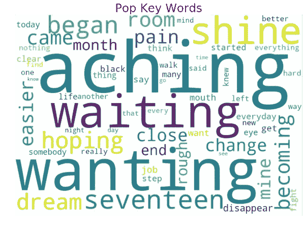
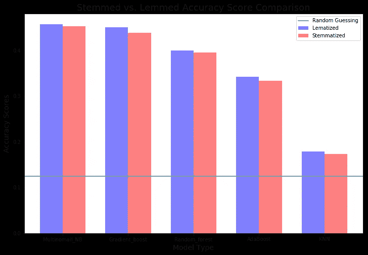
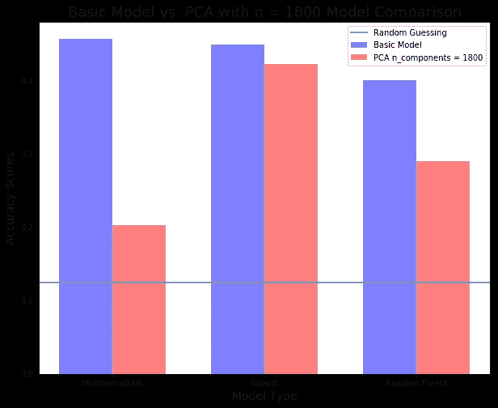
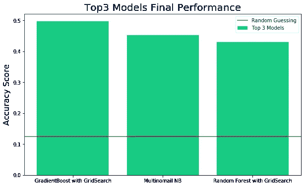
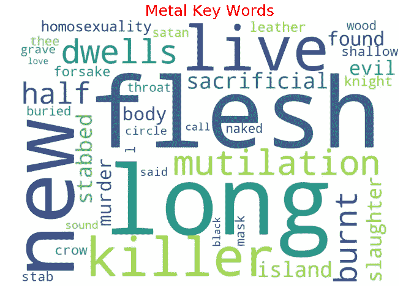
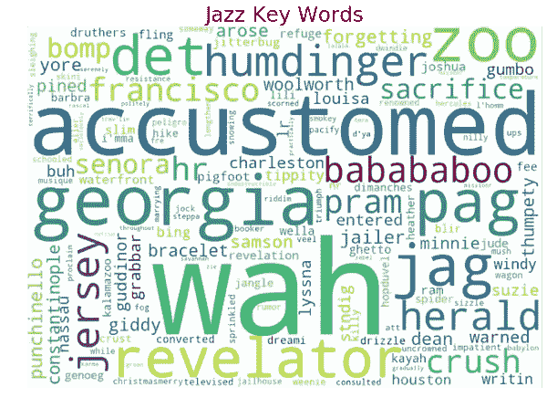
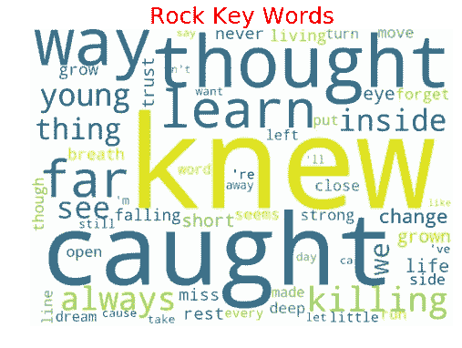
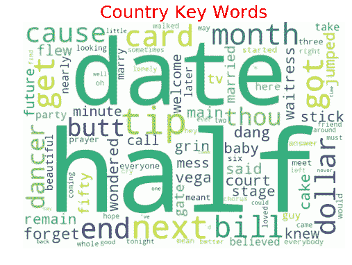
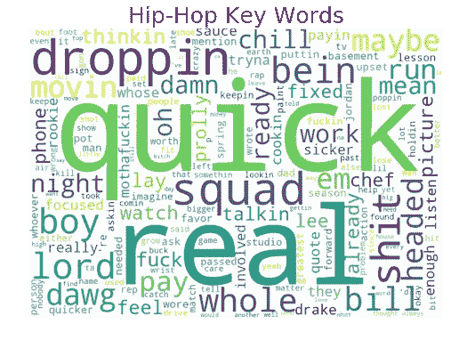

# 我们如何使用 NLTK 和 NLP 从歌词中预测歌曲的风格

> 原文：<https://towardsdatascience.com/how-we-used-nltk-and-nlp-to-predict-a-songs-genre-from-its-lyrics-54e338ded537?source=collection_archive---------11----------------------->

本文的目的是概述我们使用 NLTK 和自然语言处理方法来清理和预处理文本数据并将歌词转换为数值矩阵的过程，以便我们可以训练一个机器学习算法，该算法可以根据歌词对每首歌曲的流派进行分类。

**什么是自然语言处理(简称 NLP)？**

**NLP** 指的是处理文本或语音形式的自然人类语言的分析任务。这些任务通常涉及某种机器学习，无论是文本分类还是特征生成，但 NLP 不仅仅是机器学习。诸如文本预处理和清理之类的任务也属于 NLP 范畴。

用于 NLP 任务的最常见的 python 库是自然语言工具包，或 **NLTK。NLTK 是 NLP 所有事情的“一站式商店”。与大多数其他 Python 库和 ML 模型不同，NLTK 和 NLP 的独特之处在于，除了统计学和数学，它们还非常依赖语言学领域。本文其余部分描述的许多处理文本数据的概念和方法都基于语言学规则。**

获取数据:我们从哪里获取数据？

我们在 Kaggle 上发现了一个包含 30 万首歌词的 CSV，这些歌词来自 11 种不同的流派和 6-7 种不同的语言。该数据集包含关于歌曲名称、艺术家、年份、专辑、流派的信息，以及一个包含完整歌词的列。

**清理和预处理文本数据**

现在我们有了数据，有趣的部分开始了。首先，我们需要预处理和清理我们的文本数据。正如您可能已经怀疑的那样，预处理文本数据比处理更传统的数据类型更具挑战性，因为对于我们需要做什么样的预处理和清理没有明确的答案。使用传统数据集时，我们在这一阶段的目标通常非常明确——标准化和清理数值数据、将分类数据转换为数值格式、检查并处理多重共线性等。我们采取的步骤在很大程度上取决于我们获得数据时它的样子。

**文本数据不同** —在其原始格式中，文本数据仅从一维开始—在项目的初始阶段，我们对数据集中唯一感兴趣的功能是包含每首歌词全文的列。这意味着我们需要决定如何预处理我们的数据，并从文本文档中提取特征，以便稍后用于训练 ML 模型。在我们开始清理和预处理文本数据之前，我们需要做出一些决定，例如:

*   我们要不要删除停用词？
*   我们是对我们的文本数据进行词干化或词目化，还是让单词保持原样？
*   基本的标记化是否足够，或者我们是否需要通过使用正则表达式来支持特殊的边缘情况？
*   我们是坚持只使用英语单词，还是允许使用其他语言？
*   我们是使用整个词汇表，还是仅仅将模型限制在最常用单词的子集？如果有，有多少？
*   我们是否设计了其他特征，如二元模型、词性标签或互信息分数？
*   我们应该在模型中使用哪种矢量化？布尔矢量化？计数矢量化？TF-IDF？Word2Vec 等更高级的矢量化策略？

这些都是我们在处理文本数据时需要考虑的问题。

**探索数据**:查看我们的熊猫数据帧，我们发现…

我们做的第一件事是检查无价值的歌曲，并删除带有 NaN 歌词的歌曲，在清理后，我们仍然有 200，000 行。

然后，我们查看了流派的价值计数，决定放弃民谣、独立音乐和其他音乐，因为前两者没有足够的数据，“其他”不能为我们的最终分类任务提供任何预测价值。

在所有这些清理之后，我们只剩下八种基本风格:**摇滚、流行、嘻哈、金属、乡村、爵士、电子、R & B** 。这些是我们将试图预测的目标类别。

流派之间的分布是不均匀的，所以我们决定随机选择每个流派 900 首歌曲，这样我们的总行数 **900 首歌曲* 8 个流派= 7200 首歌曲**。

## 特征工程和模型优化:

1.  我们结合使用 NLTK、Pandas 和 Regex 方法来:

*   清除文本中的标点符号和奇数字符
*   删除停用词
*   仅标记英语单词
*   返回词干语料库
*   返回词条化单词的语料库
*   将最终的干净歌词附加回熊猫数据帧

2.我们使用 TF-IDF 矢量器将单词转化为每个单词对特定歌词的重要性的数字表示。

**什么是 TF-IDF？**

TF-IDF 代表*词频-逆文档频率*，TF-IDF 权重是信息检索和文本挖掘中经常使用的一种权重。该权重是一种统计度量，用于评估一个单词对集合或语料库中的文档有多重要。重要性与单词在文档中出现的次数成比例增加，但是被单词在语料库中的频率抵消。

**TF-IDF 是如何计算的？**

通常，TF-IDF 权重由两项组成:第一项计算归一化项频率(TF)，aka。单词在文档中出现的次数，除以该文档中的总单词数；第二项是逆文档频率(IDF ),计算为语料库中文档数量的对数除以特定术语出现的文档数量。

1.  **TF:术语频率**衡量一个术语在文档中出现的频率。因为每个文档的长度不同，所以一个术语在长文档中出现的次数可能比短文档多得多。因此，术语频率通常除以文档长度(又名。文档中的术语总数)作为标准化的一种方式:

**TF** =(术语 t 在文档中出现的次数)/(文档中的总术语数)。

**2。IDF:逆文档频率**，它衡量与所有其他文档相比，一个术语对于语料库中特定文档的意义/内容有多重要。众所周知，某些术语，如“is”、“of”和“that”，可能会在大多数文档中非常频繁地出现，但这并没有给我们任何关于这些常用词对特定文档含义的重要性的信息。因此，我们需要通过计算以下各项来降低过于频繁的术语的权重，同时增加仅特定于少量文档的罕见术语的权重:

*   **IDF** = log_e(文档总数/其中包含术语 t 的文档数)。

在对所有歌词进行词干化和词汇化并创建特征 TF-IDF 矩阵后，我们发现自己拥有了一个最终的熊猫数据帧，该数据帧有**7200 行**和 **30，000** **列**。每一行代表一个特定的歌词，每一列是一个唯一的单词及其对应的 TF-IDF 值。

## 培训和优化我们的模型

我们想做的第一件事是测试我们的基本 ML 模型在处理词干化或词条化文本时是否表现得更好。我们训练和评估了多项式朴素贝叶斯、随机森林、AdaBoost、梯度增强和 K-最近邻的性能，使用词干和词条。下表显示了我们的结果:

我们选择使用**词汇化的单词**而不是词干化的单词，因为当使用词汇化的文本时，每个模型的性能始终至少提高 1%。

从这里开始，我们选择关注我们的前三个模型- **多项式朴素贝叶斯、梯度推进和随机森林的模型优化。**

我们做的下一件事是 **PCA** ，我们对我们的数据进行了一次测试，看看有多少组件可以保留 80%的变化。然后，我们在我们的前三个模型上运行 n_components = 1800 的 **PCA，看看这是否提高了性能。下图显示了结果:**

从图中可以看出，PCA 在两种模型中都没有提高性能，所以我们决定不继续使用 PCA。

接下来我们要做的事情是 **GridSearch** 三个表现最好的模型，并选择具有产生最高准确度分数的参数组合的模型。结果汇总如下:

*   **随机森林上的网格搜索****准确率从 41%提高到 43%。**
*   ****网格搜索** **上的梯度提升**将性能精度从 45%提高到 50%。**
*   ****朴素贝叶斯网格搜索**上的网格搜索 **没有产生改进的性能，因为默认参数是最优的。****

## **解释和传达最终结果:**

**下面你可以看到我们的前三个模型在使用 GridSearch 优化和超参数调整后的最终性能图。**

****

**网格搜索后，我们的最高模型 **GradientBoost 产生了 50%的准确性**，这比随机猜测(从 8 个可能的类别中随机猜测一个类别= 1/8 或 12.5%)好了大约 4 倍。尽管 50%并不是一个很大的数字，但我们仍然对只有 7200 首歌词的情况印象深刻，我们能够训练一个模型，通过只扫描这首歌的歌词，就可以在 50%的时间内正确猜测这首歌属于什么类型。**

**通过对网格搜索和 PCA 优化的实验，我们发现多项式朴素贝叶斯是最快和最简单的开箱即用模型。在没有任何额外优化技术的情况下，它的准确率仅比顶级模型 GradientBoosted 分类器低 5%。**

****结论:****

**根据我们有趣的实验，似乎有一组特定于每种歌曲类型的词汇，可以允许人们训练一种 ML 算法，该算法可以仅通过分析歌词来猜测歌曲的类型。另一个有趣的发现是，NaiveBayes 分类器似乎可以立即生成非常强大的性能。因此，如果您正在处理一个非常大的文本数据集，其中的特征生成和模型优化被证明是计算量大且耗时的，那么您可能会选择使用朴素贝叶斯来简化和提高效率，而不会牺牲太多的性能。如果您有足够的时间和计算能力，并且希望尽可能地优化性能，那么在一系列集成模型(如随机 Fores 或 GradientBoosted 分类器)上运行网格搜索将是一个不错的选择。**

****有趣的附加功能:** *使用无监督学习模型来识别每个流派的独特主题和关键词***

**我们使用 gensim.corpora.Dictionary 为词汇化、标记化的单词集创建了一个频率词典。我们从每个流派中抓取关键词，并生成主题模型分数。使用 Word2Vec 字典生成器，我们运行了一个主题建模 LDA 算法，并打印了下面每个流派中热门关键词的词云。**

************************