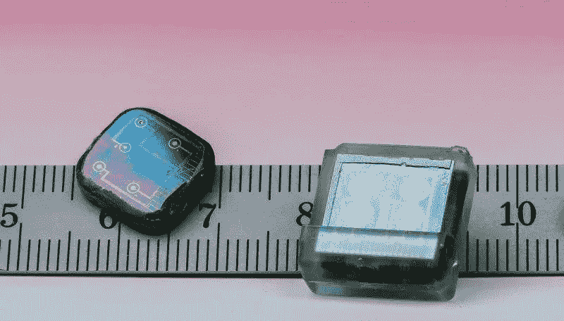

# 可穿戴设备和生物传感器如何利用机器学习帮助研究人员抗击克罗恩病

> 原文：<https://towardsdatascience.com/how-wearables-biosensors-can-help-researchers-fight-crohns-disease-using-machine-learning-1517090f0a35?source=collection_archive---------37----------------------->

Photo by [Luke Chesser](https://unsplash.com/@lukechesser?utm_source=medium&utm_medium=referral) on [Unsplash](https://unsplash.com?utm_source=medium&utm_medium=referral)

男朋友 20 岁的时候发现自己得了克罗恩病。就像我们中的许多人一样，他控制着疼痛，直到他无法再忽视它，并在几周内避免去看医生。在遇到他之前，我从未听说过克罗恩病，但现在，我遇到的每个人似乎都认识被诊断出患有克罗恩病的人。

克罗恩病是一种自身免疫性疾病，过去被认为是“罕见的”。这是一种第一世界的疾病，也就是说，这种疾病主要出现在发达国家。研究人员还没有找到这种疾病的确切原因，但这种疾病主要发生在发达国家的事实使他们相信一些环境因素可能会引发这种疾病。尽管控制这种疾病的治疗方法在不断改进，但目前还没有治愈 CD 的方法。缓解是可能的，但克罗恩病的结果和症状因患者而异。我很高兴地说，现在，我的男朋友是“幸运”的一部分。

# 数据科学能为克罗恩病做些什么？

一方面，数据科学可以帮助回答这个大问题，因为它可以帮助找到**模式，病例**之间的相似之处，以便找出这种疾病几乎神秘的原因。机器学习模型可以发现饮食习惯之间的模式，也可以发现患者基因中的模式。人工智能已经帮助[识别与疾病相关的未发现基因](https://www.newswise.com/articles/new-a-i-method-may-help-diagnose-treat-crohn-s-disease)，并准确预测哪些患者受到 CD 的影响。

另一方面，机器学习模型也可以预测某人对某种药物反应良好的机会。最近，今年 6 月发表的一项研究表明，ML 模型可以准确地[估计哪些患者可能对药物治疗有良好的反应](https://www.ncbi.nlm.nih.gov/m/pubmed/31074823/)，然后他们才会接受长期治疗，并且无需昂贵的药物水平测量。在预测用于治疗克罗恩病的硫嘌呤药物的临床反应时，随机森林模型甚至被证明比普通技术更准确、更便宜。

# 我们怎么还不知道是什么导致了这种疾病？

美国国家医学图书馆将克罗恩病的原因描述为复杂且不为人知的 T2。作为一名数据科学家，我很震惊地得知，虽然我们在世界范围内有如此多的病人，**我们仍然不知道为什么这种疾病首先会发生。我想知道为什么没有一个机构在疾病被宣布之前收集了足够的关于病人生活的数据，以便找出大多数病人共有的一个或多个环境因素。我的男朋友本人在确诊前从未被采访过他的习惯，也没有被采访过他的饮食。**

> 缺乏准确的数据

通过更深入地研究这个问题，我明白了获得关于病人的准确数据可能是一项相当困难的任务。食物日志或关于过去习惯的记忆可能会提供非常不准确的事实，因为人们会有意或无意地误报自己的行为。如果你知道医生会查看数据，并且你前一天已经喝了 2 杯，你会写下你喝了 3 杯酒吗？如果第三个杯子非常小，它可能会被算作 2，而不是 3。多少钱才算“一杯”？你也可能忘记在前一天的食物日志中写下你的食物量，现在记不起确切的量了，所以你写下了近似值。研究人员期望客观的测量，但是当涉及到人的判断时，测量可能变成非常主观的事情。

# 世界最大数据库能为机器学习带来希望

试图用机器学习解决各种问题的研究人员经常遇到同样的问题:**缺乏可靠和准确的数据**。关于人们在被诊断前几年的饮食或生活习惯的数据要么不存在，要么可能非常不准确。你还记得 5 年前你在做什么或吃什么吗？即使是两个月前？大概不会。

为了解决这一问题，CCFA ( [克罗恩病&结肠炎基金会](https://www.crohnscolitisfoundation.org/))在 2015 年获得了一笔赠款，用于建立可能是克罗恩病和溃疡性结肠炎 的 [**最大的研究数据库，目标是“*集中和汇总多个研究项目的患者信息*”。该中心选择了几个方面的研究重点，包括**](https://helmsleytrust.org/news/ccfa-launches-development-world%E2%80%99s-largest-research-database-crohn%E2%80%99s-disease-and-ulcerative) **[**环境触发**](https://www.crohnscolitisfoundation.org/research/challenges-ibd/environmental-triggers) 和新技术。关于触发因素，基金会目前正在支持研究以下因素:*饮食、心理、压力、病毒和吸烟*。**

 [## 环境触发因素

### 环境触发因素是五个重点领域的一部分，包括临床前人类 IBD 机制，新技术…

www.crohnscolitisfoundation.org](https://www.crohnscolitisfoundation.org/research/challenges-ibd/environmental-triggers) 

# 用于更精确测量的生物传感器和可穿戴设备

Biosensors recently designed by [t](https://phys.org/partners/ecole-polytechnique-federale-de-lausanne/)he [EPFL](https://phys.org/partners/ecole-polytechnique-federale-de-lausanne/)

如上所述，[新技术](https://www.crohnscolitisfoundation.org/research/challenges-ibd/novel-technologies)是基金会目前支持的 5 个重点之一。为了收集更精确的测量数据，研究人员提议为患者使用**生物传感器和可穿戴设备**。这种类型的工具允许比人工日志更准确的数据，因为患者不必参与报告。它还允许在没有护士或医生参与的情况下进行测量。然后可以将测量结果结合起来，以获得一个长期的可靠的患者状况图，而不是在医院就诊的当天。

此外，CCFA 目前正在开发一种 [**可摄取电子设备**](https://www.crohnscolitisfoundation.org/research/challenges-ibd/novel-technologies) ，可以连接智能手机进行(近)实时数据采样。该设备可以检测肠道何时出现炎症，并直接报告给智能手机，以通知患者或医务人员。最终，该技术的一个版本可以被开发出来，通过传递抗炎信号来检测甚至**相应地对炎症做出**反应。

 [## 新技术

### 新技术是五个重点领域的一部分，包括临床前人类 IBD 机制，环境触发…

www.crohnscolitisfoundation.org](https://www.crohnscolitisfoundation.org/research/challenges-ibd/novel-technologies) 

# 具有机器学习的个性化医疗

> 个性化(或精确)医学是一种疾病管理形式，它使用关于一个人的基因、蛋白质和环境的信息来预防、诊断和治疗疾病。——NCI 癌症术语词典

根据南安普顿大学和南安普顿儿童医院的几位研究人员的说法，机器学习是炎性肠病(如克罗恩病)诊断和治疗个性化药物开发的关键因素，它根据患者的特征将患者分为不同的风险类别，允许提供适合的营养、药物和管理。

虽然监督和非监督模型都用于患者的分层，但随机森林分类器和支持向量机在使用[多组学数据](http://tp.amegroups.com/article/view/23431/22518)模拟生物现象时非常流行，因为这两种算法都易于解释，并且在计算要求上非常相似。

## 研究人员预计，在未来几十年里，个性化治疗将会发生重大转变。这种转变可以通过使用生物传感器等新技术来实现，但特别依赖于可理解和可访问的 ML 模型的可用性。