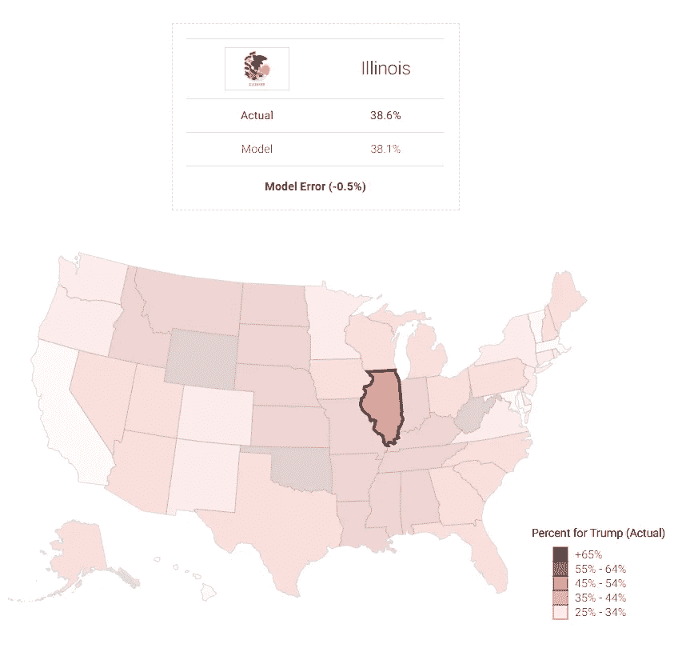
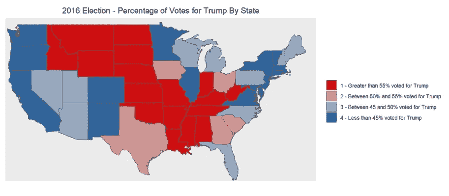
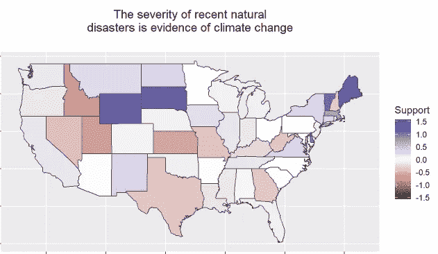
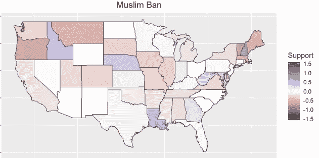
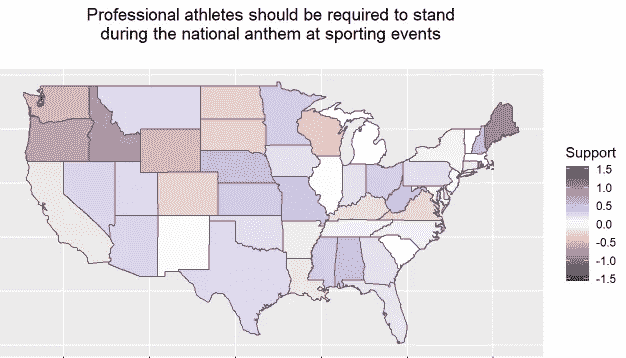
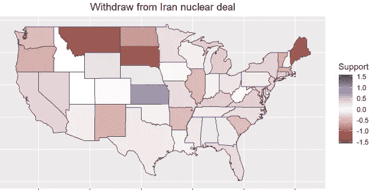

# 基于价值的回归模型在 2016 年总统选举中表现如何？

> 原文：<https://towardsdatascience.com/how-well-does-a-value-based-regression-model-perform-in-the-2016-presidential-election-251ea7d10674?source=collection_archive---------38----------------------->

## 使用多元回归调查唐纳德·特朗普选民在 2016 年大选中的价值观预测

A D3.js map comparing the actual 2016 election results to the model predictions. Visit [www.zach-alexander.com/pres2016-regression](https://www.zach-alexander.com/pres2016-regression) to interact with the full visualization.

可能很难相信，但 2020 年总统大选大约还有 300 天。今年将是政治上又一个充满争议的一年，[预测称，将会有空前数量的选民](https://www.theatlantic.com/politics/archive/2019/06/2020-election-voter-turnout-could-be-record-breaking/591607/)出来投票给那些无疑对我们国家的未来有着截然不同的议程的被提名者。

随着民主党寻求在未来一年赢得前特朗普选民的支持，我认为回顾 2016 年的选举结果以确定导致他成功的因素将是有趣的。在我的分析中，很明显，某些价值观和意识形态可以预测全州范围内投票给唐纳德·特朗普的选民比例。

通过使用线性回归，我创建了一个模型，捕捉到了唐纳德·特朗普投票比例中近 87%的可变性。

现在，对于那些更懂统计学的人来说，这一模型在预测 2020 年大选(甚至是 2016 年大选)的结果方面绝不有效，但它确实告诉了我们一些关于选民对某些“热点”问题的感受的有价值的东西，以及它们对他们决定是否投票给特朗普总统的影响。

# 用于此分析的数据集

2016 年的选举结果最终是从 Townhall.com[的](https://www.townhall.com)那里获得的，在此之前，他们清理了 html 格式的表格并做了一些整理。如果有兴趣，你可以在 [GitHub](https://github.com/tonmcg/US_County_Level_Election_Results_08-16) 上阅读更多关于这个的内容。网络抓取的功劳归于托尼·麦戈文。

我处理的第二个数据集包含对 2017 年美国价值观调查的回答。这个数据集是在[公共宗教研究所(PRRI)](https://www.prri.org/data-vault/)) 网站上找到的。它包含大量与价值观相关的问题，从受访者对移民、枪支管制法律、医疗保健等的看法。

调查的主要版本可以在[这里](https://www.prri.org/wp-content/uploads/2018/12/2017-AVS-Topline-FINAL.pdf)找到，关于调查方法的更多信息可以在[这里](https://www.prri.org/data-vault/page/2/)找到。

# 用 R 建立回归模型

由于时间关系，我不会详细介绍我所做的数据整理工作。如果你对这个过程的这个方面感兴趣，你可以在我的 [Rpubs 出版物](https://rpubs.com/zachalexander/fnl-proj)上读到更多。

需要注意的是，我需要以某种方式整理数据，将两个数据集连接在一起。幸运的是，美国价值观调查数据有一个变量可以捕捉每个受访者的居住州——我最终用它来联系 2016 年的选举结果。

有了可供分析的数据，我决定先看看 2016 年实际选举结果的一些地图，以及对美国价值观调查问题的平均评分。

使用 ggplot 和 R，我创建了一个快速地图，显示了特朗普在每个州的选民比例:

正如我们所见，中西部和南部的大部分地区在很大程度上支持选举唐纳德·特朗普为总统。*请记住，这只是唐纳德·特朗普的得票率，不包括选举团。*此外，我想看看各州对美国价值观调查问题的平均回答是否有所不同。一些值得注意的差异是:

正如我们从上面所看到的，在从气候变化到伊朗核协议等问题上存在很大的分歧。要查看美国价值观调查中许多其他问题的分类，你可以参考我的 RPubs 出版物[这里](https://rpubs.com/zachalexander/fnl-proj)。

最后，这些回答中的许多有助于多元线性回归模型的创建。在多次调整模型，并使用诸如反向消除、绘制残差和检查诊断等技术后，最可靠的模型得出的 R 值为 0.87。还不错！

# 模型中具有高度预测性的问题

**你是强烈赞成、赞成、反对还是强烈反对…**

*   允许同性恋合法结婚？
*   允许你所在州的小企业主拒绝向同性恋者提供产品或服务，如果这样做违反了他们的宗教信仰？
*   沿着美国和墨西哥的边界建一堵墙？
*   允许童年时被带到美国的非法移民在参军或上大学后获得合法居民身份？

**您完全同意、基本同意、基本不同意还是完全不同意……**

*   今天的美国为世界树立了一个良好的道德榜样？
*   体育赛事奏国歌时应该要求职业运动员起立？

**你认为以下应该是最高优先级，高但不是最高优先级，还是较低优先级？…**

*   颁布更严格的枪支管制法律。
*   降低医疗保健成本。
*   改变联邦所得税制度，使其更加公平。

# 外卖

从统计学的角度来看，最终结果是一个相当强的模型，其 R 平方值高于 0.85。然而，这是一个真实世界的边际比数学世界的边际精细得多的主要例子。我们的模型的残差有时接近 0.10，这意味着特朗普在几个州(即马里兰州、俄克拉荷马州和加利福尼亚州——所有这些州最终都被从最终的模型计算中删除)将获得 10%的选票。

然而，在完成这一过程的同时，我能够检验似乎相当有助于唐纳德·特朗普投票的价值观。例如，有趣的是，对枪支管制、医疗保健、税收制度、移民以及在南部与墨西哥边境修建隔离墙等问题的回答都进入了模型。这些话题一直是特朗普竞选和执政期间的最重要话题。这表明*最近的*问题，以及由唐纳德·川普这样一个两极分化的人物制造的问题，对是否有人会投票给他有很大的影响。

2016 年的选举被证明是一场非常两极分化的选举，人们有时声称他们会投票反对某个特定的候选人，而不是投票支持某个候选人。构成最终模型的一长串价值观证明了这一点，因为选民有足够的机会表达为什么他们认为他们的候选人是领导美国的正确选择。

# 请参见 D3.js 地图可视化

要查看我创建的显示 2016 年大选特朗普选民实际比例与模型预测之间差异的地图可视化，可以访问我的[网站](https://zach-alexander.com/pres2016-regression)。

这一分析的功劳与我在数据科学领域的同事 Misha Kollontai 分享。