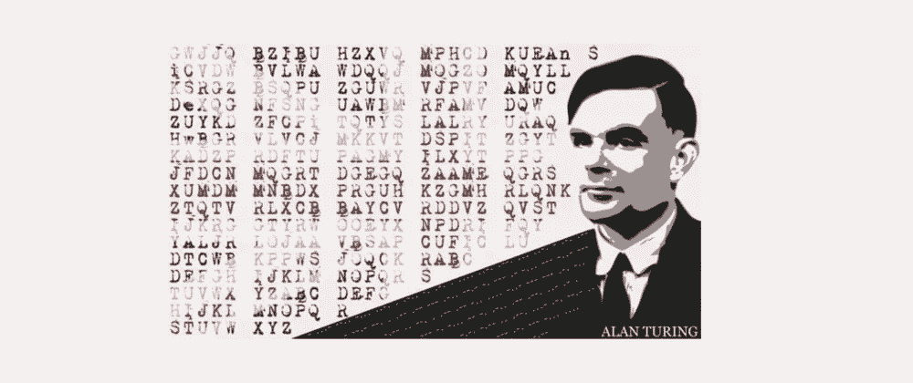
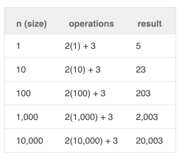

# 如何通过学习数据结构和算法来改变世界

> 原文：<https://towardsdatascience.com/how-you-can-change-the-world-by-learning-data-structures-and-algorithms-84566c1829e3?source=collection_archive---------19----------------------->

作为开发者，你有改变世界的力量！你可以编写支持新技术的程序。例如，开发软件来发现疾病的早期诊断。但是，这不是唯一的方法，你可以通过创建项目间接做到这一点，让人们更有效率，并帮助他们腾出时间做其他令人惊叹的事情。无论你做什么，它都有可能影响使用它的社区。

然而，这些成就只有在我们编写快速且可伸缩的软件时才有可能实现。学习如何测量你的代码性能是这篇文章的目标。

我们将探索如何使用算法分析来测量代码性能:**时间复杂度**和**大 O 符号**。

首先，让我们看一个真实的故事来了解为什么这很重要。

# 拯救了数百万人生命的算法

在第二次世界大战期间，德国人使用调幅无线电信号与欧洲各地的军队通信。任何一个有 AM 频率无线电和一些莫尔斯电码知识的人都可以截获这个信息。然而，信息被编码了！所有被攻击的国家都试图破译它。有时，他们很幸运，能够在一天结束时理解一些信息。不幸的是，纳粹每天都在改变编码！

一位名叫艾伦·图灵的杰出数学家加入了英国军队，破解了德国的“谜”密码。他知道如果他们继续用笔和纸来计算，他们将永远不会成功。所以经过几个月的努力，他们造出了一台机器。不幸的是，这个设备的第一个版本需要很长时间来解码一条信息！所以，它不是很有用。

艾伦的团队发现每条加密信息都以同样的字符串结尾:“希特勒万岁”啊哈！改变算法后，机器解码传输的速度快了很多！他们用这些信息来更快地结束战争，拯救数百万人的生命！

*同一台即将因故障而关闭的机器变成了一个活的拯救者。同样，当你编写高效的代码时，你可以用你的计算资源做更多的事情。这就是我们在这个帖子系列中要学习的内容！*

另一个流行的算法是谢尔盖·布林和拉里·佩奇(谷歌创始人)在 1998 年开发的`PageRank`。这种算法曾经(现在也是)被谷歌搜索引擎用来理解数万亿的网页。谷歌不是唯一的搜索引擎。然而，由于他们的算法返回了更好的结果，大多数竞争者逐渐消失了。今天，它为每天 30 亿次搜索中的大部分提供了快速的动力。这就是可扩展算法的力量！🏋🏻‍

# 那么，为什么要学习写高效的算法呢？

优点很多；这些只是其中的一部分:

*   你会成为一名更好的软件开发人员(并获得更好的工作/收入)。
*   花更少的时间调试、优化和重写代码。
*   您的软件将在相同的硬件上运行得更快(扩展成本更低)。
*   你的程序可能被用来帮助拯救生命的发现(也许？).

事不宜迟，让我们加紧我们的游戏！

# 什么是算法？

算法(你可能知道)是如何完成某项任务的步骤。例如，当你做饭时，你按照一个**食谱**来准备一道菜。如果你玩游戏，你正在设计**策略**来帮助你获胜。同样，计算机中的算法是用来解决问题的一组指令。

> *算法是执行任务的指令*

有“好”和“坏”的算法。好的很快；坏的很慢。缓慢的算法花费更多的钱，并使一些计算在我们的生命周期内不可能！

我们将探索算法的基本概念。此外，我们将学习如何区分“快”和“慢”。更好的是，您将能够“测量”您的算法的性能并改进它们！

# 如何提高自己的编码技能？

改善某事的第一步是衡量它。

> 测量是控制并最终改进的第一步。如果你不能衡量一件事，你就不能理解它。如果你不能理解它，你就不能控制它。如果你不能控制它，你就不能改善它。
> 
> ***H. J .哈灵顿***

你如何“测量”你的代码？你会计算跑步需要“多长时间”吗？如果你在移动设备或者量子计算机上运行同样的程序呢？同样的代码会给你不同的结果吧？

要回答这些问题，我们需要先确定一些概念，比如**时间复杂度**！

# 时间复杂度

时间复杂度(或**运行时间**)是算法运行所需的估计时间。然而，你不用秒来度量时间复杂度，而是作为输入的**函数**。(我知道这很奇怪，但请原谅我)。

> ****时间复杂度*** *不是关于计时算法需要多长时间。而是执行*多少个操作*。一个程序执行的指令数量受输入大小和元素排列方式的影响。**

*为什么时间复杂度被表示为输入的函数？好吧，假设你想对一组数字进行排序。如果元素已经排序，程序将执行较少的操作。相反，如果项目顺序相反，将需要更多的时间来排序。因此，程序执行的时间与输入大小和元素的排列方式直接相关。*

*我们可以说对于每一个算法都有如下的运行时间:*

*   *最坏情况下的时间复杂度(例如，输入元素顺序相反)*
*   *最佳情况时间复杂度(例如，已经排序)*
*   *平均情况时间复杂度(例如，随机顺序的元素)*

*我们通常更关心**最坏情况下的时间复杂度**(我们抱着最好的希望，但也在为*最坏的情况*做准备)。*

# *计算时间复杂度*

*这里有一个如何计算时间复杂度的代码示例:*在一个数组中找到最小的数*。*

*我们可以将`getMin`表示为输入`n`大小的函数，基于它必须执行的操作数量。为了简单起见，让我们假设每行代码在 CPU 中花费相同的时间来执行。让我们算一下总数:*

*   *线 6: 1 操作*
*   *线 7: 1 操作*
*   *第 9–13 行:这是一个执行大小为`n`倍的循环*
*   *—10 号线:1 操作*
*   *—第 11 行:这个比较棘手。它在一个条件中。我们将假设最坏的情况，即数组按升序排序。每次都会执行条件(`if`块)。因此，1 次操作*
*   *第 14 行:1 操作*

*总而言之，我们在循环外有`3`操作，在`forEach`块内有`2`操作。因为循环的大小是`n`，所以我们只有`2(n) + 3`。*

*但是，这个表达式有些过于具体，很难用它来比较算法。我们将应用**渐近分析**来进一步简化这个表达式。*

# *渐近分析*

*渐近分析只是评估函数，因为它们的值接近无穷大。在我们之前的例子`2(n) + 3`中，我们可以将其概括为`k(n) + c`。随着`n`值的增长，值`c`越来越不重要，如下表所示:*

**

*Input size vs Number of Operation*

*信不信由你，常量`k`也不会有太大的区别。使用这种渐近分析，我们采用高阶元素，在这种情况下:`n`。*

*让我们再做一个例子，这样我们就可以得到这个概念。假设我们有下面的函数:3 n + 2n + 20。使用渐近分析的结果会是什么？*

> **`3 n + 2n + 20 `随着` n '越长越大；最重要的术语是“n”。**

*回到我们的例子`getMin`，我们可以说这个函数的时间复杂度为`n`。正如你所看到的，我们可以把它近似为`2(n)`，去掉`+3`，因为随着‘n’不断变大，它不会增加太多的价值。*

*我们感兴趣的是这里的大图，我们将使用渐近分析来帮助我们。有了这个框架，对比算法，就舒服多了。我们可以用它们最重要的术语来比较运行时间:n 或 n 或`2^n`.*

# *函数的 Big-O 符号和增长率*

*大 O 符号结合了我们在上两节学到的关于**最坏情况时间复杂度**和**渐近分析**的内容。*

> **字母‘o’指的是某个功能的* ***顺序*** *。**

*大 O 符号用于根据算法的最差运行时间对算法进行分类，也称为函数增长率的上限。*

*在我们之前使用`getMin`函数的例子中，我们可以说它的运行时间为`O(n)`。有许多不同的运行时间。以下是我们将在下一篇文章中讨论的最常见的问题，以及它们与时间的关系:*

**

*Input size (n) vs Time Taken by Growth Rate*

*如你所见，有些算法非常耗时。一个小至 100 的输入大小，即使我们有一个 1 PHz(100 万 GHz)的 CPU 也无法计算！！硬件的可扩展性不如软件。*

*在下一篇文章中，我们将通过一两个代码示例来探究所有这些时间复杂性！你准备好成为一名超级程序员并扩展你的代码了吗？！*

*其他资源:*

*   *[使用 JS-Github 解释的数据结构和算法](https://github.com/amejiarosario/dsa.js-data-structures-algorithms-javascript)*
*   *[算法教程——帖子](https://adrianmejia.com/tags/tutorial-algorithms/)*

**原载于 2019 年 4 月 5 日*[*https://adrianmejia.com*](https://adrianmejia.com/how-you-can-change-the-world-learning-data-structures-algorithms-free-online-course-tutorial/)*。**