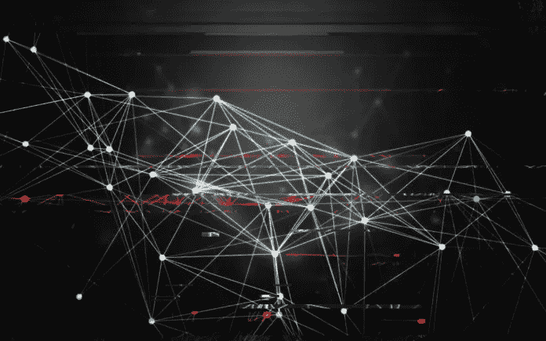
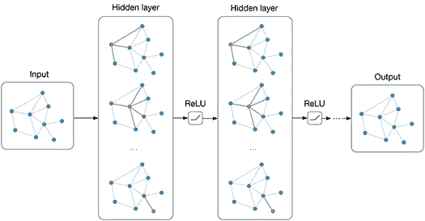
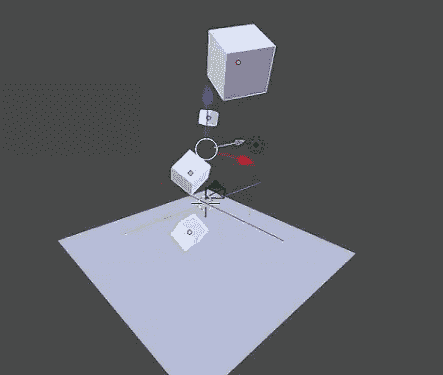
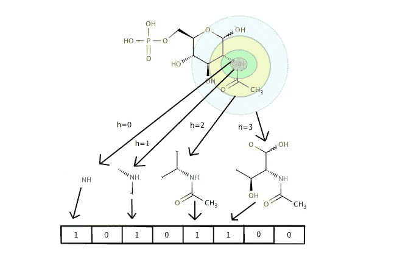
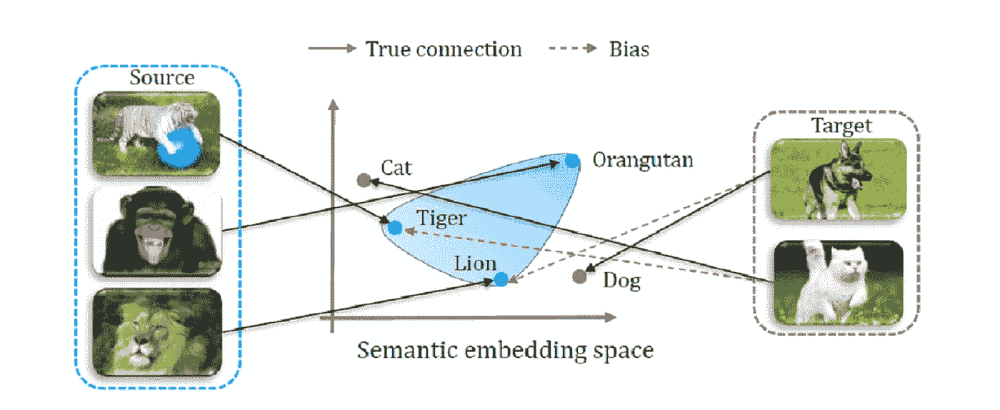
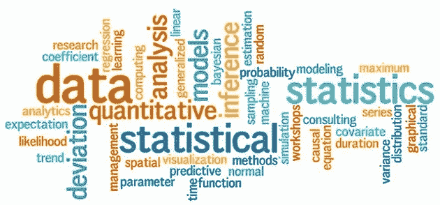
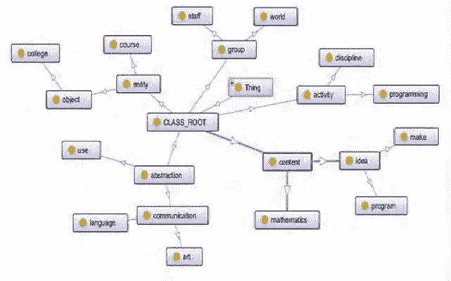
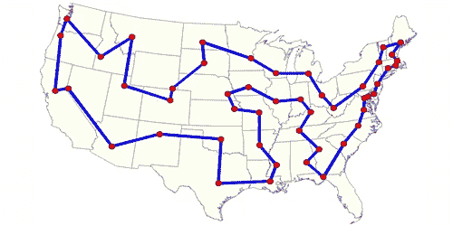

# 图形神经网络的应用

> 原文：<https://towardsdatascience.com/https-medium-com-aishwaryajadhav-applications-of-graph-neural-networks-1420576be574?source=collection_archive---------3----------------------->

由于图形能够以一种可以客观分析的方式表现现实世界，因此图形及其研究自古以来就受到了广泛的关注。事实上，图形可以用来表示许多有用的真实世界数据集，如社交网络、网络链接数据、分子结构、地理地图等。除了这些具有自然结构的情况之外，诸如图像和文本的非结构化数据也可以以图形的形式建模，以便对它们执行图形分析。由于图的表达能力和近来可用计算能力的巨大增长，大量注意力已经转向分析图的机器学习方式，即图神经网络。

## **那么，什么是图神经网络(GNNs)？**

根据[这篇](https://arxiv.org/pdf/1812.08434.pdf)论文，图形神经网络(GNNs)是连接主义模型，它通过图形节点之间的消息传递来捕捉图形的依赖性。它们是神经网络模型的扩展，用于捕获以图形表示的信息。然而，不同于标准的神经网络，GNNs 保持状态信息以捕获节点的邻居属性。然后，图的节点的这些状态可以用于产生输出标签，例如节点的分类或由节点计算的任意函数值。网络试图通过在节点的邻居之间以迭代的方式相互共享数据来学习每个节点的这些编码(hv ),直到收敛。

鉴于 GNNs 可以应用的广泛领域，基于数据类型，大多数 GNNs 可以被分类为结构化应用或非结构化应用。结构化案例表示具有固有结构的数据，如社会互动网络或分子网络。因此，非结构化场景表示数据中的结构不明确的情况，如文本和图像。在这些非结构化场景中，一般的方法是尝试将数据转换成结构化格式，然后应用 GNN。还有一些其他应用程序不属于上面提到的任何一个类的范围。我们将在这里讨论这些类别中的一些有趣的应用。

## 物理系统

据说，人脑通过创建从现实世界的日常经验中学到的图表来帮助其推理过程。因此，现实世界的实体建模和它们之间的相互作用被赋予了极大的重要性。这被认为是迈向类人人工智能的第一步。通过将对象视为节点，并将它们之间的关系或相互作用视为边，简单的物理系统可以被建模为图形，并且可以使用 GNN 进行有效的分析。

[*交互网络*](https://arxiv.org/pdf/1612.00222.pdf) 可以被训练来推理复杂物理系统中对象的交互。它可以对碰撞动力学(刚性和非刚性)等领域的各种系统属性进行预测和推断。它使用图形上的深度神经网络，使用以对象和关系为中心的推理来模拟这些系统。这些 gnn 已经被证明可以预测未来数千个时间步的不同物体的轨迹。

[*视觉互动网络*](https://papers.nips.cc/paper/7040-visual-interaction-networks-learning-a-physics-simulator-from-video.pdf) 利用上面的互动网络更进一步，从原始视觉观察中了解系统的动态，或者简单地说，只需系统运行中的六个视频帧。除了像其母网络一样预测一系列物理系统的未来轨迹，该模型还可以根据未知物体对可见物体的影响来推断未知物体的质量和未来状态！这是通过感知前端卷积神经网络的共同训练来实现的，感知前端卷积神经网络解析视觉场景以向后端交互网络提供一组对象节点表示。

## 化学

纳米尺度的分子具有内在的图形结构，离子或原子是节点，它们之间的键是边。GNNs 可以应用于两种情况:了解现有的分子结构以及发现新的化学结构。这对计算机辅助药物设计产生了重大影响。

*分子指纹*是代表分子的特征向量。通过从示例分子中学习来预测新分子属性的机器学习模型使用固定长度的指纹作为输入。GNNs 可以取代给出分子固定编码的传统方法，以允许生成适合于需要它们的任务的可区分指纹。此外，GNN 从分子的图形结构中学习的这些分子指纹不需要像固定指纹那样大，固定指纹必须在单个特征向量中编码所有可能的子结构。可区分的指纹可以被优化以仅编码相关的特征，减少下游计算和正则化要求。

## 图像分类

图像分类是一个经典的计算机视觉问题，许多最先进的机器学习机制都有出色的解决方案，其中最受欢迎的是卷积神经网络(CNN)。GNN 把他们的动机赶出了 CNN，也被应用于这个领域。这些模型中的大多数，包括 GNN，在给定一个巨大的标签类训练集时，确实提供了有吸引力的结果。现在的重点是让这些模型在零镜头和少镜头学习任务中表现良好。*零镜头学习* (ZSL)指的是试图学习识别模型在训练中没有遇到的类别。ZSL 识别依赖于已知类的标记训练集的存在，以及关于每个未知类如何与已知类在语义上相关的知识。一种方法是在 ZSL 图像分类中利用图形形式的结构信息。因此，GNN 在这方面显得颇有吸引力。知识图表可以提供必要的信息来指导 ZSL 任务。不同的方法在知识图中表示的信息种类不同。这些图表可以基于图像本身或通过对象检测提取的图像中的对象之间的相似性。这些图还可以结合来自图像的类别标签的单词嵌入的语义信息。然后，GNNs 可以应用于这种结构化数据，以帮助 ZSL 图像分类识别任务。

## 文本

像图像一样，文本内部的关系也是不明确的，即文本不能被认为是可以直接应用 GNN 的结构化数据。但是，有一些方法可以将文本文档转换成结构化数据，如单词或句子的图形，然后使用图形卷积来卷积单词图形。构造文本数据的另一种方法是使用句子 LSTM，它将整个句子视为由子状态即单词组成的单个状态(节点)。文档引用关系也可以用来构建以文档为节点的图。然后，文本 gnn 可以用于学习单词和文档的嵌入。这些方法可用于各种自然语言处理任务，如文本分类、序列标记、机器翻译、关系和事件抽取。

一个有趣的应用领域是阅读理解；给定一段文字，模型必须能够通过巩固文章中的信息来回答基于这段文字的问题。

阅读理解是人类执行的复杂推理任务之一；问题的答案可能不在摘录的任何单个部分中，但可能需要全局推理。使用句子 LSTM 以图表的形式表示段落有助于更好地连接全局证据。

## 组合最优化

图上的组合优化问题是一组 NP 难问题。其中一些可以通过启发式方法解决。最近，人们正在尝试使用深度神经网络来解决这些问题。因此，gnn 也被用来操作这些图形结构的数据集。

Travelling Salesman Problem

有趣的是，一个通用的基于 GNN 的框架可以应用于图的许多优化问题，例如最小顶点覆盖问题、最大割、旅行推销员问题、最小生成树等。一些方法将 GNNs 与强化学习相结合，在给定输入图的情况下迭代学习解决方案。GNNs 优于传统方法的一个例子是二次分配问题。它的目的是测量两个图的相似性。使用 GNN 学习的节点嵌入的图的比较提供了比标准的基于松弛的技术更好的性能。

# 结论

鉴于图形神经网络的表达能力和图形数据的显式表示，图形神经网络越来越受欢迎。因此，它们在可以从数据中利用图形结构的领域中有广泛的应用。上面介绍的只是冰山一角。随着新架构的不断涌现，gnn 将继续涉足不同的领域。

图神经网络现在已经发展成为图卷积网络，顾名思义，是受卷积神经网络的启发。这些更加有效和强大，并形成了其他复杂图形神经网络架构的基础，如图形注意网络、图形自动编码器、图形生成网络和图形时空网络。在本帖中探索这些高级架构:[超越图卷积网络](/beyond-graph-convolution-networks-8f22c403955a)。