# 回归——为什么是均方差？

> 原文：<https://towardsdatascience.com/https-medium-com-chayankathuria-regression-why-mean-square-error-a8cad2a1c96f?source=collection_archive---------1----------------------->

Photo by [Edu Grande](https://unsplash.com/@edgr?utm_source=medium&utm_medium=referral) on [Unsplash](https://unsplash.com?utm_source=medium&utm_medium=referral)

> 我如何知道我的算法的正确损失函数是什么？因为如果我选择了错误的损失函数，我会得到错误的解。

在机器学习中，我们的主要目标是最小化由损失函数定义的误差。每种算法都有不同的误差测量方法。在这篇文章中，我将介绍回归算法中使用的一些基本损失函数，以及它们为什么会这样。我们开始吧。

假设我们有两个损失函数。两个函数将具有不同的最小值。因此，如果你优化了错误的损失函数，你就会得到错误的解，这就是我的损失函数中的最优点或权重的优化值。或者我们可以说我们在解决错误的优化问题。因此，我们需要找到适当的损失函数，我们将最小化。

## 1.误差总和(标准误差):

让我们从考虑最基本的损失函数开始，它只不过是每次迭代中的误差之和。误差将是预测值和实际值之间的差异。因此，损失函数将由下式给出:

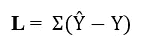

Ŷ is the predicted value; Y is the actual value

其中求和从 n=1 到 N，N 是数据集中实例的数量。现在考虑下面这条符合我们 3 个数据点的线:

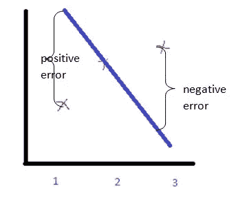

当然不是你可能会说的最佳拟合线！但是根据这个损失函数，这条线是最佳拟合线，因为误差几乎为 0。对于点 3，由于预测值较低，误差为负。而对于点 1，误差是正的，并且大小几乎相同。对于点 2，它是 0。将所有这些相加将导致总误差为 0！但错误肯定不止于此。如果误差为 0，那么算法将假设它已经收敛，而实际上它并没有收敛——*，并且将提前退出*。它将显示一个非常小的误差值，而实际上该值要大得多。所以你怎么能说这是错误的路线呢？你真的不能。你只是选错了损失函数。

## 2.绝对误差之和(SAE):

SE 肯定不是我们想要使用的损失函数。所以让我们稍微改变一下来克服它的缺点。让我们只取所有迭代的误差绝对值。这应该能解决问题..对吗？还是没有？这是损失函数的样子:

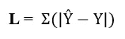

所以现在误差项不会相互抵消，实际上会相加。这个函数有什么潜在的问题吗？嗯，是的。这个损失函数不是 [*在 0 处可微*](https://www.khanacademy.org/math/ap-calculus-ab/ab-differentiation-1-new/ab-2-4/v/differentiability) 。损失函数的图形将是:

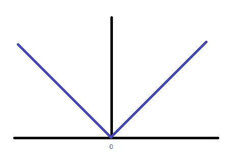

Y axis is the loss function

导数*在 0 处将不存在*。我们需要对函数求导，并使其等于 0，以找到最佳点。这在这里是不可能的。我们无法解决这个问题。

## 3.误差平方和(SSE):

所以让我们用平方代替绝对值。损失函数现在将变成:

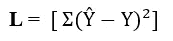

它在所有点上都是可微的，并且给出非负误差。但你可能会说，为什么我们不能达到更高阶，比如 4 阶左右。那么，如果我们考虑采用 4 阶损失函数，结果会是怎样:

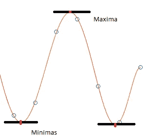

因此它的*梯度*将在 3 点消失。所以它也会有局部最小值——这不是我们的最优解。我们需要找到全局最小值的点来找到最优解。所以让我们坚持正方形本身。

**4。均方差(MSE):**

现在考虑我们用 SSE 作为损失函数。因此，如果我们有一个 100 点的数据集，我们的上证指数就是 200。如果我们将数据点增加到 500，我们的 SSE 将会增加，因为平方误差现在将增加到 500 个数据点。所以假设它变成了 800。如果我们再增加数据点的数量，我们的 SSE 会进一步增加。够公平吗？绝对不行！

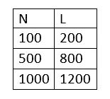

误差应该随着我们样本数据的增加而减少，因为我们数据的分布越来越窄(指正态分布)。我们的数据越多，误差就越小。但在上交所，情况完全相反。最后，我们的勇士——均方差出场了。它的表述是:

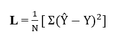

我们取上证指数的平均值。因此，数据越多，总误差 MSE 就越小。

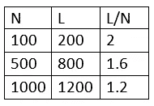

这里你可以看到，随着我们的算法获得越来越多的经验，误差在减少。无论是 R、Python 还是 MATLAB，均方误差都被用作评估大多数回归算法性能的默认指标。

**5。均方根误差(RMSE):**

MSE 的唯一问题是丢失的次数多于数据的次数。由于我的数据是 1 阶的，损失函数的 MSE 是 2 阶的。所以我们不能直接把数据和误差联系起来。因此，我们取 MSE 的根，即均方根误差:

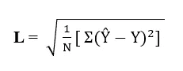

这里，我们不改变损失函数，解决方案仍然是相同的。我们所做的就是通过求根来降低损失函数的阶数。

## 6.胡伯损失:

Huber 损失结合了 MSE 和 MAE(平均绝对误差)的最佳特性。对于较小的误差，它是二次的，否则是线性的(对于它的梯度也是类似的)。它由它的*变量*参数识别:

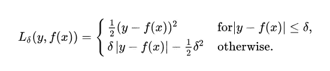

[Huber loss](https://en.wikipedia.org/wiki/Huber_loss) 比 MSE 对数据中的异常值更不敏感或更稳健。它在 0 也是可微的。基本上是绝对误差，误差小了就变成二次了。误差必须小到二次，这取决于一个可以调整的超参数𝛿(δ)。当𝛿 ~ 0 时，胡伯损失接近 MAE，当𝛿 ~ ∞(大数)时，接近 MSE。)

这就是本文的全部内容。一定要看看 Neptune 上这个令人惊叹的博客，了解关于[性能指标](https://neptune.ai/blog/performance-metrics-in-machine-learning-complete-guide)的更多细节。请在下面评论你的想法！