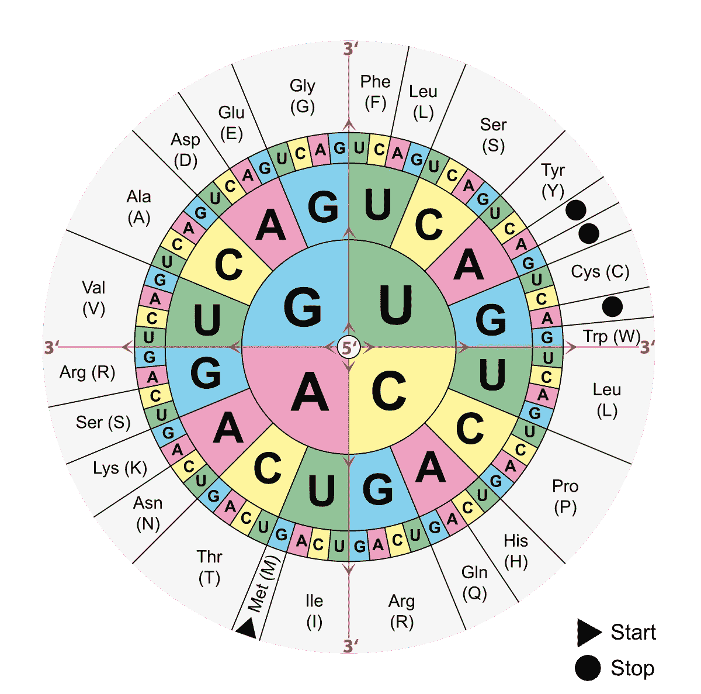

# 谷歌如何解码大自然的生命公式——使用人工智能——这是他们迄今为止最大的打击

> 原文：<https://towardsdatascience.com/https-medium-com-decoding-natures-formula-of-life-using-ai-this-is-google-deepmind-biggest-strike-yet-2da4a5992729?source=collection_archive---------7----------------------->

如果没有疾病会怎样？如果我们能够像自然界一样高效地获取能量，会怎么样？如果我们能立刻回收塑料、石油或其他任何东西？这些是如果人类能够解码生命的自然法则会发生什么的一些使用案例。Deepmind 的数据科学工程师最近朝着这一成就迈出了一大步。下面是如何:

Original Photo by Paweł Czerwiński on Unsplash

它是一次大爆炸，生命科学的新时代。新时代——由新技术驱动:数据科学和机器学习。在科学领域这个非凡而基本的里程碑背后的公司是 deep mind——谷歌的人工智能研发实验室。

Deepmind 因其在人工智能领域的成就而闻名。 [**AlphaGo**](https://deepmind.com/research/case-studies/alphago-the-story-so-far) 和 [**AlphaZero**](https://deepmind.com/blog/article/alphago-zero-starting-scratch) 例如——强化学习领域的两个主要里程碑——最近制造了很多谣言。

相比之下，来自同一个 R&D 实验室的另一个团队完成的工作并不那么受欢迎，甚至是默默无闻。这个由数据科学家和数据工程师组成的团队最近一直在研究一种新算法。他们在去年年底向公众推出的一种算法。他们把它命名为**。**

****

**AlphaFold by [Deepmind](https://deepmind.com/blog/article/alphafold)**

**AlphaFold 的适度目标是解读自然——我稍后会详细解释我这么说的意思——从而赋予人类新的能力。从那以后只有自然母亲才有的能力:**生命的圣杯**。**

# **发生了什么事？**

**去年年底，DeepMind 的 alpha fold——一种基于人工神经网络的解决方案——在著名的 CASP 竞赛中获得了第一名。CASP — [结构预测的关键评估](http://predictioncenter.org/) —是一项两年一度的科学竞赛，成立于 1994 年，已经举办了 13 届。这有点像好莱坞的分子生物学和蛋白质结构奥斯卡奖。CASP 小组——你也可以称之为奥斯卡评审团——评估全世界科学家和研究人员提交的作品。当然没有好莱坞那么迷人，但肯定更有影响力。**

**好吧，你可能会说——分子生物学和蛋白质结构——它有什么令人兴奋的？**

**嗯，我想这也是 AlphaFold 不像 AlphaGo 和 AlphaZero 那样受到公众关注如此之少的原因之一。分子生物学——听起来太像化学和生物学了。自学生时代以来，我们大多数人都乐于放弃的科目。蛋白质——它们到底是什么？当然，我们知道它们的存在和重要性。但是…**

**蛋白质不仅仅是我们在超市购买的产品背面的营养信息。它们是必不可少的，而且——嗯，是的，我必须承认——蛋白质相当令人兴奋。**

# **蛋白质——大自然的秘密代理人**

**蛋白质是小分子化合物。我们身体的每一个过程都需要它们。它们是功能核心，是我们身体每个细胞的引擎，像特工一样控制着发生在它身上的一切:我们的荷尔蒙、我们的感情、出生、成长、疾病、幸福、生命、死亡。**

**它们在细胞分裂过程中传递物质，引发化学反应，保护细胞或制造新的 DNA 链。他们控制一切。因此他们控制了我们。这不仅适用于我们人类。地球上的每一个生物——无论大小和形状如何——都是建立在蛋白质结构上的。**

**从技术上讲，蛋白质是由 21 种不同的氨基酸组成的链，也称为多肽。每个氨基酸本身由以下 4 种可能的核苷酸构成三联体(密码子):**

*   ***克(鸟嘌呤)***
*   ***C(胞嘧啶)***
*   ***甲腺素***
*   ***T(胸腺嘧啶)***

****

**3 Nucleotides (a triplet called Condon) describe an amino acid. The exact order of the amino acids constructing a given protein are encoded in the double helix of our DNA. (src — [wikimedia](https://upload.wikimedia.org/wikipedia/commons/1/1b/Genetick%C3%BD_k%C3%B3d.jpg)).**

**意味着只有 21 个相应的氨基酸有 64 个(4-4 个核苷酸的三联体)可能的密码子。例如，氨基酸 ***Ala(丙氨酸)*** 被编码为密码子 *GCA、GCG、GCC* 或 *GCT。***

> **如果你愿意，这是内置于 DNA 密码功能中的性质——你可以用四个核苷酸中的三个来编码特定的氨基酸，但你不能逆转这个过程，并解码身体细胞中给定氨基酸的精确和原始的核苷酸片段。**

****

**Overview of Condons and the corresponding amino acids**

**尽管蛋白质是由非常简单的组成部分——氨基酸——构成的，但它的结构可能会变得复杂而精密。想想那些只用 26 个简单的英文字母写成的小说和故事吧。类似和简单的概念，但非常强大。**

****

**From 26 letters to stories like “Harry Potter” — the Alphabet is a simple, yet powerful concept to encode information. (Photo by [Jack Anstey](https://unsplash.com/@jack_anstey?utm_source=medium&utm_medium=referral) on [Unsplash](https://unsplash.com?utm_source=medium&utm_medium=referral))**

****

**Proteins are a sequence of amino acids (Nucleotide triplets)**

**除此之外，几种蛋白质有时会相互结合，在细胞中产生更大更复杂的结构。**

**最后但并非最不重要的是，他们建造的链条在 3D 空间中以一种独特和非常具体的方式折叠。一个我们还没有应用到小说创作中的概念。(这是一个有趣的想法——如果字母和单词不仅是用 2D 语写的，也是用 3D 技术写的，那就能编码更多不同的信息。) .**

**在折叠过程中，蛋白质寻找其最低的能量状态。就像一根拉长的橡皮筋，松开后会卷在一起。只有在蛋白质链中，才会有无数的力——每个氨基酸——相互吸引或相互排斥，从而影响折叠过程中的最终状态。**

****

**Animation of a 3D folded protein (src: [Proteopedia.org](https://proteopedia.org/wiki/index.php/Acetylcholine_binding_protein))**

## **它是如何工作的**

**让我们再做一个简单的类比:我们可以将一个蛋白质结构与一个软件的代码进行比较。代码，不是软件工程师写的，而是天生的。该代码将告诉你身体任何器官的任何细胞该做什么，不该做什么。例如什么时候分裂自己。何时进行特定的化学反应，何时与另一个分子连接。或者什么时候自我毁灭。**

**因为我们的身体里发生了很多事情，所以我们需要很多这样的小程序。每个人都有特定的任务。目前的研究估计人体蛋白质种类的数量在一万到几十亿之间。**

**事实上，每个蛋白质结构都是一个独立的软件，以一种非常特殊的方式与所有其他蛋白质相互作用。生物学上称之为对接的过程:**

****

**Docking of proteins (src: [https://en.wikipedia.org/wiki/Docking_(molecular)](https://en.wikipedia.org/wiki/Docking_(molecular)))**

**换句话说——坚持类比——每个蛋白质都有其特定的应用程序接口 API，允许它与其他蛋白质进行交互。身体细胞中所有蛋白质及其 API 的编排是细胞的操作系统。因此，人们可以说—**

> **蛋白质是自然界生命的操作系统。**

## **这是一个独特的操作系统**

**还有一个更重要的方面需要解决:氨基酸的确切序列和蛋白质分子的折叠是由我们的基因决定的，换句话说，是由我们的 DNA 决定的。因为我们每个人的 DNA 都是独一无二的，蛋白质也是如此。**

**尽管人类基因在所有人中只有大约 0.025%的差异，但这个小数字具有重大影响。这就是为什么我，我和你，你。**

**这同样适用于蛋白质——即使蛋白质的酸性序列出现很小的偏差和/或其结构的错误折叠都可能导致细胞操作系统出现严重问题。我们称之为老年痴呆症、帕金森症或其他疾病的问题。**

# ****但现在让我们回到 Deepmind 在 AlphaFold 上的成就。****

**在过去的几年里，科学家们花了很多时间破译我们的 DNA。与此同时，人类的 DNA 被编码并广为人知。**

**科学家们仍在努力解决的是秘密的第二部分:蛋白质必须如何折叠才能让它按照预期的方式工作。**

**这就像知道软件代码包含的所有命令和关键字(DNA)，但不知道它们是如何链接的(折叠)。只有所有这些命令和关键字的正确顺序才有意义，才能让软件正常工作——没有错误，没有瑕疵。**

**制药业制造的药物是人工生产的蛋白质，试图模仿它们的天然对应物。药物的许多副作用的原因正是如此——蛋白质没有正确折叠，因此与我们的机体不是 100%兼容。**

> ****蛋白质折叠**是生物学和制药业领域的一个**圣杯**难题。**

**在 CASP13 比赛上 Deepmind 的团队——alpha fold(现在这个名字很有意义了吧？)—提交了一个令人振奋的解决方案。而且他们不仅获得了[第一名](http://predictioncenter.org/casp13/zscores_final.cgi?formula=assessors)。不，他们远远超过了他们的竞争对手。**

**AlphaFolds 算法能够正确预测 43 个给定蛋白质结构中的 25 个的折叠。58%的准确率*(排名第二的团队达到了 7%的准确率)。*这意味着在给定的 DNA 序列中，他们能够预测 58%的给定蛋白质的 3D 折叠结构。**

****

**AlphaFold’s predicted(blue) protein structure vs. its ground truth(green) / src: [Deepmind](https://deepmind.com/blog/article/alphafold)**

**你可以把它与 7 本哈利波特系列书中包含的 1084170 个单词中的每一个字母进行比较。把每本书放回原处，不分类，放在一个巨大的拼字板上，重新组合所有的 7 本书。逐字逐句。没错。不可能，不是吗？**

****

**Photo by [Joshua Hoehne](https://unsplash.com/@mrthetrain?utm_source=medium&utm_medium=referral) on [Unsplash](https://unsplash.com?utm_source=medium&utm_medium=referral)**

**一个小小的数学推断说明了其背后的复杂性:**

****

**Photo by [Dev Asangbam](https://unsplash.com/@devasangbam?utm_source=medium&utm_medium=referral) on [Unsplash](https://unsplash.com?utm_source=medium&utm_medium=referral)**

**想象一个维度为 3x3x3 的三维立方体。意味着 27 个可能的立方体块/位置。让我们以一个简单的氨基酸链“仅由两个氨基酸“A”和“B”组成，并在 3D 空间中表示它。**

**氨基酸“A”可以位于 3D 立方体的中间。下一个氨基酸“B”现在在 3D 空间中将有 3x3x 3–1 = 26 个选项来连接到其前一个氨基酸“A”。**

**现在让我们看一个 100 个氨基酸的链——事实上，它是一个非常短的蛋白质。( *Titin 例如——迄今已知最长的蛋白质——由 34350 个氨基酸组成*)。可能的折叠数量增加到 26 ⁰⁰.一个有 141 个零的数字。一个非常大的数字。比整个宇宙中的原子数还要多。实际上比 universe^2.还要大**

**根据 Leventhal 悖论——尝试这 100 个氨基酸链的所有可能折叠以找出哪一个是正确的所需的时间，将比宇宙的年龄更长。再次——难以想象！**

**在未来，量子计算机也许能够在这样的维度上进行运算。如今，人们需要想出比暴力计算更聪明的解决方案。**

**经过数十亿年的试错进化时间，大自然显然也找到了解决这个问题的聪明办法。只要想想这个过程在你身体的细胞里需要几毫秒才能完成。几乎完美无瑕，一生中无数次，一次又一次。**

> **大自然的聪明仍未实现。**

# **AlphaFold 的人工智能方法**

**不可能——但 AlphaFold 做到了。第一次参加那项比赛的队伍！不是由分子生物学专家组成的团队，而是由数据科学家和机器学习工程师组成的团队。**

**AlphaFold 解决方案的核心是基于深度学习技术的巧妙结合。这似乎是解决问题的一个显而易见的方法**

**但是，这些细节仍然让我感到惊讶:由于有许多(> 150K)已知的蛋白质结构，在那个数据集上进行监督训练将是我的第一个猜测。**

**他们的方法更聪明。考虑到氨基酸的遗传序列，该团队更关注蛋白质结构独特物理特性的第一步。**

**该步骤的目标是:**

**(a)预测氨基酸对之间的**距离****

**(b)预测连接这些氨基酸的化学键之间的**角**。**

**这里应用的数据科学和机器学习技术是[递归神经网络](https://en.wikipedia.org/wiki/Recurrent_neural_network) (RNNs)和 L [长短期记忆](https://de.wikipedia.org/wiki/Long_short-term_memory) (LSTM)网络——一种特殊的 RNN。**

**RNNs 和 LSTMs 广泛用于处理时间序列数据和/或自然语言处理(NLP)。他们有一种“内置”的记忆，在那些用例中非常有用。在语言的语境中，这是相当明显的——有些词倾向于更频繁地以某种顺序出现在其他词的某种组合中。在时间序列的情况下，情况是相似的——一些事件更有可能与其他事件同时发生。**

**这同样适用于基因序列中的氨基酸——或者说它们之间的距离和角度。聪明！**

**这是新的。这些性质的结合导致了一对氨基酸在给定结构中彼此靠近的可能性。一个“向对方折叠的概率”——如果你喜欢，可以打分。**

****

**src: [Deepmind](https://deepmind.com/blog/article/alphafold)**

**使用这些评分函数，AlphaFold 的团队能够**

1.  **在真实蛋白质数据库中寻找匹配的结构。**
2.  **并且训练生成神经网络(GAN)来发明新的、优化的蛋白质片段**

**创造优化的蛋白质片段并评估它们的分数和整个蛋白质链的分数的能力是成功的关键。**

**现在 AlphaFold 能够创造一个完整的蛋白质结构。计算它的分数。通过替换和重组氨基酸片段来逐步优化它，直到收敛。在这种情况下，收敛意味着:最低能量状态的最佳折叠结构。**

****

**src: [Deepmind](https://deepmind.com/blog/article/alphafold)**

**作为最后一步优化算法，AlphaFold 应用了[梯度下降](https://en.wikipedia.org/wiki/Gradient_descent)技术。**

****

**src: [Deepmind](https://deepmind.com/blog/article/alphafold)**

# **结论和下一步**

**Deepmind 在解决蛋白质折叠问题上迈出了一大步。解决那个问题似乎是个时间问题。**

> **AlphaFold 对我们人类、气候、健康、能源的影响将是巨大的。人工智能解锁的影响**

**我很有信心，AlphaFold 目前正在开发他们解决方案的 CASP14 版本。该版本将显著提高现有基准 58%的准确性。不幸的是，这可能是 Deepmind 至今仍未发表关于 AlphaFold 解决方案背后细节的论文的原因之一。**

**期待[casp 14](http://predictioncenter.org)2020 年底。**

***喜欢你读的书吗？* ***在下面给我留言*** *或者考虑看我另一篇关于 Medium/TDS 的文章:***

** [## 如何在数据科学竞赛中胜出——洞察力、技术和策略

### 过去两天，我花了相当多的空闲时间在当前的数据科学竞赛上。我来分享一下我的经历…

towardsdatascience.com](/how-to-out-compete-on-a-data-science-competition-insights-techniques-and-tactics-95a0545041d5)** 

**PS:想接触一下？在 LinkedIn[上找到我](http://bit.ly/2tcoWd4):**

** [## Christo Zonnev -数据科学副总裁*人工智能车库主管-凯捷发明| LinkedIn

### 查看 Christo Zonnev 在世界上最大的职业社区 LinkedIn 上的个人资料。Christo 列出了 7 项工作…

www.linkedin.com](https://www.linkedin.com/in/christo-zonnev/) 

或者在推特上关注我**