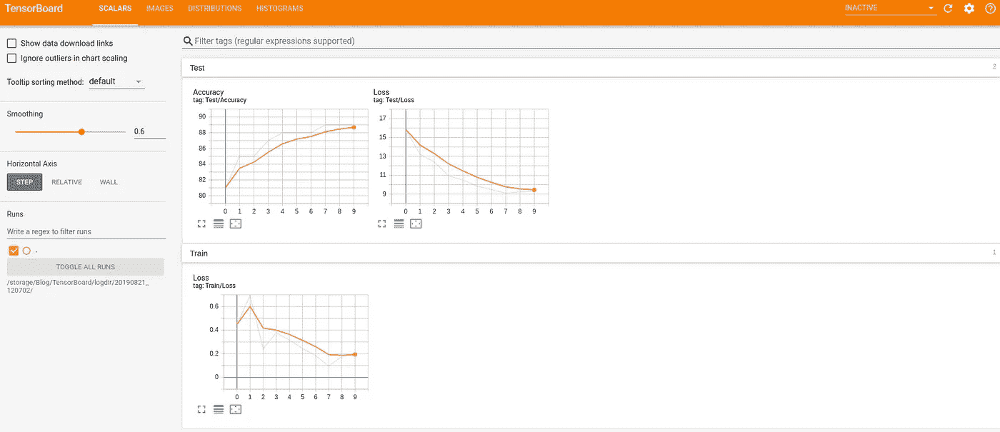
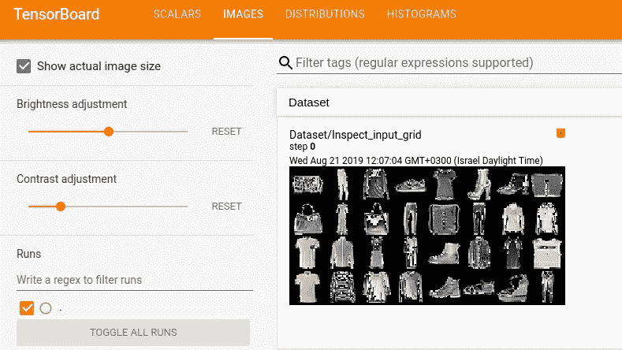
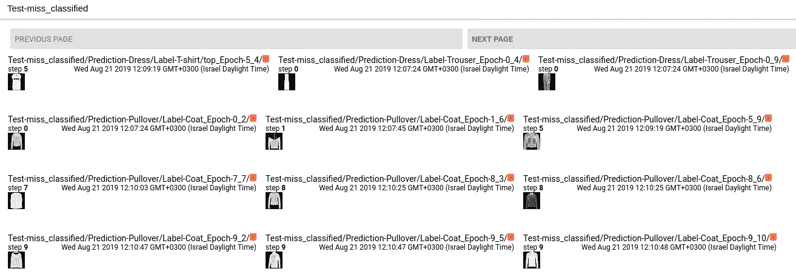
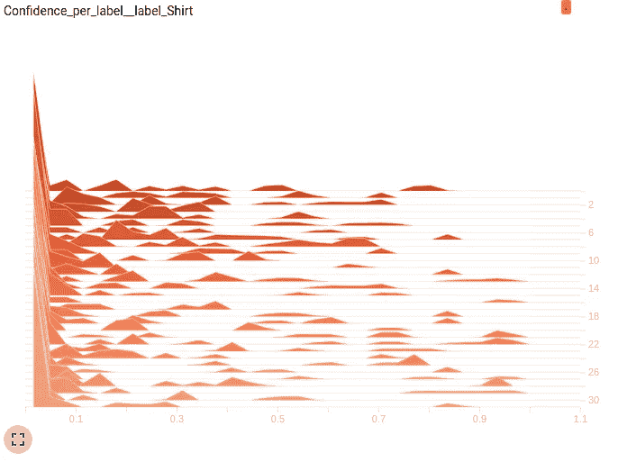
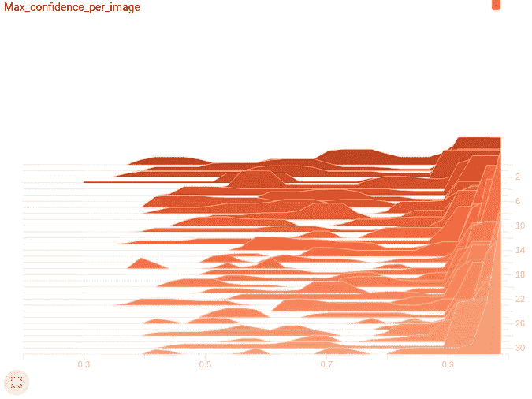

# 深入了解您的 Pytorch 模型，内置新的 Tensorboard

> 原文：<https://towardsdatascience.com/https-medium-com-dinber19-take-a-deeper-look-at-your-pytorch-model-with-the-new-tensorboard-built-in-513969cf6a72?source=collection_archive---------3----------------------->

深度学习模型通常很复杂，难以理解，并被用作“黑盒”。使您的模型更容易访问并可视化其进度可以帮助您更好地理解培训过程中发生的事情。在一个表现良好的模型中，这是一种很好的教育能力，但当你遇到问题时，这是一种不可忽视的力量。它可以帮助您及早发现它们，更有效地调试并消除数据集中的任何偏差。

Tensorboard 允许您记录来自模型训练的事件，包括各种标量(例如，准确性、损失)、图像、直方图等。直到最近，Tensorboard 才得到 Tensorflow 的官方支持，但随着 Pytorch 1.2.0 的最新发布，Tensorboard 现在是一个本机 Pytorch 内置的。


Photo by [Kelly Sikkema](https://unsplash.com/@kellysikkema?utm_source=medium&utm_medium=referral) on [Unsplash](https://unsplash.com?utm_source=medium&utm_medium=referral)

**这篇文章**的目的是向读者介绍 Pytorch 内置 Tensorboard 的基本用法、功能和用途。该员额分为三个部分:

1.  **安装**
2.  **基本运行**
3.  **时尚 MNIST 数据集上的示例补充了使用选项**

# **安装**

要开始安装，请确保您已经创建了一个**新的 conda 环境**。查看[此处的](https://docs.conda.io/projects/conda/en/latest/user-guide/tasks/manage-environments.html)以获取更多 conda 环境管理说明。接下来，您需要安装最新的 Pytorch 版本(1.2.0):

```
conda install -n /yourenv/ pytorch torchvision cudatoolkit=/yourcudaver/ -c pytorch
```

分别用环境名和 cuda 版本名替换“yourenv”和“yourcudaver”。

安装 Pytorch 后，您应该激活您的环境并安装 Tensorboard 的每夜构建版本:

```
pip install tb-nightly
```

最后，为了避免依赖性错误“没有名为‘past’的模块”，应该安装库‘future ’:

```
pip install future
```

## **就是这样！**

如果一切安装正确，你应该能够在 python 中导入**torch . utils . tensor board**并进入基本运行部分。

# **基本运行**

Tensorboard 的一般使用模式包括两个互补的部分:(python 中的事件记录和(ii)命令行显示激活。

## python 中的事件记录

首先，需要将 Tensorboard 导入 python，并创建 writer 类的新实例。writer 的可选输入是 logdir 的路径(否则它将记录到。/runs/)。

该路径表示一个目录，如果该目录不存在，将会创建该目录，所有事件文件都将被写入该目录。稍后，运行将基于 logdir 相互分离，因此您应该为每个运行构建一个唯一的目录路径。

现在，剩下的就是将各种日志写入编写器(在第三节中有详细介绍)。对于动态显示在板上的日志，应使用以下两个选项之一:

**注意**每次使用 **writer.close()** 都会随后生成一个新的事件文件供日志跟踪(但是不用担心，您仍然可以继续将事件记录到同一个板)。

## 命令行显示激活

要查看板上的日志，您需要在命令行中运行以下命令:

```
tensorboard --logdir=/path_to_log_dir/ --port 6006
```

到端口 6006 的链接将打印在命令行中，您可以通过 CTRL+单击链接或在浏览器中键入 localhost:6006 来访问它。

**注意**:使用**到 logdir** 的完整路径，和你在 python 中使用的一样。不要使用任何引号。即使显示了错误或不存在的路径，Tensorboard 也不会**发出任何错误！**

如果您想在同一块板上查看多个运行，最简单的方法是将所需的 logdir 移动到同一个目录，并在 logdir 中指明新的目录路径:

```
tensorboard --logdir=/path_to_joint_dir/ --port 6006
```

您也可以通过更改其中一个的端口(例如 8008)来同时监控多个运行，但在不同的板上。

# **时尚 MNIST 数据集上的示例补充了使用选项**

既然 Tensorboard 已经安装并导入到 python 中，您可以开始记录各种有趣的指标来评估您的模型。

为了更好地解释不同的用法和它们的主要好处，我们将遵循一个简单的时尚 MNIST 分类器的案例研究。完整代码可从[这里](https://github.com/dinaber/Fashion-MNIST-classifier-for-Pytorch-built-in-Tensorboard/blob/master/Fashion-MNISTclassifier.py)获得，数据集可以使用 Pytorch 下载，也可以从[这里](https://github.com/zalandoresearch/fashion-mnist)下载。

我们将用于分类器的模型相当简单。两个 conv2d 层，后面是两个完全连接的层，最终输出 10 个类。ReLU 用作模型内的激活，softmax 用作输出。

**模型类:**

## **记录标量:**

也许检查模型性能的最直观方法是跟踪损失、准确性等标量指标输出。绘制这些指标可以更好地理解它们的时间背景，如果可以在运行模型时实时完成，就更好了。Tensorboard 可以让你做到这一点。

标量日志记录的格式为:

其中**标签**表示唯一的数据标识符(即标量值将被附加到哪个列表)。对指标进行分层排序的一种简便方法是对标记使用“截面/绘图”格式。Tensorboard 然后将所有具有相同截面的图聚集在一起(下面的代码中给出了示例)。

**global_step** 是一个整数，而**T5 实际上是绘图中的 x 轴值。如果你让它不存在，那么模型将假设所有标量的 global_step=0。
**注意**:在同一次运行中不会发生覆盖，这意味着如果你用相同的全局步长绘制两个标量，它们都会出现在图上。默认的**墙壁时间**是 time.time()，因为训练已经开始，可以更改为自定义时间。**

查看时尚-MNIST 分类器，我们最感兴趣的是训练时期之间的损失变化以及每次验证之间的平均损失和准确性。我们将在测试和训练运行中记录这些标量(记住，您可以在完整的代码上下文[中查看这些行，这里是](https://github.com/dinaber/Fashion-MNIST-classifier-for-Pytorch-built-in-Tensorboard/blob/master/Fashion-MNISTclassifier.py))。

在 Tensorboard 中，数据显示在每个历元之后更新(由于 writer.flush())，在 10 个历元之后，我们的损耗和准确度日志图如下所示:



我们可以玩我们想要的情节显示的“平滑”程度，也可以放大到全屏。

所以，事实上，我们可以看到我们的模型正在做一些事情。它学习有效，训练和测试损失减少，测试准确率提高到 89%。10 个纪元后还不错。但是也许我们可以做得更好？数字是伟大的，但图像有时甚至更好。

## **记录图像:**

人们可以想到可视化图像数据会有帮助的许多原因和步骤。

图像记录的格式为:

这里，**标记**再次代表一个唯一的数据标识符，这意味着对于要添加的多个图像，您应该更改标记名称。例外情况是一次添加多个图像。对于批量图像数据记录，您可以阅读 Pytorch [文档](https://pytorch.org/docs/stable/tensorboard.html)中的“添加图像”部分。分级排序也是可能的，如在标量日志中。**注意**在图像记录中**全局 _ 步骤**仅仅是一个标签。

在我们的案例研究中，我们首先希望用与模型相同的眼睛来观察数据，并在转换后检查所选图像的网格。
为此，我们使用 torchvision utils 创建一个网格对象，并将其添加到 writer:

Tensorboard 中显示的结果让我们很好地掌握了我们的数据在输入到我们的模型后的样子。你能说出所有图片的真实标签吗？



图像记录的另一个有趣的目的是在模型运行时跟踪模型的学习进度。例如，在对象检测/分割中，我们可以随时间可视化预测的遮罩或边界框，并且当训练生成模型时，我们可以通过训练过程来监控模型正在生成的图像的质量。

在我们的案例研究中，也许更有趣的是观察我们模型的**错误分类**。具体来说，在每个时期之后，我们可以记录一些带有错误预测和正确标签的错误分类图像。
我们可能认为模型在早期会犯“非常愚蠢”的错误，但随着模型的学习，我们会认为它只会错误地对非常硬的图像进行分类。

在 Tensorboard 中，这将看起来像:



事实上，我们可以看到，在纪元 0 时，我们的模型将裤子错误地归类为衣服，而在纪元 9 时，模型将套头衫错误地归类为外套(坦白地说，我不确定我能说出其中的区别)。

## **记录直方图:**

另一个关于模型性能和任何数据偏差的很好的展望可以通过直方图提供。

直方图记录的格式为:

虽然**标签**的行为与标量中的行为相同，但这里的 **global_step** 变量是一个整数，它在创建直方图堆栈时指示 z 轴值。**值**可以作为标量或 numpy 数组传递。

**注意**尽管理论上直方图无论是以累积方式还是使用 numpy 数组一次接收其值都应该表现相同，但实际上是不同的。逐个传递值会导致绘图出现不连续的现象，因此最好将值作为 numpy 数组传递。

也许直方图查看数据的一些更普通的用法可能包括输入图像大小(如果您的数据不均匀)、每幅图像的边界框数量等

但是有更多的选择。在我们的案例研究中，我们希望确保我们的分类器在学习不同的图像或标签时没有偏见。为此，我们从测试步骤中提取了两个变量:(I)对每个标签的置信度建模，以及(ii)对每个图像的最大置信度建模。
**每个标签的模型置信度**是我们在这个标签位置的预测向量中看到的软最大概率，而不管真实图像标签。
**每幅图像的模型最大置信度**是一幅图像的最大 softmax 概率输出。我们从第一个时期和随后的时期提取这些变量并绘制每批的分布直方图。这些批次是随机选择的，从第 0 个时期中选择的机会较高，因为大多数戏剧性的学习可能发生在那里。

**现在，你应该停下来一分钟，不要向下滚动，试着在脑海中想象两个直方图堆栈的结果应该是什么样子。**

以下是 Tensorboard 的一些结果:



在 Tensorboard 上，堆叠直方图以这样的方式显示，早期记录(在我们的例子中是批次)出现在后面，具有较深的橙色，而较新的图在前面。

让我们首先来看看每个标签的最大置信度直方图。正如你在这里显示的一个标签的例子中看到的，早期的批次更连续，有更多的“峰”。当我们转到后面的批次，甚至可能是时代，直方图看起来更像双峰。查看每个图像的最大置信度图，我们可以看到，随着我们移动到后面的批次，图上的临界质量向右移动，接近 1。

那么我们看到了什么？我们的模型随着学习变得更加自信。在开始时，它不能真正告诉每个图像的正确标签，因此对于许多图像，它犹豫地猜测多个标签，从而降低了每个图像的最大置信度。这也导致每个标签的置信度分布几乎是均匀的。但是随着它逐渐了解到这一点。现在，对于每个标签，分布都是双峰的——要么它知道它是有问题的标签(然后是值~ 1)，要么它知道它不是(然后是值~0)。大多数情况下不是(90%)。相应地，每幅图像的最大置信度也增加了。

# **后记**

Pytorch 内置 Tensorboard 是一个非常强大的工具，可以在训练期间可视化和评估您的模型和数据集。Pytorch 最终决定将 Tensorboard 的本地版本加入到他们的库中，这很棒，我真的希望他们继续开发和改进它。为了您的方便，也出于乐观的期望，我列出了一些错误和潜在的改进:

*   从命令行运行 Tensorboard 无法识别两侧带有引号的路径，并且即使该路径不存在也不会报告任何错误。
*   不幸的是，计算图形可视化不起作用(最后一次检查是在 2019 年 8 月 21 日)。它记录的图形没有任何错误，Tensorboard 中的图形部分变为“活动”，但它只显示两个空框。
*   将值累积记录到直方图的行为很奇怪。单独的测井事件不会形成连续的图，如果使用直方图叠加，一些峰值不稳定。
*   直方图堆叠相机角度可能非常有用，否则透视扮演太大的角色。
*   Tensorboard 缺少重置或覆盖标量数据 id 的选项(例如，用于每历元实时丢失跟踪)。