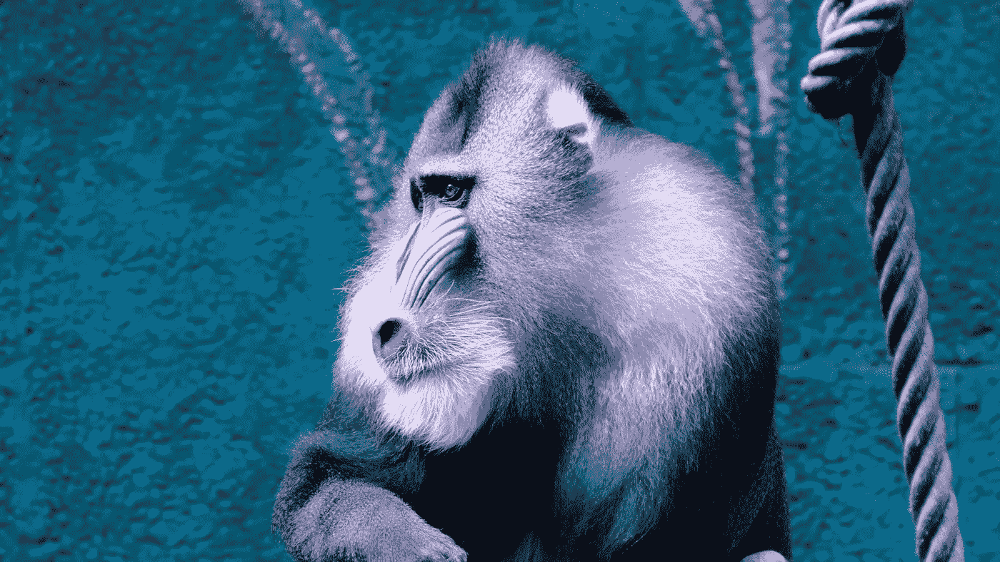

# 在不到 10 分钟的时间内对数据集进行最先进的图像分类

> 原文：<https://towardsdatascience.com/https-medium-com-drchemlal-deep-learning-tutorial-1-f94156d79802?source=collection_archive---------2----------------------->


Photo by [Andre Mouton](https://unsplash.com/@andremouton?utm_source=medium&utm_medium=referral) on [Unsplash](https://unsplash.com?utm_source=medium&utm_medium=referral)

> 2019 年 7 月 3 日更新。

这个简短的教程是在您选择的任何**图像数据集上构建和训练图像识别器的分步指南。**

在本教程中，您将学习如何:

*   从谷歌图片中抓取图片，创建你自己的数据集
*   在数据集上构建和训练图像识别器
*   可视化并充分解释分类结果
*   用新图像测试模型

**要运行这个笔记本，只需在这里用 Google Colab**[](https://colab.research.google.com/github/SalChem/Fastai-iNotes-iTutorials/blob/master/Image_Recognizer_Tutorial.ipynb)****打开即可。****

**该笔记本是完全独立的，没有错误，所以你可以运行它。**

**一旦进入 Colab， ***确保更改以下内容以启用 GPU 后端，*****

***运行时- >更改运行时类型- >硬件加速器- > GPU***

# **1.图像数据集下载和设置**

****选项 1:** 使用您自己的数据集**

**如果您想使用自己的图像数据集，请重新排列它，使同一类的图像位于同一文件夹下。然后，用相应的类别标签命名文件夹。**

****选项 2:** 从谷歌图片中抓取图片**

**如果你手头没有数据集，你可以从[谷歌图片](https://www.google.com/imghp?hl=en)中抓取图片，组成一个你选择的数据集。为此，只需在您的谷歌 chrome 浏览器上安装 [Fatkun 批量下载图片](https://chrome.google.com/webstore/detail/fatkun-batch-download-ima/nnjjahlikiabnchcpehcpkdeckfgnohf)扩展，并通过点击扩展选项卡下载任何一组谷歌图片。将同一类别的所有图像放在同一文件夹下，并相应地命名文件夹。**

****选项 3:** 使用我的猴子数据集，这是我最初从谷歌图片上搜集的:)**

**可以使用以下几个 bash 命令下载和解压缩数据集。**

**在本教程中，我们将对**猴子**进行分类，因此我们创建了 6 个文件夹，对应 6 种不同类型的猴子，如下所示。**

********

**如果您使用您的数据集运行此笔记本，只需将上面单元格中的 url 和文件名替换为您的。存储。Dropbox 中的 tar 文件对我来说效果最好。**

# **2.图像识别**

> **关于代码和函数的更详细的解释可以在我的另一个综合教程⬇中找到**

**[](/a-comprehensive-state-of-the-art-image-recognition-tutorial-c34c544d0b4) [## 一个全面的最先进的图像识别教程

### 使用 fastai 和 PyTorch 解密 CNN、ResNets、迁移学习、微调和 1Cycle 策略

towardsdatascience.com](/a-comprehensive-state-of-the-art-image-recognition-tutorial-c34c544d0b4) 

# 初始化

PATH 是包含所有类文件夹的路径。如果使用自己的数据集，请相应地更改路径。

让我们检索图像类，

```
There are  6 classes:
 ['Macaque', 'Orungatun', 'Chimpanzee', 'Gorilla', 'Mandrill', 'Gibbon']
```

让我们验证没有任何无法读取的损坏图像。如果找到了，它们将被删除。

# 创建和训练分类器

让我们创建我们的训练和验证集，80%的数据集将用于训练，20%用于验证。

```
There are 268 training images and 67 validation images.
```

让我们想象一些不同班级的图片，


让我们建立我们的深度卷积神经网络(CNN)，

我们使用 [**ResNet34**](https://arxiv.org/pdf/1512.03385.pdf) 作为我们的模型架构。ResNet architecture 在过去几年中取得了巨大的成功，并且仍然被认为是最先进的。

查看我的另一篇文章，了解更多关于 CNN、resnets、迁移学习、微调、1 周期策略调度器和更多⬇.的信息本教程全面而简洁，您将对底层架构和培训过程有一个很好的理解。

[](/a-comprehensive-state-of-the-art-image-recognition-tutorial-c34c544d0b4) [## 一个全面的最先进的图像识别教程

### 使用 fastai 和 PyTorch 解密 CNN、ResNets、迁移学习、微调和 1Cycle 策略

towardsdatascience.com](/a-comprehensive-state-of-the-art-image-recognition-tutorial-c34c544d0b4) 

尽管我们在这里使用的是 ResNet34，你也可以尝试其他 [ResNet 型号](https://pytorch.org/docs/stable/torchvision/models.html#id3)。但是，请记住，增加层数将需要更多的 GPU 内存。

让我们训练模型，


太好了，我们只用几行代码就达到了很高的分类精度。

我们完成了，但是让我们进一步解释结果。

# 3.结果解释和可视化

我们可以从想象一个混乱矩阵开始。对角线元素表示预测标签等于真实标签的图像的数量，而非对角线元素是那些被分类器错误标记的图像。


我们还可以绘制损失最大的图像，这些图像是模型最困惑的图像。高损失意味着对错误答案的高度信任。

图像与顶部损失一起显示:
预测标签/实际标签/损失/实际图像类别的概率。


## 4.在新图像上测试模型

现在让我们给这个模型一个它以前从未见过的新图像，看看它做得有多好。

将图像上传到此笔记本的同一文件夹中。



```
It is a Mandrill
```

# 祝贺您完成、阅读或浏览本教程。

**鸣谢:**本教程使用 [fastai 库](https://docs.fast.ai/index.html)，在此感谢[杰瑞米·霍华德](https://twitter.com/jeremyphoward)和 [fast.ai](https://www.fast.ai/) 。我也感谢戴夫·史密斯的善意编辑。

我希望这篇简短的教程对你有所帮助。请分享它，并给它一些掌声，这样它也可以到达其他人😀欢迎留下任何评论，在 Twitter @ [SalimChemlal](https://twitter.com/SalimChemlal) 上与我联系，并在 [Medium](https://medium.com/@drchemlal) 上关注我了解更多信息！**