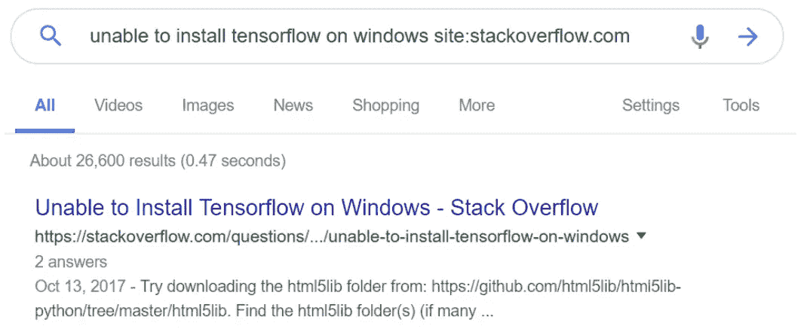
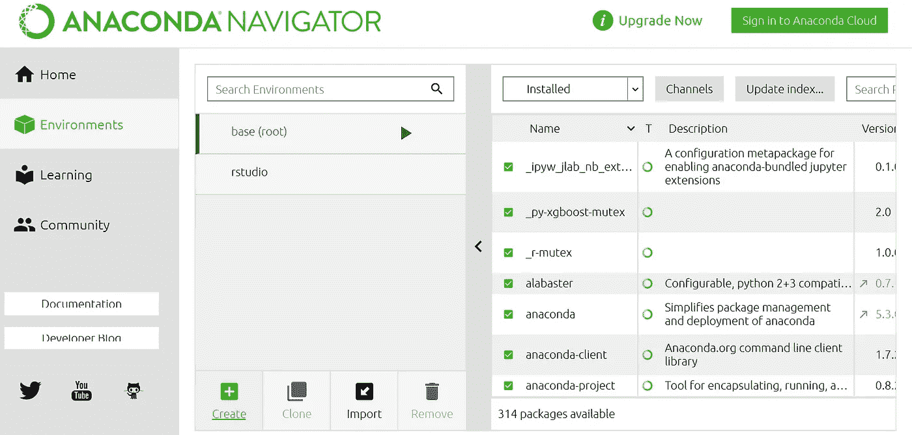
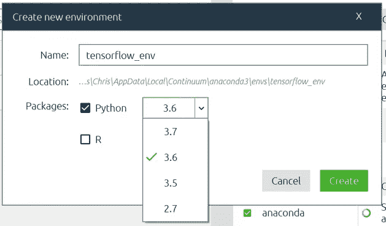
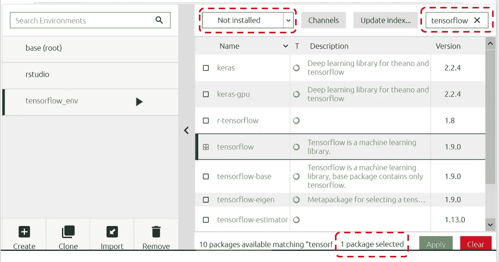
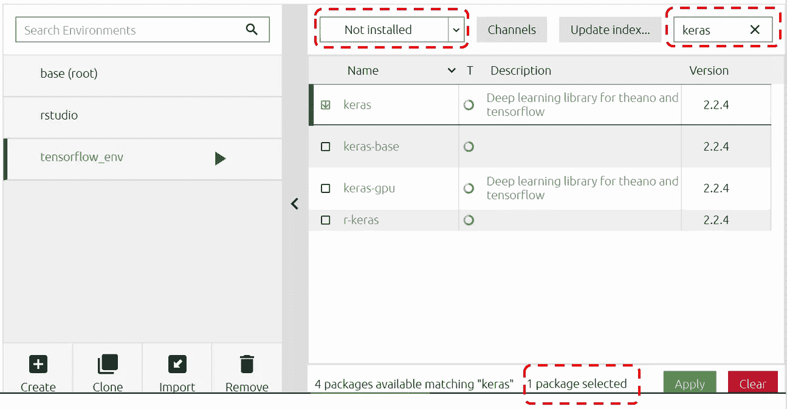
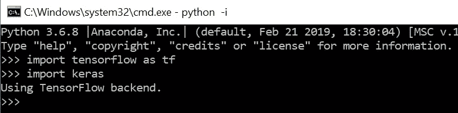
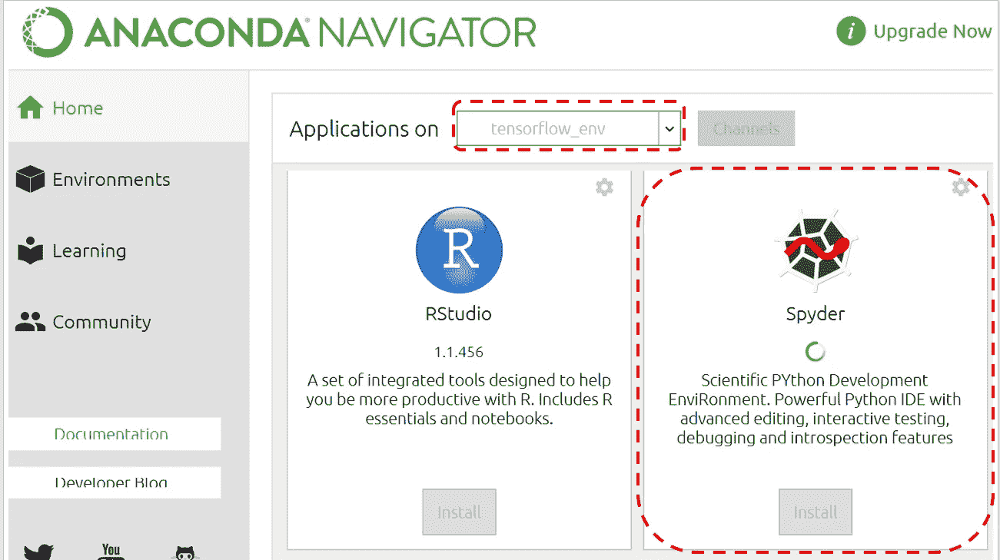
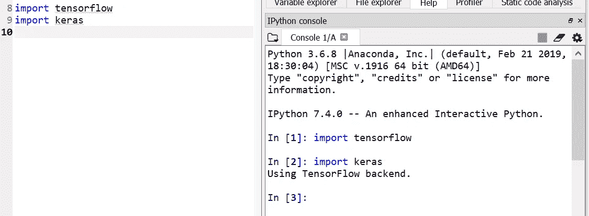

# 使用 Anaconda Navigator 安装 TensorFlow 和 Keras 无需命令行

> 原文：<https://towardsdatascience.com/https-medium-com-ekapope-v-install-tensorflow-and-keras-using-anaconda-navigator-without-command-line-b0bc41dbd038?source=collection_archive---------0----------------------->

## 在命令行中对 pip 安装说不！**分三步在你的机器上安装** TensorFlow **的另一种方法。**

[https://www.pexels.com/photo/silhouette-people-on-beach-at-sunset-315843/](https://www.pexels.com/photo/silhouette-people-on-beach-at-sunset-315843/)

# 我为什么要写这个？

我花了几个小时使用多种配置的 pip install，试图弄清楚如何为 TensorFlow 和 Keras 正确设置我的 python 环境。

why is tensorflow so hard to install — 600k+ results

unable to install tensorflow on windows site:stackoverflow.com — 26k+ results

# 就在我放弃之前，我发现了这个…

> "[使用 conda 而非 pip 安装 TensorFlow 的一个主要优势是 conda 软件包管理系统。当使用 conda 安装 TensorFlow 时，conda 也会安装软件包的所有必需和兼容的依赖项。](https://www.anaconda.com/tensorflow-in-anaconda/)

*本文将带您了解如何使用 Anaconda 的 GUI 版本安装 TensorFlow 和 Keras。我假设你已经下载并安装了 [Anaconda Navigator](https://www.anaconda.com/distribution/) 。*

# *我们开始吧！*

1.  *启动蟒蛇导航器。转到“环境”选项卡，然后单击“创建”。*

**

*Go to ‘Environments tab’, click ‘Create’*

*2.输入新的环境名，我放‘tensor flow _ env’。**这里一定要选择 Python 3.6！**然后“创建”，这可能需要几分钟时间。*

**

*make sure to select Python 3.6*

*3.在您的新“tensorflow_env”环境中。选择“未安装”，输入“tensorflow”。然后，勾选“张量流”和“应用”。将出现弹出窗口，继续操作并应用。这可能需要几分钟时间。*

**

*对“keras”进行同样的操作。*

**

*通过导入软件包来检查您的安装。如果一切正常，该命令将不返回任何内容。如果安装不成功，您将得到一个错误。*

**

*no error pop up — Yeah!*

**

*You can also try with Spyder.*

**

*no error pop up — Yeah!*

*然后…哒哒！搞定了！你可以按照本文[来测试你新安装的软件包:)](/how-to-build-a-neural-network-with-keras-e8faa33d0ae4)*

*感谢您的阅读。请尝试一下，并让我知道你的反馈！*

*考虑在 [GitHub](https://github.com/ekapope) 、 [Medium](https://medium.com/@ekapope.v) 和 [Twitter](https://twitter.com/EkapopeV) 上关注我，以获取关于您的提要的更多文章和教程。如果你喜欢我做的，不要只按一次拍手按钮。击中它 50 次:D*