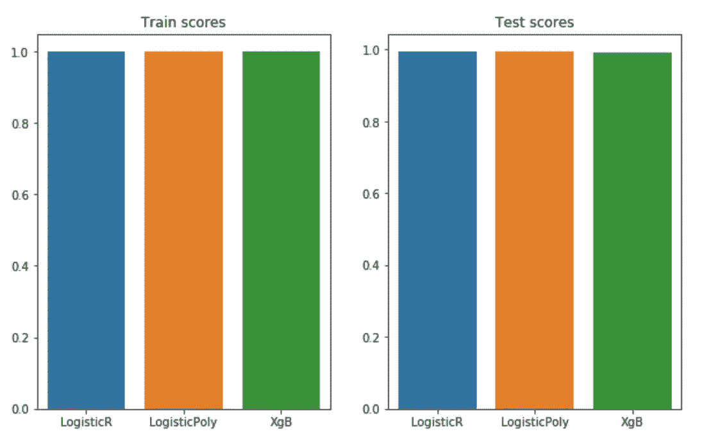

# 使用 Scikit 生成合成分类数据

> 原文：<https://towardsdatascience.com/https-medium-com-faizanahemad-generating-synthetic-classification-data-using-scikit-1590c1632922?source=collection_archive---------2----------------------->


Generating Synthetic Data

这是关于不平衡和噪声数据系列文章的第 1 部分。[关于偏斜分类指标的第 2 部分已经发布](/selecting-the-right-metric-for-skewed-classification-problems-6e0a4a6167a7)。

# 为什么我们需要数据生成器？

数据生成器帮助我们用不同的分布和概要文件创建数据来进行实验。如果您正在测试各种可用的算法，并且希望找到哪种算法在什么情况下有效，那么这些数据生成器可以帮助您生成特定于情况的数据，然后测试算法。

例如，你想检查是否梯度推进树可以做得很好，只给 100 个数据点和 2 个特征？现在，您可以搜索 100 个数据点的数据集，也可以使用您自己正在处理的数据集。但是你怎么知道这个分类器是不是一个好的选择，假设你有这么少的数据，做交叉验证和测试仍然留下了过度拟合的机会？或者，您可以使用生成的数据，看看在这种情况下什么通常效果好，是升压算法还是线性模型。

您需要生成数据的几个原因

*   你的模型能处理嘈杂的标签吗？
*   当你的标签 99%是负面的，只有 1%是正面的，会发生什么？
*   如果你的模型能告诉你哪些功能是多余的？
*   在模型提供特征重要性的情况下，模型如何处理冗余特征。
*   移除多余的特征会提高模型的性能吗？
*   当冗余要素、噪声和不平衡同时出现在数据集中时，您的模型会如何表现？
*   如果你有 *N* 个数据点和 *M* 个特征，N，M 的安全值是多少，这样你的模型才不会过拟合？

找到一个真正的数据集来满足这种已知水平的标准组合将是非常困难的。因此，我们只考虑了生成器必须具备的几个能力，以给出真实世界数据集的良好近似。

# 发电机能力

在寻找发电机时，我们寻找某些功能。我列出了我们在生成器中寻找的重要功能，并对它们进行了相应的分类。

## 支持不平衡的类

很多时候，你会得到有巨大不平衡的分类数据。例如，欺诈检测具有不平衡性，使得大多数例子(99%)是非欺诈的。要检查分类器在不平衡情况下的表现，您需要能够生成多种类型的不平衡数据。

*   高斯分位数
*   制作分类 API

## 支持生成噪声数据

即使类别标签有噪音，你的分类器能完成它的工作吗？如果一些欺诈例子被标记为非欺诈，一些非欺诈被标记为欺诈怎么办？你如何知道你选择的分类器在有噪声的情况下的行为？你如何选择一个健壮的分类器？

*   制作分类 API

## 添加冗余/无用的功能

这些是你有用特征的线性组合。许多模型，如线性回归，对相关特征给出任意的特征系数。在树模型的情况下，它们混淆了特征的重要性，并且随机地和可互换地使用这些特征进行分割。移除相关特征通常会提高性能。

*   制作分类 API

# 例子

[用于此的笔记本在 Github 中。](https://github.com/faizanahemad/data-science/blob/master/exploration_projects/imbalance-noise-oversampling/Generating%20and%20Visualizing%20Classification%20Data%20using%20scikit.ipynb)助手功能在这个[文件](https://github.com/faizanahemad/data-science/blob/master/exploration_projects/imbalance-noise-oversampling/lib.py)中定义。

在这里，我们将介绍 scikit 中可用的 3 个非常好的数据生成器，并了解如何在各种情况下使用它们。

## 高斯分位数

**2 级 2D**

```
from sklearn.datasets import make_gaussian_quantiles# Construct dataset
X1, y1 = make_gaussian_quantiles(cov=3.,
                                 n_samples=10000, n_features=2,
                                 n_classes=2, random_state=1)X1 = pd.DataFrame(X1,columns=['x','y'])
y1 = pd.Series(y1)
visualize_2d(X1,y1)
```


Gaussian Data

**多级 2D**

```
from sklearn.datasets import make_gaussian_quantiles# Construct dataset
X1, y1 = make_gaussian_quantiles(cov=3.,
                                 n_samples=10000, n_features=2,
                                 n_classes=3, random_state=1)X1 = pd.DataFrame(X1,columns=['x','y'])
y1 = pd.Series(y1)
visualize_2d(X1,y1)
```


3 Class Gaussian

**2 级 3D**

```
from sklearn.datasets import make_gaussian_quantiles# Construct dataset
X1, y1 = make_gaussian_quantiles(cov=1.,
                                 n_samples=10000, n_features=3,
                                 n_classes=2, random_state=1)X1 = pd.DataFrame(X1,columns=['x','y','z'])
y1 = pd.Series(y1)
visualize_3d(X1,y1)
```


3D Gaussian Data

**通过组合两个高斯函数得到更硬的边界**

我们创建两个中心位置不同的高斯。`mean=(4,4)`在第二个高斯创建中，它以 x=4，y=4 为中心。接下来，我们反转第二个高斯，并将其数据点添加到第一个高斯的数据点。

```
from sklearn.datasets import make_gaussian_quantiles# Construct dataset# Gaussian 1
X1, y1 = make_gaussian_quantiles(cov=3.,
                                 n_samples=10000, n_features=2,
                                 n_classes=2, random_state=1)X1 = pd.DataFrame(X1,columns=['x','y'])
y1 = pd.Series(y1) # Gaussian 2X2, y2 = make_gaussian_quantiles(mean=(4, 4), cov=1,
                                 n_samples=5000, n_features=2,
                                 n_classes=2, random_state=1)X2 = pd.DataFrame(X2,columns=['x','y'])
y2 = pd.Series(y2)# Combine the gaussiansX1.shape
X2.shapeX = pd.DataFrame(np.concatenate((X1, X2)))
y = pd.Series(np.concatenate((y1, - y2 + 1)))X.shapevisualize_2d(X,y)
```


Combined Gaussians

## 一滴

如果你想要更简单和容易分离的数据，Blobs 是个不错的选择。这些可以通过线性决策边界来分隔。这里我将展示一个 4 类 3D (3 特征斑点)的例子。


Blobs with 4 classes in 3D

你可以注意到斑点是如何被简单的平面分开的。因此，这些数据点非常适合测试线性算法，如 LogisticRegression。

## 制作分类 API

这是用于数据生成的最复杂的 scikit api，它带有所有的附加功能。它允许您拥有多种功能。还允许您向数据中添加噪声和不平衡。

一些更好的特性包括添加冗余特性，这些特性基本上是现有特性的线性组合。添加非信息特征来检查模型是否过度拟合这些无用特征。也增加了直接重复的特征。

此外，为了增加分类的复杂性，您可以拥有多个类簇，并减少类之间的间隔，以强制分类器具有复杂的非线性边界。

我在下面提供了使用这个 API 的各种方法。

**3 类 3D 简单案例**

```
from sklearn.datasets import make_classification
X,y = make_classification(n_samples=10000, n_features=3, n_informative=3, 
                    n_redundant=0, n_repeated=0, n_classes=3, n_clusters_per_class=2,
                          class_sep=1.5,
                   flip_y=0,weights=[0.5,0.5,0.5])X = pd.DataFrame(X)
y = pd.Series(y)visualize_3d(X,y)
```


Simple case of Make Classification API

**3 类 2D 带噪声**

这里我们将使用参数`flip_y`来添加额外的噪声。这可以用来测试我们的分类器在添加噪声后是否工作良好。如果我们有真实世界的噪声数据(比如来自 IOT 的设备)，并且分类器不能很好地处理噪声，那么我们的准确性将会受到影响。

```
from sklearn.datasets import make_classification# Generate Clean dataX,y = make_classification(n_samples=10000, n_features=2, n_informative=2,n_redundant=0, n_repeated=0, n_classes=2, n_clusters_per_class=1,class_sep=2,**flip_y=0**,weights=[0.5,0.5], random_state=17)f, (ax1,ax2) = plt.subplots(nrows=1, ncols=2,figsize=(20,8))
sns.scatterplot(X[:,0],X[:,1],hue=y,ax=ax1);
ax1.set_title("No Noise");# Generate noisy DataX,y = make_classification(n_samples=10000, n_features=2, n_informative=2, n_redundant=0, n_repeated=0, n_classes=2, n_clusters_per_class=1,class_sep=2,**flip_y=0.2**,weights=[0.5,0.5], random_state=17)sns.scatterplot(X[:,0],X[:,1],hue=y,ax=ax2);
ax2.set_title("With Noise");plt.show();
```


Without and With Noise

**2 级 2D 与不平衡**

这里我们会有比正面例子多 9 倍的反面例子。

```
from sklearn.datasets import make_classification# Generate Balanced DataX,y = make_classification(n_samples=1000, n_features=2, n_informative=2,n_redundant=0, n_repeated=0, n_classes=2, n_clusters_per_class=2,class_sep=2,flip_y=0,weights=[0.5,0.5], random_state=17)f, (ax1,ax2) = plt.subplots(nrows=1, ncols=2,figsize=(20,8))
sns.scatterplot(X[:,0],X[:,1],hue=y,ax=ax1);
ax1.set_title("No Imbalance");# Generate Imbalanced DataX,y = make_classification(n_samples=1000, n_features=2, n_informative=2, n_redundant=0, n_repeated=0, n_classes=2, n_clusters_per_class=2,class_sep=2,flip_y=0,weights=[0.9,0.1], random_state=17)sns.scatterplot(X[:,0],X[:,1],hue=y,ax=ax2);
ax2.set_title("Imbalance 9:1 :: Negative:Postive");plt.show();
```


Imbalance: Notice how the right side has low volume of class=1

**使用冗余功能(3D)**

这增加了冗余特征，这些冗余特征是其他有用特征的线性组合。

```
from sklearn.datasets import make_classification# All unique featuresX,y = make_classification(n_samples=10000, **n_features=3, n_informative=3, n_redundant=0,** n_repeated=0, n_classes=2, n_clusters_per_class=2,class_sep=2,flip_y=0,weights=[0.5,0.5], random_state=17)visualize_3d(X,y,algorithm="pca")# 2 Useful features and 3rd feature as Linear Combination of first 2X,y = make_classification(n_samples=10000, **n_features=3, n_informative=2, n_redundant=1,** n_repeated=0, n_classes=2, n_clusters_per_class=2,class_sep=2,flip_y=0,weights=[0.5,0.5], random_state=17)visualize_3d(X,y,algorithm="pca")
```


Non Redundant features

请注意，在存在冗余特征的情况下，第二张图似乎是由某个 3D 平面(而非完整的 3D 空间)中的数据点组成的。与第一张图相比，第一张图中的数据点是在所有 3 个维度上分布的云。

对于第二张图，我直觉地认为，如果我将我的坐标改变到数据点所在的 3D 平面，那么数据将仍然是可分离的，但是它的维度将减少到 2D，即，通过减少第二张图的维度，我将不会丢失任何信息。但是如果我减少第一个图的维度，数据将不再保持可分，因为所有 3 个特征都是非冗余的。让我们试试这个主意。

```
X,y = make_classification(n_samples=1000, **n_features=3, n_informative=3, n_redundant=0,** n_repeated=0, n_classes=2, n_clusters_per_class=2,class_sep=0.75,flip_y=0,weights=[0.5,0.5], random_state=17)visualize_2d(X,y,algorithm="pca")X,y = make_classification(n_samples=1000, **n_features=3, n_informative=2, n_redundant=1,** n_repeated=0, n_classes=2, n_clusters_per_class=2,class_sep=0.75,flip_y=0,weights=[0.5,0.5], random_state=17)visualize_2d(X,y,algorithm="pca")
```


Non Redundant — Can’t Separate in 2D


Redundant 3rd Dim — Separable in 2D as well

**利用阶级分离**

改变类分离会改变分类任务的难度。在低等级分离的情况下，数据点不再容易分离。

```
from sklearn.datasets import make_classification# Low class Sep, Hard decision boundaryX,y = make_classification(n_samples=1000, n_features=2, n_informative=2,n_redundant=0, n_repeated=0, n_classes=2, n_clusters_per_class=2,**class_sep=0.75**,flip_y=0,weights=[0.5,0.5], random_state=17)f, (ax1,ax2, ax3) = plt.subplots(nrows=1, ncols=3,figsize=(20,5))
sns.scatterplot(X[:,0],X[:,1],hue=y,ax=ax1);
ax1.set_title("Low class Sep, Hard decision boundary");# Avg class Sep, Normal decision boundaryX,y = make_classification(n_samples=1000, n_features=2, n_informative=2,n_redundant=0, n_repeated=0, n_classes=2, n_clusters_per_class=2,**class_sep=1.5**,flip_y=0,weights=[0.5,0.5], random_state=17)sns.scatterplot(X[:,0],X[:,1],hue=y,ax=ax2);
ax2.set_title("Avg class Sep, Normal decision boundary");# Large class Sep, Easy decision boundaryX,y = make_classification(n_samples=1000, n_features=2, n_informative=2, n_redundant=0, n_repeated=0, n_classes=2, n_clusters_per_class=2,**class_sep=3**,flip_y=0,weights=[0.5,0.5], random_state=17)sns.scatterplot(X[:,0],X[:,1],hue=y,ax=ax3);
ax3.set_title("Large class Sep, Easy decision boundary");plt.show();
```


From Left to Right: Higher Class separation and easier decision boundaries

# 测试各种分类器以了解数据生成器的使用

我们将生成两组数据，并展示如何测试二进制分类器的性能并检查其性能。我们的第一组将是具有容易分离性的标准 2 类数据。我们的第二组将是具有非线性边界和较小类别不平衡的 2 类数据。

## 要测试的假设

我们想要检验的假设是，单独的逻辑回归不能学习非线性边界。梯度推进在学习非线性边界时最有效。

## 数据

```
from sklearn.datasets import make_classification# Easy decision boundaryX1,y1 = make_classification(n_samples=10000, n_features=2, n_informative=2, n_redundant=0, n_repeated=0, n_classes=2, n_clusters_per_class=2,class_sep=2,flip_y=0,weights=[0.5,0.5], random_state=17)f, (ax1,ax2) = plt.subplots(nrows=1, ncols=2,figsize=(20,8))
sns.scatterplot(X1[:,0],X1[:,1],hue=y1,ax=ax1);
ax1.set_title("Easy decision boundary");# Hard decision boundaryX2,y2 = make_classification(n_samples=10000, n_features=2, n_informative=2, n_redundant=0, n_repeated=0, n_classes=2, n_clusters_per_class=2,class_sep=1,flip_y=0,weights=[0.7,0.3], random_state=17)X2a,y2a = make_classification(n_samples=10000, n_features=2, n_informative=2, n_redundant=0, n_repeated=0, n_classes=2, n_clusters_per_class=2,class_sep=1.25,flip_y=0,weights=[0.8,0.2], random_state=93)X2 = np.concatenate((X2,X2a))
y2 = np.concatenate((y2,y2a))sns.scatterplot(X2[:,0],X2[:,1],hue=y2,ax=ax2);
ax2.set_title("Hard decision boundary");X1,y1 = pd.DataFrame(X1),pd.Series(y1)
X2,y2 = pd.DataFrame(X2),pd.Series(y2)
```


Easy vs Hard Decision boundaries

我们将用这些测试 3 个算法，看看算法的表现如何

*   逻辑回归
*   多项式特征的逻辑回归
*   XGBoost(梯度推进算法)

## 简单决策边界的测试

参考笔记本第 5 节的完整代码。

```
f, (ax1,ax2,ax3) = plt.subplots(nrows=1, ncols=3,figsize=(20,6))
lr_results = run_logistic_plain(X1,y1,ax1)lrp_results = run_logistic_polynomial_features(X1,y1,ax2)xgb_results = run_xgb(X1,y1,ax3)
plt.show()
```

让我们绘制性能和决策边界结构。


Decision Boundary : LR and XGB on Easy Dataset



Train and Test Performances

## 硬决策边界测试

判别边界


Decision Boundary for Hard dataset

表演


Train and Test Performance for Non Linear Boundary

请注意 XGBoost 如何以 0.916 的分数脱颖而出。这是因为梯度增强允许学习复杂的非线性边界。

我们能够检验我们的假设，并得出结论说它是正确的。由于生成数据很容易，我们节省了初始数据收集过程的时间，并且能够非常快速地测试我们的分类器。

# 其他资源

[](http://www.blackarbs.com/blog/synthetic-data-generation-part-1-block-bootstrapping) [## 合成数据生成(第 1 部分)-块引导

### 引言数据是定量研究的核心。问题是历史只有一条路。因此我们是…

www.blackarbs.com](http://www.blackarbs.com/blog/synthetic-data-generation-part-1-block-bootstrapping) [](https://scikit-learn.org/stable/modules/classes.html#module-sklearn.datasets) [## Scikit 数据集模块

### sklearn.datasets 模块包括人工数据生成器以及多个真实数据集…

scikit-learn.org](https://scikit-learn.org/stable/modules/classes.html#module-sklearn.datasets) [](https://github.com/faizanahemad/data-science/blob/master/exploration_projects/imbalance-noise-oversampling/Generating%20and%20Visualizing%20Classification%20Data%20using%20scikit.ipynb) [## 此处使用的笔记本

### 本笔记本中的全部代码连同助手一起给出…

github.com](https://github.com/faizanahemad/data-science/blob/master/exploration_projects/imbalance-noise-oversampling/Generating%20and%20Visualizing%20Classification%20Data%20using%20scikit.ipynb) [](https://github.com/faizanahemad/data-science/blob/master/exploration_projects/imbalance-noise-oversampling/lib.py) [## 助手文件

### 此项目中使用的帮助器函数…

github.com](https://github.com/faizanahemad/data-science/blob/master/exploration_projects/imbalance-noise-oversampling/lib.py) [](/synthetic-data-generation-a-must-have-skill-for-new-data-scientists-915896c0c1ae) [## 合成数据生成—新数据科学家的必备技能

### 为自驱动数据科学项目和深潜生成合成数据的包和想法的简要概述…

towardsdatascience.com](/synthetic-data-generation-a-must-have-skill-for-new-data-scientists-915896c0c1ae) 

这是一系列文章中的第一篇，我计划在给定噪声和不平衡的情况下分析各种分类器的性能。[接下来的第二部分在这里。](/selecting-the-right-metric-for-skewed-classification-problems-6e0a4a6167a7)

感谢阅读！！

我利用数据科学、人工智能、机器学习和深度学习来解决现实世界的问题。随时联系我 [**LinkedIn**](https://www.linkedin.com/in/faizan-ahemad-7851a07b/) **。**