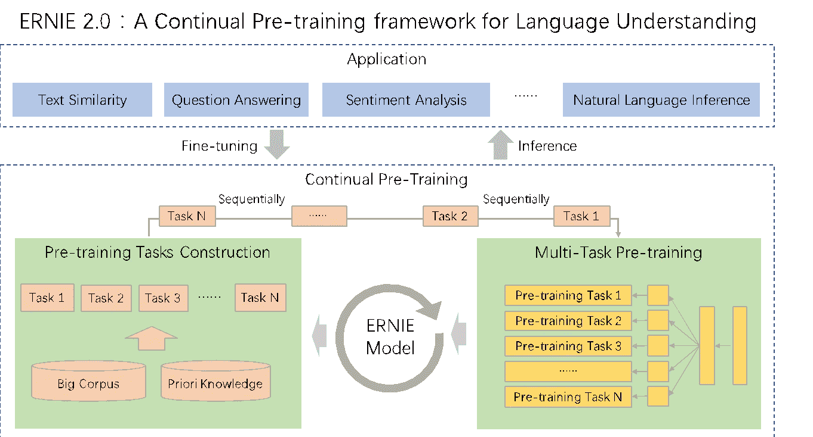

# 针对文本分类微调 ERNIE 2.0

> 原文：<https://towardsdatascience.com/https-medium-com-gaganmanku96-fine-tune-ernie-2-0-for-text-classification-6f32bee9bf3c?source=collection_archive---------13----------------------->

## 如何微调 ERNIE 2.0，百度最新的文本分类模型


Photo by [Caspar Camille Rubin](https://unsplash.com/@casparrubin?utm_source=unsplash&utm_medium=referral&utm_content=creditCopyText) on [Unsplash](https://unsplash.com/search/photos/setup?utm_source=unsplash&utm_medium=referral&utm_content=creditCopyText)

百度发布了连续自然语言处理框架 ERNIE 2.0。ERNIE 主张通过知识整合增强代表性。百度在其[研究论文](https://arxiv.org/abs/1907.12412)中声称，ERNIE 2.0 在中文和英文的 16 个自然语言处理任务中的表现优于 BERT 和最近的 [XLNet](https://hub.packtpub.com/google-researchers-present-xlnet-a-new-pre-training-method-that-outperforms-bert-on-20-tasks/) 。



[source](https://hub.packtpub.com/baidu-open-sources-ernie-2-0-a-continual-pre-training-nlp-model-that-outperforms-bert-and-xlnet-on-16-nlp-tasks/)

ERNIE 2.0 是一个持续的预培训框架。持续学习旨在用几个任务按顺序训练模型，以便它在学习新任务时记住以前学习的任务。连续预训练的架构包含一系列共享的文本编码层来编码上下文信息，这些信息可以通过使用递归神经网络或由堆叠的自我关注层组成的深度转换器来定制。编码器的参数可以在所有预训练任务中更新。

基本模型包含 12 层，12 个自关注头和 768 维的隐藏尺寸，而大模型包含 24 层，16 个自关注头和 1024 维的隐藏尺寸。XLNet 的型号设置和 BERT 一样。

对于进一步的阅读，我建议查看这些文章——[这](https://www.analyticsindiamag.com/baidus-ernie-2-0-gets-nlp-top-honours-eclipses-bert-xlnet/)和[这](https://hub.packtpub.com/baidu-open-sources-ernie-2-0-a-continual-pre-training-nlp-model-that-outperforms-bert-and-xlnet-on-16-nlp-tasks/)，以深入了解这种模式是如何工作的。

## 现在，让我们看看代码

## 安装和导入必要的包—

1.  安装必要的软件包

```
$ !pip install paddlepaddle-gpu
```

> 你也可以安装它的 CPU 版本，但它是高度计算的任务，所以我建议在 GPU 上训练它。
> 
> ERNIE 2.0 接受了 48 个英伟达 v100 GPU 卡(用于基本型号)和 64 个英伟达 v100 GPU 卡(用于大型型号)的英语和中文培训。

2.克隆它的 git 存储库并下载模型。我在这里使用基本模型。

```
$ wget [https://ernie.bj.bcebos.com/ERNIE_Base_en_stable-2.0.0.tar.gz](https://ernie.bj.bcebos.com/ERNIE_Base_en_stable-2.0.0.tar.gz)$ gunzip ERNIE_Base_en_stable-2.0.0.tar.gz$ tar -xvf ERNIE_Base_en_stable-2.0.0.tar$ git clone [https://github.com/PaddlePaddle/ERNIE.git](https://github.com/PaddlePaddle/ERNIE.git)
```

## 准备数据

数据集必须采用特殊的格式化方式。这些列应该是 ***text_a*** 和 ***标签。*** 必须是 tsv 文件。

1.  下载数据集

```
!wget !wget [https://archive.ics.uci.edu/ml/machine-learning-databases/00462/drugsCom_raw.zip](https://archive.ics.uci.edu/ml/machine-learning-databases/00462/drugsCom_raw.zip)!unzip 'drugsCom_raw.zip'
```

你会得到 2 个文件-训练和测试。

2.现在，让我们处理数据并更改标签

a)创建培训和开发数据

preprocessing data

我们以 80:20 的比例将数据分成两部分。

b)创建测试数据

## 将数据放在正确的位置

1.  创建 2 个文件夹

```
$ mkdir -p dataset/SST-2
$ mkdir -p parameters/params
```

2.将培训、开发和测试文件移入 SST-2 文件夹

```
$ mv train.tsv dataset/SST-2/
$ mv dev.tsv dataset/SST-2/
$ mv test.tsv dataset/SST-2/
```

3.将参数内容移动到参数/参数中

```
$ mv params/ parameters/params/
```

4.将文件夹数据集和参数都移动到 ERNIE

```
$ mv dataset ERNIE/
$ mv parameters ERNIE/
```

## 开始模型训练

1.  将目录更改为 ERNIE

```
$ cd ERNIE/
```

2.为模型路径和数据集设置环境变量

3.开始训练

```
sh script/en_glue/ernie_base/SST-2/task.sh
```

> 如果您遇到任何错误，说找不到培训文件或 init_parameter 丢失，请尝试检查您的当前目录。你应该在 ERINE 文件夹里。

全部代码可在[这里](https://github.com/gaganmanku96/NLP/tree/master/ERNIE%202.0%20Fine%20-Tuning)获得。

你也可以试试 [colab 笔记本](https://colab.research.google.com/drive/1GVXVb8M8kclroIpb3KMmfqQqe_ujWfUd)上的代码。

## 结论

随着诸如 BERT、ERNIE、XLNET、OPEN-AI 等新方法的出现。我们已经看到每个 NLP 任务都有巨大的改进，但代价是高昂的计算成本。XLNET 的培训成本约为 245，000 美元，这是一笔惊人的金额。由于计算需求很高，初创公司越来越难以适应这些新模式。

## **参考文献**

1.  [https://github.com/PaddlePaddle/ERNIE](https://github.com/PaddlePaddle/ERNIE)
2.  [https://hub . packtpub . com/Baidu-open-sources-Ernie-2-0-a-continuous-pre-training-NLP-model-that-performs-Bert-and-XL net-on-16-NLP-tasks/](https://hub.packtpub.com/baidu-open-sources-ernie-2-0-a-continual-pre-training-nlp-model-that-outperforms-bert-and-xlnet-on-16-nlp-tasks/)