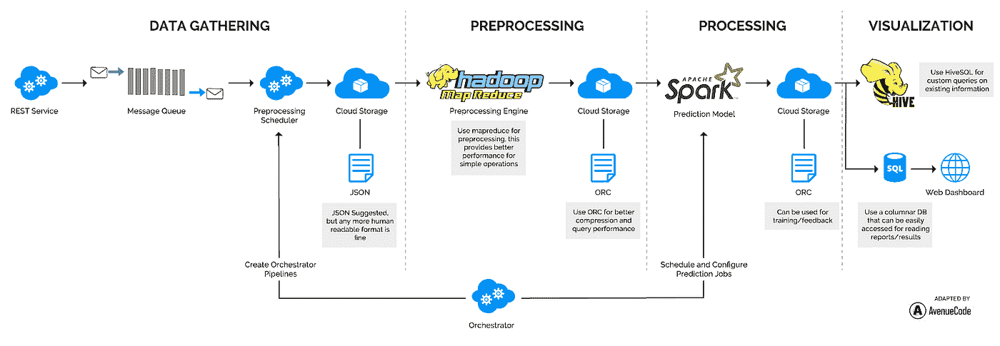
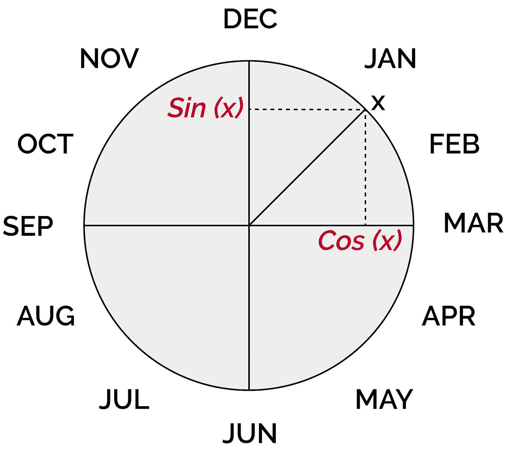
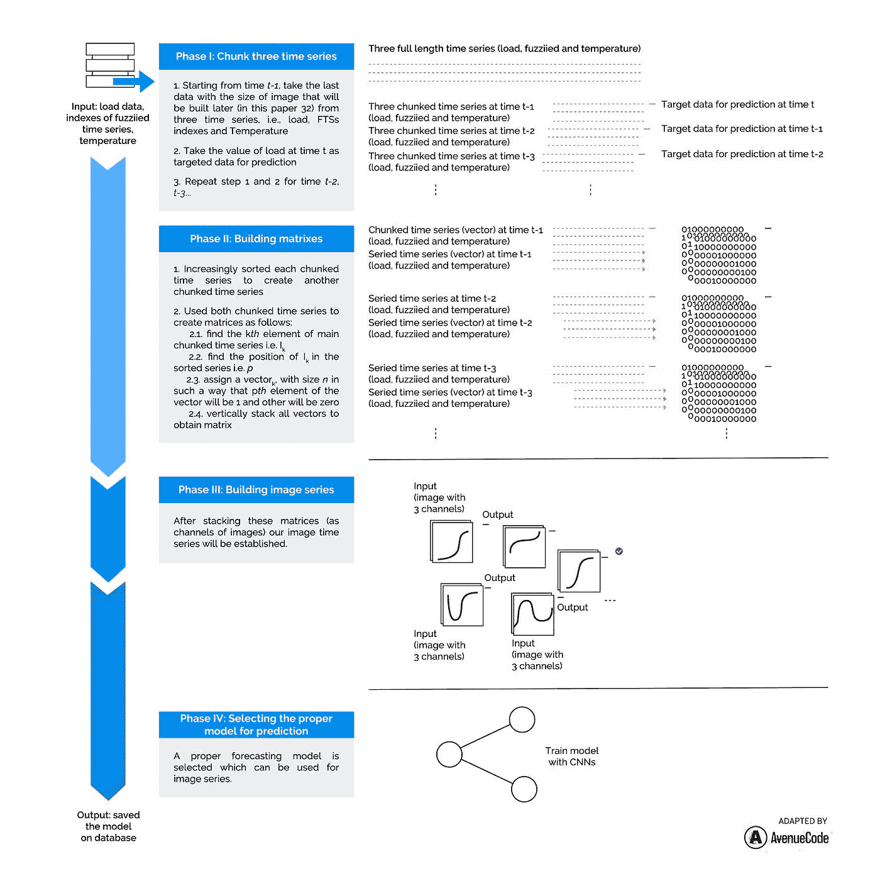

# 你的供应链预测有多聪明？

> 原文：<https://towardsdatascience.com/https-medium-com-h-javedani-how-smart-are-your-supply-chain-predictions-daf5a154ac6d?source=collection_archive---------16----------------------->

## 深入分析

## 这些需求预测最佳实践降低了成本

# **简介**

为了说明准确需求预测的重要性，考虑一下 2014 年令人震惊的头条新闻“沃尔格林首席财务官因 10 亿美元的预测错误而离职”[1]以及耐克 2001 年导致 1 亿美元销售额损失的需求规划软件实施失败[2]。有几个由于需求预测错误而造成巨大财务损失的例子，但也有许多成功的案例，其中提高需求预测的准确性带来了巨大的财务收益。例如，Kimberly-Clark 多年来依赖基本预测模型，但当他们实施更高级的实时需求趋势分析时，他们将面向客户的发货地点从大约 80 个减少到 20 个，并将年销售额平均提高了 5%[3]。

本文研究了提高需求预测准确性的方法，以增加企业利润和避免损失。它还解释了这种改进的先决条件。最后，介绍了 AC Forecast [4]，Avenue Code 的稳健需求预测解决方案。

# **需求预测和供应链管理**

在讨论准确需求预测的具体模型之前，有必要了解与供应链管理(SCM)相关的基本需求预测概念。需求预测是供应链管理的一部分，与所有供应链管理流程相关，包括客户关系管理(CRM)、订单履行(of)、制造流程管理(MFM)、供应商关系管理(SRM)、产品开发和商业化(PDC)以及退货管理(RM)。

1.  CRM: CRM 涉及规划和管理有效且有利可图的长期客户关系，通常是在客户需要时向他们提供他们想要的产品。准确的需求预测提高了客户满意度。
2.  OF:可靠的需求预测对 OF 也有直接影响，因为高效的订单履行需要高效的供应链运作。
3.  MFM:这一过程包括在生产环境中转移产品以及在供应链中获得、实施和管理制造多样性的所有必要行动。目前，一家公司的生存能力很大程度上取决于其对消费者需求不断变化的灵活应变能力，因此准确的需求预测至关重要。
4.  SRM: SRM 致力于促进与供应商的互利关系，尤其是那些被认为对品牌最具战略意义的供应商，以增加通过交易、绩效、现代化等实现的价值。自然，需求预测会对 SRM 产生重大影响。
5.  PDC: PDC 涉及生产新产品并将其运输到市场。该流程的适当实施使管理层能够通过准确的需求预测来控制供应链上新产品的动态流动。
6.  RM: RM 使管理员能够有效地管理逆向产品流，克服不希望的退货，并管理可重用的资产。稳健的需求预测对于减少退货量至关重要，退货量会直接影响利润。

总之，准确的需求预测能够:提高盈利能力、提高客户满意度、减少库存缺货、降低安全库存要求和降低产品淘汰成本。

# **需求预测模型**

从最先进的到经典的再到基于人工智能的模型，供应链管理有几种需求预测算法[5]。每种方法都有其优点和缺点。尽管每种模型类型中使用的复杂性、假设和数据类型不同，但基本组件是相似的。因此，很难确定哪些模型在特定情况下表现最佳。本文评估了一些常用方法类别，包括简单历史平均值、经典时间序列以及机器学习和深度学习方法论的新类别，以帮助公司发现哪种模型最适合需求预测。

## 临时需求预测

一种主要的方法是临时需求预测。该模型认为，时间序列模型不会产生很好的结果，因为它们大多使用预测(和预测误差的度量)来参数化需求模型。然而，需求不仅取决于时间和需求历史，还取决于其他因素，如销售价格、价格变化、天气条件等。因此，临时需求预测的用户在不同的目标和服务水平约束下应用回归模型或某种线性规划来优化外生变量的(线性)目标函数[6]。这组模型的主要缺点是线性假设，这不适用于许多非线性问题。(线性预测模型使用线性函数作为其预测函数或预测函数的重要部分。)

## 数学高级线性预测

另一方面，供应链需求预测的数学线性模型(如 ARIMA)提供了关于供应链动态的非常实用的见解。这些模型导致了对牛鞭效应的理解[7]，这是一种在供应链的连续阶段订单和库存变化增加的现象。这些模型用于许多需求预测场景[8]。

然而，在使用它们之前，应该做出许多假设，如数据的稳定性、线性和质量。例如，ARIMA 模型假设当前需求是过去需求的线性函数。事实上，ARIMA 模型是回归分析的一种形式，它测量一个因变量相对于其他变化变量的强度。其目的是通过检查时间序列中的值之间的差异而不是实际值来预测时间序列的未来状态。因此，在真实情况下，大多数数据是非线性的，基于 ARIMA 的模型无法产生非常好的结果。

其他一些方法，如 SARIMA(ARIMA 的季节性版本)，试图检测每个时期内的日内和周内季节性影响。除了萨瑞玛之外，还有其他技术可以做到这一点。例如，可以基于使用不同季节性获得的组来定义一族函数线性回归模型[9]。使用这种模型的另一个问题是确定季节性参数，这通常是一个复杂的过程。尽管在构建预测模型时使用季节性信息是一个好方法，但这还不够。

## 机器学习和深度学习

机器学习模型是一套广泛的非线性方法，采用更复杂的数学技术来挑选变量，并在特征之间可能存在复杂交互的情况下优化拟合。这就是为什么机器学习解决方案通常更稳定，更适合需求预测。但是，其中一个主要的复杂因素是高维的需求历史数据。有两种常见的方法可以解决这个问题。第一种方法是选择一些重要的因素(特征选择)，第二种方法是将一个问题分解成更小的问题，并使用多阶段方法解决它们[10]。这两种方法既昂贵又复杂。

对整个供应链有负面影响的另一个问题是数据不稳定/波动。需求预测的微小变化会造成库存和订单的波动，这种波动会随着供应链的上升而放大(再次出现牛鞭效应)。然而，事实证明，准确的需求信息和良好的预测模型可以显著降低牛鞭效应[11]。

最近，出现了几种深度学习技术，可以解决几乎任何类型的预测问题。深度学习是使用神经网络构建的机器学习的一个流行子类。神经网络获取输入，然后使用训练期间调整的权重在隐藏层中使用这些输入。那么该模型可以用于预测。几种深度学习方法目前正用于需求预测[12，13]。然而，需要注意的是，深度学习模型只有在数据量足够大的情况下才能很好地工作，并且它们也需要比上述更简单的模型更多的计算资源。

# **最好的需求预测模型是什么？**

如上所述，作为机器学习模型的子类的机器学习模型或深度学习模型的使用已经被学术界和商业界用于需求预测。然而，每个 ML 预测模型家族都有其优点和缺点，并且对于需求预测没有单一的最佳模型。每家公司都有自己的数据，这些数据有特定的模式，这些模式更适合某些模型。确定哪种模式最适合给定的组织需要时间和专业知识。然而，人工智能的最新进展已经引入了一种为特定组织寻找正确预测模型的自动化方法。这种方法被称为自动机器学习。

## 自动化机器学习

使用单一方法构建需求预测的机器学习引擎不是一个好主意，因为一个模型可能不够灵活，无法在所有情况下都工作良好。此外，组织提供的每种产品和服务都有自己的数据和数据模式。由于一个组织中产品和服务的多样性，手工开发用于预测每种产品需求的单个模型几乎是不可能的。在这种情况下，应该有一种自动算法，它在许多机器学习模型中迭代搜索，选择适当的模型，调整每个模型，然后评估最终创建的模型。这种建模方式被称为自动机器学习(Auto ML)，它是目前解决预测问题(如需求预测)的最重要的模型类型之一。

Auto ML 是一系列迭代过程，包括算法选择、模型训练、超参数优化、模型调整和性能评估。如果数据已准备就绪，可以进行训练，Auto ML 会尝试应用许多模型，这些模型包含定义范围内的大量超参数。然后，它在验证集上测试准确性和其他性能指标，以查看模型和估计权重的哪个组合给出了最佳结果。换句话说，Auto ML 是一种算法，它选择具有最佳参数和超参数的预测器的最佳组合来解决特定的预测问题，例如需求预测。

因此，与其评估需求预测的最佳模型，不如通过使用生成自动 ML 模型的服务来评估开发良好需求预测模型的最佳方法。

# **需求预测数据管道的最佳实践**

在使用预测模型之前，数据必须采用特定的格式。但是，在此之前，数据应该是可访问的。由于需求预测所需数据的敏感性，获取数据并不总是容易的。数据应该从许多独立的数据集中获取，尤其是在遗留系统中。由于没有遵循标准程序将数据合并到一个地方，许多开发人员错过了改进预测的机会。此外，公司通常不愿意完全出于安全考虑而利用内部或外部数据。毫无疑问，使用内部销售数据、指标和历史数据有助于提高需求预测的准确性。使用外部数据也可以帮助企业提高预测的准确性，但外部数据往往没有得到充分利用。因此，应该有明确的阶段来组合各种数据，并为预测引擎做好准备。

将原始数据转换成所需的格式需要一系列称为数据流水线的操作。由于一些内部和外部因素，如假期影响、客户数据等，用于需求预测的数据管道非常复杂。在不断变化的商业环境中，制造商必须解决不断发展的挑战，这影响了数据管道。本文的后续部分解释了需求预测应遵循的常见数据管道阶段。

## 使用开源解决方案准备大数据

处理大数据需要选择正确的工具、库和技术。这些工具应该足够强大，能够清理杂乱的数据并将其从一种格式转换为另一种格式，尤其是对于大数据。有很多付费和开源的解决方案可用，开源的解决方案应用更广泛。作为数据管道工具和技术的一个例子，这是 AC Forecast 采用的解决方案，Avenue Code 的内部需求预测模型:

如上所示，需要非常复杂的数据流水线过程来从多个源摄取数据，并准备将它们输入到机器学习流水线。选择开源工具对于产品的可移植性至关重要，因为这些工具可以在以后部署在许多云服务提供商以及本地基础设施上。

## 组合多个数据集

如前所述，许多数据源必须组合成单个数据集才能输入到机器学习管道中。主要问题是，合并和连接数据的最佳策略是什么？如果我们关注需求预测所需的数据格式，我们知道每个数据源都应该表示为<timestamp factor="">。如果可以采用这种格式的数据集表示，那么所有这些对<timestamp factor="">可以在适当的时间间隔内根据它们的时间戳进行合并。然而，在这些对的另一边，应该有一个目标变量，即需求量。</timestamp></timestamp>

## 将时间序列问题转化为机器学习问题

将成对的<timestamps factor="">组合成一个数据集后，时间序列问题需要转化为机器学习问题。数据项应该以相等的时间长度呈现，例如每分钟、每小时等。因此，如果数据在每个时间范围内都不可用，就会有几个空值或缺失值，或者数据会在多个时间范围内重复，这会对模型的准确性产生负面影响。这是使用时间序列方法进行这种预测的诸多限制之一。</timestamps>

使用时间序列模型的另一个限制是可用的模型较少。如前所述，这些模型中的大多数只能解决具有非常清晰的时间框架和非常干净的数据的线性问题，这通常不是大公司需求预测的情况。将时间序列问题转化为机器学习模型允许从广泛的 ML 模型中选择更多的自由，并且它还允许我们建立自动 ML 模型。为此，我们建议应用时间戳编码，如下所示:

有些数据，比如时间，本来就是周期性的。例如，秒、分、小时、天、周、月、季等等都遵循周期。问题是如何在数据中编码时间，以便在机器学习模型中有用，同时避免受到考虑时间序列的限制。一个好的解决方案是使用循环时态建模。在这种方法中，我们将每个循环变量(如时间戳)映射到一个圆上，使得该变量的最小值紧挨着最大值出现。我们使用 sin 和 cos 三角函数计算该点的 x 和 y 分量，如下所示:x 处的时间戳可以由另外两个特征表示为(Sin(x)，Cos(x))。

## 处理缺失值和空值

在将许多数据源合并到单个数据集中并将时间序列转换为机器学习问题之后，对于在数据集中的特定记录中没有任何信息的因子，可能存在空值。这个问题的一些标准解决方案是:

1.  如果某一行有很多缺失值，可以完全忽略该数据行；
2.  如果数值数据中有空值/缺失值，则数据列的平均值是替换的合理值；
3.  在分类信息的情况下，使用每一列中的数据模式是一个好的选择。

然而，最佳实践之一是使用尽可能多的历史数据来估计缺失值。这需要更先进的预测模型。例如，回归插补是一种基于其他变量预测某个变量的观察值的模型。更准确地说，完整和不完整案例的可用信息用于预测特定因素的值。回归模型的拟合值稍后用于估算缺失值[14，15]。值得一提的是，处理缺失值的最佳方法在很大程度上取决于数据的性质。询问值缺失的原因总是很有帮助的，因为处理缺失数据的不同方式会对模型的性能产生不同的后果。

## 将分类数据转换为数字

为预测模型准备数据的一个主要步骤是处理分类数据。对此有几种方法。虽然一些算法可以直接处理分类数据，但大多数机器学习算法要求它们的输入是数字，因此，分类特征在使用前必须转换为数字特征。将分类数据转换为数值数据包括两个步骤:

1.  整数编码:当分类数据具有自然的有序关系，使得某个值更重要或处于更高的位置时，只需用较高的整数对其进行编码，并为不太重要/较低的值选择较低的整数。
2.  独热编码:独热编码是将分类变量表示为二进制向量。首先，分类值必须映射到整数值。接下来，任何整数值都被描述为一个二进制向量，除了用 1[16]标记的整数索引之外，其他值都是 0。

# **交流预测**

AC Forecast 是由 Avenue Code 开发的一种易于使用、准确、可靠且强大的需求预测模型，它试图通过使用上述所有最佳实践来解决本文中概述的复杂性。

## AC 预测的数据管道

AC Forecast 数据管道的第一步是接收数据。从多个来源获取数据需要一个高度复杂的过程，该过程使用多个开源工具来实现 AC Forecast 的可移植性。该项目可以部署在谷歌云平台上，实现所有需要的项目资源。Apache AirFlow data scheduler 用于将数据从一个大型查询表导出到另一个查询表。基于配置文件预处理输入文件的 AirFlow DAG 托管在 Google 云存储上，以便开发人员可以开始配置和运行预定的预处理作业。

作为数据处理任务的一部分，如果需要，数据应按照给定的时间因子进行汇总。此外，有一个适当的警报过程，以便开发人员可以立即知道数据管道中是否出现了故障。数据管道使用来自 Spark、Hadoop、Kafka 和 Hive 等开源工具的非常灵活和强大的架构。例如，Hadoop MapReduce jar 用于预处理具有长值的文件，并以优化行列(ORC)文件的格式输出文件，供下游使用(有关更多详细信息，请参考第 7 页的数据管道图)。

## AC 预测的深度学习引擎

如上所述，AC Forecast 采用自动 ML 方法来自动选择最佳引擎，并为每个预测用例设置最佳参数。Avenue Code 的机器学习团队最近通过结合卷积神经网络和模糊时间序列开发了一个非常准确和强大的需求预测引擎，作为其 Auto ML 方法的一部分[17]。这种组合方法将基于时间的预测模型转换为一系列图像。通过使用这些从多变量问题的序列值创建的图像，引擎可以以隐含和自动的方式确定和提取相关的重要参数，而不需要任何专家知识或人工干预，证明这种方法比其他一些传统模型更容易。这是 AC 预测和其他先进方法的主要区别。

此外，使用模糊逻辑通过在光谱和阴影中用模糊空间表示时间序列的一个维度，而不是用精确的数字表示它，极大地有助于控制过拟合。几个实验证明了所提出的方法对于非常复杂的需求预测的有效性，给了我们对结果准确性的信心。下面的流程图显示了此模型如何工作的一个示例:

# **结论**

本文阐述了准确需求预测的财务重要性，并介绍了与需求预测相关的供应链管理基础知识。Auto ML 被证明是开发需求预测模型的最佳方式，因为它消除了与人力和人才相关的成本。其次，本文解释了数据管道的最佳实践。

最后，AC Forecast 是 Avenue Code 的内部机器学习模型，用于稳健而准确的需求预测，它提供了本文中概述的所有策略和最佳实践的真实示例。

# **参考文献**

1.  [《华尔街日报》:沃尔格林首席财务官因 10 亿美元预测误差离职。](https://www.cio.com/article/2439601/nike-rebounds--how--and-why--nike-recovered-from-its-supply-chain-disaster.html)路透社。
2.  [耐克反弹:耐克如何(以及为什么)从供应链灾难中恢复，](https://www.cio.com/article/2439601/nike-rebounds--how--and-why--nike-recovered-from-its-supply-chain-disaster.html)克里斯托弗·科赫。首席信息官。
3.  [金佰利了解需求，](https://consumergoods.com/kimberly-clark-makes-sense-demand)希瑟·克兰西。消费品。
4.  注意:尚未公开发布。
5.  [选择“正确的”需求预测模型，](https://medium.com/alloytech/choosing-the-right-demand-forecasting-model-d8a8b4c6878c) Alloy 客户解决方案。中等。
6.  [因果需求预测下的安全库存计划，](https://www.sciencedirect.com/science/article/pii/S0925527311001927) Anna-Lena Beutel 和 Stefan Minner。科学指导。
7.  [供应链中的信息失真:牛鞭效应，](https://dl.acm.org/citation.cfm?id=2869060) Hau L. Lee 等。
8.  [一个 ARIMA 供应链模型，](https://pubsonline.informs.org/doi/abs/10.1287/mnsc.1040.0308) Kenneth Gilbert。informsPubsOnLine。
9.  [峰值负荷预测的功能聚类和线性回归，](https://www.sciencedirect.com/science/article/pii/S0169207009000879) Aldo Goia 等人，ScienceDirect。
10.  [利用高维数据进行需求预测:利用品类内和品类间促销信息进行零售额预测的案例，](https://www.sciencedirect.com/science/article/abs/pii/S0377221715007845)马等.科学指导。
11.  [减少供应链波动和牛鞭效应的需求预测和共享策略。斯普林格链接。](https://link.springer.com/article/10.1057/jors.2010.188)
12.  [基于 GPU 深度学习元启发式的时间序列预测模型](https://www.sciencedirect.com/science/article/pii/S0306261917300041#!) Igor M. Coelho 等 ScienceDirect。
13.  [用于能源负荷预测的深度神经网络](https://ieeexplore.ieee.org/document/8001465)，Kasun Amarasinghe 等，IEEE Xplore 数字图书馆。
14.  [缺失数据的多重插补:警示故事。圣人杂志。](https://journals.sagepub.com/doi/10.1177/0049124100028003003)
15.  [处理缺失数据，](https://mro.massey.ac.nz/handle/10179/4355)朱迪·谢弗。梅西大学。
16.  [用于学习分子指纹的图上卷积网络，](https://arxiv.org/abs/1509.09292)戴维·杜文瑙德等康乃尔大学。
17.  [采用卷积神经网络和模糊时间序列相结合的方法进行短期负荷预测。](https://www.sciencedirect.com/science/article/abs/pii/S0360544219304852) Hossein Javedani Sadaei 等人。