# 寻找贝叶斯乐高玩具-第 1 部分

> 原文：<https://towardsdatascience.com/https-medium-com-hankroark-finding-bayesian-legos-part1-b8aeb886afba?source=collection_archive---------22----------------------->

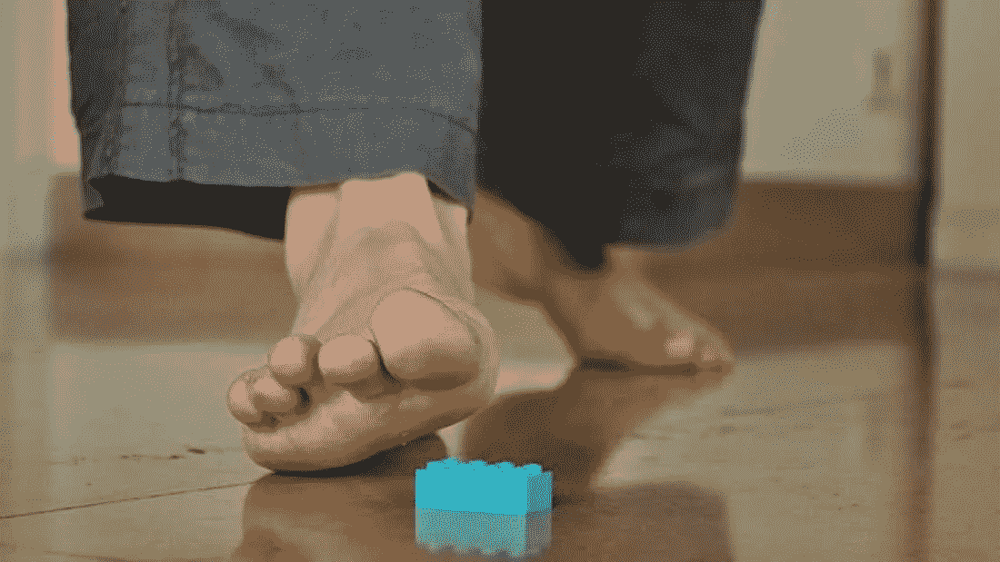

*Photo credit: Frédérique Voisin-Demery/Flickr (CC BY 2.0)*

乔是我们家的好朋友，本周早些时候来过。就像我们经常做的那样，我们讨论天气(在太平洋西北部这里似乎比正常情况下更热)、新闻(主要是关于我们如何采取行动避免新闻)和我们的孩子。我们都有孩子，他们真的很喜欢玩乐高。乐高玩具不可避免地会带来踩在乐高玩具上的剧烈疼痛，通常是在半夜或早上去冲咖啡的路上。尽管乔和我都跟在我们的孩子后面，捡起我们能找到的孩子们留下的所有乐高玩具，但踩在挥之不去的乐高玩具上似乎还是会发生。

乔和我一直在想办法减少踩到乐高积木的机会。过了一段时间，我建议我们可以用概率和统计学来估计在孩子们之后的清扫中没有移走乐高玩具的概率。乔说他在船上，“任何东西，我的脚不能再承受了！”。

我启动了我最喜欢的估算概率的工具，乔和我开始想办法，在我们清理完孩子们遗漏的乐高玩具后，我们可能能够估算出剩余的乐高玩具的可能性。

```
import numpy as np
import matplotlib.pyplot as plt
plt.style.use('seaborn-darkgrid')

np.random.seed(42)  # It's nice to replicate even virtual experimentsimport pymc3 as pm
import scipy.stats as stats
print('Running on PyMC3 v{}'.format(pm.__version__))> Running on PyMC3 v3.6
```

## 实验者做二十次

每个人似乎都有不同的方法来拿起乐高。对乔来说，他说他会跟在孩子后面打扫卫生，捡剩下的乐高玩具。

我给乔的第一个建议是，如果我们知道他在每次清扫中捡起乐高积木的能力，那么我们就可以确定每次清扫后留下乐高积木的概率。数学上这是

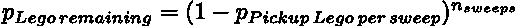

其中 *p_Pickup Lego per sweep* 是单次扫描中拾取乐高的概率， *n_sweeps* 是乔执行的扫描次数， *p_Lego remaining* 是乔完成所有扫描后剩余乐高的累积概率。

我向乔建议做一个实验，以确定他在捡乐高玩具方面有多好:我会去他的孩子玩乐高玩具的房间，在地板上随意铺上一个数字的乐高玩具，代表乔的孩子留下来让他寻找的乐高玩具的数量。乔会跟在我后面，像往常一样打扫房间，捡起他找到的乐高玩具。

我们需要重复这个实验很多次，我估计有 20 次，来估计乔捡起乐高积木的效率。这时，Joe 说，“嘿，我说过我正在寻找解决方案，但是重复二十次拿起乐高玩具并不是我的乐趣所在。你需要向我证明这是值得我花时间的。”我同意这个实验看起来可能会伤害受试者，Joe，所以我决定在我们进行实际的实验之前向 Joe 演示这可能是如何工作的。

我设计了(虚拟的)实验，每个实验都用了随机数量的乐高积木。根据 Joe 的一些估计，为了最好地代表 Joe 的孩子留下的乐高玩具数量的实际情况，我选择了一个乐高玩具的正态分布(即高斯分布),每个实验的平均值为 100 个乐高玩具，标准差为 20 个:

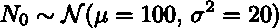

其中 *N₀* 是乔留下的待发现的乐高积木的数量。

```
mean = 100
standard_deviation = 20
experiments = 20
N_0 = (np.random.randn(experiments)*standard_deviation+mean).astype(int)
N_0> array([109,  97, 112, 130,  95,  95, 131, 115,  90, 110,  90,  90, 104, 61,  65,  88,  79, 106,  81,  71])
```

## 拿起乐高玩具

然后，如果我们在进行一个实际的实验，每次我把乐高积木四处铺开后，Joes 就会跟在我后面捡起来。为了在虚拟实验中模拟这一点，我使用二项式分布对 Joe 捡起的乐高积木的数量进行了建模。想想看，对于地面上的每个乐高积木，乔要么捡起来，要么不捡起来，这是基于乔捡起一个乐高积木的未知概率。

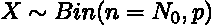

其中 *X* 是乔找到的乐高积木的数量，而 *p* 是乔捡起一块乐高积木的未知概率。这也假设了 Joe 在拿起乐高积木时相当一致，并且模型具有单一概率 *p* 。

```
X = np.random.binomial(N_0, actual_prob)  
X> array([ 87,  66,  80, 110,  76,  65,  95,  92,  61,  83,  57,  76,  77, 46,  49,  75,  54,  75,  61,  54])
```

直方图显示了在虚拟实验的每一次尝试中，乐高积木 Joes 的百分比分布。

```
plt.hist(X / N_0, range=(0,1), bins=20)
plt.xlabel("Percentage Legos Picked Up")
plt.ylabel("Number of Times Observed")
plt.show();
```

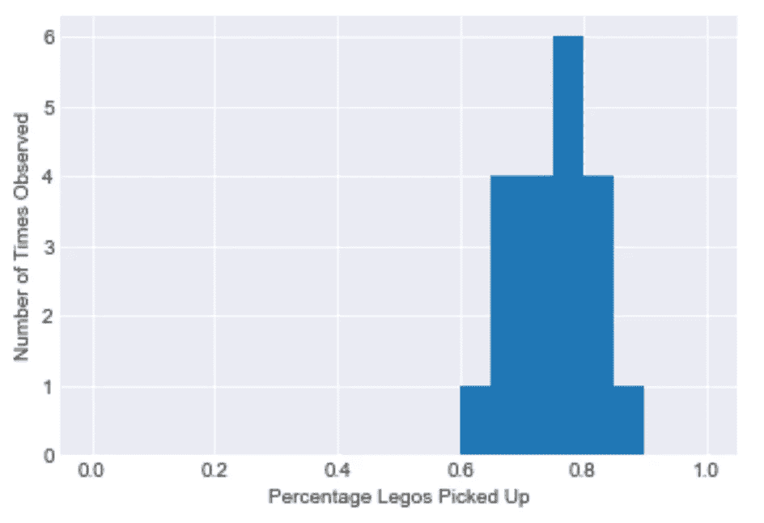

## 模特乔

在这一点上，我们有了一个模型，使用二项式分布，显示了 Joe 在他的试验性清扫中捡了多少个乐高积木；我们知道 N₀在每次实验中留下了多少乐高积木，我们也知道乔在每次实验中捡了多少乐高积木。我们不知道乔捡起乐高积木的概率，所以我们需要对概率建模。

概率分布的常见模型是[贝塔分布](https://en.wikipedia.org/wiki/Beta_distribution)。在这个例子中有很多理由使用 beta 分布。贝塔分布是二项分布的共轭先验；这个原因是代数上的方便，对于这个例子来说不太重要，因为我们将使用数值积分。更重要的是，beta 分布是将百分比或比例建模为随机变量的合适分布。

在我们的例子中，我们将使用[弱信息先验](http://www.stat.columbia.edu/~gelman/presentations/weakpriorstalk.pdf)，它估计 Joe 捡起乐高的概率在范围[0，1]内，更有可能接近该范围的中心。这表示我们对 Joe 捡起乐高积木的技巧有所了解，并将其融入到模型中。贝塔分布由两个值参数化，通常称为α (alpha)和β (beta)。我选择与弱信息先验目标匹配的值，模式为 0.5。

```
alpha_prior=2
beta_prior=2

x_locs = np.linspace(0, 1, 100)
plt.plot(x_locs, stats.beta.pdf(x_locs, alpha_prior, beta_prior), label='Probability Distribution Function');
plt.legend(loc='best');
```

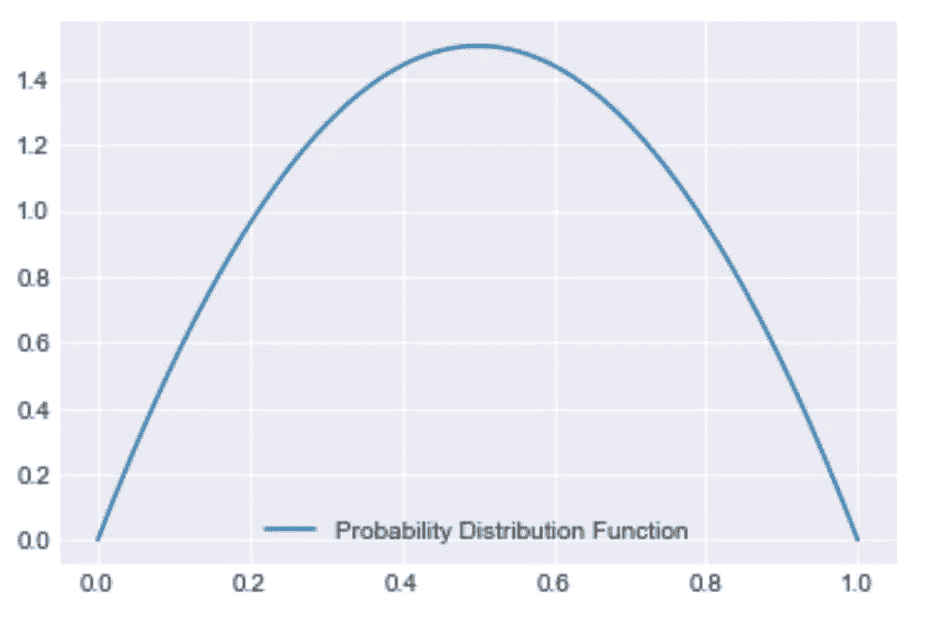

## 模型拟合

现在我们有了一个完整的模型，可以解释是什么产生了观察到的数据(即使到目前为止这只是一个思想实验):

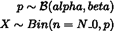

我同意 Joe 的观点，现在是 2010 年，使用 [PyMC3](https://docs.pymc.io/) 进行计算统计是“酷”的。有很多文档和[很好的介绍可用](https://docs.pymc.io/notebooks/getting_started.html)；我不会在这里重复这些信息，而是直接跳到模型拟合。

首先，我们构建模型对象:

```
basic_model = pm.Model()

with basic_model:
    p = pm.Beta('p', alpha=alpha_prior, beta=beta_prior)
    x = pm.Binomial('x', n=N_0, p=p, observed=X)
```

然后，我将使用默认的不掉头采样器(NUTS)来拟合模型:

```
with basic_model:
    trace_basic = pm.sample(50000, random_seed=123, progressbar=True)> Auto-assigning NUTS sampler...
> Initializing NUTS using jitter+adapt_diag...
> Multiprocess sampling (2 chains in 2 jobs)
> NUTS: [p]
> Sampling 2 chains: 100%|██████████| 101000/101000 [00:55<00:00, 1828.39draws/s]
```

现在我们可以看看模型拟合的一些结果。在这种情况下，根据数据和给定的模型(也称为后验概率)，我的朋友乔在一次传球中捡起一个乐高玩具的估计实际概率为 75%，95%的置信区间为[73%，77%]。我还绘制了先验概率(使用 beta 分布的弱信息先验)与后验分布的比较图。

```
plt.hist(trace_basic['p'], 15, histtype='step', density=True, label='Posterior');
plt.plot(x_locs, stats.beta.pdf(x_locs, alpha_prior, beta_prior), label='Prior');
plt.legend(loc='best');
```

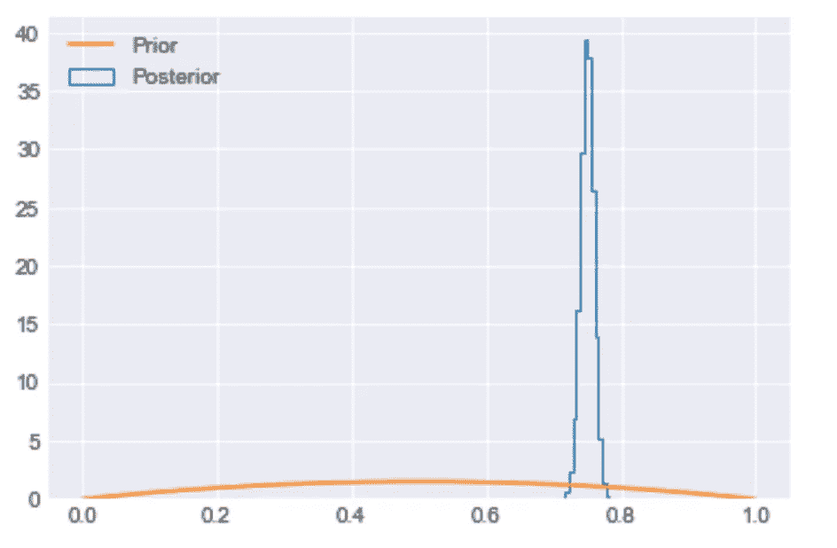

```
basic_model_df = pm.summary(trace_basic)
basic_model_df.round(2)
```

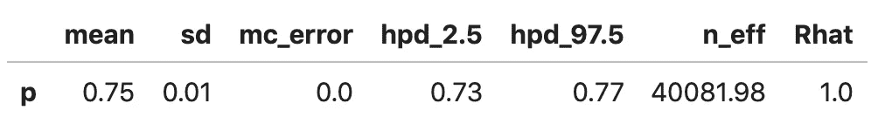

## 又是模特乔

乔和我花了一些时间研究这个模型，看看它是否符合我们对现实的感觉。毕竟，为了实现这一点，Joe 需要进行大约 20 次实验，并且他希望确信这是值得他花费时间的。

假设 Joe 经常在 95%置信区间的低端执行任务，我们了解到的第一件事是，在对房间进行 4 次扫描后，有不到 1%的机会会有剩余的乐高积木需要拾取。

```
(1-basic_model_df.loc['p','hpd_2.5'])**4> 0.0052992694812835335
```

总的来说，Joe 和我对这个模型很满意，但是我们怀疑有些东西需要改进。乔说，他经常四次捡起乐高，但似乎仍然总是在下一次穿过房间时踩到乐高。乔和我聊得更多了，我了解到他有时会很快地打扫房间，有时会很详细地打扫房间。

当我们最初为 Joe 建模时，我们假设 Joe 捡起乐高积木的概率是连续的。所有的统计模型都会遗漏一些东西，我们的原始模型也不例外。我们现在知道的是，捡起一个散落的乐高积木的概率是不同的。这种对观测数据产生原因的新理解现在需要包含在模型中。

对此有一个模型，叫做[贝塔二项分布](https://en.wikipedia.org/wiki/Beta-binomial_distribution)。Beta-二项式分布放宽了每个二项式试验只有一个概率的假设，模拟了每个二项式试验有一个不同的概率参数。这与 Joe 描述的他的过程相匹配，有些扫描很快，有些非常详细。我们的新模型看起来像这样:

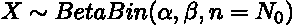

我们可以直接在 PyMC3 中建模。为此，我们提供半柯西分布作为β-二项式分布的α和β参数的[弱正则化先验](http://www.stat.columbia.edu/~gelman/presentations/wipnew2_handout.pdf)。我们使用半柯西分布作为一种方式来“鼓励”α和β值比先验被设置为均匀分布时更接近于零。在[0，∞)的范围上支持半柯西分布。至此，我们有了一个完整的模型:

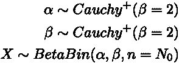

```
model_bb = pm.Model()

with model_bb:
    alpha_bb = pm.HalfCauchy('alpha_bb', beta = 2.)
    beta_bb = pm.HalfCauchy('beta_bb', beta = 2.)
    X_bb = pm.BetaBinomial('X_bb', alpha=alpha_bb, beta=beta_bb, n=N_0, observed=X)with model_bb:
    trace_bb = pm.sample(50000, tuning=5000, random_seed=123, progressbar=True)> Auto-assigning NUTS sampler...
> Initializing NUTS using jitter+adapt_diag...
> Multiprocess sampling (2 chains in 2 jobs)
> NUTS: [beta_bb, alpha_bb]
> Sampling 2 chains: 100%|██████████| 101000/101000 [03:05<00:00, 544.28draws/s]
```

有了这个新的参数化，我们就失去了与概率参数的直接联系。这是必要的，这样 Joe 可以确定他需要通过多少次才能达到他期望的水平，确信所有的 Legos 都已被移除，并且他的脚在晚上走在地板上是安全的。

在 PyMC3 中，我们可以通过基于拟合模型生成数据来确定总体概率后验估计。PyMC3 有一个简单的方法来做到这一点，使用[后验预测检查](https://docs.pymc.io/notebooks/posterior_predictive.html)。我会产生 1000 个后验概率的例子。

```
with model_bb:
    p_bb = pm.Beta('p_bb', alpha=alpha_bb, beta=beta_bb)
    ppc = pm.sample_posterior_predictive(trace_bb, 1000, vars=[p_bb])> 100%|██████████| 1000/1000 [00:24<00:00, 41.64it/s]
```

据此，Joe 和我比较了使用 beta-二项式假设(每个二项式试验的不同概率，或者乐高扫地)和二项式假设(所有二项式试验的单一概率)的结果。正如我们所了解和预期的那样，与二项式假设相比，beta-二项式模型假设中的概率分布更广。

```
plt.hist(trace_basic['p'], 15, histtype='step', density=True, label='Posterior Binomial');
plt.hist(ppc['p_bb'], 15, histtype='step', density=True, label='Posterior BetaBinomial');
plt.plot(x_locs, stats.beta.pdf(x_locs, alpha_prior, beta_prior), label='Prior');
plt.legend(loc='best');
```

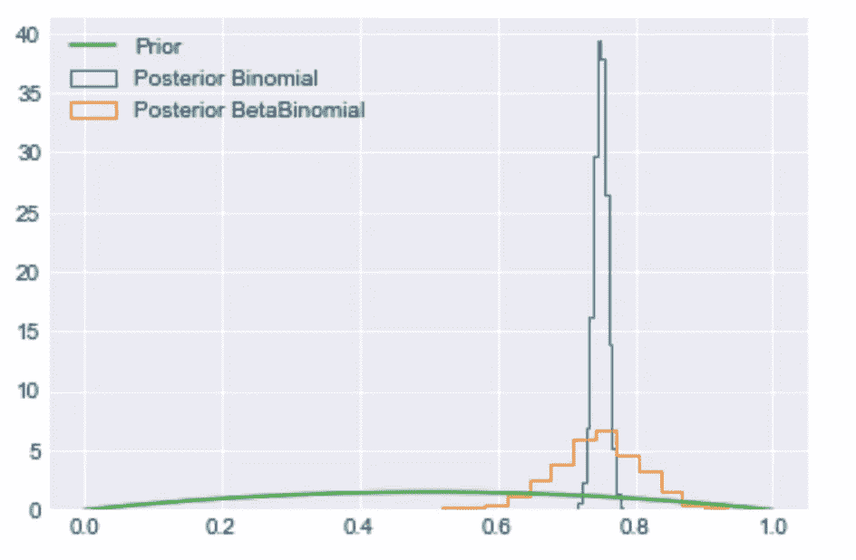

```
bb_quantiles = np.quantile(ppc['p_bb'], [0.025, 0.5, 0.975])
bb_quantiles> array([0.59356599, 0.74900266, 0.86401046])
```

再一次，安全地假设 Joe 经常在 95%置信区间的低端执行，我们学到的第一件事是，在房间扫了 7 次之后，有不到 1%的机会有剩余的乐高积木要被拾起。

```
(1-bb_quantiles[0])**7> 0.0018320202853132318
```

## 总结:模型与生成函数的比较

请记住，在开始的时候，所有这一切都是一个思考练习，看看是否值得乔进行 20 次实验，这样我们就可以确定乔在一次扫描中捡起一块乐高积木的概率。在这个思考练习中，我们生成了数据，即乔在 20 次实验性清扫中每次捡了多少个乐高积木。既然我们已经完成了建模，我们可以研究实际的数据生成函数，并将其与模型进行比较。生成数据，然后恢复参数，以验证建模方法，至少恢复原始参数，这是计算统计学中的最佳实践。

这个生成函数的参数可以在 Jupyter 笔记本中找到，在靠近开头的一个隐藏的单元格中。

从下面可以看出，在一次通过中捡起乐高积木的概率的原始生成函数是由乔每次扫过的概率生成的 beta 分布。由此我们可以看出，与二项式模型相比，beta-二项式模型在从生成的数据中重新创建原始生成函数方面做得更好。二项式模型没有考虑到乔通过的工作质量的变化，而贝塔二项式模型考虑到了。

```
plt.hist(actual_prob, label='Observed Probabilities')
plt.plot(x_locs, stats.beta.pdf(x_locs, alpha, beta), label='Generating Distribution');
plt.hist(trace_basic['p'], 15, histtype='step', density=True, label='Posterior Binomial');
plt.hist(ppc['p_bb'], 15, histtype='step', density=True, label='Posterior BetaBinomial');
plt.legend(loc='best');
```

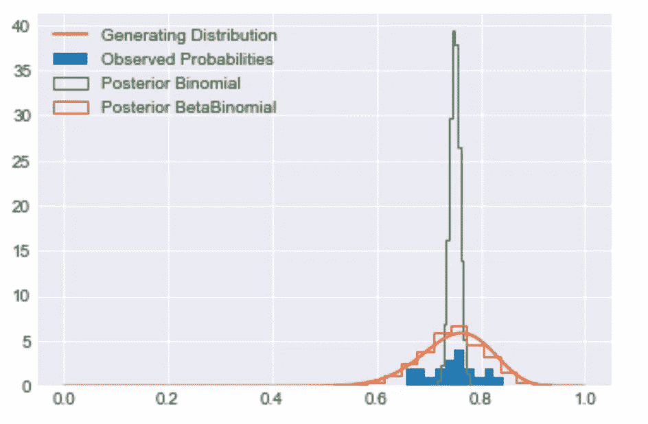

## 乔不想做二十次

Joe 和我对虚拟实验很满意，并且相信通过进行实验，我们可以了解 Joe 在一次通过中捡起乐高的概率。但乔还是不想做实验，“二十次也不行，一次也不行。我讨厌拿起乐高玩具，为什么我要一遍又一遍地做，只是为了了解自己的一个参数。汉克，肯定会有更好的办法的。”

乔和我开始探索不同的方法，我们可以帮助他获得信心，所有的乐高积木都被捡起来了，而不必在乔身上做实验。敬请期待[下一期](/finding-bayesian-legos-part-2-a1b88674166a)。

*本帖* [*全 Jupyter 笔记本可用*](https://github.com/hankroark/finding-bayesian-legos/blob/master/1-ExperimentalApproach.ipynb) *。*