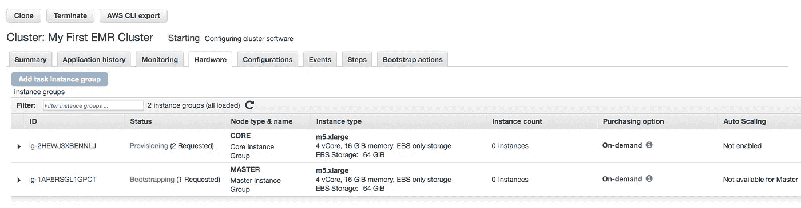

# 通过 AWS 中的数据日志分析进行云风险评估

> 原文：<https://towardsdatascience.com/https-medium-com-hari-santanam-cloud-audits-and-risk-assessment-data-log-analysis-in-aws-bf04579d0c1e?source=collection_archive---------15----------------------->

使用 EMR 集群、HiveQL 和 S3 分析云数据日志


Photo by [rm in](https://unsplash.com/@ustriza?utm_source=medium&utm_medium=referral) on [Unsplash](https://unsplash.com?utm_source=medium&utm_medium=referral).

随着企业、政府和教育实体越来越多地迁移其技术基础架构和流程，云和 IT 审计已成为大多数组织的一种必需。出于成本、硬件和软件的持续更新、规模和效率等方面的原因，他们将全部或部分迁移到云中。

由于 IT 云的复杂性和更大的规模，除了相对较新且快速变化之外，自动化数据收集和分析可能成为**云审计**和**风险控制自我评估(RCSA)** 的重要组成部分。随着云系统和流程变得越来越复杂，针对云合规性的自动化和交钥匙项目将变得越来越重要。

云审计可以涵盖广泛的领域，但最常见的是云安全、云应用程序使用、云治理和风险以及 IAM(身份和访问管理)。另外，还可以进行成本和使用审计。

# 背景和背景

随着基础架构、平台、应用程序和软件越来越多地迁移到云中，其中大多数迁移到公共云中，一些迁移到私有云，还有一些迁移到混合模式中，对审计、风险和控制评估以及合规性的需求也随之增长。因为用户(以及系统间的功能和过程)在云中所做的一切都会被记录下来(如果没有，那么就有一个更大的风险问题——为什么不呢？)，理所当然地，云相关审计和风险/控制评估的起点和流程也是通过日志进行的——收集、分组、分析、评估和评价以及发现/结束。

本文提供了一个日志分析的工作示例，改编自 Amazon 云文档，以适应审计和控制框架——收集 Amazon Web Services **(AWS)云数据日志**,在同一个框架中的一个 **EMR (Elastic Map Reduce)集群**中分析它们，并将结果存储在同一个**云框架中——在 S3** 中，这是 AWS 中的存储区域。


Cloud Control Framework. Diagram credit: [https://www.opensecurityarchitecture.org/](https://www.opensecurityarchitecture.org/)

这是一种审计大量基于云的日志的方法，以分析和搜索日志中的细节并找到答案。在企业环境中，现有的云容量可以用来初始化这种云审计。

在下面的审计设置中，脚本从数据日志中查找并聚合每个操作系统的请求。正如您所想象的，可以从数据日志中收集到许多可能与云审计相关的其他细节(浏览器、URI、位置等)。

注意:这个例子改编自 AWS 项目，使用**亚马逊 EMR** (AWS Hadoop 集群) **S3** (AWS 存储)和 **HiveQL** 脚本(用于数据仓库和分析的类似 SQL 的脚本)来分析日志文件。

我们为什么要使用这样的项目来分析审计或 RCSA 的云数据？

*   因为云数据日志的大小和规模可能非常庞大，很难用标准工具进行分析。
*   从标准 pc 或其他桌面工具收集数据、分析数据和编写输出可能更复杂，在许多情况下简直太慢了。
*   由于不同公司和不同规模的定制云设置，标准工具可能有帮助，也可能没有帮助，或者可能需要大量的购买/订阅预算。
*   从设置、探测、收集和评估来自云基础设施、服务和应用的数据日志中收集的知识将增加内部专业知识，以提供对公司 IT 云环境和风险偏好的持续评估和预测。

# 履行


[https://aws.amazon.com/getting-started/projects/analyze-big-data/](https://aws.amazon.com/getting-started/projects/analyze-big-data/)

这些是高级步骤:

*(注意:AWS 帐户设置是先决条件。如果您尝试这样做，请确保在使用后删除集群和存储桶，以避免额外费用)。*

*   样本数据已加载；在现实生活中的项目，相关的数据集将取代这一点。
*   使用***Amazon EMR[Elastic Map Reduce]启动 Hadoop 集群，这是一种托管服务，可以轻松快速地启动集群。*** 集群需要准备数据(大概是企业云环境中的大量数据)，创建 Hive 表并查询数据。这些表和查询针对大数据进行了优化。 ***集群是一组计算机，它们可以分配任务，以更快、更高效地处理大型复杂任务。***
*   将数据结果加载到亚马逊 S3 上的数据集输出桶中，这是亚马逊的云存储服务。 ***把它想象成一个存放文件的文件夹空间。***
*   结果可以迁移或下载到 Tableau 等数据可视化工具中，以便进一步分析和演示。

```
***#Example data log***
2014-07-05 20:00:00 LHR3 4260 10.0.0.15 GET eabcd12345678.cloudfront.net /test-image-1.jpeg 200 - Mozilla/5.0%20(MacOS;%20U;%20Windows%20NT%205.1;%20en-US;%20rv:1.9.0.9)%20Gecko/2009040821%20IE/3.0.9 ***#Example of another log...note information on ACLs***
SLF4J: Class path contains multiple SLF4J bindings.
SLF4J: Found binding in [jar:file:/mnt/yarn/usercache/livy/filecache/13/__spark_libs__2061181110188298748.zip/slf4j-log4j12-1.7.16.jar!/org/slf4j/impl/StaticLoggerBinder.class]
SLF4J: Found binding in [jar:file:/usr/lib/hadoop/lib/slf4j-log4j12-1.7.10.jar!/org/slf4j/impl/StaticLoggerBinder.class]
SLF4J: See [http://www.slf4j.org/codes.html#multiple_bindings](http://www.slf4j.org/codes.html#multiple_bindings) for an explanation.
SLF4J: Actual binding is of type [org.slf4j.impl.Log4jLoggerFactory]
19/07/18 02:34:42 INFO SignalUtils: Registered signal handler for TERM
19/07/18 02:34:42 INFO SignalUtils: Registered signal handler for HUP
19/07/18 02:34:42 INFO SignalUtils: Registered signal handler for INT
19/07/18 02:34:42 INFO SecurityManager: Changing view acls to: yarn,livy
19/07/18 02:34:42 INFO SecurityManager: Changing modify acls to: yarn,livy
19/07/18 02:34:42 INFO SecurityManager: Changing view acls groups to: 
19/07/18 02:34:42 INFO SecurityManager: Changing modify acls groups to: 
19/07/18 02:34:42 INFO SecurityManager: SecurityManager: authentication disabled; ui acls disabled; users  with view permissions: Set(yarn, livy); groups with view permissions: Set(); users  with modify permissions: Set(yarn, livy); groups with modify permissions: Set()
19/07/18 02:34:43 INFO ApplicationMaster: Preparing Local resources
19/07/18 02:34:44 INFO ApplicationMaster: ApplicationAttemptId: appattempt_1563416155364_0001_000001
19/07/18 02:34:44 INFO RMProxy: Connecting to ResourceManager at ip-0.us-west-2.compute.internal/
19/07/18 02:34:44 INFO YarnRMClient: Registering the ApplicationMaster
19/07/18 02:34:44 INFO TransportClientFactory: Successfully created connection to 0.us-west-2.compute.internal/0 after 94 ms (0 ms spent in bootstraps)
19/07/18 02:34:44 INFO ApplicationMaster:
```

(1)在 AWS 中创建 EMR 集群



My EMR cluster being provisioned and prepped in AWS

(2)创建并运行 HiveQL 步骤。在本例中，AWS 步骤中已经存在创建 EMR 集群的脚本。

```
***# From AWS documentation*** [*https://docs.aws.amazon.com/emr/latest/ManagementGuide/emr-gs-process-sample-data.html*](https://docs.aws.amazon.com/emr/latest/ManagementGuide/emr-gs-process-sample-data.html) 
***#Summary: This script shows you how to analyze CloudFront logs stored in S3 using Hive***-- Create table using sample data in S3\.  Note: you can replace this S3 path with your own.
CREATE EXTERNAL TABLE IF NOT EXISTS cloudfront_logs (
  DateObject Date,
  Time STRING,
  Location STRING,
  Bytes INT,
  RequestIP STRING,
  Method STRING,
  Host STRING,
  Uri STRING,
  Status INT,
  Referrer STRING,
  OS String,
  Browser String, 
  BrowserVersion String
)
ROW FORMAT SERDE 'org.apache.hadoop.hive.serde2.RegexSerDe'
WITH SERDEPROPERTIES (
  "input.regex" = "^(?!#)([^ ]+)\\s+([^ ]+)\\s+([^ ]+)\\s+([^ ]+)\\s+([^ ]+)\\s+([^ ]+)\\s+([^ ]+)\\s+([^ ]+)\\s+([^ ]+)\\s+([^ ]+)\\s+[^\(]+[\(]([^\;]+).*\%20([^\/]+)[\/](.*)$"
) LOCATION '${INPUT}/cloudfront/data';***-- Total requests per operating system for a given time frame*****INSERT OVERWRITE DIRECTORY** '${OUTPUT}/os_requests/' **SELECT** os, **COUNT(*) count** **FROM** cloudfront_logs **WHERE** dateobject BETWEEN '2014-07-05' AND '2014-08-05' **GROUP BY os**;
```


My EMR cluster script step: The script run step in queue

(3)检查指定输出文件的 S3 存储文件夹


My specified output file with query results in S3.

(4)查看结果，并可能根据需求进行评估


Result file detail: Count of requests by O/S

# 结束:结束是[一个新过程]的开始

现在想象一下，在针对特定部门云或功能区域的数千个数据日志上使用非常特定的查询来复制这些类型的脚本，或者跨越应用程序的共享服务。以下是此过程的一系列可能步骤:

*   可以在 AWS S3 地区启动日志数据仓库，为审计或风险评估做准备。
*   然后，包含日志的特定区域要么将它们全部复制到“日志中心”空间，要么只对来自风险/控制/审计组的查询脚本启用权限。
*   基于审计/控制目标和要求，控制小组将指定确切的查询和顺序(*我们在寻找什么？用户数量？查询中央数据库的应用程序 API 数量？用户位置的细分？调用系统/应用程序的客户的角色？他们属于哪一类政策？哪些传入端口对哪些应用开放，为什么？他们是太少，刚刚好还是太多？*)
*   准备区域:云工程师/审计专家将绘制设计和工作流，也就是说，绘制步骤并记录细节。
*   将创建一个 EMR 集群(经理注意:确保集群成本在本练习的预算内，除非它是集中分配的！).设定严格的时间表，在此之后集群将被删除，以避免额外的成本。如果同一个集群可以重新用于管道中的下一个控制练习，则不需要删除它。
*   HiveQL 脚本将被启用和测试。
*   将根据主要目标查看、分析和评估结果:

*(1)结果是否符合演习中设定的目标？*

*(2)如果是这样，我们能使它们更好吗——更好的质量或更全面，如果适用的话？也许，通过从查询中寻找更多的细节来收集更多的见解？*

*(3)这些问题是否揭示了意料之外的事情，或者不是练习中提出的主要问题？*

*(4)如果不是，哪些是正确的日志？它们存在于我们所寻找的框架内吗？如果不是，要么问题太复杂，要么太宽泛。也许缩小范围或重新提出问题是恰当的。*

如果结果与目标一致，可以通过 Tableau 或 Excel 或其他可视化工具对数据指标进行汇总、格式化和呈现。

存在更复杂的审计脚本和收集工具，甚至更多的工具正在开发中。这些工具可能是企业风险管理和控制系统的一部分，虽然全面且可定制，但运行起来会很昂贵。其他的是云管理系统本身的一部分，作为一个付费选项，由云提供商提供。与此同时，如果你所在的领域或公司已经有了云系统和一些云专家，这可能是一种自我评估的试水方式。关键问题是到底需要评估什么。要求越具体，回答就越有益。

云风险评估、控制和审计跨越 IT 和风险的许多领域，在未来很长一段时间内仍将是一个备受关注的主题。

感谢阅读！