# 用 Vaex 飞得更高:用 Python 分析 30 多年的飞行数据

> 原文：<https://towardsdatascience.com/https-medium-com-jovan-veljanoski-flying-high-with-vaex-analysis-of-over-30-years-of-flight-data-in-python-b224825a6d56?source=collection_archive---------10----------------------->


[guvendemir](https://www.istockphoto.com/nl/portfolio/guvendemir?mediatype=photography)/iStockPhoto

航空旅行对我们的社会产生了深远的影响。这是全球化的主要驱动力之一。航空旅行的商业化使我们的世界变得更小，联系更紧密。人们可以很容易地探索地球上遥远的角落，并与远离自己的文化建立联系。企业可以发展并相互联系，货物可以在几个小时内运往世界各地。

在本文中，我们将对美国各航空公司在过去 30 年中进行的近 2 亿次航班进行探索性数据分析。这些数据是经过整理的，可以从美国运输部下载。它包含每个记录的航班的各种信息，例如始发地、目的地和它们之间的距离、出发和到达的日期和时间、关于延误或取消的细节、关于运营航空公司的信息等等。

这个数据集并不大，也就是说，大小不到 100 TB。尽管如此，它确实包含了近 2 亿个样本和 29 个列，占用了大约 23GB 的磁盘空间。您可能认为全面的数据分析可能需要一个强大的云实例，甚至一个小型集群，以避免遇到内存问题并加快计算速度。或者，人们可以采取二次抽样的方法，也许把重点放在最近几年的飞行数据上。然而，这些实际上都不是必需的。事实上，我要展示的整个分析是在我的 2013 年 13 英寸 MacBook Pro 上进行的，并且使用了标准的 Python 工具。你想知道什么？

[](https://github.com/vaexio/vaex)

输入 [Vaex。](https://github.com/vaexio/vaex) Vaex 是一个开源的数据框架库(类似于[熊猫](https://github.com/pandas-dev/pandas))。使用 Vaex，用户可以处理任意大小的表格数据集，而不会遇到内存问题。只要你的硬盘能装下这些数据，你就可以开始了。诀窍是将数据转换成内存可映射文件格式，如 [Apache Arrow、](https://arrow.apache.org/) [Apache Parquet](https://parquet.apache.org/) 或 [HDF5](https://en.wikipedia.org/wiki/Hierarchical_Data_Format#HDF5) 。一旦完成，Vaex 将使用其快速核外算法来计算各种统计数据，或任何与预处理和探索表格数据集相关的任务。

完整的分析可在[这款 Jupyter 笔记本](https://nbviewer.jupyter.org/github/vaexio/vaex-examples/blob/master/medium-airline-data-eda/airlines-EDA.ipynb)中找到，在[这里](https://nbviewer.jupyter.org/github/vaexio/vaex-examples/blob/master/medium-airline-data-eda/airline-original-data-conversion.ipynb)您可以看到原始数据文件(压缩 CSV)是如何被转换成内存可映射的 HDF5 文件格式的。

# 准备起飞

让我们从阅读我们将要分析的数据集开始:

用 Vaex 打开一个内存可映射文件是即时的，不管文件是 1GB 还是 1TB 大。

每当我面对一个我不熟悉的数据集时，我通常的第一步是获得其内容的高级概述。`describe`方法给出了数据帧的概述，并显示了每一列的数据类型、条目数和缺失值。此外，对于每个数字列，它还显示平均值、标准偏差、最小值和最大值。所有这些都是通过一次数据传递完成的！


Fig. 1: The output of the `describe()` method in a Jupyter notebook.

基于`describe`方法的输出，我们可以对数据进行初步过滤。也就是说，去除非物理的负持续时间和距离:

这是停下来欣赏 Vaex 做事方式的绝佳时机。其他常用的数据科学工具需要大约 23 GB 的 RAM 才能加载和检查这个数据集。如上所示的过滤操作将需要大约 20GB 的 RAM 来存储过滤后的数据帧。Vaex 对于检查和与任意大小的数据集交互所需的 RAM 量可以忽略不计，因为它从磁盘中缓慢地读取数据集。此外，上面的过滤操作创建了一个*浅拷贝*，它只是对应用了二进制掩码的原始数据帧的引用，选择显示哪些行并用于进一步的计算。Vaex 立即为我们节省了超过 40 GB 的内存！这确实是 Vaex 的主要优势之一:可以进行大量的选择、过滤、分组和各种计算，而不必担心 RAM，我将在本文中通篇展示这一点。

无论如何，让我们从统计每年的飞行次数开始分析。用`value_counts`方法很容易做到。说到可视化，我喜欢建立在`matplotlib`之上的`seaborn`库，所以在整个分析中我会经常使用它。


Fig. 2: Number of flights per year

我们看到，在 20 世纪 80 年代末和 90 年代，航班数量稳步上升，在 2000 年代中期达到顶峰。2002 年的突然下降是由于 2001 年悲剧之后制定的新的安全条例。随后在 2010 年出现下降，2018 年航班数量突然回升。

人们可以采用类似的方法来确定美国最常见的起点和终点。图 3 显示了过去 30 年中最常见的 11 个始发和目的地机场。这两个面板几乎相同，这是有道理的——去程航班的数量应该与来程航班的数量相匹配。亚特兰大国际机场(ATL)的客流量最大，其次是奥黑尔国际机场(ORD)和达拉斯/沃斯堡国际机场(DFW)。

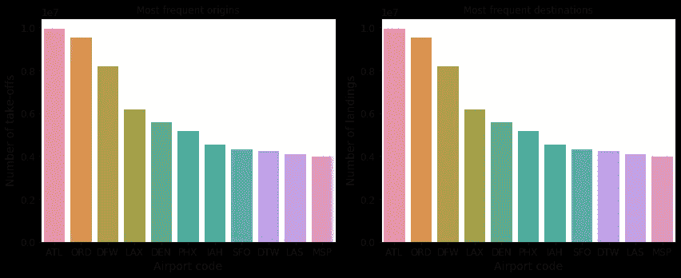

Fig. 3: Top 11 most common origins and destinations

接下来，让我们找到热门的起飞日期和时间。使用 Vaex，这非常简单:

首先，我们从`Month`和`DayOfWeek`列中减去`-1`，使它们从 0 开始。由于这些列包含离散的整数，我们将它们标记为“分类的”。最后，我们可以使用`plot`方法来可视化特定日期和月份起飞数量的二维直方图。通常，`plot`方法在给定网格分辨率和边界的情况下，生成连续数据的二维直方图。但是，由于绘制的列被标记为分类，该方法将自动设置条块，并计算每个日/月组合的离散值。结果如下图所示:

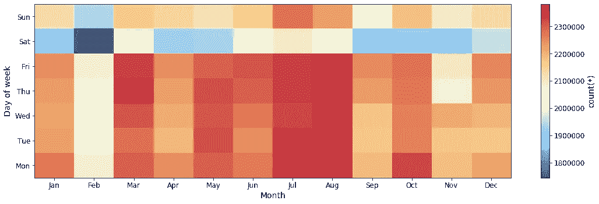

Fig. 4: Number of flights per month vs day of the week.

似乎七月和八月是乘飞机旅行最受欢迎的月份，而二月是空中交通最少的月份。周六起飞的飞机数量最少，二月的周六起飞的飞机数量也最少。

类似地，我们还可以探索一周中每天任何给定小时的出发次数:


Fig. 5: Number of departures per hour vs day of week.

早上 6 点到 9 点之间的时间段出发的人最多，另一个高峰出现在下午 5 点。与白天相比，夜间(晚上 10 点至凌晨 5 点)的航班数量明显减少。与工作日相比，周末的起飞量较少，如图 3 所示。

现在让我们把注意力转向飞行本身的一些基本性质。让我们绘制飞行时间、距离和速度分布图:


Fig. 6: Distributions of the air-time(left), distance (middle) and average speed(right) for each flight.

看着图 5，我很好奇:哪些是最短和最长距离的常规路线。所以让我们来看看。为了找出短途飞行的频繁航班，让我们计算以下任何给定距离的航班数量，比如 20 英里:

```
> 11    2710
  17      46
  18       5
  16       3
  12       2
  10       2
  19       1
  8        1
  6        1
  dtype: int64
```

看起来在相距仅 11 英里的两个机场之间发生了近 3000 次航班！对 Origin 列应用与上面代码块中相同的过滤器的`value_counts`方法，告诉我们有哪些航线:旧金山国际机场—奥克兰国际机场在过去 30 年中有超过 2600 次航班，而约翰·肯尼迪国际机场—拉瓜迪亚机场在同一时期只有少量航班。让我们更详细地了解一下，统计一下这两个机场对之间每年的航班数量:


Fig. 7: Number of flights per year on the shortest routes over the past 30 years.

从上图的左图我们可以看到，旧金山国际机场和奥克兰国际机场之间的定期航线至少存在了 5 年。距离只有 11 英里的乌鸦文件，这只是疯狂的。根据谷歌地图，人们可以在 30 多分钟内驾车往返于这两个机场。事实上，根据航班数量，我们可以推断，1988 年这两个机场之间平均每天有近 4 个航班，在随后的 4 年里减少到大约每天一个航班。从 1993 年开始，只有少数几个航班进行了登记。另一方面，在过去 30 年中，约翰·肯尼迪国际机场和拉瓜迪亚机场之间只有 53 次航班记录在案，很可能是私人航班或特殊服务。

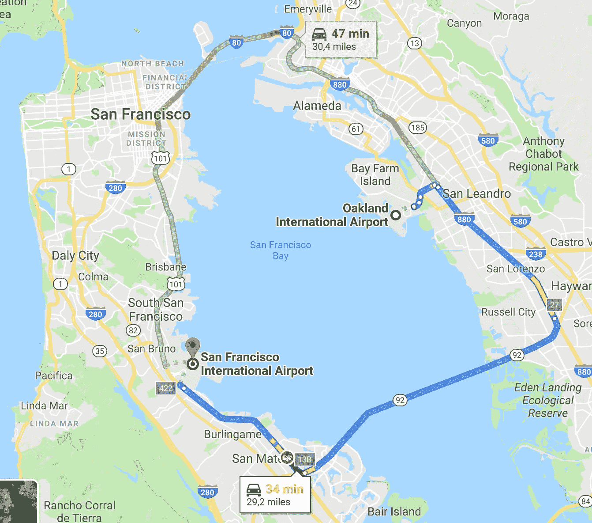

Fig. 8: Google Maps screen-shot showing the proximity between San Francisco and Oakland airports.

为了确定最长的常规路线，我们可以做类似的练习。通过查看图 5 的中间部分，让我们来计算一下飞行里程超过 4900 英里的航班数量:

```
> 4962    13045
  4983     4863
  4963     2070
  dtype: int64
```

看起来有 3 组固定距离，表明至少有 3 对机场。请注意，其中两个距离组仅相差一英里。为了确定哪些机场是有问题的，我们可以根据航班的始发地、目的地和距离对数据进行分组，然后对数据进行过滤，只选择距离非常远的机场:

```
> # Origin  Dest    Distance  count   
  *0* HNL     JFK         4983   2432 
  *1* HNL     EWR         4962   6528 
  *2* HNL     EWR         4963   1035 
  *3* EWR     HNL         4962   6517 
  *4* EWR     HNL         4963   1035 
  *5* JFK     HNL         4983   2431
```

`groupby`行动的结果告诉我们，事实上只有两条航线:纽瓦克自由国际机场(EWR)和约翰·肯尼迪国际机场(JFK)都往返于火奴鲁鲁国际机场(HNL)。如果遵循标准航线，檀香山国际机场和纽瓦克自由国际机场之间的飞行距离应该正好是 4962 英里。然而，由于 2001 年的悲剧，航线被临时改变了几年，这就是为什么我们在相同的机场之间观察到两个几乎相同的飞行距离。让我们看看这两个机场之间每年的航班数量:

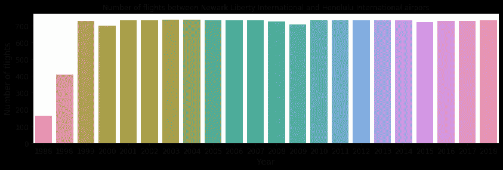

Fig. 9: Number of flights between Honolulu International and Newark Liberty International airports.

上图显示，从 1999 年开始，纽瓦克自由国际机场和檀香山国际机场之间几乎每天都有两班航班。另一条长途定期航线是在檀香山国际机场和约翰·肯尼迪国际机场之间。与之前类似，我们可以绘制每年发生的航班数量，如下所示。2012 年开始了频繁的服务，平均每天一个航班。从 2013 年开始，这两个机场之间平均每天有两个航班。

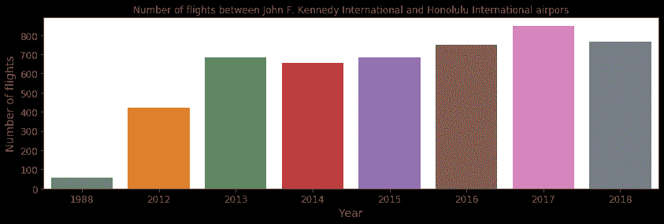

Fig. 10: Number of flights between Honolulu International and John F. Kennedy International airports.

# 让我们更加专注

我们正在分析的数据集不仅包括我们最初可能想到的较大的通勤枢纽，还包括许多不太常用的地方机场，以及货运、运动和军用机场。事实上，在数据中出现的 441 个机场中，10 个最频繁的机场占 33%，而 50 个最频繁的机场占我们数据集中所有起飞的 80%。因此，在随后的分析中，我将只考虑大型商业机场。一个机场进入这一选择的“经验法则”是在过去 30 年中有超过 20 万次的离港。基本原理是这样一个机场应该有大约 20 个定期目的地，每天一个航班。为了进行这样的选择，我们将根据起点对航班进行分组，然后计算每组中的航班数量。由于我们已经在进行`groupby`操作，我们可以计算额外的综合统计数据，如平均滑行时间、飞行距离和航班延误:

从这组数据中，我们可以得到一些有趣的见解。例如，让我们检查平均航程最长的 10 个机场，即出发航班平均飞行距离最长的机场:

我们发现这些机场要么位于美国偏远地区，如夏威夷群岛(HNL、OGG)、波多黎各(SJU)、阿拉斯加州(ANC)，要么附属于大陆沿海较大城市(三藩市、洛杉机、纽约州、迈阿密)。事实上，如果我们取每个机场始发航班的平均距离的中间值，我们得到的值是 600 英里。该值代表大城市或包含常用商业机场的热门目的地之间的典型距离。

我们还可以调查每个机场的滑行进入和滑行退出时间，这是飞机在起飞前和着陆后分别处于运动或等待状态的时间，同时所有乘客仍在飞机上。这可以让我们了解一个机场有多“忙”，或者它的运行效率有多高。让我们画出机场平均滑行时间的分布图:

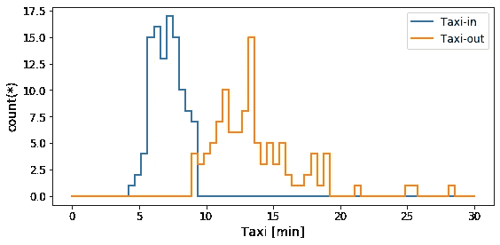

Fig. 11: Average taxi times for the main airports

平均来说，一架飞机起飞前滑行的时间比着陆后多 5-10 分钟。对于一些机场来说，平均滑行时间可能会超过 20 分钟。起飞前最长的等待时间发生在约翰肯尼迪机场，平均滑行时间为 28 分钟！在这方面，拉伯克国际机场是最好的，平均滑行时间刚刚超过 8 分钟。

# 延误和取消

现在让我们做一些更有趣的事情，看看航班延误和取消。因为我们只想考虑最常使用的机场，所以我们可以在我们用于此分析的主数据帧`df_filtered`和`df_group_by_origin`数据帧之间进行内部连接，我们从这些数据帧中筛选出起飞人数少于 20 万的机场:

为了标记航班是否延误，我们可以添加一个虚拟列:

回想一下，这不占用任何内存，只是存储在数据帧中的一个数学表达式，仅在必要时才进行计算。数据集中已经存在一个类似的列，但用于已取消的航班。让我们看看每年延误和取消的次数:

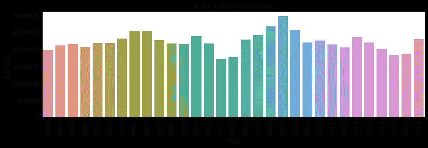

Fig. 14: Number of delays per year

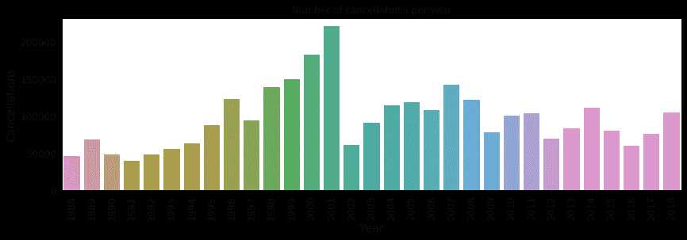

Fig. 15: Number of cancellations per year

自 2003 年以来，该数据库还包含航班取消的原因，如果知道的话。因此，我们可以创建一个图表，显示每个取消代码每年的取消次数，即航班被取消的原因。`seaborn`库对于这样的可视化特别有用:

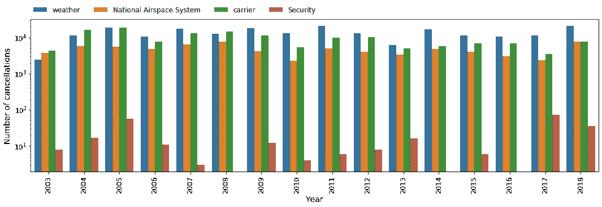

Fig. 16: The reason behind flight cancellations per year, if known.

看到由于安全原因取消的数量最近有所上升，这有点令人担忧。希望这只是相对的高峰，这样的取消在将来会少得多。现在让我们看看哪些机场的航班最常被延误或取消:


Fig. 17: Airports at which outgoing flights experience the most delays (left) and cancellations (right).

在匹兹堡国际机场(PIT ),超过 45%的离港航班都经历过某种程度的延误！芝加哥中途国际公司(MDW)和达拉斯国际公司(DFW)也紧随其后。威彻斯特县机场(HPN)、拉瓜迪亚机场(LGA)和波特兰国际机场(PWM)是取消航班比例最大的三大机场。

现在让我们开始指责，看看哪些航空公司经历了最多的延误和取消，而不考虑起点。我们正在使用的数据集已经包含一个列，其中包含每个航班的主要承运商的代码。要将实际的航空公司名称附加到该代码上，我们可以使用中的[表。请注意，该表已经编译了一段时间，因此可能有点过时。让我们将实际的航空公司名称映射到数据集中的航空公司代码:](http://stat-computing.org/dataexpo/2009/supplemental-data.html)

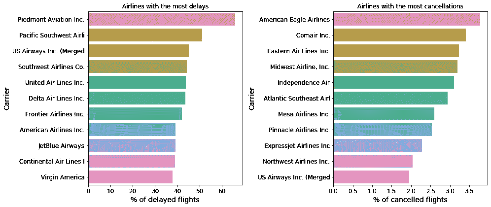

Fig. 18: Airline carriers which experience the most delays (left) and cancellations (right).

我希望你在上图中没有看到你最喜欢的航空公司！令人难以置信的是，有些航空公司的航班延误时间超过 50%。但别再指指点点了。让我们看看光谱的另一端，看看哪些航空公司经历的延误和取消最少:


Fig. 19: Airline carriers which experience the fewest delays (left) and cancellations (right).

取消航班最少的航空公司是那些通常长途运营的航空公司，比如夏威夷航空公司或那些环太平洋飞行的航空公司。这是有道理的:这些机场没有太多的“交通堵塞”，这些航班通常距离很远，不太频繁，因此可能被赋予更高的优先级。

# 比以往任何时候都更加紧密

最后，让我们看看不同机场之间的连接数量是如何随时间变化的。让我们计算每个常用机场连接的唯一连接的平均数量，并绘制每年的图表:

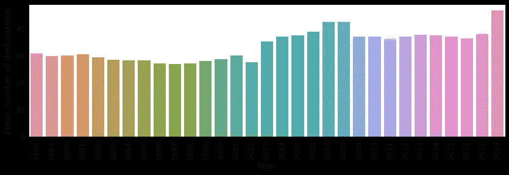

Fig. 20: The mean number of unique destinations that can be reached from each airport.

从上图我们可以看到，在经历了几年的“停滞”之后，2018 年美国的机场比以往任何时候都更加互联互通。

# 感谢您乘坐我们的航班

美国的飞行数据是一个非常有趣的数据集。它提供了许多可以分析这些数据的角度，比本文所描述的要多得多。也请查看完整的笔记本，因为它包含了更多关于上述情节是如何创作的细节，以及一些额外的见解。

我希望这能激励你更深入地研究这个问题，甚至更大的数据集，尤其是现在你已经知道用 [Vaex](https://github.com/vaexio/vaex) 来做这件事是多么容易。事实上，我认为这个数据集有点小，至少就 [Vaex](https://github.com/vaexio/vaex) 而言。Vaex 是免费的开源软件，我鼓励你在工作流程中尝试一下，尤其是当你遇到内存问题的时候。

数据科学快乐！