# BigQuery:嵌套数据上的 SQL

> 原文：<https://towardsdatascience.com/https-medium-com-martin-weitzmann-bigquery-sql-on-nested-data-cf9589c105f4?source=collection_archive---------3----------------------->

在 BigQuery 中运行分析可能非常强大，因为嵌套数据和数组基本上意味着处理预连接的表。查询它们可能非常有效，但许多分析师不熟悉半结构化、嵌套的数据，并努力利用其全部潜力。

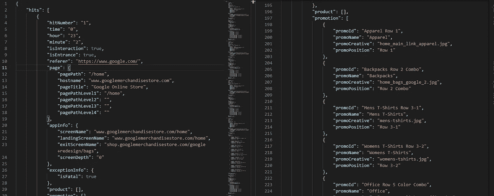

# “半结构化”到底是什么意思？

这意味着我们可以定义一个复杂的嵌套结构，但它必须在整个表中保持一致。要创建它，我们需要两样东西:[结构](https://cloud.google.com/bigquery/docs/reference/standard-sql/data-types#struct-type)和[数组](https://cloud.google.com/bigquery/docs/reference/standard-sql/data-types#array-type)。定义结构的一种方法是使用 struct()函数:

```
SELECT
  STRUCT(42 as answer, 'Hello World!' as greeting) as info
```

结果的 JSON 表示如下:

```
{
  "info": {
    "answer": "42",
    "greeting": "Hello World!"
  }
}
```

定义数组也相当容易。请注意，在定义结构时，您只需要在第一个实例中定义字段名称。所有其他结构都继承这些名称。

```
SELECT
  [1, 4, 832] as integers,
  ['a', 'b', 'c', 'xyz', 'Hallo!'] as strings,
  [true, true, false, true ] as booleans,
  [
    STRUCT(1 as int, false as bools), 
    STRUCT(25, false), 
    STRUCT(620, true) 
  ] as structs1,
  [
    STRUCT( [5, 2, 9] as arr ), 
    STRUCT( [7, 2] ), 
    STRUCT( [15, 0, 94] ) 
  ] as structs2
```

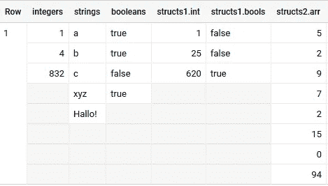

A couple of arrays … and arrays in an array — everything in one row! (screenshot by author)

正如你在`structs2`中看到的，为了在一个数组中列出数组，你需要将它们放入一个结构中。这样他们可以有一个名字，也可以在以后得到解决。

# 但是这些数组是如何预先连接到表中的呢？

请这样想:通常信息分布在多个表中以节省存储空间，只有在需要时才组合在一起，如下例所示:

```
WITH t1 AS (
    SELECT 1 AS id, 'spaghetti napoli' AS meal
  UNION ALL
    SELECT 2, 'soljanka'
  ),
t2 AS (
    SELECT 1 AS id, 'spaghetti' AS ingredient  
  UNION ALL
    SELECT 1, 'tomatoes'
  UNION ALL
    SELECT 2, 'pickles'
  UNION ALL
    SELECT 2, 'lecsó'
  )

SELECT * FROM t1 LEFT JOIN t2 USING(id)
```

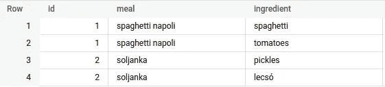

Yummy result of a join (screenshot by author)

现在，在嵌套数据中，相同的场景看起来更像这样:

```
WITH t1 AS (
    SELECT 'spaghetti napoli' as meal, ['spaghetti', 'tomatoes'] as ingredient
  UNION ALL
    SELECT 'soljanka', ['pickles', 'lecsó']
  )

SELECT * FROM t1 
```

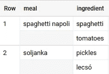

Nested result in two rows (screenshot by author)

我们将两个表合并为一个—数据放在一起，节省了存储空间，并且不需要 id。

# 好的，但是我如何查询数组呢？

公平的问题—让我们看看选项…

## Unnest 阵列

允许我们查询数组的神奇函数叫做`UNNEST()`。它将一个*数组作为输入*，并将它的内容作为*表行作为输出*。如果数组由*结构*组成，它会很方便地将它们转换成*列*。

```
SELECT id, name FROM UNNEST( [ 
    STRUCT(12 as id, 'Hannah' as name),
    (13, 'Simone'),
    (14, 'Ada')
  ] )
```

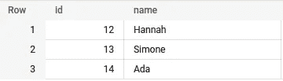

3 important personalities in 3 rows from one array (screenshot by author)

使用`UNNEST()`有两种方法:*展平*表格或者使用*子查询*。这在很大程度上取决于您的用例。

*   扁平化大大增加了表格的大小
*   子查询聚集数组

这意味着，如果你能避免扁平化，那么尽一切办法避免它！

## 子查询未嵌套数组

如果要聚合数组，应该使用子查询。只需将您的查询括在括号中并选择`FROM UNNEST()`:

```
WITH t1 AS (
    SELECT 'spaghetti napoli' AS meal, ['spaghetti', 'tomatoes'] AS ingredient
  UNION ALL
    SELECT 'soljanka', ['pickles', 'lecsó']
  )

SELECT 
  meal,
  (SELECT COUNT(*) FROM UNNEST(ingredient)) AS numIngr,
  (SELECT STRING_AGG(i, '; ' ORDER BY i) FROM UNNEST(ingredient) AS i) AS listIngr,
  (SELECT i FROM UNNEST(ingredient) i ORDER BY LENGTH(i) DESC LIMIT 1) AS longestIngr
FROM t1 
```

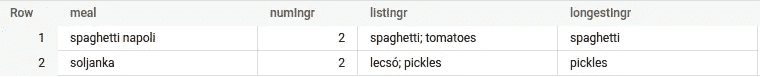

Go ahead and add your own sub-query! (screenshot by author)

就像嵌套在 for 循环中的 for 循环一样，子查询在每行执行**。您可以使用 SQL 提供的大多数东西。无论是排序、分组、开窗还是甚至与当前行中的其他数组相结合。**

您甚至可以通过将子查询输出反馈给函数`ARRAY()`来准备数据和创建自己的数组。如果您想用多列的结构填充它，只需`SELECT AS STRUCT`。

```
WITH t1 AS (
    SELECT 'spaghetti napoli' AS meal, ['spaghetti', 'tomatoes'] AS ingredient
  UNION ALL
    SELECT 'soljanka', ['pickles', 'lecsó']
  )

SELECT 
  meal,
  ARRAY(
    SELECT AS STRUCT 
      i, 
      substr(upper(i),1,3) as ui, 
      length(i) as len 
    FROM UNNEST(ingredient) i
  ) myIngred
FROM t1 
```

在 BigQuery 中试试吧！添加您自己的子字段！

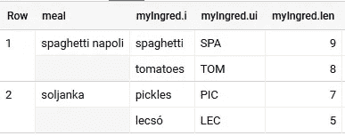

Write your own sub-tables! (screenshot by author)

子查询也非常适合快速查看非常大的表。在 Google Analytics 数据上尝试这个查询——它只显示特定事件的选定字段。

```
SELECT 
  event_name,
  -- Create an array with selected columns only (literally)
  array(
    select as struct item_id, item_name, item_category, item_list_index, promotion_name 
    from unnest(items) 
    order by item_list_index
  ) as items

FROM `bigquery-public-data.ga4_obfuscated_sample_ecommerce.events_20210131` 
WHERE
  ARRAY_LENGTH(items)>1
  AND event_name='view_item'
LIMIT 1000
```

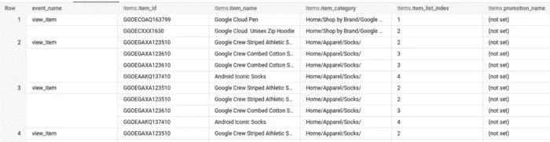

Better exploration with less sub-columns (screenshot by author)

我提到过你可以在`WHERE`子句中运行子查询吗？不要混淆哪个`WHERE`适用于整个桌子，哪个适用于`UNNEST(hits)`。每个`WHERE`都有它的`FROM`！小心瞄准镜！

```
SELECT 
  event_name,
  items
FROM `bigquery-public-data.ga4_obfuscated_sample_ecommerce.events_20210131` 
WHERE
  -- Only show events with "Charcoal" in their product name
  exists(select 1 from unnest(items) where item_name like '%Charcoal%')
```

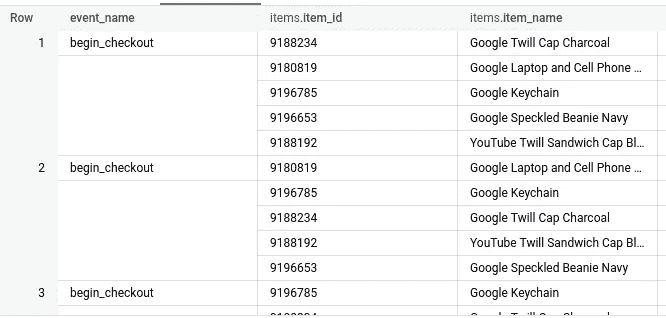

Filter events with conditions on items (screenshot by author)

## 通过在非嵌套数组上使用联接来拼合表格

由于`UNNEST()`为我们提供了表格行，我们不仅可以查询它们，还可以在`JOINs`中使用它们！

```
WITH t1 AS (
    SELECT 'spaghetti napoli' AS meal, ['spaghetti', 'tomatoes'] AS ingredient
  UNION ALL
    SELECT 'soljanka', ['pickles', 'lecsó']
  )

SELECT 
  meal,
  i
FROM t1 CROSS JOIN UNNEST(ingredient) AS i 
```

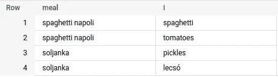

This is called lateral joining — a separate join per row (screenshot by author)

事情是这样的:

1.  将数组转换成表格行
2.  *将它们与数组父行交叉连接*

我们有效地为来自未嵌套数组的每一行重复父行。

但这也意味着，从技术上讲，我们也在重复数组。因此，如果我们没有选择正确的列，整个事情看起来会有点混乱。试着用`*`替换`meal, i`:

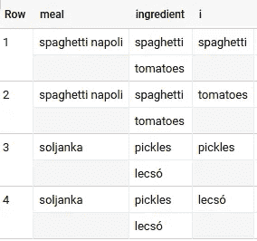

Not so flat anymore … (screenshot by author)

如果你对“扁平化”表格有更深的了解，你可以充分利用这个事实。例如，在这个查询中，我们使用展平的子行的信息在该行所在的数组中进行查找！

```
SELECT 
  event_name,
  itm.item_name,
  -- Count Google items within the duplicated items array!
  (select COUNT(1) from unnest(items) where item_name like '%Google%') anzahl_Google_items_im_elternevent
-- Cross Join with the items array!
FROM `bigquery-public-data.ga4_obfuscated_sample_ecommerce.events_20210131` t, t.items as itm
WHERE
  -- Only show items whose event-products have "Charcoal" in their product name
  exists(select 1 from unnest(items) where item_name like '%Charcoal%')
```

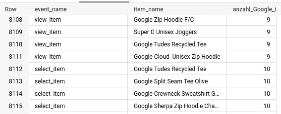

Items that are “adjacent” to charcoal items (screenshot by author)

在关系表中，这相当于连接两个表 t1 和 t2，但仍然编写子查询来检查 t2 中的某些内容。

# 使用非嵌套数组的高效查询

让我们回顾一下:

*   子查询有利于集合数组
*   交叉连接有利于根据表中包含的数组的大小来加长表

但是交叉连接也意味着大量的计算——所以如果你能避免它们:*避免它们*。

作为一般准则:

如果您需要通过数组中的值来扩展您的表**，请使用`cross join`。例如，您想要`group by`我们示例表中的成分。**

```
WITH t1 AS (
    SELECT 'spaghetti napoli' AS meal, ['spaghetti', 'tomatoes'] AS ingredient
  UNION ALL
    SELECT 'soljanka', ['pickles', 'lecsó', 'tomatoes']
  )

SELECT 
  i, count(*) qty
FROM t1 CROSS JOIN UNNEST(ingredient) AS i 
GROUP BY 1
```

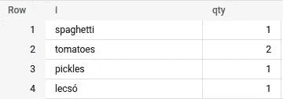

Group by ingredient from the array — no way around cross joining (screenshot by author)

如果您只需要来自数组的**聚合值**，使用**子查询**。当然，您也可以在聚合中使用它们:

```
WITH t1 AS (
    SELECT 'spaghetti napoli' AS meal, ['spaghetti', 'tomatoes'] AS ingredient
  UNION ALL
    SELECT 'soljanka', ['pickles', 'lecsó', 'tomatoes']
  )

SELECT 
  -- sum the length-sums over all meals
  SUM(
    -- sum lengths of all ingredients in this meal/array
    (SELECT SUM(LENGTH(i)) FROM UNNEST(ingredient) AS i)
  ) AS sumLenIngred
FROM t1
```

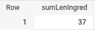

Aggregations all the way down (screenshot by author)

这意味着您应该**避免这个版本的查询**以节省金钱、资源和时间:

```
SELECT 
  SUM(length(i)) AS sumLenIngred
FROM t1 cross join unnest(ingredient) i
-- Please don't do this
```

我知道它比较短——但只供你阅读。特别是对于 BigQuery，这个版本是对结果的**更长的方式** ，因为它必须先*扩展*表，然后才聚合它。而在子查询版本中，它只是聚合而没有额外的`cross join`步骤。

我希望这对您有所帮助，并让您开始使用嵌套数据中的 SQL！让我知道，如果你有问题或需要更多的阐述！

编辑于 2023 年 2 月。

阅读如何主动创建嵌套数据 BigQuery 中数据清理和数据准备所需的技能:

[](/bigquery-creating-nested-data-with-sql-727b761f1755) [## BigQuery:使用 SQL 创建嵌套数据

### 在 BigQuery 中对嵌套数据使用 SQL 是非常高效的。但是，如果您的数据出现在平面表中，比如…

towardsdatascience.com](/bigquery-creating-nested-data-with-sql-727b761f1755) [](https://medium.com/@martin.weitzmann/membership) [## 通过我的推荐链接加入 Medium-Martin Weitzmann

### 阅读马丁·威茨曼(以及媒体上成千上万的其他作家)的每一个故事。您的会员费直接…

medium.com](https://medium.com/@martin.weitzmann/membership)