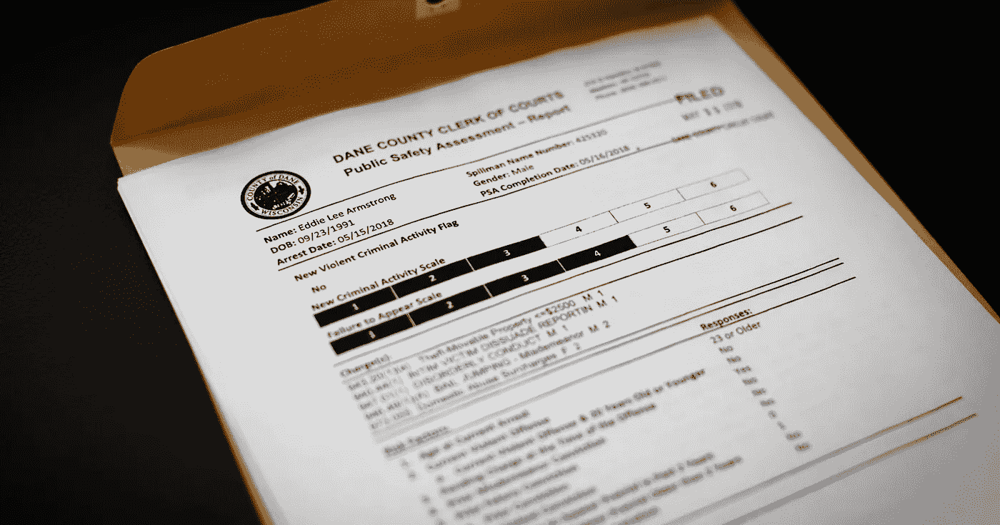
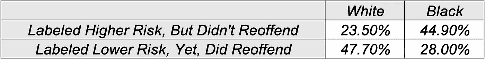

# 美国刑事司法系统对大数据算法的滥用

> 原文：<https://towardsdatascience.com/https-medium-com-mfingerhood-the-misuse-of-big-data-algorithms-in-the-united-states-criminal-justice-system-e9053d947aa?source=collection_archive---------18----------------------->

> 尽管(风险需求评估测试)是出于好意，但我担心它们可能会无意中破坏我们确保个性化和平等司法的努力。通过将量刑决定建立在静态因素和不可改变的特征(如被告的教育水平、社会经济背景或居住环境)的基础上，他们可能会加剧不必要和不公正的差异，而这种差异在我们的刑事司法系统和社会中已经太普遍了。
> 
> *—埃里克·霍尔德，美国前司法部长*

美国拥有世界上最多的监狱人口。美国有 230 多万囚犯，关押着世界监狱人口的 25%以上，而其总人口仅占 5%。虽然大约 1%的美国人口被监禁，但没有哪个群体比黑人更容易成为目标。[三分之一的美国黑人将在监狱服刑](https://www.aclu.org/issues/smart-justice/mass-incarceration/mass-incarceration-animated-series)在一些州，黑人因毒品指控入狱的比率是白人的 20 到 50 倍。

近年来，这种制度化的种族主义做法和大规模监禁的现实并没有被完全忽视。事实上，许多执法机构和联邦机构已经找到了消除种族偏见和提高效率的方法。或许并不令人意外的是，在大数据时代，算法已经成为所谓的解决方案。这些算法主要采取风险需求评估测试(RNAs)和地理空间预测监管技术的形式(后者我不会在本文中讨论)。理论上，这些技术是出于诚实的目的而实施的，但在实践中，它们最终强化了它们想要消除的偏见，并披上了客观的外衣。

***什么是 RNA？***

*Sample RNA Score Sheet*

早在 20 世纪 70 年代，早期版本的计算性 RNAs 就已经存在，作为一种工具，帮助执法部门识别再犯风险较低的囚犯，以便他们有资格获得提前假释。简而言之，这些测试利用静态风险因素，如首次被捕时的年龄、性别或种族，结合动态风险因素，如婚姻和就业状况以及教育水平，根据以前罪犯的数据确定相对风险得分。虽然这些项目最初旨在帮助通知假释等审后决定，但管理人员此后对 RNA 的应用变得过于自信和过度热情，将他们的触角延伸到了[审前决定，如保释金额或刑期](https://www.wired.com/2017/04/courts-using-ai-sentence-criminals-must-stop-now/)。在这样做的时候，刑事司法机构忽略了大数据算法的关键现实。具体来说，他们忽略了这样一个事实，即数据集可能天生就有偏差，即使被[的客观吸引力](https://onlinelibrary.wiley.com/doi/abs/10.1002/asi.23294)和数字的简单性所迷惑，异常值也是存在的。

***为什么 RNA 的使用有问题？***

[2007 年，首席大法官会议和州法院行政人员会议呼吁使用 RNA 测试来协助判决刑期](https://www.ncsc.org/~/media/Microsites/Files/CSI/RNA%202015/Final%20PEW%20Report%20updated%2010-5-15.ashx)，因为它们在预测累犯方面很有效。这意味着 RNA 算法将在审判过程中实施，以根据被告未来犯罪可能性的*预测*告知法官建议的刑期。因为这个应用程序有严重的后果，所以管理员必须假设可以忽略不计的假阴性(如果有的话),以及数据集的完全客观性。事实上，情况并非如此。

***宣判期间使用 RNA 的含义***

RNA 测试在一个充满偏见的社会中进行。因此，这些测试使用的数据是有偏差的。举个例子，在 RNA 算法中使用逮捕历史。据统计，一名警察逮捕一名黑人的可能性是逮捕一名白人的三倍多，即使他们后来没有被定罪。不考虑定罪，逮捕历史在某些算法中被用作进一步预测风险的输入，从而证明了数据的主观性。

Data From [ProPublica](https://www.propublica.org/article/machine-bias-risk-assessments-in-criminal-sentencing)

2016 年，当 [ProPublica 对 NorthePointe 的算法 COMPAS 进行外部分析](https://www.propublica.org/article/machine-bias-risk-assessments-in-criminal-sentencing)时，RNA 测试中有偏见数据的后果被揭示出来。ProPublica 分析了佛罗里达州布劳沃德县 7000 名在 2013 年至 2014 年期间被判刑的人的 RNA 结果。评估发现，COMPAS 只能准确预测 61%的个人的累犯率。此外，该算法更有可能“错误地将黑人被告标记为未来的罪犯，错误地将他们标记为白人被告的比例几乎是白人被告的两倍。白人被告比黑人被告更容易被误贴上低风险的标签。”该研究继续说道，“黑人被告仍有 77%的可能性被认定为未来实施暴力犯罪的风险较高，45%的可能性被预测为未来实施任何形式的犯罪。”这些结果意义重大，无论是在计算误差方面，还是在它们不可逆转地、不成比例地针对和损害真实的、活着的美国人的生活方面。

具体来说，来自佛罗里达州劳德代尔堡的 18 岁黑人妇女 Brisha Borden 在偷了一辆价值 80 美元的自行车后，在 RNA 测试中得了 8 分。弗农·普拉特，一名 41 岁的白人男子，从一家家得宝商店偷了价值相当的货物。Prater 之前有几项指控，并在过去服刑，但他仍然获得了 3 分的风险评分。最终，这些分数被用来确定两个被告的保释金数额，并不成比例地负担波登。此外，在实施分数管理两年后，Prater 因另一项罪行再次入狱，而获得更高风险分数的 Borden 没有被指控任何新的罪行。

最终，在判决和其他审前决定中使用 RNA 测试是不道德的。很多时候，社会接受一个数字或分数仅仅是因为它看起来是定量的，因此也必须是客观的。也就是说，大数据算法有潜力有效地对社会的许多方面产生积极影响。然而，为了让这成为现实，我们必须首先合理解释并真正理解我们的数据、模型和结果的含义，然后再将它们广泛应用于强大而有影响力的机构。