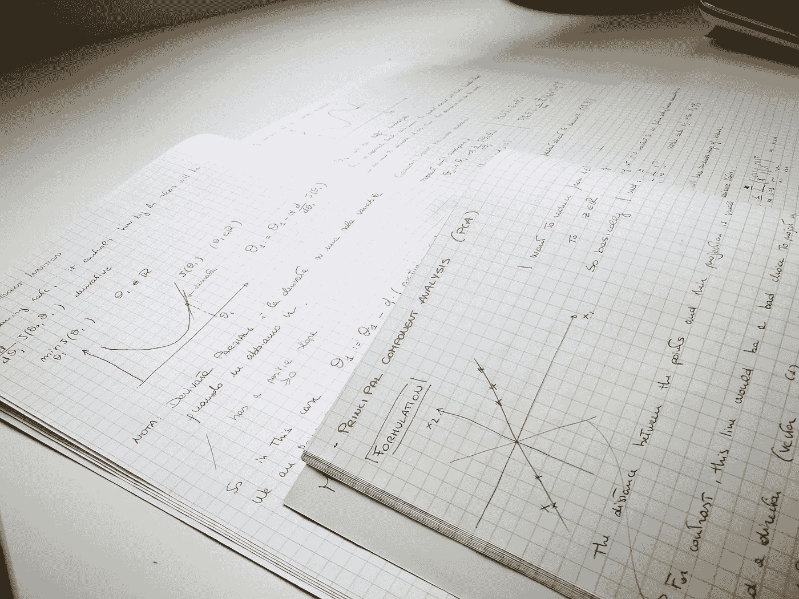
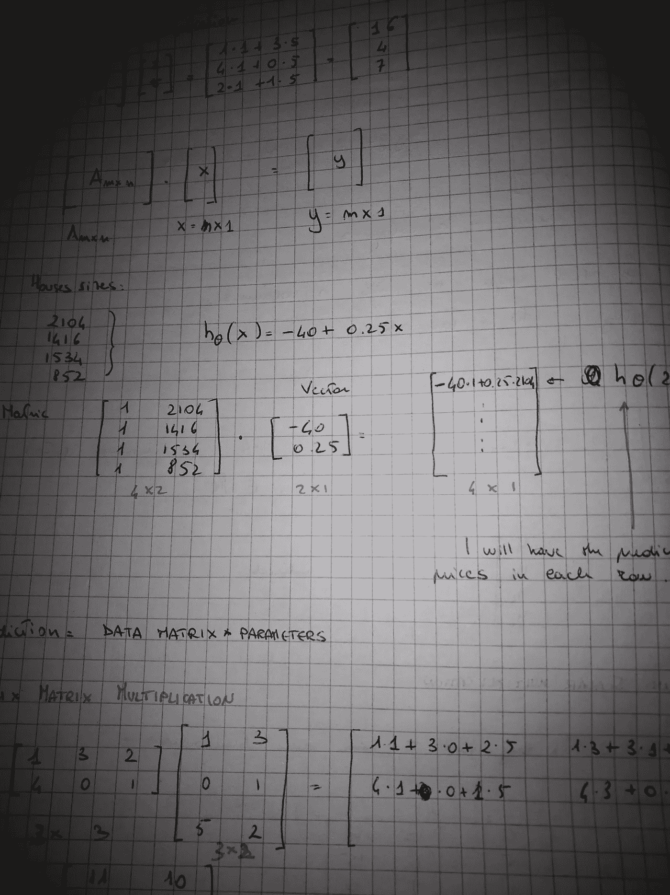

# 数据科学，从何入手？课程回顾。

> 原文：<https://towardsdatascience.com/https-medium-com-mirko-mastrelli-data-science-where-to-start-a-course-review-978094d3de5b?source=collection_archive---------32----------------------->

## 过多的在线课程会造成严重后果

## 在这篇综述中，我将谈谈让我接触到 ML 和 DL 的课程。

I went medieval on this one..

肯定有许多人正在考虑在数据科学领域工作或转行，因此肯定有许多人心中有两个问题。

1)网络课程报价巨大，我该从哪里入手？

答案是，这里[https://www.coursera.org/learn/machine-learning](https://www.coursera.org/learn/machine-learning)

我放心推荐。这门课程激发了我的热情和求知的欲望，我相信它也会对其他人产生同样的影响。

首先要提到的是，在课程结束时，你还没有做好工作准备，但另一方面，很少有课程能让你做好准备。

这些材料相当旧，如果我没记错的话，可以追溯到 2007 年。

其次，你不会使用 python，所以你不会学习 pandas、seaborn 或 scikit-learn。该课程基于 Octave/Matlab，不会吸引招聘人员关注你的 Linkedin 个人资料。

还在吗？好吧，那你为什么要选这门课呢？

因为它为你开始积累知识提供了最好的基础，它介绍了一些概念并给出了清晰的解释，这些概念将在以后的其他课程中扩展，并且现在在就业市场上需求量很大。

吴恩达老师提供了非常有价值的课程，用一种让学生更容易理解的方式呈现了一些(有时非常)复杂的概念。

第二个问题可能是:

2)我需要多少数学或编程经验才能熟练地学习这门课程？还是希望在 ML 里干出一番事业？

为了回答这个问题，我决定提供一个按周细分的列表，我将对数学和编程部分的难度进行评分。这些分数是基于我对一个对微积分和编程有些生疏概念的新手在接近这门课程时可能会经历的事情的看法。

我会用愚蠢但不言自明的分数(容易、中等、困难)来给每个星期留下第一印象。

第一周数学难度:中等，编程难度:无。

我们介绍了监督和非监督学习的概念，以及单变量线性回归。一些数学和微积分知识从一开始就是必要的。我们还介绍了成本函数和梯度下降。

我承认我喜欢这部分。我于 2005 年毕业，相当于意大利的工程学博士，这意味着我已经超过 10 年没有接触一些严肃的微积分了，重新使用它就像在熟悉的水域航行一样。

微积分被很多课程刻在我脑子里，用在工程的不同学科。它留下的不仅仅是伤疤，还有一些持久的知识，让我能够轻松地理解吴恩达先生的推理。如果你的线性代数是新的，你也会对这里介绍的内容感到轻松。

Vignette effect to provide dramatization.

如果你不是很擅长，不要害怕。导师会不断提供很有帮助的好例子(他称之为直觉),还有你需要的代数复习介绍。

如果你对微积分毫无概念，我建议你仔细阅读线性代数复习课。这应该给你足够的信息来继续。

从好的方面来看，在这一点之后，数学不会变得更糟。

八度简要介绍。

第二周数学难度:中等，编程难度:低。

在这里，我们将开始使用一些很好的旧线性代数，我们将学习更多关于线性回归和梯度下降，我们将有第一个参数的雏形。

它开始变得紧张，因为编程方面也引入了第一个线性回归和 Octave 梯度下降的练习。一切都有很好的解释，练习也有指导，所以试着从一开始就尽可能吸收，不要跳过可选的练习。

你也会看到一些很酷的情节。

亲提示:尽量对预先写好的代码有充分的理解。

第三周数学难度:中等，编程难度:低。

逻辑回归是本周的重点。

引入了 sigmoid 函数、决策边界以及一些用于防止过拟合的正则化技术。

数学在这里仍然很重要，但现在应该更熟悉了。

在编码方面，我们有一个关于逻辑回归和正则化的练习。

如果你上周做了很好的家庭作业，你会有优势，因为这个练习和上一个有一些相似之处。

第四周数学难度:中等，编程难度:中等。

当我们第一次看到神经网络时，事情开始升温。

我们直觉地知道它们是如何工作的，然后开始努力学习数学部分。

至此，我们应该对如何处理矩阵和向量有了很好的理解。

编码部分将包括一对一逻辑回归和神经网络，以识别手写数字。

这是一个很好的方式开始体验神经网络的力量与实际练习。

第五周数学难度:中高，编程难度:中。

本周课程的中心是初学者最难理解的概念之一。反向传播是一种有点违反直觉的算法，在这节课中，老师对教学的热爱真的闪闪发光。艰难的概念解释清楚，并举例说明，使其更容易理解。

编程练习将是一个数字识别神经网络的实现。

难度与上周的练习相当。

第六周数学难度:中高，编程难度:中。

作为现在通常的大量代数的一部分，我们也将不得不在这里使用大量的逻辑。

我们将学习为你要做的工作选择正确算法的方法，以及一些性能评估。

练习练习是对偏差和方差调整的研究。

第七周数学难度:中低，编程难度:中难。

本周数学不会特别复杂！

将会用到很多逻辑，编程练习也很难。

我们将使用支持向量机创建一个垃圾邮件分类器，请注意，这个练习可能有点棘手。

老实说，这是你可能想要放弃的部分。不要！后来就好了。

第八周数学难度:中等，编程难度:中等难度。

这是提出一些挑战的一周，因为我们开始了解一些无监督学习。

我们看到了一个名为 K-means 的算法，我发现它非常简单，并且有降维和 PCA 这样的概念。

还有两个相当有挑战性的编码练习。

在第一部分中，你将使用我们在 K-means 中学到的知识，应用随机初始化来完成一个图像压缩任务。这是激励工作在一个有形的任务，像这样的一个，因为图像处理将直接可见。不要跳过未评分的练习。

在第二部分中，我们致力于 PCA 降维，首先将一些数据投影到低维空间，然后投影到人脸图像数据集。这是一个有益的练习，因为我们将开始看到这些算法如何影响图像处理。

第九周数学难度:中难，编程难度:难。

本周围绕异常检测展开。

我们将处理一些统计的原始概念，但是它永远不会变得太疯狂，如果你知道我的意思。

我们还将研究推荐系统，这是网飞和 Spotify 等公司首次使用情感分析向你推荐下一个电视节目或艺术家。

虽然是编码练习，但这也是你最后要做的，因为课程接近尾声时会开始“对话”。

第十周数学难度:中低，编程难度:无。

我们将看到当存在大量数据时，ML 学习如何扩展，就像我们现在拥有的一样。

像小批量和随机梯度下降这样的技术是本周的一部分，也是在线学习和 map reduce。

没有编码练习。

第 11 周数学难度:低/无，编程难度:无。

这可能是最酷的一周。你学到了很多概念，可怕的数学已经成为过去，你驯服了 Octave。

现在，您将看到如何解决光学字符识别的问题，或者如何在图片中找到文本。本质上，当你给谷歌翻译应用程序输入图片时，它会做什么。

我们将看到如何人工增加数据集和上限分析。本周也没有编程作业。

结尾是一段来自吴恩达的鼓舞人心的视频，标题是“总结和感谢”，只有在你打算观看的时间观看，你才能完全欣赏它:在课程结束的时候。

在简短回顾了所有材料后，吴恩达在视频的最后两分钟发表了我听过的最真诚、最激励人心的演讲。好好享受吧。

总之，如果你和我一样，你最终会爱上这个人，爱上学习的内容和领域，希望这门课程能成为你新职业生涯的垫脚石。