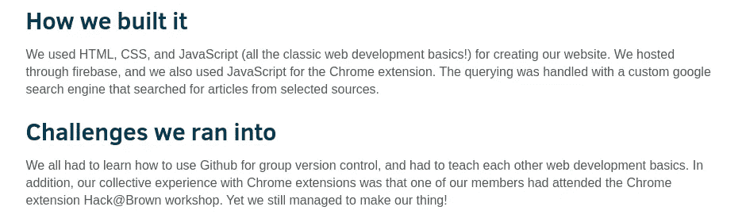

# 自学很难，坦白说，很孤独。以下是如何让它变得更简单的方法。

> 原文：<https://towardsdatascience.com/https-medium-com-nityeshagarwal-difficulties-with-self-learning-and-3-systems-to-solve-them-a14f4c9a64c6?source=collection_archive---------6----------------------->

## 让自学变得更容易的 3 个系统，在 Twitter 上关注的导师和学习的酷项目想法

Photo by [Atlas Green](https://unsplash.com/@atlas_green?utm_source=unsplash&utm_medium=referral&utm_content=creditCopyText) on [Unsplash](https://unsplash.com/?utm_source=unsplash&utm_medium=referral&utm_content=creditCopyText)

MOOCs(大规模开放在线课程)对我们这些自学者来说是个福音。无论你住在地球的哪个角落，世界上最好的教授的讲座都会直接送到你的手中——
**这难道不是破坏世界一流教育并使其在全世界民主化的秘诀吗？**

2019 年[的一项研究使用了 edX](https://www.researchgate.net/publication/330316898_The_MOOC_pivot) (麻省理工学院和哈佛大学提供的一个受欢迎的 [MOOC 平台)提供的 MOOC 数据，表明—
*不，可能不是* **:**](https://www.edx.org)

*   学习者几乎全部集中在世界上最富裕的国家和地区，
*   平均每 100 个注册课程的人中只有 6 个真正完成课程
*   这些数字没有改善。

这项研究可以总结为，MOOCs 并不像 2012 年首次引入这一理念时世界所预期的那样具有破坏性。

## 那么，我们如何将更多的学生纳入我们的教育民主化目标呢？

MOOCs 帮助需要帮助的自学者找到学习某个科目的资源。如果我们从更广阔的角度看问题，解决那些需要帮助找到学习这些科目的动机的自学者的需求，也许我们可以使教育更加民主化。

**激励学生是无组织的。**

我相信，在自学这门学科的概念的同时，自学者也在努力应对我们在传统教育方式中认为理所当然的事情——方向感(由竞争引导)、学习环境和同伴群体。

因为这些正是促使人们自我激励的东西，缺乏这些东西对自学者来说是一个非常现实的问题。对于来自非传统背景和处于不利环境(如发展中国家)的人来说，这个问题尤其严重。他们正在进行一场艰苦的战斗。

我的目标是通过这篇文章给它带来一些结构。以下是我的建议，如果在线课程似乎对你的情况不够有帮助，你可以如何进行自学。

# 帮助自学的 3 个系统

在做了两年自学者，自学了所有他想学的东西，又过了一年迷茫、没有动力、有点沮丧之后，我开始意识到——

*   自学任何东西都可能是困难的、耗费精力的、相当孤独的过程
*   但是当你关心你正在学习的东西时，你会把它从消耗你能量的东西变成提升你的精神和让你更自信的东西
*   有几个同龄人会让事情变得简单很多

考虑到所有这些，我已经能够提出 3 个系统来帮助你学习 X，当你的物理环境不能的时候

1.  在你尝试学习它之前，认真努力爱上它
2.  **创造一个激励你的环境**
3.  **激励自己完成学习 X 的细节**

请记住，它们是长期的系统，而不是一次性的提示和技巧。从长远来看，它们是增加你学习 X 的几率的常规练习。

下面我将详细描述这些系统，告诉你为什么我认为它们都很重要，并给你一些个人建议/技巧来开始使用它们。

# 1.在你尝试学习 X 之前，认真努力爱上它

如果你爱一样东西，你就会在乎它。当这种情况发生时，学习不再是一项“任务”；它变成了一次冒险。你会渴望更多地了解它，你会有精力去寻找你疑惑的答案。

**但是这里有一个陷阱:**
当你第一次想知道*如何学习 X* 的时候，并不是因为你爱 X 甚至觉得它很刺激。你可能对爱 X 的想法更感兴趣..也许*，b* 因为你已经看到一个同事完全疯狂地谈论 X，或者因为你已经听/读了足够多遍，X 是一个“热门”技能，可以放在你的简历中。

尽管这些理由是一个很好的起点，但还不够。如果你因为这些原因而投身于做 X，你将只是*从众*。如果有人问你“你为什么这么关心 X？”，你大概不会有一个能让你骄傲的答案。

所以，在你去寻找教授 X 的最佳课程之前，认真地、有意识地努力去寻找痴迷 X 的理由。

## "如果我试着跳过这一步，继续学习会怎么样？"

每当你强迫自己仅仅为了学习而学习某样东西的时候，你就创造了一个非常不令人满意的学习经历。

> 为你真正感兴趣的事情努力工作是激情，但为你并不真正关心的事情努力工作是 T21 压力。

这样做可能会让你陷入以下三种情况之一——

*   发现自己无法关心这个主题，中途停止
*   完成一门课程，获得证书，就是这样
*   陷入“教程炼狱”:没完没了地学习一系列课程，看讲座和教程，却没有实际运用它们

这些都不理想。

## 个人建议和入门技巧:

1.  **有意识地**寻找理由，让**你**确信学习 X 是绝对最好地利用**你现在的**时间。
2.  在你问别人“*如何学习 X”*之前，先问“*X 有什么让你兴奋的地方”*。
3.  去 Twitter 或 Reddit，逛逛喜欢 X 的人的社区，深入到与那里的人产生最大共鸣的东西——最受喜欢/投票最多的帖子。去兔子洞。

这就把我们带到了下一个系统。

# 2.创造并置身于激励你的环境中

我们都钦佩有上进心的人。这就像是一种超能力，让他们无法阻挡。

Much like the Juggernaut!

但是没有人生来就有自我激励的能力，对吗？那么是什么给了他们这种“动力”呢？更重要的是，我们如何培养自己的这种能力？

我相信你需要自我激励的是一个充满激励你做更多事情的人和想法的环境。当你和珍视一件东西的人在一起时，你自己更有可能珍视它。

如果你利用互联网的力量，不管你身在何处，你也可以拥有一个激励的环境。

## 创造一个激励的在线环境

你知道你的 newsfeed 是如何帮助你发现所有那些令人愉悦、令人垂涎、难以想象和疯狂的美食视频，因为它知道你是一个美食家。

现在想象一下，如果它知道你对机器学习或区块链技术或开源软件感兴趣，它会推荐什么。

你可以利用社交媒体最消极的一面——一个令人上瘾的、可以无限滚动的订阅源——并把它变成你的优势。

## “如果我跳过这个呢？”

还记得这样一句话吗——“你是和你相处时间最长的 5 个人的平均值”？

所以，如果你周围有一群谈论并经常与你分享 X 的酷事的人，你可以跳过这一步。但即使这样，如果你能接触到你自己的新的、酷的东西的来源，并与他们分享，你会感觉更好。

但是我们大多数自学者并没有被这样的人包围。我们是来自非传统背景或不太好的大学的人，或是来自发展中国家的人，在那里我们没有机会接触到有相似志向的同龄人。这可能是我们解决“个人环境问题”最简单的方法。

## 个人建议和入门技巧:

我经常使用 Twitter。我建议你也加入。为了进一步说服你，我推荐你阅读 Alexey Guzey 的这篇文章— [为什么(以及如何)你应该现在就加入 Twitter](https://guzey.com/twitter/)。

让它的推荐系统知道你喜欢 X 很简单:

1.  追随那些对 X 感兴趣的人——那些可能成为你榜样的人和对 X 充满热情的学习者
2.  从他们的个人资料里偷偷溜走
3.  花(有限的)时间浏览你的精彩新闻提要！

这样做，看看 Twitter 的新闻提要如何让你发现所有那些不可思议的事情，并帮助你自我激励。

“但如果我刚刚开始使用 Twitter，我怎么知道该关注谁，不该关注谁？”

没错，对于平台新人来说，这确实是个问题。因此，如果你需要帮助进入编程生态系统，我创建了几个 Twitter 帐户列表。这里列出了喜欢

*   [机器学习](https://twitter.com/build_to_learn/lists/ml-people)
*   [数据科学](https://twitter.com/build_to_learn/lists/ds-people)
*   [区块链/密码](https://twitter.com/build_to_learn/lists/blockchain-people)
*   [网页开发](https://twitter.com/build_to_learn/lists/web-dev-people)
*   [脑机接口](https://twitter.com/build_to_learn/lists/bmi-people)

你可以点击查看更多此类列表[。](https://twitter.com/build_to_learn/lists)

# 3.激励自己去完成学习 X 的细节

尽管有所有正确的学习理由，但很多时候自学真的会让人精疲力尽。这时你可能会卡在一些较小的 X 上，而这些较小的 X 组成了我们较大的 X。

你需要激励自己，这样你就能不断度过这段低迷期。

激励自己的一个简单方法是在你学习教程/课程的同时，兼职做一个项目。制作一些看起来很酷很有趣的东西是欺骗自己专心学习 X 的好方法。

## 个人建议和入门技巧:

我知道这很可怕。我知道你可能会有一些严重的不安全感，尤其是如果你是第一次这样做:

***不安全感#1:“我很想自己做点什么，但是我没有任何新的有趣项目的想法。”***

是的，这可能是阻止大多数人做项目的最狭窄的瓶颈。甚至超过了建造这个东西的实际难度。

我认为浏览其他人在[***devpost.com***](https://devpost.com/software/search?query=is%3Afeatured)上的黑客马拉松项目是获得这些想法的一个很好的途径，因为—

1.  它们只是小的、舒适的、温暖的宠物项目:作为年轻程序员在大约 12、24 或 48 小时内完成的个人项目，它们是非常可行的
2.  你可以知道你正在**建造一些有价值的东西**:他们中的大多数都是黑客马拉松获奖项目

如果你能创造出这样的东西，那该有多酷啊

*   [一个简单的通知应用，当通知频率超过每 3 秒 1 次时，你可以选择想要阻止通知的消息应用](https://devpost.com/software/notificationsapp)。
    ***骗自己学*** —安卓开发
*   [一个网络应用程序，可以让你在 YouTube 视频中搜索，并让你找到说出那个词的地方——视频的 Ctrl-F 功能](https://devpost.com/software/yoogle)
    ***并欺骗自己学习***——Python，基本网络开发(HTML/CSS，Javascript)
*   [一款短信应用，自动给你爱的人发短信，让他们知道你已经到达了一个特定的目的地，因为你经常忘记这么做](https://devpost.com/software/holla-vkgquz)
    ***并欺骗自己学习***——安卓应用开发
*   [一个工具，用来分析你的 Whatsapp 聊天，并显示诸如](https://www.reddit.com/r/dataisbeautiful/comments/8fl589/i_built_a_tool_to_visualize_whatsapp_chats_here/)——发送的消息数、发送的字数、每条消息的平均字数、最常用的单词、最长的双发短信记录、聊天时间模式、最常分享的网站链接和更多的信息
    ***，并欺骗自己学习***——Python，甚至是 web 开发，如果你决定为它建立一个网站的话
*   [一个浏览器扩展，将你引向一个与你正在阅读的政治观点相反的故事](https://devpost.com/software/twosidednews)(这将打击新闻订阅的效果，新闻订阅只允许人们看到社交媒体和新闻网站上与他们观点一致的帖子)
    ***并欺骗自己学习***——基本的 web 开发(HTML/CSS、Javascript、jQuery)，也许是一些机器学习
*   一个脚本，用于分析《权力的游戏》各季推文的情绪，以了解上一季有多糟糕(😜)
    ***骗自己学*** — Python，机器学习，NLP
*   [Kaggle](https://kaggle.com) 有一些非常酷的资源，你可以[用它们来学习机器学习和数据科学](/use-kaggle-to-start-and-guide-your-ml-data-science-journey-f09154baba35)。

[How cool would it be if you could get into ML/Data Science by analysing these datasets!?](/use-kaggle-to-start-and-guide-your-ml-data-science-journey-f09154baba35) ([1](https://www.kaggle.com/edumucelli/spotifys-worldwide-daily-song-ranking), [2](https://www.kaggle.com/miroslavsabo/young-people-survey), [3](https://www.kaggle.com/philipjames11/dark-net-marketplace-drug-data-agora-20142015), [4](https://www.kaggle.com/therohk/india-headlines-news-dataset), [5](https://www.kaggle.com/stackoverflow/stack-overflow-2018-developer-survey))

记住你的目标是自我提升。这就是为什么，我相信，你可以问心无愧地简单模仿和重新实现别人的想法。(尽管如果您能找到一种方法来赋予重新实现您的个人风格，那就太棒了！)

***不安全感#2:“但是我没有任何经验。我怎么会知道该学什么，如何建造，如何经历这一切？”***

我相信你不需要任何神秘的“真实世界的经验”来构建有用的东西。互联网上充满了这样的故事:有些人只是[构建了他们想要的](https://www.quora.com/How-did-Feross-Aboukhadijeh-learn-to-program-And-if-he-could-do-it-over-again-what-would-he-do-different-What-language-would-he-start-with/answer/Feross-Aboukhadijeh)，[学到了他们需要的技能](https://www.indiehackers.com/@marcinem/i-needed-a-tool-for-myself-so-ive-learned-to-code-cc037eba66)，[并在这个过程中自学了编程。](https://medium.com/free-code-camp/learn-how-to-be-a-better-programmer-by-automating-the-boring-stuff-74a67a568c50)

我在这里写了更多关于它的内容:[如何(以及为什么)在没有经验的情况下开始构建有用的、真实的软件](https://medium.com/free-code-camp/how-and-why-to-start-building-useful-real-world-software-with-no-experience-46f265eaf38)。

> “你认识的每一个伟大的开发人员都是通过解决他们没有资格解决的问题而获得成功的，直到他们真正做到了。”
> 
> 帕特里克·麦肯齐

但即便如此，我也意识到这说起来容易做起来难。

所以我想帮你。

# 简介，为学习而构建

我创建了[**Build To Learn**](https://www.buildtolearn.club)**来帮助你的自学需求。在这里，我将围绕做项目和教你必要的编程技巧创建一系列教程。**

****

**It’ll be like a story — You be the hero, the project our adventure and me, Gandalf, your guide**

**我会注意学习动机的需要(和缺乏),将上述 3 个系统记在心里，并尝试帮助你——**

1.  **一个“爱 X 的理由”系列，它将作为各个领域的起点**
2.  **我上面介绍的“Twitter 上喜欢 X 的人的名单”系列**
3.  **激励你做更多事情的项目本身**

**你可以注册[这个简讯](https://buildtolearn.substack.com)，这样我就可以给你发送一个更广泛的项目想法列表，让你知道 [Build To Learn](https://buildtolearn.club) 的更新。**

**我还成立了一个 Slack 小组，为那些想学习的人建立一个社区。我们的社区每天都在变大(已经有 350 名成员)。你可以点击这里的[链接](https://join.slack.com/t/build-to-learn/shared_invite/enQtMzg3MzYyNTA5MjAzLTkwMGYyYTljOTdkNTIzODJhNTlkZWQxMTZkODJmY2YxMTQ4OTVkODM1MTVlM2FmYTE0MzkwODhhYTc5MDc4YmI)加入！**

**感谢阅读！**

**如果你喜欢我写的东西，你可以通过 Twitter 或者 LinkedIn 或者普通的电子邮件联系我**

****PS** :如果你觉得我的建议有用，我很乐意了解你的故事，你的学习挣扎，给你更多个性化的建议。使用上述任何服务联系我，与我进行 **10 分钟通话【T13:)****