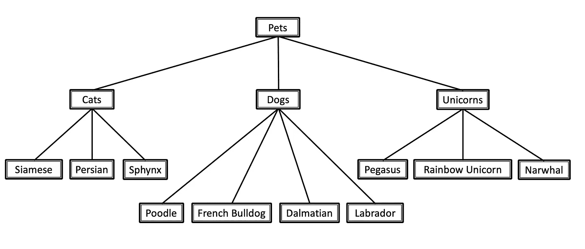
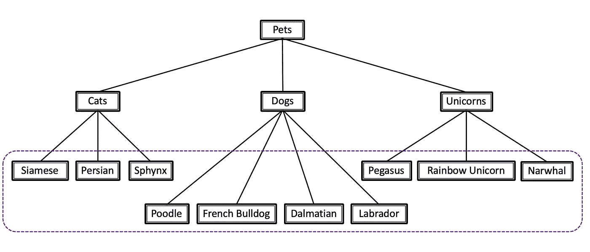
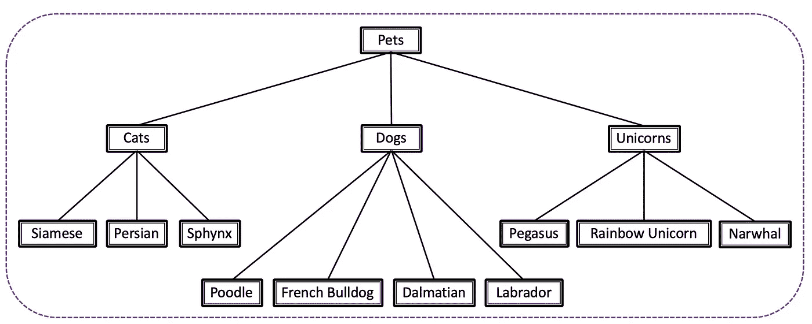
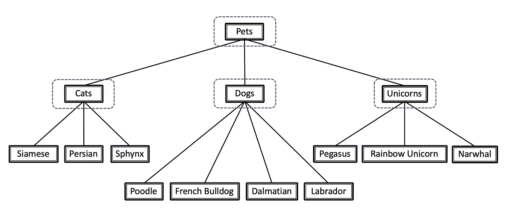
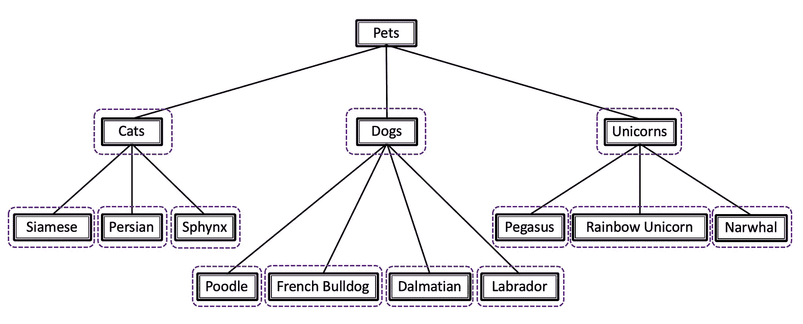
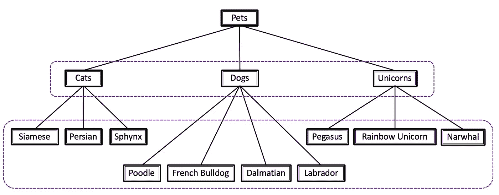

# 分级分类的搭便车指南

> 原文：<https://towardsdatascience.com/https-medium-com-noa-weiss-the-hitchhikers-guide-to-hierarchical-classification-f8428ea1e076?source=collection_archive---------3----------------------->

## 如何像专家一样对分类数据进行分类？

数据科学领域有一个固有的不协调性:当人类思维以层级结构感知周围的世界时，我们构建的模型接收的输入是平面的。

例如，当想到动物时，我们脑海中有一个清晰的分类:德国牧羊犬和金毛寻回犬都属于“狗”类，属于“哺乳动物”类；另一方面，普通的绿色鬣蜥属于“蜥蜴”类，属于“爬行动物”——与“哺乳动物”同属一类。虽然类层次树对人类来说非常直观，但如何向机器学习算法表示这些关系并不总是很清楚。

那么我们应该如何处理分类数据呢？弥合这一差距的最佳方式是什么？通常情况下，没有一个明确的答案，但有几种方法来应对这一挑战。我在这里告诉你关于他们的一切。

在这篇文章中，我将使用常见宠物的分类法来说明不同的层次分类方法:

# 平面分类

一种简单、直接的分类方法是**平面分类法**。在这里，您不必为那些讨厌的父类别而烦恼，只需将每个示例分类到其最终的叶级标签即可。暹罗猫对法国牛头犬来说就像对 Sphynx 猫一样(也被称为“奇怪的，没有毛的那种”)。

Flat classification: the dashed rectangle stands for one multi-class classifier

## **平级分类的利弊**

*   这种方法的明显优点是简单。你来，你看，你分类。这是一个简单的解决方案，可以用一个现成的分类器轻松实现。
*   不利的一面是，你显然会丢失一些重要的信息。数据的自然层次结构可能具有很高的分类价值，忽略这些父子类关系可能会降低性能。

# 大爆炸方法

接下来，我们有了**全球分类器****——**，或者用他们更吸引人的名字**“大爆炸方法”。**这些是各种各样的一堆，它们都共享同一个概念:*一个单一的、相对复杂的模型，它在一次运行中把整个类层次结构作为一个整体来考虑。*

除此之外，他们几乎没有共同之处。全局分类器可以走向非常不同的方向。一些使用聚类方法，一些将问题重新定义为多标签问题，一些是现有算法的修改版本，手工定制以适合手头非常具体的数据层次结构。

例如，您可以使用决策树算法，但是更改熵计算公式，以包含所讨论的数据层次结构特有的信息。或者修改模型，使其更喜欢较深的节点而不是较浅的节点，从而提供更具体的类别预测。这只是一个例子。说到全球分类器，世界是你的。

The Big Bang approach: one global classifier for the entire class hierarchy

## 大爆炸方法的利与弊

自然，这些各不相同。与半通用多标签算法相比，定制算法具有不同的优缺点，对于全局分类器池中的每一个其他独特的雪花也是如此。不过，一般来说，这种方法的高度复杂性是一个主要缺点，也可能是它很少被使用的原因。

# **分层结构**局部分类器

最后但同样重要的是，我们有我个人最喜欢的:使用**分层结构** **局部分类器**。这种方法使用预定义的数据分类法来创建分类器的层次结构。有三种标准方法可以做到这一点:

*   **每个父节点的局部分类器**:为每个**父节点**训练一个**多类**分类器，以区分其子节点。
    在我们的例子中，这意味着第一层有一个分类器(确定“猫”、“狗”或“独角兽”)，然后再有三个分类器来确定具体的品种。
    为了防止不同级别的预测不一致，您可以设计系统，使被第一个分类器分类为“猫”的示例只能被第二个级别的“猫”分类器看到。这样，你可以避免创造新的、奇异的混血儿，比如狮子狗独角兽(尽管这听起来不可思议)。

Local classifier per parent node (each dashed rectangle represents a multi-class classifier)

*   **每个节点的局部分类器**:为层次结构中的每个**节点**训练一个**二元**分类器(“Pets”节点除外)。这是一只猫吗？这是一只法国斗牛犬吗？这是彩虹独角兽吗？每个问题都有一个分类器。

Local classifier per node (each dashed rectangle represents a binary classifier)

*   **每级局部分类器:**为每个**级**训练一个**多级**分类器。在我们的例子中，这意味着两个分类器:一个用于确定种族(猫、狗或神奇的独角兽)，另一个用于品种(波斯猫、拉布拉多、独角鲸等)。).这种方法很不受欢迎，可能是因为它提出了不一致的问题:很可能的结果是“狗”是种族，而“飞马”是品种，而且没有好的方法来避免它。

Local classifier per level (each dashed rectangle represents a multi-class classifier)

## **局部分类器的利弊**

局部分类器方法非常直观，使用数据中的层次信息，同时保持简单性和通用性(它可以用于任何基本分类器)。然而，根据分类法和选择的方法，您可能会得到一个相当庞大的最终模型。

还有一个**错误传播**的问题，其中一个级别的错误可能会影响所有后续级别。不过，这是可以控制的——稍后会详细介绍。

思考这三种方法各自独特的优缺点？敬请关注。

# 我自己选择分类器的个人分类器

**那么，你应该选择什么方法呢？**以下是我在讨论这个问题时的考虑:

个人最爱？**地方量词**，这是毫无疑问的。它直观、聪明，可与任何基本算法一起工作，并设法保留关于数据层次结构的自然信息。同时保持合理的设计和维护简易性。在我看来，这应该是你处理所有层次结构的首选方法。

不过，可能会有特殊情况。也许你的项目是一个快速和肮脏的项目，你愿意牺牲一点准确性来获得更快的胜利。或者也许你有限制，简单是关键。如果是这样的话，直截了当的**扁平分类**可能最适合你。

当你需要你的模型提供快速预测而不牺牲准确性时，一个**全局分类器**可能是一个很好的选择，这取决于特定的算法。毕竟，它只需要运行一次。然而，这种出色的表现是有代价的:做好付出高复杂性的准备。

或者也许你是那种超级有创造力的人，你有第四个更好的想法，我在这里没有提到。如果是这样的话，为什么不和班上其他人分享一下呢？下面的评论区等着你。

# 一些最后的调整

*好吧，我决定使用强大的本地分类器，但是……*

*   *我应该使用每个节点、每个父节点还是每个级别的分类器？*
*   *我应该对每个分类器使用相同的特征，还是应该改变它们？*
*   *对于这种奇怪的模型结构，我使用了哪些性能指标？*
*   以神圣的名义，我该如何定义我的正面和负面训练范例？

的确，所有重要的问题都将得到解答——但不是在此时此刻。在我的下一篇文章中，我将深入探讨局部分类器方法的所有优点。

与此同时，我希望你充分利用你新发现的关于分类数据分类的知识，并记住:独角兽是一种有效的家养宠物，不要让任何人告诉你不同。

Noa Weiss 是特拉维夫的一名自由数据科学家。

*资料来源* : C.N. Silla & A.A. Freitas， [*跨不同应用领域的层次分类综述*](https://link.springer.com/article/10.1007/s10618-010-0175-9) (2011)，*数据挖掘与知识发现*，22(1–2):182–196