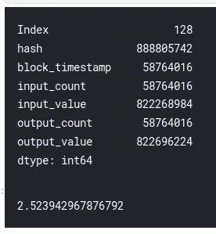

# 使用 Python 和 BigQuery 在 Kaggle 上开始使用比特币数据

> 原文：<https://towardsdatascience.com/https-medium-com-nocibambi-getting-started-with-bitcoin-data-on-kaggle-with-python-and-bigquery-d5266aa9f52b?source=collection_archive---------21----------------------->

## 什么是区块链

## 逐步概述

Photo by [André François McKenzie](https://unsplash.com/@silverhousehd?utm_source=medium&utm_medium=referral) on [Unsplash](https://unsplash.com?utm_source=medium&utm_medium=referral)

在我的[上一篇文章](https://medium.com/@nocibambi/how-to-get-into-bigquery-analysis-on-kaggle-with-python-b75ee5e0a79d)中，我研究了 Python 在 Kaggle 上研究 BigQuery 数据的可用性。在那里，我得出结论，就目前而言，我们无法避免比我最初设想的更广泛地使用 BigQuery。

(本文是用 Python 分析 BigQuery 区块链数据系列文章的一部分。关于项目和帖子的概述，见[此链接](https://medium.com/@nocibambi/blockchain-data-analysis-on-kaggle-with-bigquery-and-python-c7ab2f46ace)。)

在这篇文章中，我展示了一种简单直接的方法，在`pandas`和谷歌的`bigquery` Python 模块的帮助下，在 [Kaggle](https://www.kaggle.com/bigquery/bitcoin-blockchain) 上运行 BigQuery 比特币数据集的查询。你可以[看到并分支我写这篇文章所基于的笔记本](https://www.kaggle.com/nocibambi/getting-started-with-bitcoin-data/)，你可以在它的 [BigQuery 页面](https://console.cloud.google.com/marketplace/details/bitcoin/crypto-bitcoin?filter=solution-type:dataset&id=7fd60425-cb95-4a58-b59f-ab3789642844)上阅读更多关于数据集的信息。

虽然有其他方法可以访问比特币数据，但[谷歌的 BigQuery 数据集](https://cloud.google.com/blog/products/data-analytics/introducing-six-new-cryptocurrencies-in-bigquery-public-datasets-and-how-to-analyze-them)集合是关于比特币的最详尽和最新的数据源，它还包含了更多加密货币的数据。另一方面，通过 Google 云平台使用 BigQuery 是一套完全独立的技能，您需要掌握这些技能才能开始分析。相比之下，使用 Kaggle 可以给你一个快速的开端，尽管——正如我在上一篇文章中指出的——你确实需要了解一些 BigQuery SQL。此外，通过 Google Cloud，在免费计划中，你一个月只能处理 1TB 的数据，而使用 Kaggle 的许可证可以为你提供 5tb 的处理能力。

## 概述

1.  BigQuery `Client`对象
2.  BigQuery 数据集和表的一般结构
3.  一个示例查询
4.  运行查询并生成数据帧
5.  情节

首先，我将介绍 BigQuery `Client`对象，我们将使用它来访问数据。在这个对象的帮助下，我们将对 BigQuery 数据集的高层结构有所了解。接下来，我们将编写一个简单的查询来访问比特币数据。

由于比特币数据集非常庞大，并且使用 BigQuery 的成本非常高(无论是在内存使用还是时间方面)，我们还将评估查询的大小以及产生的数据帧。虽然这不是我们在这里的主要焦点，但最后，我们将生成一些关于熊猫的情节。

# 🔧BigQuery“客户端”对象

这里我们使用 Google 的官方 Python 库，特别是它的`bigquery`模块。导入库之后，我们初始化一个`Client`对象，这将是我们访问和处理数据的主要工具。

因为我们会经常检查我们创建和使用的对象，所以我们创建一个助手函数来简化这个过程。

我们在我们的`client`物体上进行试验。这让我们知道它处理的是什么类型的其他对象(例如，'表'，'数据库'，'模式'，'模型'，'行'，'作业')，以及它应该执行什么操作(例如，'列表'，'获取'，'更新'，'删除')。

(如果您对`client`对象的细节感兴趣，您可以在它的[文档](https://cloud.google.com/apis/docs/client-libraries-explained)或它的 [API 描述](https://googleapis.dev/python/bigquery/latest/generated/google.cloud.bigquery.client.Client.html)中了解更多信息)

# 📩访问 BigQuery 数据集和表

为了理解下面的步骤，如果我们从概览图像开始会有所帮助。

(图片来自 [Kaggle 的教程](https://www.kaggle.com/dansbecker/getting-started-with-sql-and-bigquery)。它使用了 Hackernews 数据集的例子，但是它的逻辑也适用于这里)。

结构相对简单。一个客户可以有多个项目，这些项目的数据集由不同的表组成。我们已经创建了一个客户端对象，因此，在本节中，我们继续执行以下步骤:

1.  定义项目和数据集
2.  获取表名
3.  定义表引用
4.  获取表模式
5.  检查前几行

在演示这些步骤时，我们将经常检查我们创建的对象的属性。希望这能让这个过程更好理解，更有可复制性。

除了仅仅访问数据之外，每当我们想要做其他事情，或者每当我们事先需要一些信息时，我们需要能够在数据集和表之间导航。以下步骤向我们展示了实现这一点的基本方法。

## 获取有关数据的信息

`client`对象的主要用途之一是获取我们试图访问的数据对象的信息。例如，查找术语“列表”，我们的函数返回以下属性。

为了符合我们的意图，我们将使用`list_tables`和`list_rows`。

(我们也可以尝试列出数据集，但 Kaggle 许可证不允许这样做)。我们可以在[页面](https://www.kaggle.com/bigquery/bitcoin-blockchain)上找到数据集名称

首先，我们要列出表格。然而，在此之前，我们需要定义一个项目，通过它我们可以访问一个 BigQuery 数据集。因为我们通过 Kaggle 的许可工作，所以我们使用‘big query-public-data’项目。数据集的名称是“crypto_bitcoin”。

我们将这些参数传递给`list_tables`方法，该方法又返回一个迭代器。

为了看得更清楚，我们列出了它返回的第一个项目的属性。

该列表显示数据集中表对象的属性。基于它，我们将使用`table_id`属性，该属性将返回数据集中的表的名称。

让我们检查一下`transactions`表。我们可以通过`Client`对象再次做到这一点。这里我们列出了与表相关的客户机属性和方法。

其中，我们使用了`get_table`方法。这样做将创建一个对表的引用，我们可以访问它来检查它的内部。

首先，我们检查表的模式。

这个列表显示了关于表的列的信息，比如它的名称和数据类型。我们还可以看到,`inputs`和`outputs`表本身包含更多的`SchmeaField`对象，这表明在列中嵌套了更多的表。

为了更好地理解，我们列出了表的前五行，并将其转换成 pandas 数据帧。

最后，我们看一下第一个的`outputs`值。因为——正如我们注意到的——它是一个嵌套表，该“单元格”的内容是第一个事务的相应输出相关信息。

至此，我们达到了 BigQuery `client`对象操作的极限。这对于了解被检查的数据集和表很有用，但是要做任何更实质性的事情，我们需要运行实际的 SQL 查询。

# 🔍该查询

假设我们对 2017 年 9 月期间比特币交易的频率和价值感兴趣。我们希望有一个事务的标识符，它们的时间(至少大约)，以及输入和输出的计数和值。

下面的 SQL 查询就是这样做的。

这是一个简单的查询，但是让我们做一些解释:

`FROM`:从`crypto_bitcoin`数据集中通过`bigquery-public-data`项目访问`transactons`表。

`SELECT`:选择以下栏目:

*   `hash`(因为`hash`是 BigQuery 中的一个[遗留 SQL 关键字，我们需要将这个列名放在反斜杠中)，](https://cloud.google.com/bigquery/docs/reference/legacy-sql#hash)
*   `block_timestamp`，
*   `binput_count`，
*   `binput_value`，
*   `boutput_count`，
*   `boutput_value`

`WHERE`:过滤数据，只显示数据块时间戳在 2017 年 9 月的记录。(正如[这篇文章解释的](https://hackernoon.com/a-clarification-on-the-perpetual-discussion-of-bitcoins-timestamp-5597859a9193)，比特币交易没有时间戳，因为它们被捆绑在一起，所以这是我们可以用来作为时间指示器的最接近的东西)

由于我们需要处理的资源有限，所以在运行查询之前估计它的大小是一个很好的做法。我们可以通过打开`dry run`作业配置参数来实现。为此，我们编写了一个助手函数。

该查询将需要处理大约 53gb 的数据。当我们通过 Kaggle 的许可工作时，我们有 5TB 的每月预算，所以我们会很好。然而，这是一个有限的查询，例如，在`transactions`表上运行一个`SELECT *`将需要处理 1TB 的数据。

# 🕒运行查询

现在，是时候运行查询了。因为默认情况下，一个作业被限制为 1gb，以防止意外处理太多数据，所以我们需要手动设置一个新的限制。我们通过在初始化 BigQuery `QueryJobConfig`对象时传递一个`maximum_bytes_billed`作业配置参数来实现这一点。

之后，我们将这个对象传递给`client`对象的`query`方法。

下一步是得到工作的结果。我们还将其转换为 pandas 数据框架，因为在这一步之后，我们希望以这种形式继续处理数据。

(对于那些考虑运行这段代码的人，请注意:这一步大约需要 15 分钟来运行。)

拥有数据帧格式的数据是一个很好的里程碑。尽管如此，我们也想评估结果的大小。

产生的数据帧非常大，超过 700 万行，占用将近 2.5，这取决于预期的工作，会影响处理时间。

然而，正如详细视图所示，大部分大小来自三列:`hash`、`input_value`和`output_value`。虽然我们在这里不会这样做，但如果需要，并且不影响我们的分析目标，我们可以通过对数值进行脱壳并将散列信息转换为分类信息来减小对象的大小。

然而，为了以后的使用，我们可以将数据帧保存到 csv 中，这样我们下次就可以避免从云中查询数据。

# 📈情节

最后，让我们做一些基本的数据可视化。因为我们有事务的输入和输出值和计数以及块时间戳，所以我们可以很容易地检查它们是如何随时间变化的，以及它们的值是否有明显的时间模式。(以下是精选，可以在笔记本里找到所有情节)

然而，要做到这一点，我们需要将时间戳转换成 pandas `datetime`格式。

## 总交易产值

这里，我们将实际事务输出值的值绘制在它们的块的时间戳上。

由于这是一个过于精细的图，很难看到整体模式，但它确实显示了一些异常值事件。例如，从 9 月 12 日左右开始，产值开始上升，随后几天逐渐下降。在这一个月里，比特币价格经历了大幅下跌，例如[14 日](https://www.coindesk.com/bitcoins-price-fallen-500-today)，其价值下跌了 500 多美元。

## 按工作日划分的总产值

下一幅图向我们展示了总产量是如何在一周中的每一天分布的。

根据该图，周二和周四的交易量较多，周日的交易量最少。尤其是周日价值似乎遵循一个不令人惊讶的模式(即，人们在周末交易较少)。但是，为了使其他值有意义，我们可能希望删除异常值(例如，9 月 14 日是星期四)。

## 一天中每小时的输出值

最后一个情节与前一个情节相似；只是它显示了一天中各小时之间的分布。

分布似乎告诉我们，比特币交易在 1800–0100 期间的产值最小，在 0800–1000 和 1300–1400 左右的产值最高。然而，该图使用原始时间戳数据，没有对时区进行任何处理，因此，为了更好地理解，我们还应该考虑地理差异。

正如我们所看到的，在我们成功地提取数据之后，用 python 生成图是很容易的。然而，为了使这些图有意义，我们确实需要更深入地研究数据维度规范并进行预处理。

# 🌔结论

综上所述，在本帖中，我们回顾了一个借助 Python 和 BigQuery 在 Kaggle 上分析比特币数据的简单入门方法。特别是，我们从 Google 的`bigquery` Python 模块中引入了`Client`对象，并展示了如何使用它来处理数据集和表。我们还编写了一个简单的 SQL 查询并估计了它的大小。我们提取数据，将其转换成数据帧，保存，并从中生成一些图表。

这篇文章的一个目的是帮助其他人进入区块链分析，所以如果有任何不清楚的地方，或者如果你错过了什么，请在评论中告诉我。同样，你可以随意地将[的内核放在 Kaggle](https://www.kaggle.com/nocibambi/getting-started-with-bitcoin-data/) 上，并将其用于你的研究。