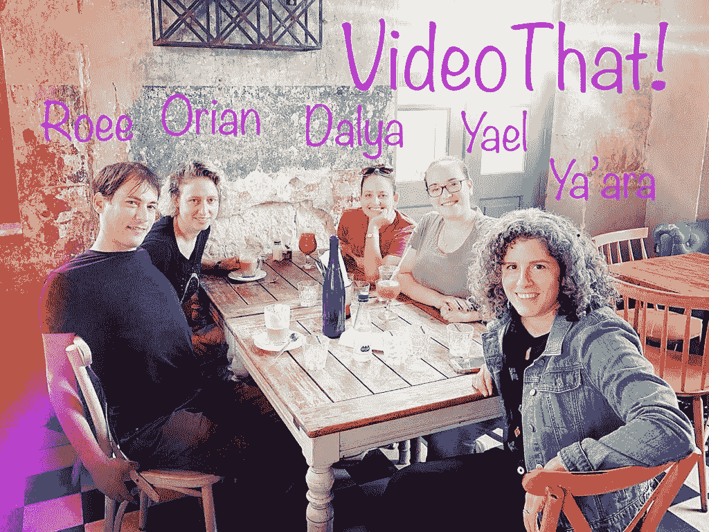

# 录像带！

> 原文：<https://towardsdatascience.com/https-medium-com-orian-sharoni-videothat-6849277c301b?source=collection_archive---------27----------------------->

## 自动为您的输入音频生成音乐视频

## 第二名 [DataHack](https://www.datahack.org.il/) 获胜者🥈，2019 年 9 月

[VideoThat](https://github.com/Sharonio/VideoThat) 会自动生成完美的视频剪辑，与你选择的主题曲完美契合。该算法的默认选择是从泰勒·斯威夫特的视频到北极猴子的歌曲创建一个视频剪辑。

[点击此处](https://www.meimadix.com/videos/videoThat_snippet.mp4)观看结果演示🎬

# 每个好的算法都需要一个用例

这是你最好朋友的婚礼，你想为他们做点什么。你召集了所有共同的朋友，录制了一首充满内部笑话和难忘故事的个人歌曲。一切都差不多准备好了！现在你所要做的就是手动编辑所有你需要的派对视频，使之与歌曲完美契合！

现在说什么？？

是的，听起来像是一个相当乏味的任务…嗯，幸运的是，不再需要手动操作了！

来救援了！

# 前提

这个项目的基本假设是，输入视频已经有一个完全适合它们的音频。因此，通过找到相关的音频模式，我们可以在视频片段和主题曲的音频片段之间进行匹配。

# 拍特征提取:光谱新颖性

我们的前提是，匹配源素材和目标歌曲之间的节拍将产生与目标歌曲配合良好的视频。问题是如何定义节拍匹配，我们的选择是尽量对齐尽可能多的音符开始。

当演奏一个音符时，直觉上，我们是在添加声音。量化这一点的简单方法是查看添加到信号中的能量(RMSE)。或者，用算法的术语来说，计算短时间窗内的能量，然后计算能量总量之间的差异(δRMSE)，并且只保留正值，因为我们在寻找音符开始(能量新奇)。

Audio and its corresponding RMSE, delta-RMSE and energy-novelty

如果我们一次只有一种乐器演奏一个音符，这种方法效果很好。幸运的是，在真正的音乐中通常不会出现这种情况，所以我们扩展了这一原理，通过查看不同频段的能量:如果我们在旧音符仍在逐渐消失的时候演奏一个新音符，我们可能会保持歌曲中的总能量不变，但新音符的频率更高或更低，所以我们现在能够检测到正在增加的能量。

Librosa 将这一逻辑打包到[lib Rosa . onset . onset _ strength](http://librosa.github.io/librosa/generated/librosa.onset.onset_strength.html)中，这为检测音符开始的任务提供了一个良好的信号。如果你想在聚会上玩得开心，你可以把它描述为计算半波整流光谱通量。

更多资源:[参考代码示例](https://musicinformationretrieval.com/novelty_functions.html)，【onset _ strength 的源代码

# 管道

在我们匹配输入视频片段和音频片段之前，我们首先需要找到这些片段…

使用 [scenedetect](https://pypi.org/project/scenedetect/) python 包可以自动分割视频。

然后，为了为手头的每个音频片段生成指纹，我们使用 [librosa](https://librosa.github.io/librosa/) python 包来发现[开始](https://librosa.github.io/librosa/generated/librosa.onset.onset_detect.html#librosa.onset.onset_detect)模式。

Spectral Novelty

## 评分功能或:如何将声音与场景最佳匹配

最后，我们以贪婪的方式工作，通过找到音频与主题曲中的下一个片段最相关的未使用的视频，将视频片段与主题曲匹配。为了计算相关性，我们使用了一个评分函数。

我们选择的评分函数是基于每个剪辑的频谱新颖性和目标歌曲的频谱新颖性之间的相关性。然而，选择原始相关性在实践中是一个糟糕的选择，因为频谱新奇度是一个非负量，这使我们偏向于较长的片段，因为即使节拍不匹配，它们也有更多的机会使音符对齐。

为了解决这个问题，我们可以通过将总相关性除以我们相关的剪辑的长度来查看相关率，或“每秒相关度”。这也不是最好的，因为它使我们偏向于完美对齐的短剪辑，而我们确实希望更长的匹配不是 100%准确的，以获得更令人满意的结果。

最后，我们选择使用一种平衡的方法，将相关性除以片段长度的平方根，这仍然偏向于较长的片段，但给了短而好的匹配一个战斗的机会:

Our scoring function

## 替代解决方案

你可能会问自己，为什么贪婪？一定有更好的方法来做这件事！确实有。事实上有**有**。很多更好的方法。正如您在下一节所看到的，这个项目时间很紧，快速成功是预期的结果。但是，我们确实尝试了一些不同的方法，并考虑了未来的方法:

## 更智能的搜索

贪婪搜索做出局部良好的决策，但可能是全局不佳的。解决这个问题的一个简单方法是使用**波束搜索**，以便考虑更多选项。另一种选择是使用不连续的搜索策略。例如，尝试找到全局良好匹配的剪辑(例如，“剪辑 7 匹配歌曲井的中间”)，然后填充剩余的空格。

## 更好的分数

有足够的空间来篡改分数(例如，从光谱新鲜感中减去少量，这样与沉默相比的音符将积极地惩罚分数，沉默上的沉默将增加分数)

# 在幕后

这个项目是在每年在耶路撒冷举行的名为 [DataHack](https://www.datahack.org.il/) 的 40 小时数据科学黑客马拉松(或者我们喜欢称之为数据科学的年度实地考察)中构思、诞生和成熟的，2019 年是第五届🤓

我们的团队是由以前随机的松散联系组成的，我们都抱着一种信念，希望这将是一场伟大的比赛。幸运的是，这种化学反应很快就显现出来了！我们度过了一段美好的时光，从“我们要做什么”到“天哪，这太棒了”再到“好了，这是我们应该采取的步骤”。''

为了展示 [VideoThat](https://github.com/Sharonio/VideoThat) 的能力，我们在 YouTube 上选取了[泰勒·斯威夫特](https://www.youtube.com/taylorswift)的前 30 个视频来代表我们的视频数据集，并且作为主题曲，我们选择了北极猴子乐队的“[我想知道吗](https://www.youtube.com/watch?v=bpOSxM0rNPM)”。

在这 40 个小时里，我们每个人都学到了很多东西，享受了交流想法的时光，进行了富有成果和深刻见解的谈话，实现了良好的工作生活平衡，甚至[获得了第二名](https://www.facebook.com/datahackil/photos/a.427954734076246/1196000310605014/?type=3&theater)！

Practicing work-life balance at a brunch during the hackathon

Winning 🥈

这是我们:

雅艾尔·戴赫斯[吉图布](https://github.com/yooli3) [LinkedIn](https://www.linkedin.com/in/yael-daihes/) 雅阿拉·阿金[吉图布](https://github.com/yaarasegre) [LinkedIn](https://www.linkedin.com/in/yaara-arkin-86706013/) 奥瑞安·沙罗尼[吉图布](https://github.com/Sharonio) [LinkedIn](https://www.linkedin.com/in/orian-sharoni/) 罗伊·申伯格[吉图布](https://github.com/shenberg) [LinkedIn](https://www.linkedin.com/in/roeeshenberg/) 达尔亚·加兹曼[吉图布](https://github.com/DalyaG) [LinkedIn](https://www.linkedin.com/in/dalya-gar/)

由 [Dalya Gartzman](https://medium.com/u/8cb8e88c4f51?source=post_page-----6849277c301b--------------------------------) 、 [Orian Sharoni](https://medium.com/u/3d4847f568f?source=post_page-----6849277c301b--------------------------------) 、 [Roee Shenberg](https://medium.com/u/f6d919af8841?source=post_page-----6849277c301b--------------------------------) 、 [Yaara Arkin](https://medium.com/u/b78663b78e1b?source=post_page-----6849277c301b--------------------------------) 和 [Yael Daihes](https://medium.com/u/2aa98abfade8?source=post_page-----6849277c301b--------------------------------) 撰写和编辑

This is here for a nice cover photo. infinite gear by Roee Shenberg

*原载于*[*https://www.meimadix.com*](https://www.meimadix.com/posts/videothat.html)