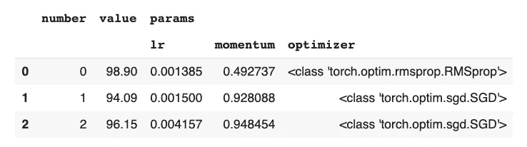
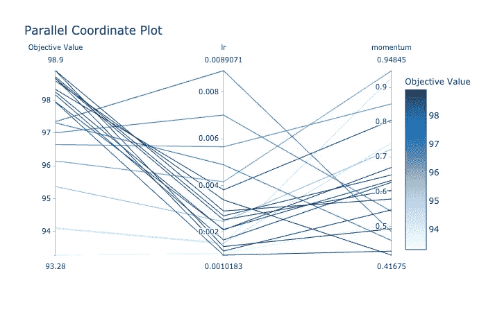
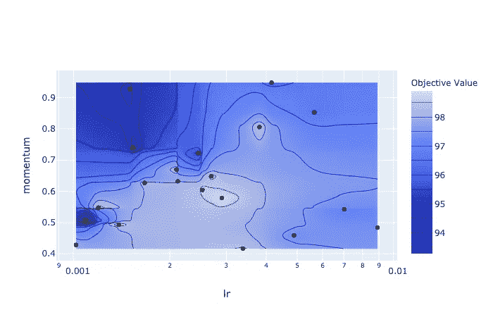
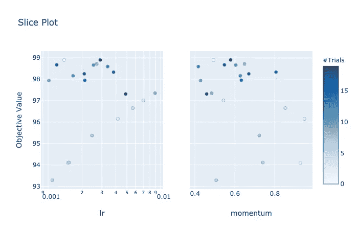
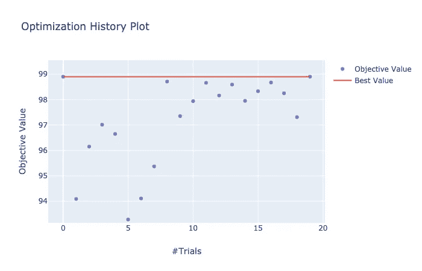

# 使用 Optuna 进行超参数优化

> 原文：<https://towardsdatascience.com/https-medium-com-perlitz-hyper-parameter-optimization-with-optuna-1c32785e7df?source=collection_archive---------13----------------------->

## 5 分钟指南

## 现在，为您的模型寻找最佳超参数变得轻而易举。

在这篇文章中，我们将采用一个简单的 pytorch 神经网络训练脚本，并使用[***Optuna***](https://optuna.org/)包(此处为文档)对其进行增强。这将允许将**智能** **超参数调整**和**试验修剪**轻松融入您的 ML 工作流，只需**最少的代码修改。**

就个人而言，寻找最适合我目标的超参数是我 ML 工作流程中最糟糕的部分。到目前为止，我的选择有两个:(1)牺牲我的时间和理智，使用优秀的老研究生血统，或者(2)实现一个复杂的框架来搜索参数空间，找到最佳值，记录和可视化过程。

好消息是:这样一个框架已经存在，它被称为 ***Optuna*** ，使用起来很简单也很有趣。

我们的起点是 Pytorch 教程中的 MNIST 分类脚本。为了完整起见，这里给出了完整的脚本，但是，由于其他部分都与我们的观点无关，我推荐**浏览所有部分，直到主函数。**

如果你想看代码的运行，下面是一个工作的 google colab 笔记本的链接。

 [## 谷歌联合实验室

MNIST·皮托尔赫光学公司](https://colab.research.google.com/drive/1TEILbIeyE1wW3daNWOx9rLq0Hc9TXmbV) 

现在让我们言归正传。

# 香草 MNIST 分类器框架

我们从导入和数据加载器开始:

接下来，我们实施网络:

`train`和`test`方法:

还有`main`功能:

注意，到目前为止，没有什么有趣的事情发生，只是一个简化的 pytorch MNIST 分类器脚本。用当前随机选择的超参数训练上述脚本 5 个时期将给出 93%的准确度。我们能做得更好吗？让我们看看…

# 用 Optuna 增强 MNIST 分类器框架

Optuna 框架(通过`pip install optuna`安装并作为`import optuna`导入)基于 ***研究*** 对象。它包含关于所需参数空间、采样器方法和修剪的所有信息:

研究创建后，搜索空间通过`trial.suggest_`方法合并。我们将这些嵌入到`train_mnist`配置中，这样这些值:

将替换为以下内容:

以这种方式，我们根据我们的需求定义搜索空间，一旦完成，`train_mnist()`应该得到`trial`作为它的输入，并被定义为`train_mnist(trial)`。请注意，存在允许`train_mnist`具有除`trial`之外的输入的配置，如果您遇到这种需要，请检查[这个](https://optuna.readthedocs.io/en/latest/faq.html)。

# 最佳化

最后一步是定义一个目标函数，其输出将被优化。在我们的例子中，我们选择`train_mnist`及其输出，即*测试误差*。

因此将调用`study.optimize`，以`train_mnist`作为其参数:

总而言之，由对`train_mnist()`的单一调用组成的`main`，已经变成了:

就是这样！一旦这些行被添加到代码中，优化器将根据采样器对定义的参数空间进行采样。

优化完成后，可以通过`study.trials_dataframe`以数据帧的形式访问结果:

输出如下:

人们可以看到所有的试验和它们的价值。为了找到最佳试验最佳参数，也可以使用`study.best_trial`和`study.best_params`。

在这里，我们还可以看到其中一个结果如何在相同的训练数据量和时间下获得 98.9%的测试误差(约 6%的改进)，这是对 3 行代码的重大改进。

# 形象化

除了向您展示参数的最佳配置，Optuna 还有助于可视化物镜对参数的依赖性。给定研究对象，各种可视化工具存在于`optuna.visualization`中。您可以调用`plot_parallel_coordinates(study)`查看参数(本例中为 lr 和动量)和目标之间的相关性:

另一种获得直觉的方法是使用等高线图。这可以通过调用`plot_contour(study)`来产生:

为了完成画面，还可以通过调用`slice_plot(study)`产生切片图。这有助于理解每个参数的最佳子空间分别位于何处。

最后一个可视化选项是由`plot_optimization_history(study)`生成的研究历史。这将呈现以下情节:

这显示了 Optuna 的研究是如何进行的，首先对空间进行均匀采样，然后聚焦于最有希望的区域。

最后，我希望你喜欢这篇教程，我遗漏了几个很棒的特性，比如早期修剪和不同的搜索算法，这些将不得不等到下次。如果我激起了你的兴趣，请查看伟大的 [Optuna 文档](https://optuna.readthedocs.io/en/stable/tutorial/index.html)，都在那里。

尽情享受吧！

[1]注意，在这篇文章中，为了简洁起见，我犯了一个可怕的错误:人们应该**永远不要**优化测试集，因为它会过度拟合测试数据！更好的方法是将训练集分成*训练*和*验证*，但是因为这不是本文的主题，所以我决定保持原样。