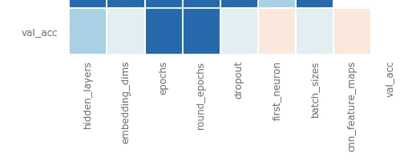
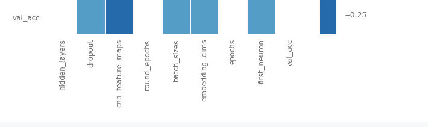
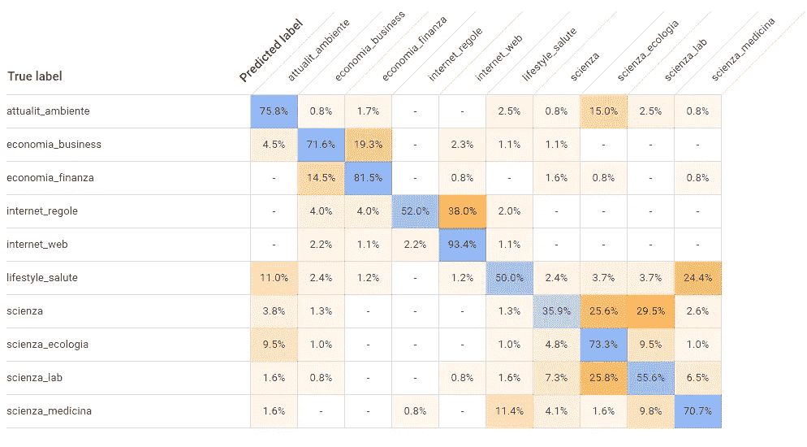

# 自动文本分类的最佳方法是什么？

> 原文：<https://towardsdatascience.com/https-medium-com-piercarlo-slavazza-what-is-the-best-method-for-automatic-text-classification-a01d4dfadd?source=collection_archive---------9----------------------->

Photo by [Franki Chamaki](https://unsplash.com/@franki?utm_source=medium&utm_medium=referral) on [Unsplash](https://unsplash.com?utm_source=medium&utm_medium=referral)

自动文本分类任务包括自动将文档分配给一个或多个成员类别。

在许多情况下，这是一项基本任务。

例如，在社交媒体监控中，有必要将与某个“品牌”相关的推文分类为正面*意见*或负面*意见*。

或者，在搜索引擎的情况下，如果索引文档根据它们所涉及的主题进行分类，就有可能大大提高它们的准确性，这样用户就可以更容易地识别感兴趣的文本。

自动文本分类任务可以通过由“领域专家”或机器学习系统明确定义的“规则系统”来实现。

机器学习(ML)是一种理想的解决方案，在这种情况下，已经有足够大的一组先前分类的文本可用，即所谓的“训练语料库”:语料库被提供给 ML 系统，该系统自主地“学习”什么是分类文档的最佳策略。

另一方面，规则系统的实现和维护通常更昂贵，因为需要“领域专家”的介入，这通常必须形式化不成文的、非单义的或模糊的规则:因此，当没有足够的训练语料库*可用时，通常使用规则系统。*

在本文中，我们将重点关注基于机器学习的自动文本分类系统，我们将比较一些系统，并试图了解哪一个是最好的，或者至少在选择系统时可以遵循的“最佳实践”是什么。

我已经处理机器学习很长时间了，多年来我认为 SVM(即支持向量机)是自动文本分类任务中最有效的 ML 工具之一。

像大多数人工智能从业者一样，我怀着极大的兴趣关注着“深度学习”作为人工智能选择范式的进步和普遍的肯定(关于“深度学习”兴起的简要而准确的总结，可以看看这篇关于神经网络“之父”之一杰弗里·辛顿教授在谷歌 I/O 2019 上接受采访的伟大文章[。](https://medium.com/syncedreview/google-i-o-2019-geoffrey-hinton-says-machines-can-do-anything-humans-can-460dff834ae2)

那么，对于自动文本分类任务，深度学习会比 SVM 更有效吗？

显然，除了 SVM 之外，还有许多其他方法，但是，根据我的经验，一般来说，对于 SVM(就整体准确性而言)没有实质性的区别。正是利用深度学习在几个领域取得的令人印象深刻的进展，让我想知道后者是否能明显优于 SVM 及其同类。

因此，这篇文章的结构是关于自动文本分类任务的 SVM 和深度神经网络(DNN)之间的(非详尽)比较的报告。

# 1.实验设置

我决定使用意大利语文本语料库来进行这个比较“实验”;在我的专业活动中，我几乎只处理意大利语文本，并且考虑到使用英语的自然语言处理(NLP)工具通常更容易，所以在意大利语语料库上进行比较对我来说很重要，这样我可以立即检查该语言的具体问题。我希望这种方法可以对所有处理非英语文本的 ML 从业者有用。

## 1.1 语料库的选择和任务要求

据我所知，没有真正“开放”的意大利语文本语料库可以用来训练和评估自动文本分类器。

因此，我决定创建一个。

《连线》杂志意大利版的文章是以知识共享许可的形式发布在网络上的:所以我决定使用这些文本来创建所讨论的语料库。

wired.it 文章按“主题”分类:文章主题显示在标题之前。例如，标题为“Tutti I limiti Dell ' intelligenza artificial e”的[文章](https://www.wired.it/attualita/tech/2018/07/31/limiti-intelligenza-artificiale/)被分类在网站的`Attualità > Tech`部分(即`News > Tech`)。

每篇文章都有一个主题，主题分为两个层次。有些文章可能被列在“高级”主题中，例如直接列在`Attualità`；但是由于层次结构只有两个级别，我更喜欢将任务定义为多类分类任务(即，每个文档被分配一个类，由给定的集合选择)——并且我相应地建立了语料库。

除了这些层次方面之外，很明显，在单个部分中对每篇文章进行编目(从出版者的角度来看是一个合理的选择)，并考虑这些部分的类型(我们将很快看到)，将导致类之间的“*语义重叠*”，这不利于上游的任何 ML 算法。因此，*我不认为这个语料库可以允许训练高性能的分类器*——不管使用什么 ML 算法。无论如何，这个限制与我们的目的无关，我们的目的主要是在不同方法之间进行比较。

尽管如此，为了不遗漏任何可能性，我也对其他非公开语料库进行了类似的评估(在我与 [KIE](http://www.kie-services.com/en/) 的职业活动期间使用，我是该公司的首席技术官)，我将偶尔报告其中的一些摘要信息。

评估将使用 precision/recall 和 F1 作为衡量标准(通常为“宏平均”)，这是最适合此任务的衡量标准。

总结一下:

*   我们将处理“多类”文本的自动分类任务
*   文集是意大利语的
*   语料库由 wired.it 意大利版的文章组成，按章节/主题分类

## 1.2 wired . it 语料库

语料库是通过使用 Scrapy 工具爬行 wired.it 创建的。爬虫代码可以在 GitHub [wired-it-scraper](https://github.com/PiercarloSlavazza/wired-it-scraper) 项目中找到。

我制作了两个版本的语料库:

1.  一个 JSON 文件，其中列出了每篇文章的相关元数据(类别、标题、URL、版权、文本)，可以从[这里](https://github.com/PiercarloSlavazza/wired-it-scraper/blob/master/corpora/wired_it_articles_20190821.json.bz2?raw=true)下载
2.  文件系统上的语料库的布局，其中使用文件夹的名称将文章分成训练集和测试集，然后总是通过文件夹的名称将文章分成类；这种“布局”将允许以简单的方式将语料库加载到 ML 训练系统中；这个文集可以从[这里](https://github.com/PiercarloSlavazza/wired-it-text-classification-ml/blob/master/corpora/wired_it_20190821.tar.bz2?raw=true)下载

下面是课程以及每个课程的培训和测试文档数量的汇总表:

# 2.SVM

## 2.1 简介

支持向量机是一种 ML 方法，它从给定向量空间中表示的一组训练数据开始，找到划分这两个类别的最佳超平面，其中“最佳”意味着最佳概括的超平面，这意味着它以最大可能的幅度划分两组数据。

支持向量机可以解决非线性分类问题:使用“核”函数将数据映射到具有更大维数的向量空间，从而可以将原始问题重新定义为具有线性可分性特征的问题。

因此，为了将 SVM 应用于自动文本分类任务，需要定义代表文档的“特征”；我们将如下进行:

1.  语料库的 NLP 预处理——需要实现所需的维度缩减，并允许更好的泛化
2.  特征提取:我们将使用 [TfIdf](https://en.wikipedia.org/wiki/Tf%E2%80%93idf)
3.  以所选 SVM 工具支持的格式导出矢量表示，即 [LibSVM](https://www.csie.ntu.edu.tw/~cjlin/libsvm/)

## 2.2 语料库的自然语言处理预处理

我继续执行语料库的 NLP 预处理步骤，使用 [Apache OpenNLP](https://opennlp.apache.org/) ，采用为意大利语训练的[模型，并以 Apache License Version 2 发布。](https://github.com/aciapetti/opennlp-italian-models)

NLP 预处理管道包括:

1.  分割
2.  标记化
3.  词性标注
4.  按位置标签过滤
5.  堵塞物

我发布了一个开源项目，它实现了各种提到的步骤的执行，并且还实现了后续的特征提取过程:这个项目叫做 [java-ml-text-utils](https://github.com/PiercarloSlavazza/java-ml-text-utils) 。这个工具也可以用于意大利语以外的语言(尽管目前它需要一些最小的定制)。

说明可以在项目“自述”中找到:

*   要为意大利语以外的语言自定义库
*   来执行各种预处理步骤，以及我们将在后面看到的为 ML 更新准备素材的其他实用程序

## 2.2 特征提取

我决定用传统的 TfIdf 作为特性；在过去，我试验过 SVM 其他类型的特征(例如单独的 Tf，用 SVD 实现的主题模型，领域语言特征，名词短语)，但是 TfIdf 总是提供更好的结果。

使用前面提到的工具 [java-ml-text-utils](https://github.com/PiercarloSlavazza/java-ml-text-utils) 提取特征。

为了限制计算复杂性，特征的向量空间的维数被限制为 10000 项。

## 2.3 导出到 LibSVM 格式

再次使用 java-ml-text-utils，语料库最终以 LibSVM 格式导出。

## 2.4 分类器的训练

使用 [LibSVM 工具](https://www.csie.ntu.edu.tw/~cjlin/libsvm/)训练分类器。

我遵循了教程“[支持向量分类实用指南](https://www.csie.ntu.edu.tw/~cjlin/papers/guide/guide.pdf)”中指出的方法，我个人认为这非常有效。

这种方法包括以下步骤:

1.  数据缩放
2.  超参数网格搜索“RBF”内核的最佳“ *C* ”和“ *γ* ”参数
3.  用找到的最佳参数训练分类器
4.  测试集上分类器的评估

对于 wired.it 语料库，按照这个过程，我获得了大约 0.59 的“宏观平均”F1。

结果不出所料:只有 10%的班级 F1 大于 0.8。

以下是详细的结果，其中:

*   `TP`表示“真阳性”
*   `FP`表示“误报”
*   `FN`意为“假阴性”

# 3.深度学习

## 3.1 Keras 和 Tensorflow

对于神经网络训练，我选择使用 Keras，带有 Tensorflow 后端。Keras 编程 API 是稳定的，并且有很好的文档记录，软件生态系统是有营养的，并且有许多可用的资源——例如教程，但是特别是可以容易地重用的网络架构的定义。

## 3.2“扁平”神经网络

我决定从一个基本上“扁平”的神经网络开始，没有“隐藏”的层次。

使用 Keras，很容易构建一个基本的记号赋予器；为意大利语获得适当的 NLP 预处理似乎并不简单，但是这种限制由于文本可以通过单词嵌入来表示的额外的简单性而减轻了:您可以在网络架构的定义中指定它。

因此，我们的第一个网络构成如下:

1.  输入是每个文本的前 N 个单词(带有适当的填充)
2.  第一级使用具有特定维度和给定嵌入大小的词汇来创建单词嵌入
3.  之后，对嵌入维度应用“平均池”
4.  最后，输出级具有与问题类别相等的神经元数量和“softmax”激活函数

你可以在项目[wired-it-text-class ification-ml](https://github.com/PiercarloSlavazza/wired-it-text-classification-ml)中找到完整的笔记本[这里](https://github.com/PiercarloSlavazza/wired-it-text-classification-ml/blob/master/src/main/python/wired_it_tensorflow.ipynb)(漂亮的印刷[这里](https://nbviewer.jupyter.org/github/PiercarloSlavazza/wired-it-text-classification-ml/blob/master/src/main/python/wired_it_tensorflow.ipynb))。

我们需要设置一些基本参数:

*   词汇大小——即用于表示文本的最大术语数量:例如，如果我们将“词汇”的大小设置为 1000，则只考虑语料库中最常见的前 1000 个术语(其他术语将被忽略)
*   文本的最大长度(长度必须相同)
*   嵌入的大小:基本上，我们拥有的维度越多，语义就越精确，但是超过某个阈值，我们将失去嵌入定义一个连贯和足够通用的语义区域的能力
*   网络的训练时期数

我们首先尝试“手动”探索这些超参数的空间:

我们使用这种配置获得了 0.62 的 F1 宏，这在目前看来是最佳配置:

*   词汇量:30000
*   文本的最大长度:1000
*   嵌入尺寸:200
*   训练时期:40

增加或减少这些设置似乎会更糟，或者无论如何不会提高 F1 的分数。

使用 LibSVM 时，我们获得了 0.59 F1(宏)的结果:因此，使用 0.62，DNN*提高了*的性能，即使增加的幅度不大，因此，一般来说，我宁愿认为这是“平局”的结果。

## 3.3 深网和回旋

我们取得了一个很好的结果，但“深度学习”的点恰恰在“深”，即在网络内部增加层次，提高“表示”某个实体“语义”的能力的思想。换句话说，每个内部层应该——直观地说——创建一个比前一层更“抽象”和“高级”的表示。

因此，让我们尝试，可以说是天真地尝试，添加一个单一的内部级别，就像这样:

采用上一步中的最佳参数，我们得到的 F1 宏的**为 0.41** :比用“琐碎的”扁平网络得到的 **0.62** 差得多！

但是还有另一个方面需要考虑。

从 Yoon Kim 的 2014 年文章"[卷积神经网络用于句子分类](https://arxiv.org/abs/1408.5882)"开始，人们普遍认为"[卷积](https://en.wikipedia.org/wiki/Convolutional_neural_network)"层允许在文本分类任务的上下文中显著提高 DNN 的性能。理论上的原因是卷积能够捕捉连续单词(或嵌入)的“窗口”上表达的语言“模式”。

因此，让我们尝试添加一个“卷积”层:

我们得到 0.52 的 F1 宏:比只有内部“密集”层的试验性宏好，但比“平坦”网络差。

然而，考虑到我们可以插入任意数量的层，每个层具有不同数量的神经元，具有卷积的层又具有一些要设置的参数(输出维度的数量和激活函数)，并且这些架构参数与前一步骤中探索的超参数(以及我们目前尚未改变的其他参数)相结合，通过“手动尝试”来探索搜索空间变得非常大和复杂。

有没有一种更有效、更详尽的方法来尝试理解架构和参数的最佳组合？

## 3.4 超参数优化

和 SVM 一样，dnn 也有“最佳实践”和库，允许您系统地探索超参数空间。

我决定尝试一下 [Talos](https://github.com/autonomio/talos) ，这是一个 Python 库，还附带了一篇由[Mikko](https://medium.com/u/415c7038aba8?source=post_page-----a01d4dfadd--------------------------------)(Talos 的作者)撰写的[文章](/hyperparameter-optimization-with-keras-b82e6364ca53)，这篇文章做得非常好，就如何进行操作给出了极好的建议。

这不是一个完全自动的过程:

*   有必要预先定义哪些是我们想要“探索”的参数，哪些是可能的值
*   在一个“扫描”周期(可能是穷尽的，或者为了提高操作效率，可能是部分的)结束时，必须对结果进行分析，并决定集中在搜索空间的一个更受限制的“区域”上，然后反复进行，直到找到满意的组合

因此，让我们定义一个可以传递给 Talos 的“参数化”网络:

我们将它定义为一个接受输入训练和验证集的函数，以及一个参数映射:Talos 将通过调用该函数生成各种网络。

因此，我们将要“探索”的参数是:

*   嵌入:大小
*   隐藏层:形状、数量、大小、激活、缺失
*   卷积:过滤器数量
*   训练:优化、时期、训练批次的大小

我们只将训练集用于扫描，然后 Talos 将使用它来创建训练和验证的示例。

让我们对搜索空间的一个非常小的区域进行第一次“快速”扫描:1%的样本。这第一步将让我们开始“定位自己”。

我们将可能的参数值设置如下:

第一次执行给出了极高的验证准确度值，但是我们在这个阶段感兴趣的是(正如相关的[指南](/hyperparameter-optimization-with-keras-b82e6364ca53)所建议的)理解哪些参数对任务影响最大。

因此，我们通过 Talos 呈现了与“验证准确性”相关的“可视化”映射:

其中，颜色根据此标度定义相关性:

因此，有人会说，最好关注:嵌入维度(对已学内容的确认)、卷积特征的数量、内部层级神经元的数量、批量大小、漏失。相反，似乎不值得有一个以上的内部级别，并且限制到几个训练时期更有效(这与前面步骤中发生的情况相反，但是，为了快速获得指示，我们仍然可以尝试)。

然后，我们用这些参数设置第二次执行:

我们增加采样率，并且我们最终获得新的相关矩阵:

这种新的执行似乎没有给出非常重要的信息——甚至可能与迄今为止所取得的成就形成对比:也许我们可以掌握的唯一线索是增加卷积的特征图仅在某个最大阈值时起作用。

让我们通过进一步提高采样率来进行最后一次扫描，并检查 115 个可能的参数组合。

我们得到的最佳结果如下:

因此，让我们尝试使用这些参数和架构创建一个网络，并验证其性能:

在 40 次训练之后，我们得到了 0.48 的 F1 宏:一个非常令人失望的结果。

为了完整起见，让我们简单地尝试删除内层——我们之前观察到这是性能下降的原因:我们得到 0.50 的 F1 宏。

为了完整起见，让我们只尝试 10 个训练周期:另一方面，这是用 Talos 进行的优化所建议的参数。我们得到 F1 为 0.53:Talos“发现”的纪元值实际上是最佳建议。很明显，这种体系结构容易过度适应，因此最好限制电子逆向拍卖的次数。

作为最后一个测试，让我们尝试恢复内部“密集”层，并用 10 个时期进行训练:我们得到 0.52 的 F1，比用 40 个时期获得的 0.48 好，但比没有内层获得的 0.53 稍差。

简而言之，使用 Talos 进行的研究似乎证实，比简单的“平面”网络更复杂的网络根本无法达到后者的性能。

然而，Talos 虽然是一个非常有效的工具，但并不容易使用:所以我仍然希望有机会做得更好。

# 4 自动化机器学习

因此，SVM 和带有嵌入的“扁平”神经网络看起来是一样的——带有 DNN 显示的轻微扇形。

目前是否有其他解决方案可以为这项任务提供更好的性能？一种我没有考虑过的建筑，甚至是一种不同于 DNN 的学习方法？

我认为找出答案的最佳方式是使用[谷歌云自动 NLP](https://cloud.google.com/natural-language/automl/docs/beginners-guide) 服务(我从各种其他类似服务中选择了该服务，例如 [H2O 无人驾驶人工智能](https://www.h2o.ai/products/h2o-driverless-ai/)或 [MokeyLearn](https://monkeylearn.com/text-classifiers/) )来检查“基线”。

自动机器学习(或简称为 AutoML)是一种定义 ML 模型的方法，旨在建立一种“端到端”的解决方案，对我们看到的所有复杂且没有通用“配方”的决策承担全部责任。

用户只需要生成数据集(这在任何情况下都是一项重要的任务……):然后，系统承担识别最佳算法(不一定是 DNN)以及寻找最佳超参数的任务。

有了 Google Cloud AutoML，我们可以用这种非常简单的方式进行:

1.  这些文本被加载到谷歌云存储桶中
2.  使用 java-ml-text-utils 工具，您可以导出 CSV 格式的语料库，以供 Google Cloud AutoML 解释
3.  训练开始

CSV 表明:

1.  文档的 URI(它必须在先前加载到存储中的文档中)
2.  相关类的标签

Google Cloud AutoML 自动生成训练集和测试集(更准确地说，它还需要生成一个“验证”集)。

为了获得更好的可比较结果，我们还在 CSV 中导出了我们的语料库的训练集和测试集之间的细分，还添加了验证集(我将其设置为训练集的 10%)。

网络培训大约 3 个小时，费用大约 10 欧元:非常便宜！

结果以精确度和召回率的形式提供。从可以推断的情况来看，结果是微观平均的。

我们可以立即检查“混淆矩阵”，这非常方便，即使只列出了类的子集:

正如所料，混淆矩阵清楚地显示了一些类别对是如何特别模糊的，例如:

*   `Attualiaà > Ambiente` 对`Scienza > Ecologia`
*   `Economia > Business` vs `Economia > Finanza`
*   `Internet > Regole` vs `Internet > Web`
*   `Scienza` vs 两个子类，`Scienza > Ecologia` e `Scienza > Lab`
*   `Lifestyle > Salute` vs `Scienza > Medicina`

在评估时，需要设置一个“分数阈值”，该阈值允许系统将某一类的归因的“排名”变成实际的赋值(“分数阈值”由系统赋予默认值)。

显然，改变分数、精确度和召回率会相应地改变:这个特性允许您理解模型如何根据与任务最相关的度量表现。

在我们的例子中，我们只是设置分数，以使精度尽可能接近其他实验中获得的精度:这样，我们获得的 F1 为 **0.6** (微平均)，而 DNN 和 SVM 分别获得 0.62 和 0.58。

因此，结果与迄今为止已经取得的成果完全一致:DNN 给出的结果完全可以与 SVM 相媲美(或许略好)，Google Could AutoML 证实，在这个语料库上，这一结果可能是所能取得的最好结果。

我在进行类似实验的其他语料库中也得出了同样的结论。

# 5.有可能用简单的方式解释为什么 SVM 和 DNN 如此相似吗？

让我们从回顾文献中关于自动文本分类任务的性质的陈述开始。

据说，考虑到向量空间的大量特征/维数，该问题通常是线性可分的(如在前面提到的 LibSVM 教程中所报告的)。在过去的实验中，我们发现 RBF 核可以给出比完全不使用任何核稍好的结果——但我们可以认为这些差异是可以忽略的优化。

为了试图找到这种说法的直观解释，我们可以将维度视为“视点”，通过它我们可以观察 n 维空间中的对象。在文本的情况下，这些“观点”是如此之多(大约数千个),以至于总是有可能(与数据集的“质量”兼容)找到一种方法在属于一个类的文档和不属于该类的文档之间“插入”一个超级计划。

另一方面，在 DNN 的例子中，我们必须问自己——从数学上而不是从“隐喻”上——到底是什么“计算”了网络的某一层。

当然，有很多文献使用数学模型准确地描述了神经网络。[然而，这篇文章](https://colah.github.io/posts/2014-03-NN-Manifolds-Topology/)提供了一个有趣的观点，可以以更直接的方式访问，并且具有非常清晰的图形显示:据说神经网络的各个级别的功能可以理解为一系列旨在修改输入的转换，以便数据将变得线性可分。因此，作案手法与 SVM 相似:

1.  尝试转换数据，使它们可以线性分离——在 DNN 的情况下，通过添加内部级别，在 SVM 的情况下，通过应用核函数(精确地说，将数据投影到一个具有更多维度的空间中)
2.  然后找到划分数据的最佳超平面(“最佳”是指它概括了“更好”，避免了最有可能的对训练数据的过度拟合)

由此可见，假设文本的自动分类问题意味着线性可分性，向 DNN 添加内部级别不会改善网络的结果。

大概，我认为这就是为什么 SVM 和 DNN 在自动文本分类任务上没有表现出实质性差异的原因。

# 6.那又怎样？

那么，如果对于自动文本分类来说，SVM 和 DNN 的任务似乎具有完全可比的性能(在理论上和实践中)，如何在两者之间进行选择呢？使用其中一种有什么好处吗？

## 6.1 训练速度

在所使用的设置中，SVM 分类器的训练——包括超参数的网格搜索(在我的体验中是不可或缺的)——在一台采用 6 核(12 线程)英特尔 i7–8750h 的笔记本电脑上的多线程中花费了整整 42 个小时。

性能相似的神经网络可以在大约 2.5 分钟内训练完成(总是在同一台笔记本电脑上，其上安装了 Nvidia GeForce GTX 1060 卡)。

然而，公平地说，LibSVM 为文本分类提供了一些特别优化的替代方案: [LibLinear](https://www.csie.ntu.edu.tw/~cjlin/liblinear/) 和[多核 LibLinear](https://www.csie.ntu.edu.tw/~cjlin/libsvmtools/multicore-liblinear/) 。我还没有机会尝试他们的语料库，但我认为他们很难比 DNN 训练得更快。

## 6.2 NLP 预处理复杂性

语料库的预处理是非常复杂的:它包括 NLP 部分(分割、标记化、词性标注、词干提取)和特征提取部分(在我们的例子中是 TfIdf)。

根据我的经验，NLP 预处理部分通常是必要的，但是逐例检查它对整体性能的贡献是值得的。

然而，特征提取部分仍然必须进行，因为它显然是不可缺少的。

另一方面，在 DNN 的情况下，这些准备步骤是不需要的:

1.  NLP 预处理不是必需的:在这方面已经使用 NLP 预处理的语料库进行了测试，并且与使用没有 NLP 预处理的语料库训练的结果相比，训练的 DNN 的结果没有给出优势
2.  特征提取隐含在第一级嵌入中，并且是网络架构本身的一部分

## 6.3 谷歌云汽车

因此，使用性能相同的 DNN 似乎比 SVM 更“经济”和简单。

另一方面，使用 Google Cloud AutoML，总是具有相同的性能，结果证明甚至比 DNN 更简单——特别是因为在训练分类器后，会自动创建一个 REST 端点来计算预测。

# 7.结论和可能的改进

## 7.1 获胜者是…

在我看来，目前实现自动文本分类任务的最强大、最简单和最廉价的方法是 *Google Cloud AutoML* 。

如果 Google Cloud AutoML 不是一个可行的选项(可能是出于战略原因，或者因为使用了真正敏感的数据)，使用具有嵌入功能的 DNN“平台”(可能是用 Keras / Tensorflow 实现的)是最好的替代可能性。在某些情况下，DNN 也可能提供比谷歌云 AutoML 略好的结果。

如果使用 Google Cloud AutoML 由于战略原因不可行，我仍然建议使用它来定义当前项目的“基线”。

关于 AutoML 方法，我也建议测试替代平台——如 H2O 无人驾驶人工智能和 MonkeyLearn。

## 7.2 可能的改进

在这个简短的调查中，一个缺失的部分可以在 DNN“迁移学习”实践中找到；在感兴趣的任务的特定情况下，目前最有前途的方法在于使用基于 BERT 的模型:这些是预训练的嵌入模型，能够基于单词使用的上下文来辨别单词的语义。然而:

*   理论上，数据集越小，它们就越有用:在我们的例子中，数据集已经足够大，但我不能排除预先训练的模型仍能带来优势
*   然而，最大的障碍是(据我所知)没有一个预先训练好的意大利语模型:因此，我应该安排训练一个，例如按照本文[文章](/pre-training-bert-from-scratch-with-cloud-tpu-6e2f71028379)中描述的步骤，其中展示了如何为俄语训练一个 BERT 模型。还有[BERT“multi-language”](https://github.com/google-research/bert/blob/master/multilingual.md)模型，但是，由于其目的是能够在某个应用程序中管理用不同语言编写的文档，所以它们对于与各种语言相关的应用程序不是很有效。

可以更好地探索的其他方法是那些与 AutoML 和超参数优化的其他库相关的方法，例如:

*   Talos 本身有一个 AutoML 特性，允许您探索不同网络架构的效率
*   [AutoKeras](https://autokeras.com/)
*   谷歌的 [Adanet](https://ai.googleblog.com/2018/10/introducing-adanet-fast-and-flexible.html)
*   [kopt](https://github.com/Avsecz/kopt)
*   [Hyperas](http://maxpumperla.com/hyperas/)