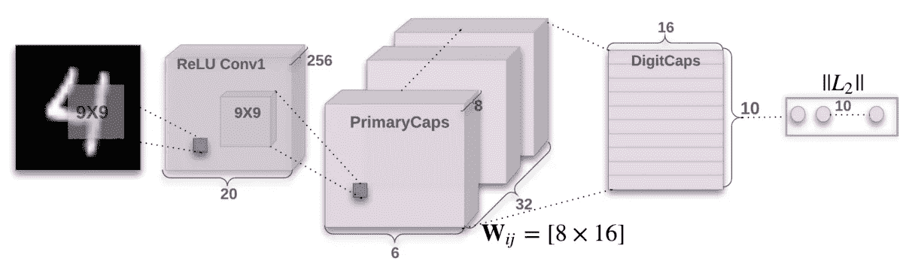

# 我们解决了手写识别的问题了吗？

> 原文：<https://towardsdatascience.com/https-medium-com-rachelwiles-have-we-solved-the-problem-of-handwriting-recognition-712e279f373b?source=collection_archive---------3----------------------->

## [内部 AI](https://medium.com/towards-data-science/inside-ai/home)

## 深度学习能够以 99.73%的准确率识别文本。我们将何去何从？

深度学习已经被广泛用于识别笔迹。在**离线手写识别**中，文字在被书写后被分析。唯一可以分析的信息是背景中字符的二进制输出。虽然向数字手写笔的转变提供了更多的信息，如笔画、压力和书写速度，但当无法在线时，仍然有必要使用离线方法。这对于历史文件、档案或手工填写表格的大规模数字化尤为必要。

对这一领域的广泛研究已经导致了从经典方法到人类竞争性能的重大进展。这篇文章是对这一旅程的概述，以及该领域的潜在未来。

# 在深度学习之前，有 ocr

邮件分类首先需要手写文本分类器。使用扫描设备，硬连线逻辑识别单倍行距字体。1974 年，Ray Kurzweil 开发了第一款光学字符识别(OCR)软件。通过减少问题域，流程更加准确。这允许手写形式的识别。首先，它缺乏 efficiency 和意想不到的人物的知识。这些经典技术在两个关键领域有很大的局限性:

*   **字符提取** —通过 OCR 轻松识别单个字符。草书笔迹，这是相连的，提出了更多的问题与评估。这是 difficult 解释笔迹没有明显的字符之间的分离。
*   **特征提取** —符号的个别属性被硬编码，并与输入符号匹配。属性包括纵横比、像素分布、笔画数、距图像中心的距离和反射。这需要开发时间，因为这些属性是手动添加的。

OCR methods fail with cursive handwriting.

# 使用神经网络

神经网络能够通过分析数据集来学习特征，然后根据权重对看不见的图像进行分类。[关于神经网络的精彩介绍可以在这里找到](/machine-learning-for-beginners-an-introduction-to-neural-networks-d49f22d238f9)。在卷积层中提取特征，在卷积层中，核通过图像来提取某个特征。最终结果是，多个内核学习数据集内的所有特征，以便进行分类。这解决了 OCR 方法中的特征提取问题。

此外，在数据库上使用神经网络，而不是传统方法，意味着不需要手动硬编码。相反，参数是在训练过程中学习的。这使得深度学习方法对手写风格的变化更具弹性，并缓解了传统方法中特征提取的挑战。然而，输出精度强烈依赖于训练过程中使用的数据集的质量和完整性。

MNIST 数据库的建立推动了使用神经网络进行手写识别的研究。该数据库包含 70，000 个手写数字，自 1998 年以来一直用于深度学习。在 [LeCuns 的开创性论文中，](http://vision.stanford.edu/cs598_spring07/papers/Lecun98.pdf)通过引入手写神经网络而引起了关注。使用 LeNet-5，并扭曲 MNIST 数字，错误率立即达到 0.7%，这是对经典方法的巨大改进。

Examples of digits from the MNIST database. Image via [https://www.oreilly.com](https://www.oreilly.com/)

除此之外，神经网络甚至被用于分类看不见的字母。这意味着，模型可以通用于任何语言，并且不需要在特定的字符数据库上进行训练，例如 MNIST。 [Graves 对一个看不见的阿拉伯文字](http://papers.nips.cc/paper/3449-offline-handwritingrecognition-with-multidimensional-recurrent-neural-networks.pdf)产生了 91.4%的准确率。

卷积神经网络(CNN)的使用在 2011 年达到顶峰，当时 Ciresan 分析了笔迹，实现了 0.27%的微小错误率。为此，七个深度 CNN 训练了相同的数据分类器，以 different 方式进行预处理。硬件的进步使这变得更容易实现，强大的 GPU 可以有效地处理深度学习任务，现在已经在社区中广泛使用。误差尽可能 differed，并且输出被平均。结果可与类似人类的性能相媲美。

The formation of CNNs used by Cisresan et al. to achieve 0.27% error rate. Image from [https://ieeexplore.ieee.org/document/6065487](https://ieeexplore.ieee.org/document/6065487)

可以说，经典方法确定的两个问题已经解决了。神经网络可以识别任何字母、任何风格的任何笔迹。《纽约时报》已经在利用这项技术来修复他们档案中的旧印刷品。[罗氏每天分析数 Pb 的医疗 pdf 文件](https://aws.amazon.com/textract/customers/)，以加速医疗保健领域的管理。下一步是什么？

# 介绍顶网

对胶囊网络(CapsNets)的新兴研究导致了该领域的进一步发展。作为机器学习解决方案的另一种方法，CapsNets 的[介绍展示了手写识别改进的未来。尽管 CapsNets 在现场还相当新，但它的应用正开始加快步伐，并解除了 CNN 的一些限制。](/capsule-networks-the-new-deep-learning-network-bd917e6818e8)

CapsNets 在许多方面改进了 CNN 的结果，特别是以下方面:

1.  **减少使用 CNN 方法发现的空间变化**的影响。
2.  **减少训练所需的数据量**。

在细胞神经网络中，不同核的空间差异是一个突出的问题。为了使用 CapsNets 解决这一问题，用于确定特征的核在动态路由的帮助下一起工作，以组合多个组(胶囊)的个体意见。这导致内核之间的[等方差，与 CNN 相比极大地提高了性能。](https://arxiv.org/pdf/1901.00166.pdf)

Am example of CapsNets architecture. Image via [https://medium.com/@pechyonkin](https://medium.com/@pechyonkin/part-iv-capsnet-architecture-6a64422f7dce)

为了最有效地使用 CNN 进行手写识别，有必要拥有包含手写字符的大型数据集。数据集需要很大，因为模型需要学习大量的变化，以适应不同的手写风格。CapsNets 有助于减少所需的数据量，同时仍然保持高精度。例如，[最近的一个团队能够在每个班仅使用 200 个训练样本的情况下进行训练，超过或达到 CNN 字符识别结果](https://arxiv.org/abs/1904.08095)，同时还能够识别高度重叠的数字。

# 超越文本到文本

到目前为止，本文已经讨论了从手写输入生成数字文本输出。既然手写文本已经成功地数字化了，那么可以采取进一步的步骤来生成不同形式的输出。

## 文本到语音

通过将文本输入与人的语音相结合，机器学习技术已经允许类似人类的文本到语音的转换。例如，Googles WaveNet 将 mel spectrograms 作为网络的输入，它指示单词如何发音，但也指示音量和语调。这允许强调大写单词，标点符号的停顿，同时也补偿了原文中的拼写错误。由此产生的语音听起来自然而富有人情味，如下面的视频所示。

## 文本到图像

深度学习方法现在可以将自然语言转化为合成图像。在这里，对图像的书面描述被用来建立一个新的幻觉图像。这是通过训练 GAN 来完成的，以从噪声中创建逼真的高分辨率图像，直到它令人信服地匹配文本输入。

其结果是产生一个描述文字内容的图像。下图显示了文本输入在第一阶段通过 GAN 生成图像的例子。然后在第二阶段提高分辨率，以创建最终的合成图像。

Example of image synthesis using GANs. Image via [https://arxiv.org/pdf/1612.03242.pdf](https://arxiv.org/pdf/1612.03242.pdf)

这只是几个机器学习应用程序，可以看到手写变成完全不同的输出。你最期待看到什么？你有没有遇到其他有趣的应用，可以把它带到另一个层次？请在回复中告诉我——我很乐意继续这个话题。

 [## 雷切尔·怀尔斯——萨里大学| LinkedIn

### 计算机视觉，机器人和机器学习理学硕士

www.linkedin.com](https://www.linkedin.com/in/rachelwiles/)