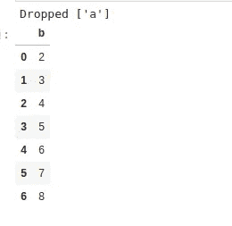

# 使用 Datasist 实现简单的数据分析、可视化和建模(第 1 部分)

> 原文：<https://towardsdatascience.com/https-medium-com-risingdeveloper-easy-data-analysis-visualization-and-modeling-using-datasist-part1-8b26526dbe01?source=collection_archive---------23----------------------->

## 使用 datasist 库进行快速有效的数据分析


datasist logo

日前，第一个稳定版**data list 发布。**你可能不知道**datalist**是什么，所以先不要太激动。

## 那么，什么是 DATASIST 呢？

简单来说，datasist 是一个 python 库，它可以让数据分析、可视化、清理、准备甚至建模变得非常简单。因为让我们面对它，我不想每次都这样…(请看下面的代码块)

…只是因为我想删除缺少 80%值的列，而我可以简单地做到这一点(请看下面的美景)


source: Pixabay

> 我知道没错，它很懒，但效率极高。

**datalist**的目标是将我们经常使用的重复代码、函数和技术抽象成可以在一行代码中调用的简单函数。Datasist 的诞生纯粹是出于懒惰，因为让我们面对它吧，除非你是一个 10 倍的数据科学家，否则我们都讨厌一遍又一遍地键入又长又无聊的代码来做同样的事情。

datasist 的设计目前围绕 5 个模块:

*   结构数据
*   特征工程
*   时间序列
*   形象化
*   模型


class diagram for datasist. Source: [ArXiv](https://arxiv.org/abs/1911.03655)

这可能会在未来的版本中发生变化，因为我们目前正在努力支持数据科学和机器学习的许多其他领域。

这篇文章的目的是向你介绍这些模块中的一些重要特性，以及你如何在你的项目中使用它们。为了这篇文章简洁明了，我决定把它分成两部分。

第 1 部分将涵盖前三个 modu *les (structdata、feature engineering、timeseries* )和[第 2 部分](/easy-data-analysis-visualization-and-modeling-using-datasist-part-2-d2ce7fbf79e3)将涵盖最后两个模块(*可视化和模型*)。

所以不浪费更多的时间，让我们开始吧。

您将在这一部分学到什么:

*   使用 structdata 模块。
*   使用数据列表的特征工程。
*   使用基于时间的要素。

要阅读本文，您需要安装 datasist 库。您可以使用 python pip 管理器来做到这一点。打开终端或 Jupyter 笔记本并键入，

```
pip install datasist
```

记得用感叹号(！)在上面的命令之前，如果你在 Jupyter 笔记本上运行它。

接下来，您需要获得一个数据集来进行实验。虽然您可以使用任何数据集，但为了一致性，建议下载我们在本教程中使用的数据集。你可以在这里 找到 [**。**](https://zindi.africa/competitions/data-science-nigeria-2019-challenge-1-insurance-prediction/data)

最后，打开 Jupyter 笔记本，导入以下库和数据集，如下所示:

# 使用 structdata 模块

structdata 模块包含许多用于处理结构化数据的函数，这些数据大多是 Pandas DataFrame 格式的。也就是说，您可以使用这些函数轻松地操作和分析数据帧。我们在下面重点介绍一些功能。

1.  **describe** :我们都知道 Pandas 中的 describe 函数，我们决定扩展它以支持对数据集的全面描述。让我们来看看实际情况。

```
ds.structdata.describe(train_df)
```


output from the describe function of structdata

从上面的结果中，您可以一次获得数据集的完整描述，并且还可以在一行中正确理解一些功能(太棒了！).

**2。check_train_test_set** :该函数用于检查两个数据集的采样策略。这一点很重要，因为如果两个数据集不是来自同一个分布，那么特征提取将会不同，因为我们不能将第一个数据集的计算应用于第二个数据集。

要使用它，您需要传入两个数据集( **train_df** 和 **test_df** ) **，**一个公共索引(customer_id)，最后传入两个数据集中存在的任何特性或列。

```
ds.structdata.check_train_test_set(train_df, test_df,
                                   index='Customer Id',             
                                    col='Building Dimension')
```


output from the check_train_test_set

**3。display_missing:** 您可以检查数据集中缺失的值，并使用该函数在格式良好的数据帧中显示结果。

```
ds.structdata.display_missing(train_df)
```


missing values in data set

**4。get_cat_feats** 和 **get_num_feats:** 就像它们的名字一样，您可以分别以 Python 列表的形式检索分类和数字特征。

```
cat_feats = ds.structdata.get_cat_feats(train_df)
cat_feats
```


categorical features in data set

```
num_feats = ds.structdata.get_num_feats(train_df)
num_feats
```


numerical features in data set

**5。get_unique_counts:** 在决定使用何种编码方案之前，您是否希望检查分类特征中唯一类的数量？那么，你可以使用***get _ unique _ count***函数来轻松做到这一点。


output from the get_unique_counts function

6。join_train_and_test: 大多数时候，在构建原型时，您可能希望将训练集和测试集连接起来，然后对其应用一些转换。您可以使用***join _ train _ and _ test***功能来完成。它返回一个连接的数据集以及训练集和测试集的大小，以便将来进行拆分。


output from combining the two data set and splitting

这些是 datasist 的 structdata 模块中的一些常用函数，要查看其他函数并了解更多关于您可以更改的参数，请查看这里的 [API 文档。](https://risenw.github.io/datasist/structdata.html)

# 使用数据列表的特征工程。

特征工程是从原始数据中提取重要特征并将其转换为适合机器学习模型的格式的行为。

数据列表的 ***特征 _ 工程*** 模块中的一些可用功能解释如下。

> **注意**:在**特征工程**模块中的函数总是返回一个新的和转换的数据帧。这意味着，你应该把结果赋给一个变量，因为什么也没有发生。

1.  **drop_missing** :这个函数删除具有指定百分比的缺失值的列/特性。假设我有一组丢失值超过 80%的特性，我想删除这些列，我可以很容易地用 ***drop_missing*** 函数来完成。

首先让我们看看数据集中缺失值的百分比

```
ds.structdata.display_missing(train_df)
```


display of missing values in data set

为了演示，我们将删除缺少 7.1%值的列(Date _ of _ Occupancy)。

> **注意:**您不应该删除丢失值如此之少的列/特征。最理想的做法是填满它。我们把它放在这里，只是为了演示。

```
new_train_df = ds.feature_engineering.drop_missing(train_df,  
                                                    percent=7.0)
ds.structdata.display_missing(new_train_df)
```


Output of dataset after using the drop_missing function

2 **。drop_redundant:** 该功能用于移除低方差或无方差的特征。也就是说，所有要素都包含相同的值。我们展示了一个使用人工数据集的简单示例。

首先，让我们创建数据集…

```
df = pd.DataFrame({'a': [1,1,1,1,1,1,1],
                  'b': [2,3,4,5,6,7,8]})df
```


sample dataset

现在看看上面的数据集，我们看到列 **a** 是多余的，也就是说它始终具有相同的值。我们可以通过将数据集传递给***drop _ redundant***函数来自动删除该列。

```
df = ds.feature_engineering.drop_redundant(df)
df
```



Result dataset from using the drop_redundant function

3. **convert_dtypes** :该函数以一个数据帧作为参数，自动将特征类型转换为正确的数据类型。

让我们看一个例子。首先，我们创建一个人工数据集如下。

```
data = {'Name':['Tom', 'nick', 'jack'],
        'Age':['20', '21', '19'], 
        'Date of Birth': ['1999-11-17','20 Sept 1998','Wed Sep 19 
                         14:55:02 2000']}df = pd.DataFrame(data)
df
```


sample data set

接下来，让我们检查数据类型…

```
df.dtypes
```


data types of features

年龄和出生日期这两个特性应该分别是整数和日期时间，通过将这个数据集传递给***convert _ dtype***函数，可以自动修复这个问题。

```
df = ds.feature_engineering.convert_dtype(df)
df.dtypes
```


datatypes of features in artificial data set after using convert_dtypes function

4. **fill_missing_cats:** 顾名思义，这个函数接受一个数据帧，并自动检测缺少值的分类列。它使用模式填充它们。让我们看一个例子。

从数据集中，我们有两个缺失值的分类要素，它们是 Garden 和 Geo_Code。

```
df = ds.feature_engineering.fill_missing_cats(train_df)
ds.structdata.display_missing(df)
```


missing values DataFrame after filling the missing categorical features

5. **fill_missing_nums** :这类似于***fill _ missing _ cats***，除了它作用于数字特征，你可以指定一个填充策略(均值、众数或中位数)。

从数据集中，我们有两个数值特征缺失值，它们是建筑尺寸和入住日期。

```
df = ds.feature_engineering.fill_missing_num(train_df)
ds.structdata.display_missing(df)
```


missing values DataFrame after filling the missing numerical features

6. **log_transform** :该功能可以帮助你对一组特征进行 log 变换。它还显示了之前和之后的图与偏斜水平，以帮助您决定是否日志转换功能是你真正想要的。

特征 B *建筑尺寸*是右斜的，我们可以转换它。

> 注意:传递给 log_transform 函数的列不应该包含缺失值，否则它将抛出一个错误。

```
df = ds.feature_engineering.fill_missing_num(df)
df = ds.feature_engineering.log_transform(df,
                                    columns=['Building Dimension'])
```


Log-transform plot

为了处理地理特征，如*纬度*和*经度*，datasist 有专门的函数，如**方位**、**曼哈顿距离**、**获取位置中心**等，在特征工程模块中也有。要查看这些和其他函数，您可以在这里查看 [API 文档](https://risenw.github.io/datasist/feature_engineering.html)。

# 使用基于时间的要素

最后，在这一部分，我将讨论 datasist 中的 timeseries 模块。timeseries 模块包含使用日期时间功能的函数。它可以帮助您从日期中提取新特征，还可以帮助您将它们可视化。

1.  **extract_dates:** 该函数可以从指定的日期特征中提取指定的特征，如星期几、一年中的某一天、小时、分钟和一天中的秒钟。为了演示这一点，让我们使用一个包含日期功能的数据集。

在这里 获取新的数据集 [**。**](https://zindi.africa/competitions/sendy-logistics-challenge)

```
new_data = pd.read_csv("Train.csv")
new_data.head(3).T
```


Transposed head of the dataset

数据集包含大量我们可以分析的时间特征。关于这项任务的更多细节可以在[竞赛页面上找到。](https://zindi.africa/competitions/sendy-logistics-challenge/data)

让我们演示一下使用 extract_dates 函数从**位置-时间**、**到达目的地-时间**要素中提取信息是多么容易。我们指定只提取星期几(dow)和一天中的小时(hr)。

```
date_cols = ['Placement - Time', 'Arrival at Destination - Time']df = ds.timeseries.extract_dates(new_train, date_cols=date_cols,
                                          subset=['dow', 'hr')df.head(3).T
```


output from extract_dates function

我们可以看到，datasist 创建了新的列，并向数据集追加了新的特性。

**2。时间片**:时间片功能可以帮助你根据特定的时间特性可视化一组特性。这可以帮助你识别趋势和模式。要使用此函数，可以传递一组数字列，然后指定要绘制的日期特征。

```
num_cols = ['Time from Pickup to Arrival', 'Destination Long', 
            'Pickup Long','Platform Type', 'Temperature']ds.timeseries.timeplot(new_train, num_cols=num_cols,
                       time_col='Placement - Time')
```


output of timeplot

至此，第 1 部分已经结束。要了解更多关于 datasist 和其他可用函数的信息，您可以在这里查看 [**API 文档。**](https://risenw.github.io/datasist/index.html)


在第 2 部分中，我们将介绍最后两个模块(可视化和模型),在那里您将看到如何利用 datasist 的强大功能，只用一行代码就能快速创建漂亮的图形。

> [**数据列表**](https://github.com/risenW/datasist) 正在并将随着我们添加更多功能而继续发展。如果你想让它变得更好，请查看我们的投稿指南[这里](https://risenw.github.io/datasist/contributing.html)，如果你想报告一个 bug 问题或者对新功能有一个想法，请访问我们的 GitHub [问题页面这里。如果这个项目对你有用，别忘了在 GitHub 上给我们留下一颗星。](https://github.com/risenW/datasist/issues)

最后，如果您在项目中使用了 datasist，请告诉我们，这样我们就可以在我们的页面上展示您的作品。

点击 查看我们的贡献者列表 [**。**](https://github.com/risenW/datasist/graphs/contributors)

[**链接**](https://github.com/risenW/datasist) 到 GitHub 上的 datasist repo

[**将**](https://risenw.github.io/datasist/index.html) 链接到文档

[**链接**](https://risenw.github.io/datasist/classification_example.html) 到示例用法

在[**Twitter**](https://twitter.com/risingodegua)**[**LinkedIn**](https://www.linkedin.com/in/risingdeveloper/)上找我**

**给我发邮件:[risingodegua@gmail.com](mailto:risingodegua@gmail.com)**