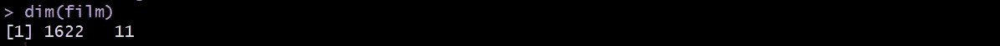
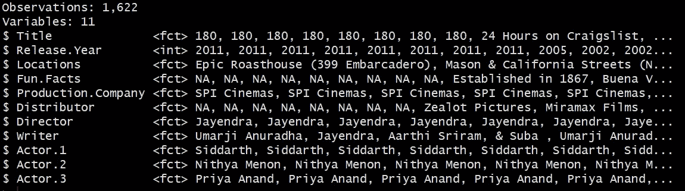
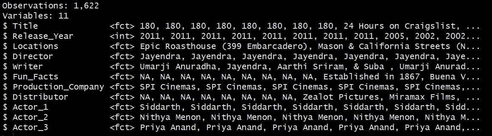
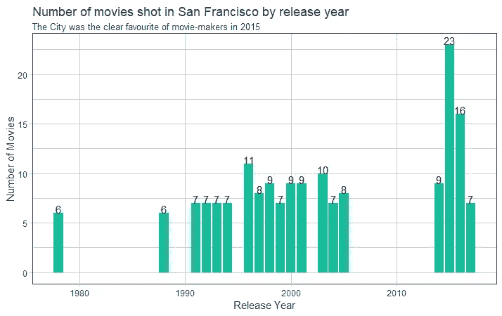
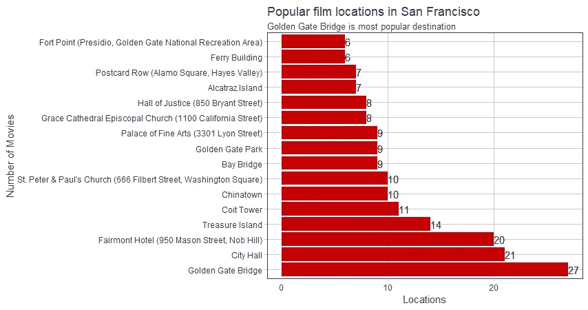
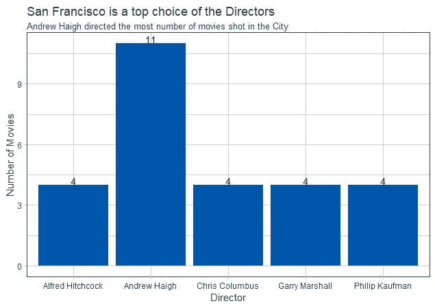
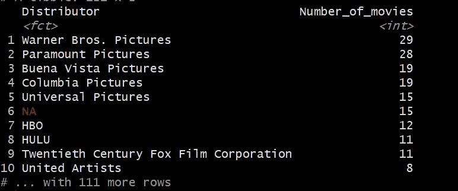
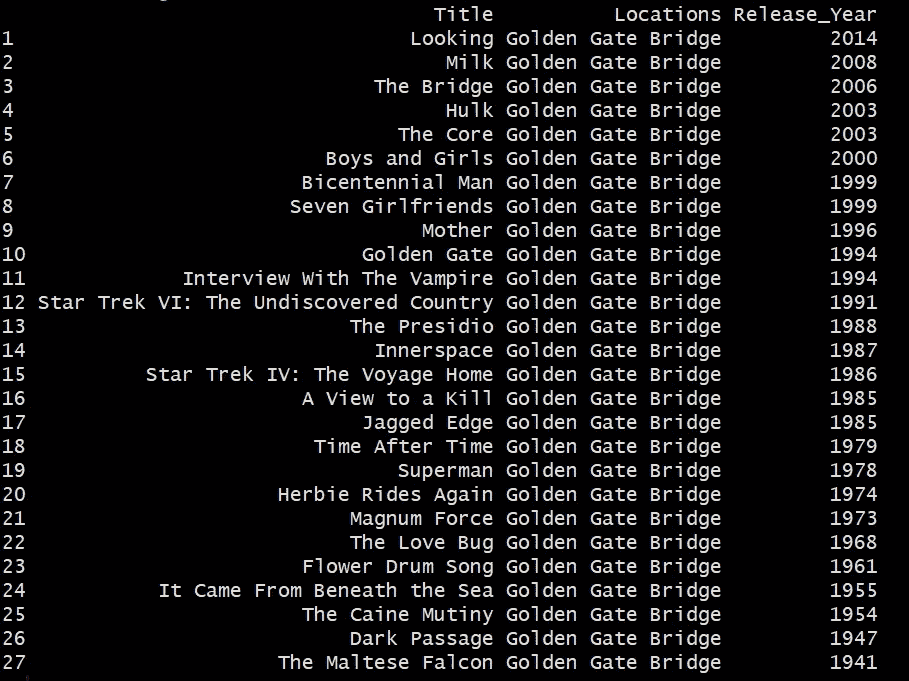

# 用 R 分析在旧金山拍摄的电影

> 原文：<https://towardsdatascience.com/https-medium-com-tanmayee92-was-your-favorite-movie-shot-in-san-francisco-f872e482a5d9?source=collection_archive---------35----------------------->


The Golden Gate Bridge stands tall with the city of San Francisco on the horizon

旧金山是一个纯粹的魔法城市，几个月前我在这座黄金城市度过了一段美好的时光。因此，当我偶然发现一组非常有趣的电影和连续剧的数据，这些电影和连续剧是在旧金山的几个地方拍摄的，我无法阻止自己去挖掘它们。瞧，我发现了 4 个有趣的见解！

1.  2015 年仅一年就有 23 部在旧金山拍摄的电影上映！
2.  金门大桥是这座城市中最热门的电影拍摄地(毫无疑问！)
3.  导演安德鲁·海格在《海湾城市》中拍摄了多达 11 部电影！
4.  华纳兄弟影业(娱乐巨头之一)和 Hulu(流媒体服务公司之一)在旧金山拍摄的电影/连续剧数量最多。

在这篇文章中，我将展示我是如何通过 6 个步骤分析这些数据的。所以，打开你的 R 工作室，跟着做吧！

步骤 1:导入库

```
library(dplyr)
library(readxl)
library(writexl) 
library(tidyquant)
library(tidyverse)
library(forcats)
library(magrittr)
```

步骤 2:加载数据

这项练习的数据可以在这个 [url](https://data.sfgov.org/Culture-and-Recreation/Film-Locations-in-San-Francisco/yitu-d5am) 上找到。确保以 csv 格式将数据下载到您的本地驱动器中。

```
film <- read.csv('Film_Locations_in_San_Francisco.csv')
```

现在，让我们仔细观察这些数据，了解其维度。

```
dim(film)
```



我们有 1622 行和 11 列。由于列的数量很大，这是一个很宽的数据集，因此，我们将使用 glimpse()函数一次性查看所有的列。

```
glimpse(film)
```



我们在数据中看到了 NAs，但我们将保持原样。

第三步:争论数据

我想通过替换“.”来使列名更加标准在带有“_”的名称中。此外，我决定重新排列几列，将“标题”、“发行年份”、“地点”、“导演”和“编剧”放在列表的顶部。

```
#Replacing "." in the column names with "_"film_wrangled <- film %>%
  set_names(names(.)%>% str_replace_all("\\.", "_")) %>%#Re-ordering the columns select(Title, Release_Year, Locations, Director, Writer,   everything()) %>%
  glimpse()
```



我们看到所期望的改变已经实现。

步骤 4:数据操作

为了深入分析，我决定只关注几列，即“发行年份”、“标题”、“地点”、“导演”和“经销商”。

```
film_tbl <- film_wrangled %>%
   #Choosing the columns to focus on
   select(Release_Year, Title, Locations, Director, Distributor) %>%
   glimpse()
```

因此，TiB ble“film _ TBL”是我们在这一点之后进行任何分析的首选数据集。

# **问题 1:哪一年在三藩市拍摄的电影数量最多**

```
popular_by_year <- film_tbl %>%
                    group_by(Release_Year) %>%
                    summarize(Number_of_movies = n_distinct(Title)) %>%
                    filter(Number_of_movies > 5) %>%
                    arrange(desc(Number_of_movies))
```

这个如果形象化就很好理解了。

```
popular_by_year %>%
    ggplot(aes(x = Release_Year, y = Number_of_movies)) +

    #Adding geometries
    geom_col(fill = "#18BC9C") +

    #Formatting
    geom_text(aes(label= Number_of_movies), vjust = 0 ) +
    theme_tq() +
    labs(
         title = "Number of movies shot in San Francisco by release year",
         subtitle = "The City was the clear favourite of movie-makers in 2015 ",
         x = "Release Year",
         y = "Number of Movies"
    )
```



似乎 2015 年是科幻电影最多的一年，接下来是 2016 年。在这两年之前，大多数科幻电影的拍摄发生在 1996 年。

# 问题 2:旧金山有哪些最著名的拍摄电影的地点？

```
popular_locations <- film_tbl %>%
                       group_by(Locations) %>%
                       summarize(Number_of_movies = n_distinct(Title)) %>%
                       filter(Number_of_movies > 5) %>%
                       filter(Number_of_movies < 54) %>%  
                       arrange(desc(Number_of_movies))
```

视觉化这个…

```
popular_locations %>%
      ggplot(aes(x = reorder(Locations, -Number_of_movies), y = Number_of_movies )) + 

      #Adding Geometries  
      geom_col(fill = "#C40003" ) +

      #Formatting  
      theme_tq() +
      geom_text(aes(label= Number_of_movies), hjust = 0 ) +
      labs (
        title = "San Francisco is a top choice of the Directors",
        subtitle = "Andrew Haigh directed the most number of movies shot in the City",
        y = "Number of Movies"
      ) +
      coord_flip()
```



数据告诉我们，拍摄一部电影最著名的地点是金门大桥(这里没有惊喜！).它与其他热门地点竞争激烈，如市政厅、梅森街 950 号的费尔蒙特酒店、金银岛和 Coit Tower。

# 问题 3:哪些导演在旧金山拍摄的电影数量最多？

```
directors <- film_tbl %>%
               group_by(Director) %>%
               summarize(Number_of_movies = n_distinct(Title)) %>%
               filter(Number_of_movies > 3) %>%
               arrange(desc(Number_of_movies))
```

视觉化这个…

```
directors %>%
    ggplot(aes(x = Director, y = Number_of_movies )) +

    #Adding Geometries  
    geom_col(fill = "#0055AA" ) +

    #Formatting  
    theme_tq() +
    geom_text(aes(label= Number_of_movies), vjust = 0 ) +
    labs (
         title = "San Francisco is a top choice of the Directors",
         subtitle = "Andrew Haigh directed the most number of movies shot in the City",
         y = "Number of Movies"
    )
```



导演安德鲁·海格在这座海湾城市拍摄了多达 11 部电影，紧随其后的是阿尔弗雷德·希区柯克、克里斯·哥伦布、盖瑞·马歇尔和菲利普·考夫曼，他们分别在这里拍摄了 4 部电影。

# 问题 4:哪些发行公司的大部分电影都是在旧金山拍摄的？

```
film_tbl %>%
      select(Title, Distributor) %>%
      group_by(Distributor) %>%
      summarise(Number_of_movies = n_distinct(Title)) %>%
      arrange(desc(Number_of_movies))
```



我们看到华纳兄弟电影公司是明显的赢家。此外，值得注意的是，流行的流媒体服务 Hulu 似乎有很多系列/电影在旧金山拍摄。

# **问题 5:在金门大桥拍摄的电影叫什么名字？**

既然我们已经知道了大多数电影通常都会有一两个在著名的金门大桥的场景，让我们看看它们的名字。

```
film_tbl %>%
      select(Title, Locations, Release_Year) %>%
      filter(grepl("Golden Gate Bridge", Locations)) %>%
      arrange(desc(Release_Year))
```



我们看到近年来上映的电影，如《寻找》(2014)、《牛奶》(2008)、《桥》(2006)等，都是在这个非常著名的地方拍摄的。

太棒了，不是吗？

一个小提示——在这些电影中，我发现网飞只有“牛奶”!所以如果你想欣赏金门大桥的美景，你知道现在该去哪里了！:)

感谢阅读这篇文章！如果你喜欢，请给我发来掌声:)

*源代码托管在我的* [*GitHub 页面*](https://github.com/tanmayeewaghmare/Movie-Analysis-using-R)