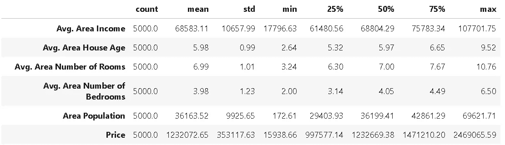

# 使用“pdpipe”与熊猫一起建造管道

> 原文：<https://towardsdatascience.com/https-medium-com-tirthajyoti-build-pipelines-with-pandas-using-pdpipe-cade6128cd31?source=collection_archive---------0----------------------->

## 我们展示了如何使用一个叫做 pdpipe 的奇妙的小库，用 Pandas DataFrame 构建直观而有用的管道。


# 介绍

Pandas 是 Python 生态系统中一个了不起的库，用于数据分析和机器学习。它们在 Excel/CSV 文件和 SQL 表所在的数据世界和 Scikit-learn 或 TensorFlow 施展魔法的建模世界之间形成了完美的桥梁。

数据科学流程通常是一系列步骤，数据集必须经过清理、缩放和验证，才能供强大的机器学习算法使用。

当然，这些任务可以通过 Pandas 等软件包提供的许多单步函数/方法来完成，但更好的方式是使用管道。几乎在所有情况下，流水线通过自动化重复的任务减少了出错的机会并节省了时间。

在数据科学领域，具有管道特性的包的很好的例子是——R 语言的[DP lyr](https://dplyr.tidyverse.org/)和 Python 生态系统的[Scikit-learn](https://scikit-learn.org/stable/modules/compose.html)。

> 数据科学流程通常是一系列步骤，数据集必须经过清理、缩放和验证才能投入使用

下面是一篇关于它们在机器学习工作流中的使用的精彩文章。

[](https://www.kdnuggets.com/2017/12/managing-machine-learning-workflows-scikit-learn-pipelines-part-1.html) [## 用 Scikit-learn 管道管理机器学习工作流第 1 部分:简介…

### 你熟悉 Scikit-learn 管道吗？它们是管理机器的一个非常简单但非常有用的工具…

www.kdnuggets.com](https://www.kdnuggets.com/2017/12/managing-machine-learning-workflows-scikit-learn-pipelines-part-1.html) 

Pandas 还提供了一个`**.pipe**`方法，可用于类似的用户自定义函数。然而，在本文中，我们将讨论一个名为 [**pdpipe**](https://github.com/shaypal5/pdpipe) 的奇妙的小库，它专门解决了 Pandas DataFrame 的流水线问题。

> 几乎在所有情况下，流水线通过自动化重复的任务减少了出错的机会并节省了时间

# 熊猫流水线

Jupyter 笔记本的例子可以在我的 Github repo 中找到。让我们看看如何用这个库构建有用的管道。

## 数据集

出于演示的目的，我们将使用美国房价的数据集(从 Kaggle 下载)。我们可以在 Pandas 中加载数据集，并显示其汇总统计信息，如下所示:



但是，数据集还有一个包含文本数据的“地址”字段。


## 添加大小限定符列

对于这个演示，我们用下面的代码向数据集添加一列来限定房子的大小，


数据集看起来像这样，


## 最简单的流水线—一个操作

我们从最简单的管道开始，只包含一个操作(不要担心，我们很快就会增加复杂性)。

假设机器学习团队和领域专家说，他们认为我们可以安全地忽略`Avg. Area House Age`数据进行建模。因此，我们将从数据集中删除该列。

对于这个任务，我们使用 [**pdpipe**](https://github.com/shaypal5/pdpipe) 中的`ColDrop`方法创建一个管道对象`drop_age`，并将数据帧传递给这个管道。

```
import pdpipe as pdp
drop_age = pdp.ColDrop(‘Avg. Area House Age’)
df2 = drop_age(df)
```

如预期的那样，产生的数据帧如下所示:


## 简单地通过添加

只有当我们能够拥有多个阶段时，管道才是有用和实用的。在 [**pdpipe**](https://github.com/shaypal5/pdpipe) 中有多种方法可以做到这一点。然而，最简单、最直观的方法是使用+运算符。这就像手工连接管道一样！

比方说，除了删除年龄列，我们还想对`House_size`列进行一次热编码，以便可以轻松地对数据集运行分类或回归算法。

```
pipeline = pdp.ColDrop(‘Avg. Area House Age’)
pipeline+= pdp.OneHotEncode(‘House_size’)
df3 = pipeline(df)
```

因此，我们首先用`ColDrop`方法创建了一个管道对象来删除`Avg. Area House Age`列。此后，我们只是用通常的 Python `+=`语法将`OneHotEncode`方法添加到这个管道对象中。

生成的数据帧如下所示。注意从一次热编码过程中创建的附加指示器列`House_size_Medium`和`House_size_Small`。


## 根据行的值删除一些行

接下来，我们可能希望根据数据的值删除数据行。具体来说，我们可能希望删除所有房价低于 25 万的数据。我们使用了`ApplybyCol`方法将任何用户定义的函数应用于数据帧，还使用了`ValDrop`方法根据特定值删除行。我们可以很容易地将这些方法链接到我们的管道中，以选择性地删除行(我们仍在添加现有的`pipeline`对象，该对象已经完成了列删除和一次热编码的其他工作)。

```
def price_tag(x):
    if x>250000:
        return 'keep'
    else:
        return 'drop'pipeline+=pdp.ApplyByCols('Price',price_tag,'Price_tag',drop=False)
pipeline+=pdp.ValDrop(['drop'],'Price_tag')
pipeline+= pdp.ColDrop('Price_tag')
```

第一种方法通过应用用户定义的函数`price_tag()`，基于`Price`列中的值标记行，


第二种方法在`Price_tag`列中查找字符串`drop`，并删除匹配的行。最后，第三种方法删除`Price_tag`列，清理数据帧。毕竟，这个`Price_tag`列只是临时需要的，用来标记特定的行，应该在它达到目的后被删除。

所有这些都是通过在同一管道上简单地链接操作阶段来完成的！

此时，我们可以回顾一下，看看我们的管道从一开始对数据帧做了什么，

*   删除特定列
*   one-hot-编码用于建模的分类数据列
*   基于用户定义的函数标记数据
*   基于标记删除行
*   删除临时标记列

所有这些——使用下面五行代码，

```
pipeline = pdp.ColDrop('Avg. Area House Age')
pipeline+= pdp.OneHotEncode('House_size')
pipeline+=pdp.ApplyByCols('Price',price_tag,'Price_tag',drop=False)
pipeline+=pdp.ValDrop(['drop'],'Price_tag')
pipeline+= pdp.ColDrop('Price_tag')df5 = pipeline(df)
```

## 最新版本更新:直接降行！

我与这个包的作者进行了一次精彩的讨论，他告诉我这个包的最新版本可以使用 lambda 函数用一行代码完成 row 的删除(满足给定的条件)。

```
pdp.RowDrop({‘Price’: lambda x: x <= 250000})
```

# sci kit-学习和 NLTK 阶段

有许多更有用和直观的数据帧操作方法可用于数据帧操作。然而，我们只是想表明，即使是 Scikit-learn 和 NLTK 包中的一些操作也包含在 [**pdpipe**](https://github.com/shaypal5/pdpipe) 中，以创建令人敬畏的管道。

## Scikit-learn 的比例估算器

构建机器学习模型最常见的任务之一是数据的缩放。Scikit-learn 提供了一些不同类型的缩放，如最小-最大缩放或基于标准化的缩放(减去数据集的平均值，然后除以标准偏差)。

我们可以在管道中直接链接这样的缩放操作。下面的代码演示了如何使用，

```
pipeline_scale = pdp.Scale('StandardScaler',exclude_columns=['House_size_Medium','House_size_Small'])df6 = pipeline_scale(df5)
```

这里，我们应用了 Scikit-learn 包中的`[StandardScaler](https://scikit-learn.org/stable/modules/generated/sklearn.preprocessing.StandardScaler.html)` [估计器](https://scikit-learn.org/stable/modules/generated/sklearn.preprocessing.StandardScaler.html)来转换数据，以便进行聚类或神经网络拟合。我们可以有选择地排除不需要这种缩放的列，就像我们在这里对指示器列`House_size_Medium`和`House_size_Small`所做的那样。

瞧啊。我们得到缩放的数据帧，


## NLTK 的标记器

我们注意到，数据帧中的地址字段现在几乎没有用。然而，如果我们可以从这些字符串中提取邮政编码或州名，它们可能对某种可视化或机器学习任务有用。

为此，我们可以使用一个[单词分词器](https://www.guru99.com/tokenize-words-sentences-nltk.html)。NLTK 是一个用于文本挖掘和自然语言处理(NLP)的流行而强大的 Python 库，并提供了一系列标记化方法。这里，我们可以使用一个这样的标记器来分割地址字段中的文本，并从中提取州名。我们知道州名是地址串中的倒数第二个单词。因此，遵循链式管道将为我们完成这项工作，

```
def extract_state(token):
    return str(token[-2])pipeline_tokenize=pdp.TokenizeWords('Address')pipeline_state = pdp.ApplyByCols('Address',extract_state,
result_columns='State')pipeline_state_extract = pipeline_tokenize + pipeline_statedf7 = pipeline_state_extract(df6)
```

产生的数据帧如下所示:


# 摘要

如果我们总结一下本演示中显示的所有操作，看起来如下所示:


所有这些操作都可能在相似类型的数据集上频繁使用，在数据集准备好进行下一级建模之前，有一组简单的顺序代码块作为预处理操作来执行将是非常好的。

流水线是实现统一的顺序代码块集的关键。Pandas 是在机器学习/数据科学团队中使用最广泛的用于此类数据预处理任务的 Python 库，而 [**pdpipe**](https://github.com/shaypal5/pdpipe) 提供了一种简单而强大的方法来构建具有 Pandas 类型操作的管道，这些操作可以直接应用于 Pandas DataFrame 对象。

[自己探索这个库](https://github.com/shaypal5/pdpipe)并为您的特定数据科学任务构建更强大的管道。

喜欢这篇文章吗？成为 [***中等会员***](https://medium.com/@tirthajyoti/membership) *继续* ***无限制学习*** *。如果您使用下面的链接，* ***，我将收取您的一部分会员费，而不会对您产生额外费用*** *。*

[](https://medium.com/@tirthajyoti/membership) [## 通过我的推荐链接加入 Medium—Tirthajyoti Sarkar

### 作为一个媒体会员，你的会员费的一部分会给你阅读的作家，你可以完全接触到每一个故事…

medium.com](https://medium.com/@tirthajyoti/membership)