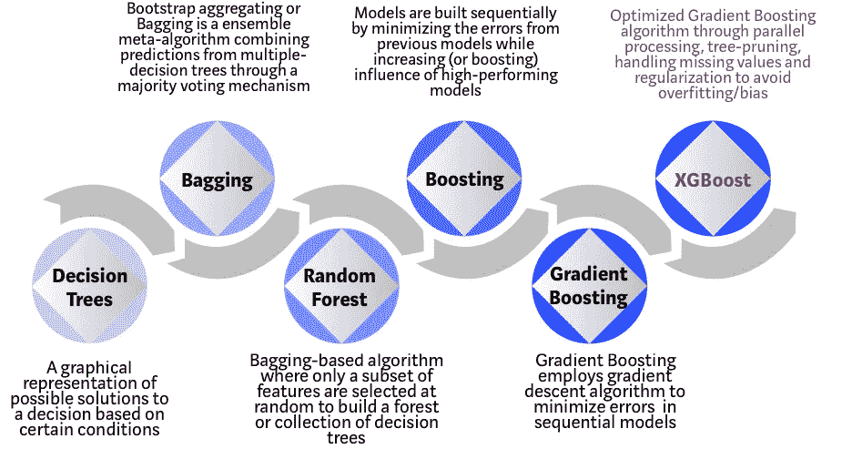

# XGBoost 算法:愿她统治长久！

> 原文：<https://towardsdatascience.com/https-medium-com-vishalmorde-xgboost-algorithm-long-she-may-rein-edd9f99be63d?source=collection_archive---------0----------------------->

Photo by [Jared Subia](https://unsplash.com/photos/QczH4IiPNx0?utm_source=unsplash&utm_medium=referral&utm_content=creditCopyText) on [Unsplash](https://unsplash.com/search/photos/tiara?utm_source=unsplash&utm_medium=referral&utm_content=creditCopyText)

## 接管世界的机器学习算法的新女王…

(本文与 [Venkat Anurag Setty](https://medium.com/u/e15e82916c90?source=post_page-----edd9f99be63d--------------------------------) 合著)

我仍然记得 15 年前我第一份工作的第一天。我刚刚完成研究生学业，加入了一家全球投资银行，担任分析师。第一天，我一直在整理领带，试图记住我学过的所有东西。与此同时，在内心深处，我怀疑自己是否适合企业界。感觉到我的焦虑，我的老板笑着说:

*“放心吧！你唯一需要知道的就是回归建模！”*

我记得我自己想，“我得到了这个！”。我知道回归建模；线性和逻辑回归。我的老板是对的。在我任职期间，我专门建立了基于回归的统计模型。我不是一个人。事实上，在那个时候，回归建模是预测分析中无可争议的女王。快进十五年，回归建模的时代结束了。老皇后已经去世了。有着时髦名字的新女王万岁；XGBoost 或者极限梯度提升！

# XGBoost 是什么？

[XGBoost](https://xgboost.ai/) 是一种基于决策树的集成机器学习算法，使用了[梯度提升](https://en.wikipedia.org/wiki/Gradient_boosting)框架。在涉及非结构化数据(图像、文本等)的预测问题中。)人工神经网络往往优于所有其他算法或框架。然而，当涉及到中小型结构化/表格数据时，基于决策树的算法目前被认为是同类最佳的。请参见下图，了解这些年来基于树的算法的演变。

Evolution of XGBoost Algorithm from Decision Trees

XGBoost 算法是作为华盛顿大学的一个研究项目开发的。[陈天琦和卡洛斯·盖斯特林](https://arxiv.org/pdf/1603.02754.pdf)在 2016 年 SIGKDD 大会上发表了他们的论文，并在机器学习领域引起了轰动。自推出以来，该算法不仅赢得了众多 Kaggle 比赛，还成为了几个尖端行业应用的驱动力。因此，有一个强大的数据科学家社区为 XGBoost 开源项目做出了贡献，大约有 350 名贡献者，在 [GitHub](https://github.com/dmlc/xgboost/) 上有大约 3，600 次提交。该算法在以下方面与众不同:

1.  应用广泛:可用于解决回归、分类、排名、用户自定义预测问题。
2.  可移植性:可以在 Windows、Linux 和 OS X 上流畅运行。
3.  语言:支持所有主要的编程语言，包括 C++、Python、R、Java、Scala 和 Julia。
4.  云集成:支持 AWS、Azure 和 Yarn 集群，可以与 Flink、Spark 和其他生态系统很好地协作。

# 如何为 XGBoost 建立一个直觉？

决策树，以其最简单的形式，是易于可视化和相当容易解释的算法，但为下一代基于树的算法建立直觉可能有点棘手。下面是一个简单的类比，可以更好地理解基于树的算法的发展。

Photo by [rawpixel](https://unsplash.com/photos/cnseVhmbA7k?utm_source=unsplash&utm_medium=referral&utm_content=creditCopyText) on [Unsplash](https://unsplash.com/search/photos/interview?utm_source=unsplash&utm_medium=referral&utm_content=creditCopyText)

假设你是一名招聘经理，正在面试几名资质优秀的候选人。基于树的算法进化的每一步都可以被看作是面试过程的一个版本。

1.  每个招聘经理都有一套标准，比如教育水平、工作经验、面试表现。决策树类似于招聘经理根据自己的标准面试候选人。
2.  **装袋**:现在想象一下，不再只有一个面试官，而是有一个面试小组，每个面试官都有投票权。Bagging 或 bootstrap 聚合涉及通过民主投票过程将所有面试官的意见结合起来以作出最终决定。
3.  **随机森林**:这是一种基于 bagging 的算法，有一个关键的区别，其中只有一部分特征是随机选择的。换句话说，每个面试者将只测试被面试者的某些随机选择的资格(例如测试编程技能的技术面试和评估非技术技能的行为面试)。
4.  推进:这是另一种方法，每位面试官根据前一位面试官的反馈改变评估标准。这通过部署一个更动态的评估过程来“提高”面试过程的效率。
5.  **梯度提升**:梯度提升的一种特殊情况，通过梯度下降算法将误差降至最低，例如，战略咨询公司利用案例面试淘汰不合格的候选人。
6.  **XGBoost** :把 XGBoost 想象成“类固醇”上的梯度增强(嗯，它被称为“极端梯度增强”是有原因的！).它是软件和硬件优化技术的完美结合，能够在最短的时间内使用更少的计算资源产生卓越的结果。

# XGBoost 为什么表现这么好？

XGBoost 和 Gradient Boosting Machines(GBM)都是系综树方法，它们使用梯度下降架构来应用增强弱学习器的原理。然而，XGBoost 通过系统优化和算法增强改进了基本 GBM 框架。

How XGBoost optimizes standard GBM algorithm

**系统优化:**

1.  **并行化** : XGBoost 使用[并行化](http://zhanpengfang.github.io/418home.html)实现来处理顺序树构建的过程。由于用于构建基础学习者的循环的可互换性质，这是可能的；枚举树的叶节点的外部循环，以及计算特征的第二个内部循环。这种循环嵌套限制了并行化，因为如果不完成内循环(对两者的计算要求更高)，外循环就无法启动。因此，为了提高运行时间，通过全局扫描所有实例进行初始化，并使用并行线程进行排序，从而交换循环的顺序。这种切换通过抵消计算中的任何并行化开销来提高算法性能。
2.  **树剪枝:**GBM 框架内树分裂的停止准则本质上是贪婪的，依赖于分裂点的负损失准则。XGBoost 首先使用指定的“max_depth”参数而不是 criterion，并开始向后修剪树。这种“深度优先”的方法显著提高了计算性能。
3.  **硬件优化**:该算法旨在有效利用硬件资源。这是通过在每个线程中分配内部缓冲区来存储梯度统计数据的缓存感知来实现的。诸如“核外”计算的进一步增强优化了可用磁盘空间，同时处理了不适合内存的大数据帧。

**算法增强:**

1.  **正则化**:通过套索(L1)和山脊(L2) [正则化](/l1-and-l2-regularization-methods-ce25e7fc831c)来惩罚更复杂的模型，防止过度拟合。
2.  **稀疏意识** : XGBoost 通过根据训练损失自动“学习”最佳缺失值，自然地承认输入的稀疏特征，并更有效地处理数据中不同类型的[稀疏模式](https://www.kdnuggets.com/2017/10/xgboost-concise-technical-overview.html)。
3.  **加权分位数草图:** XGBoost 采用分布式[加权分位数草图算法](https://arxiv.org/pdf/1603.02754.pdf)在加权数据集之间有效地寻找最优分割点。
4.  **交叉验证**:该算法在每次迭代中都有内置的[交叉验证](/cross-validation-in-machine-learning-72924a69872f)方法，这样就不需要显式地对这种搜索进行编程，也不需要指定单次运行所需的 boosting 迭代的确切次数。

# 证据在哪里？

我们使用 Scikit-learn 的' [Make_Classification](https://scikit-learn.org/stable/modules/generated/sklearn.datasets.make_classification.html) '数据包创建了一个包含 20 个特征(2 个信息性特征和 2 个冗余特征)的 100 万个数据点的随机样本。我们测试了几种算法，如逻辑回归、随机森林、标准梯度提升和 XGBoost。

XGBoost vs. Other ML Algorithms using SKLearn’s Make_Classification Dataset

如上图所示，与其他算法相比，XGBoost 模型具有预测性能和处理时间的最佳组合。其他严格的基准测试研究也产生了类似的结果。难怪 XGBoost 在最近的数据科学竞赛中被广泛使用。

> “有疑问时，使用 XGBoost”——欧文·张，Kaggle 上的 [Avito](http://blog.kaggle.com/2015/08/26/avito-winners-interview-1st-place-owen-zhang/) 上下文广告点击预测竞赛的获胜者

# 那么我们应该一直只使用 XGBoost 吗？

当谈到机器学习(甚至是生活)时，没有免费的午餐。作为数据科学家，我们必须测试手头数据的所有可能算法，以确定冠军算法。此外，选择正确的算法是不够的。我们还必须通过调整[超参数](https://www.analyticsvidhya.com/blog/2016/03/complete-guide-parameter-tuning-xgboost-with-codes-python/)为数据集选择正确的算法配置。此外，在选择获胜算法时，还有其他几个考虑因素，如计算复杂性、可解释性和实现的容易程度。这正是机器学习开始从科学走向艺术的地方，但老实说，这就是奇迹发生的地方！

# 未来会怎样？

机器学习是一个非常活跃的研究领域，已经有几个可行的 XGBoost 替代方案。微软研究院最近发布了 [LightGBM](https://www.microsoft.com/en-us/research/project/lightgbm/) 渐变提升框架，显示出巨大的潜力。由 Yandex Technology 开发的 [CatBoost](https://catboost.ai/) 已经交付了令人印象深刻的基准测试结果。我们有一个更好的模型框架，在预测性能、灵活性、可解释性和实用性方面击败 XGBoost，这只是时间问题。然而，在一个强大的挑战者出现之前，XGBoost 将继续统治机器学习世界！

请在下面给我留下你的评论。非常感谢[文卡特·阿努拉格·塞特](https://medium.com/u/e15e82916c90?source=post_page-----edd9f99be63d--------------------------------)与我合作撰写这篇文章。