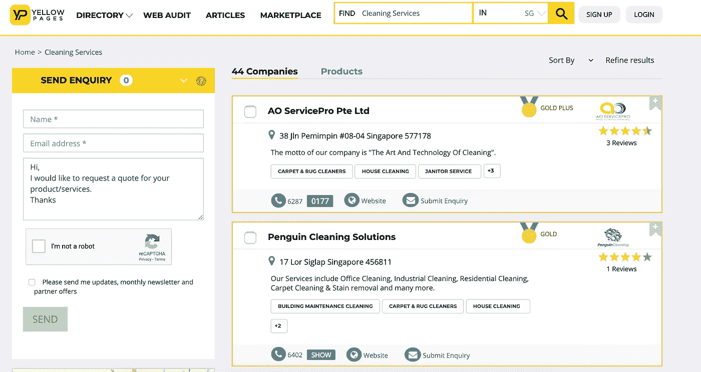

# 创建更可靠的网络爬虫的 5 个技巧

> 原文：<https://towardsdatascience.com/https-towardsdatascience-com-5-tips-to-create-a-more-reliable-web-crawler-3efb6878f8db?source=collection_archive---------6----------------------->

## 提高你的网络爬虫的效率！

W 当我在抓取网站时，网络爬虫被网站屏蔽可以说是最讨厌的情况。要成为真正的网络爬虫高手，你不仅要能够快速编写 XPath 或 CSS 选择器，而且你如何设计你的爬虫也很重要，尤其是从长远来看。

在我网络爬行旅程的第一年，我总是专注于如何抓取一个网站。能够搜集数据，清理和组织它，这个成就已经可以让我的一天。在爬越来越多的网站后，我发现有**4**重要元素是建立一个伟大的网络爬虫最重要的。

如何确定一个伟大的网络爬虫？您可能需要考虑以下几点:

## 爬虫的速度

你能在有限的时间内收集数据吗？

## 收集的数据的完整性

你能收集到所有你感兴趣的数据吗？

## 收集的数据的准确性

你如何确保你搜集的数据是准确的？

## 网络爬虫的可扩展性

当网站数量增加时，你能调整网络爬虫吗？

为了回答以上所有的问题，我将分享一些可以帮助你建立一个伟大的网络爬虫的技巧。

## 提示#1 减少你需要请求网页的次数。

使用一个 web 抓取框架: [Selenium](https://selenium-python.readthedocs.io/) 为例。如果我们要刮这个网站:[https://www.yellowpages.com.sg/category/cleaning-services](https://www.yellowpages.com.sg/category/cleaning-services)

比方说，我们想要获得公司地址和描述的数据。所以，对于 Selenium，我们可能会使用`**driver.findElement**` 两次到分别检索**地址**和**描述**。更好的方法是使用驱动程序**下载页面源**并使用 BeautifulSoup 提取你需要的数据。总之，点击网站一次，而不是两次，这样不容易被发现！

另一种情况是，当我们在使用`**WebDriverWait**` ( *驱动*、*超时*、 *poll_frequency=0.5* 、 *ignored_exceptions=None* )等待页面满载时，记得将`**poll_frequency**`(调用之间的睡眠间隔)设置为一个较高的值，以最大限度地减少向网页发出请求的频率。更多详情可以通过这个[官方文档](https://selenium-python.readthedocs.io/api.html)阅读！

## 技巧#2 一旦擦除一条记录，就将数据写入 CSV

以前当我抓取网站时，我将只输出一次记录——当所有记录都被抓取时。然而，这种方法可能不是完成任务的最聪明的方式。

取而代之的一种方法是，在你抓取了一个记录之后，你需要写入这个文件，这样当问题发生时(例如你的计算机停止运行，或者你的程序因为发生错误而停止运行)，你可以从发生问题的网站开始，重新启动你的爬虫/抓取器:)

对于我来说，我通常使用 python [writerow 函数](https://docs.python.org/3/library/csv.html)将记录写入输出文件，这样我就可以从网站开始，如果我的 scraper 停止，我就不需要重新抓取所有以前废弃的数据。

## 技巧 3:减少被网站屏蔽的次数

有相当多的方法来实现这些东西，这样爬行器或抓取器就不会被阻塞，但是一个好的爬行框架会减少你实现它们的工作量。

我使用的主要库是 Request、Scrapy 或 Selenium。Scrapy 和 Selenium 的对比可以参考这个[链接](https://hackernoon.com/scrapy-or-selenium-c3efa9df2c06)。我更喜欢 [Scrapy](https://scrapy.org/) ，因为它已经实现了一些减少被网站屏蔽次数的方法。

1.  服从 robots.txt，在刮网站之前一定要检查文件。
2.  使用下载延迟或自动节流机制，已经存在于 Scrapy 框架，使您的刮刀/爬虫较慢。
3.  最好的方法是轮换一些 IP 和用户代理来伪装你的请求。如果你正在寻找任何代理服务，你可以看看这个服务[因为他们提供了大量的代理供你轮换。](http://bit.ly/2PGh1AI)
4.  如果你使用 scrapy-splash 或 selenium，随机点击和滚动确实有助于模仿人类行为。

有关更多信息，请参考以下链接

1.  [https://www . scrape hero . com/how-to-prevent-getting-black-while-scraping/](https://www.scrapehero.com/how-to-prevent-getting-blacklisted-while-scraping/)

**提示 4 通过 API 检索数据**

比如 twitter。你可以抓取网站或者使用[他们的 API](https://developer.twitter.com/en/docs/developer-utilities/twitter-libraries.html) 。通过 API 访问他们的数据肯定会让您的生活变得更加轻松，而不是经历重重障碍！

**技巧 5 抓取谷歌缓存的网站，而不是原来的网站**

以[https://www.investing.com/](https://www.investing.com/)为例:

您可以访问缓存版本，如下所示:

您将无法通过抓取缓存的网站而不是网站来获取最新数据。然而，如果网站的数据只在几周甚至几个月内发生变化，抓取谷歌缓存网站将是一个明智得多的选择。

有关 google cache 的更多信息，您可以查看以下网站:

1.  [https://blog.hubspot.com/marketing/google-cache](https://blog.hubspot.com/marketing/google-cache)

# 关于作者

[低卫红](https://www.linkedin.com/in/lowweihong/?source=post_page---------------------------)是 Shopee 的数据科学家。他的经验更多地涉及抓取网站，创建数据管道，以及实施机器学习模型来解决业务问题。

他提供爬行服务，能够为你提供你所需要的准确和干净的数据。你可以访问 [**这个网站**](https://www.thedataknight.com/) 查看他的作品集，也可以联系他获取抓取服务。

你可以在 [LinkedIn](https://www.linkedin.com/in/lowweihong/?source=post_page---------------------------) 和 [Medium](https://medium.com/@lowweihong?source=post_page---------------------------) 上和他联系。

 [## ●伟鸿-中等

### 在媒体上阅读低纬鸿的作品。数据科学家|网络搜集服务:http://datainfinite.mystrikingly.com/…

medium.com](https://medium.com/@lowweihong?source=post_page-----e85d1753fb4b----------------------)