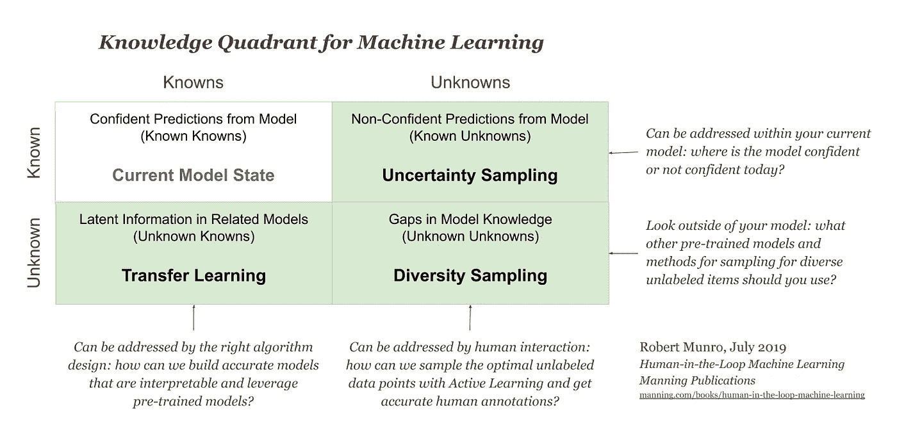

# 多样性抽样备忘单

> 原文：<https://towardsdatascience.com/https-towardsdatascience-com-diversity-sampling-cheatsheet-32619693c304?source=collection_archive---------15----------------------->

当您构建受监督的机器学习模型时，您希望确保它尽可能覆盖一组不同的数据和真实世界的人口统计数据。确保你的模型有多样化的训练数据的方法是一种叫做*多样化抽样*的*主动学习*。

备忘单中涵盖的四种多样性采样类型是:

1.  **基于模型的异常值:**对逻辑和隐藏层中的低激活进行采样，以找到由于缺乏信息而使模型混乱的项目
2.  **基于聚类的采样:**使用无监督的机器学习从数据的特征空间中所有有意义的趋势中采样数据
3.  **代表性采样:**相对于当前训练数据，最能代表模型目标领域的采样项目
4.  **现实世界的多样性:**当试图支持现实世界的多样性时，使用增加公平性的采样策略

本文分享了实现分集采样的四种常用方法的备忘单。下次当您需要决定如何为一个需要支持不同用例的模型创建训练数据时，请使用它作为参考！

Voice technologies supporting different variants of a language

在之前的一篇文章中，我分享了一份[不确定性采样](/uncertainty-sampling-cheatsheet-ec57bc067c0b?source=friends_link&sk=e1ebcc288e0e0d5db72d2ea13151a7a0)的备忘单。不确定性抽样是看你的模型在哪里混淆了。在机器学习的[知识象限](/knowledge-quadrant-for-machine-learning-5f82ff979890?source=friends_link&sk=9672722cf46b0f050c1adbe9b09de096)中，不确定性采样是您的“已知未知”。也就是说，您知道您的模型由于低置信度预测而变得混乱。多样性抽样是你的“未知的未知”，你的模型知识中的差距不是那么明显:

不用说，很难发现你不知道的东西，所以分集采样的算法比不确定性采样的算法更具探索性和多样性。这变得更加困难，因为你的模型需要知道的往往是一个不断变化的世界中的移动目标。正如人类每天都在学习新单词、新对象和新行为以应对不断变化的环境一样，大多数机器学习算法也部署在不断变化的环境中。

# 一个需要多样性采样的例子

想象一下，你的工作是建立一个语音助手，它可以为尽可能多的用户带来成功。你公司的领导希望你的机器学习算法比任何一个人都拥有更广泛的知识:一个典型的英语使用者从英语的 20 万个单词中知道大约 4 万个单词，这只占语言的 20%，但你的模型应该有接近 100%的覆盖率。你有许多未标记的录音可以标记，但人们使用的一些词非常罕见。如果你随机抽样录音，那么你会错过这些罕见的单词。因此，您需要明确地尝试获取涵盖尽可能多的不同单词的训练数据。你可能还想知道当人们和他们的语音助手说话时最常用的词是什么，并从中抽取更多的例子。

你也担心人口的多样性。这些录音主要来自一种性别和居住在少数地方的人，这意味着产生的机器学习模型可能对该性别更准确，而且只对某些口音更准确。因此，您希望尽可能公平地从不同的人口统计数据中进行采样，并使模型对所有人口统计数据都同样准确。

最后，有许多人不会说英语，他们想要一个语音助手，但你只有很少的非英语数据。所以，你可能不得不坦诚面对语言多样性的限制。

这显然是一个比简单地知道你的模型何时被混淆更困难的问题，这就是为什么多样性抽样的解决方案本身比不确定性抽样的解决方案在算法上更多样化。这也是为什么我可以将不确定性采样的实际代码和方程压缩在一页的备忘单中，但这对于多样性采样是不可能的。

# 下载代码和备忘单:

您可以在此下载 diversity_sampling.py 文件中的代码:

 [## rmunro/pytorch_active_learning

### 用于将新闻标题分类为与灾难相关或无关的人在回路机器学习系统的代码…

github.com](https://github.com/rmunro/pytorch_active_learning) 

该代码包含使用 PyTorch 的所有算法的实现，以及对灾难响应相关文本进行分类的用例。这是我最喜欢的一个用例，因为我从事灾难响应的时间几乎和我从事机器学习的时间一样长。

您可以在此下载 PDF 版本的备忘单:

[http://www . Robert Munro . com/Diversity _ Sampling _ cheat sheet . pdf](http://www.robertmunro.com/Diversity_Sampling_Cheatsheet.pdf)

另见最近的这篇伟大文章:[神经网络知道它不知道的时候吗？](/does-a-neural-network-know-what-it-doesnt-know-c2b4517896d7)蒂瓦达·卡丹

这份备忘单摘自我的书《人在回路中的机器学习:

https://www . manning . com/books/human-in-the-loop-machine-learning

有关每种方法的更多细节以及比图像和文档级标记更复杂的问题，如预测文本序列和图像的语义分割，请参见该书。多样性的原理是一样的，但是多样性的计算会有所不同。

我的书的章节已经出版了——多样性抽样章节已经出版了，下一个将是高级主动学习章节。我会一边走一边分享摘录！

罗伯特·芒罗

2019 年 9 月