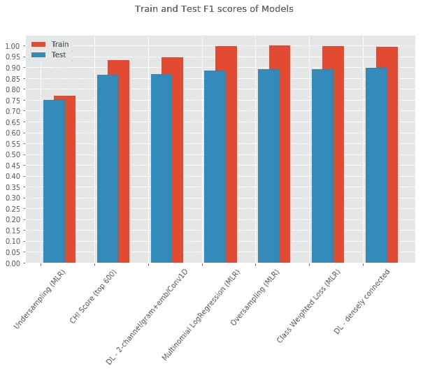

# 端到端食谱烹饪分类

> 原文：<https://towardsdatascience.com/https-towardsdatascience-com-end-to-end-recipe-cuisine-classification-e97f4ac22104?source=collection_archive---------12----------------------->

## AWS Lambda 函数，BeautifulSoup，Python，Sci-Kit Learn

Preparing Breakfast photo credit: Mark Weins @ [https://migrationology.com/pakistan-travel-guide/](https://migrationology.com/pakistan-travel-guide/)

谁应该读这篇文章？

如果您有兴趣从零开始了解机器学习系统的高级概述，包括:

—数据收集(网络搜集)

—处理和清理数据

—建模、培训和测试

—部署为云服务

—重新运行系统、获取任何新配方以及重新训练模型的计划

# 介绍

因为好奇，成长和学习的愿望——我决定从头开始构建一个 ML 系统，涵盖从数据收集和清理、建模、培训和测试，以及作为云服务部署的所有内容。也就是现实生活中适用的东西。

我已经找到了关于各部分的有用文章，但是将信息拼凑在一起，从导师和同事那里获得进一步的指导，以及阅读文档来填补知识空白，这些都需要时间。我决定记录我的过程，希望它能帮助其他人在谷歌上搜索“如何做”我的文章可以解决的事情。

本文不是我所使用的工具的教程，而是描述我如何构建这个系统，以及我在这个过程中所做的决定，用最低的成本和最简单的方法来完成工作。

# 概观

整个项目分为两部分:

1.  AWS 管道
2.  建模工作和结果

所有的代码都托管在我的 GitHub repo [这里](https://github.com/kulsoom-abdullah/kulsoom-abdullah.github.io/tree/master/AWS-lambda-implementation)。

*即将发布的第三部分将介绍如何使用 AWS API 向序列化模型提交输入数据并发回响应(预测)。*

# 为什么食谱美食分类？

Mark Weins @ [https://migrationology.com/pakistan-travel-guide/](https://migrationology.com/pakistan-travel-guide/)

为什么我选择建立一个美食分类器？我喜欢食物。从小到大，我既品尝过巴基斯坦北部的美食，也品尝过我生活过的美国城市的美食。我一直喜欢尝试来自美国以外的其他国家的朋友和同事的其他美食，当我去旅行时，我已经接触到了。随着时间的推移，全球美食是如何起源和发展的。我注意到成分和方法的区别和重叠，以及它是如何基于人口迁移和殖民主义而融合的。今天，所有类型的食物都有信息，人们几乎可以尝试任何一种食物，而不必去旅行。

Spices on Plate With Knife — Creative Commons Images [https://www.pexels.com/](https://www.pexels.com/creative-commons-images/)

这方面的商业应用可用于节省人类在标记错误分类的食谱、为数据库或档案分类新食谱方面的审核时间。

# 使用 AWS Lambda 函数实现无服务器

AWS Lambda 函数等无服务器架构流行的原因之一是不需要在云端管理服务器。用亚马逊的话说:

> AWS Lambda 是一个[无服务器计算](https://aws.amazon.com/serverless/)服务，它运行您的代码来响应事件，并自动为您管理底层计算资源。AWS Lambda 可以自动运行代码来响应[多个事件](http://docs.aws.amazon.com/lambda/latest/dg/intro-core-components.html#intro-core-components-event-sources) …

我使用的组件是写入和检索数据的 S3 桶、分发 web 抓取的简单服务队列(SQS)和处理模型端点的 API 网关。

注意:对于权限，我将我的 [lambda 函数设置为对我使用的 S3 桶和 SQS 有完全访问权](https://github.com/kulsoom-abdullah/kulsoom-abdullah.github.io/blob/master/AWS-lambda-implementation/template.yaml)。出于安全原因，可以也应该设置一个精确的权限类型列表，以避免事故，尤其是在有更多移动部件的设置中。

# 配方数据收集

我的目标是对几个菜系进行分类，并且来自一个有大量食谱的网站。我最终选择了[allrecipes.com](https://www.allrecipes.com)，因为它很受欢迎，而且在食谱公布前会有一个[审核检查](https://www.wikihow.com/Submit-a-New-Recipe-to-Allrecipes)来确认其有效性。如果没有提及，可能会有偏见问题，如菜肴中主菜类型的分布，以及拼写错误、不真实或放错地方的菜肴配方等问题。业务问题是，it 需要预测的数据是什么样的？训练数据是否反映了这一点？我想简单地开始——我能用我能得到的做什么。

allrecipes.com world cuisine page

每个美食网址滚动时动态生成单独的食谱链接，这些链接是我需要刮。我想把我选择的 6 个菜系的抓取任务分配到单独的 lambda 调用中，并且在 900 秒的限制内。为了实现这一点，我使用了 lambda 函数， [queue_cuisine_URLs.py](https://github.com/kulsoom-abdullah/kulsoom-abdullah.github.io/blob/master/AWS-lambda-implementation/src/queue_cuisine_URLs.py) 将 6 个美食 URL 发送到一个简单的服务队列(SQS)， *cuisine_URLs* ，这触发了 lambda 函数， [scrape_html_links.py](https://github.com/kulsoom-abdullah/kulsoom-abdullah.github.io/blob/master/AWS-lambda-implementation/src/scrape_html_links.py) *。*它首先通过获取 S3 桶 *recipe-url-page-numbers、*中的任何对象来检查是否已经抓取了某个菜系，否则从第 1 页开始抓取食谱 url，并将它们放入 *recipe-scraped-data* S3 桶中。

AWS Architecture Flowchart

然后`[parse_direct_URLs.py](https://github.com/kulsoom-abdullah/kulsoom-abdullah.github.io/blob/master/AWS-lambda-implementation/src/parse_direct_URLs.py)` Lambda 函数从*配方抓取数据* S3 桶中抓取配方文本，并将它们放入*配方-全部接收数据* S3 桶中。我从每个配方中解析的字段是:

*   身份证明（identification）
*   标题
*   描述
*   等级
*   复习
*   佐料

我决定的配方文本解析规则和模型管道(在第 2 节中描述)受 Sagemaker 支持，并且不需要创建容器来使用我的代码。我用 Python 代码创建了一个 [Sagemaker notebook 实例](https://github.com/kulsoom-abdullah/kulsoom-abdullah.github.io/blob/master/AWS-lambda-implementation/model_implementation/Sagemaker%20recipe%20classification%20deployment.ipynb)来解析菜谱、向量化和训练模型。模型管线被酸洗(序列化)并保存到 S3 桶中。

当事件触发按其常规时间表(每周)发生时，整个流程重新开始，获取任何新的配方，并重新训练模型。数据的规模非常小，模型足够简单，因此我不需要担心训练数据的存储问题、对整个训练数据的子集进行采样，或者对数据进行训练所需的时间。

*进行中——使用 S3 的静态网页为模型提供服务，接收用户输入的食谱，转到 AWS API，输入到模型中，并获得预测结果。这篇博文将会被编辑，第二部分将会发表。*

# 建模工作

我想回答的一些问题是:

*   仅用配料就能正确地将菜谱从 6 种不同的菜系中分类吗？
*   我能对每一类做得多好，而不仅仅是所有类的平均准确度？
*   是否有必要收集更多的训练数据，或者我是否可以使用其他方法来解决这个问题？

# 二元情况

为了开始并找出是否值得推进这个项目，我从[二进制案例](https://htmlpreview.github.io/?https://github.com/kulsoom-abdullah/kulsoom-abdullah.github.io/blob/master/AWS-lambda-implementation/model_implementation/recipe%20binary%20classification/recipe%20binary%20classification.html)开始。

## 意大利和印度——截然不同的两极？

第一次尝试将使用印度和意大利食谱，提出预处理成分列表的规则，并尝试一个简单的 BagofWords 分类模型。我从意大利菜和印度菜开始，因为它们似乎是一个简单问题的对比菜系，而且这些菜系的食谱数量是最多的。

## [解析文本规则](https://htmlpreview.github.io/?https://github.com/kulsoom-abdullah/kulsoom-abdullah.github.io/blob/master/AWS-lambda-implementation/model_implementation/recipe%20binary%20classification/recipe%20binary%20classification.html#Words-to-Remove)

## —重量和度量

我认为，重量和度量是那种不会给模型增加价值的词(除非我将数量作为一个特征，而不仅仅是成分词)。以下是成分列表的一个示例:

*   1 汤匙植物油
*   1/4 杯白糖
*   1/4 茶匙盐
*   两杯万能面粉
*   2/3 杯水

结果，这留下了这些成分名称:*，植物油，白糖，盐，面粉，和水*，因此过滤。

## **—数据泄漏**

在检查这些成分时，我发现了可能会泄露数据的单词，并将它们添加到我的过滤列表中:“意大利风格”、“法国风格”、“泰国风格”、“中国风格”、“墨西哥风格”、“西班牙风格”、“印度风格”、“意大利风格”

## —词汇化

另外，我只做了词条整理，没有选择词干。这是为了让我更容易理解成分的重要性，如果我认不出这个词，就不必回头去查这个没有成分的词。例如，“1 片朝鲜蓟”，我想要的是*朝鲜蓟*，而不是[带茎的结果](https://text-processing.com/demo/stem/) *朝鲜蓟。这样做并没有增加不同单词的数量。*

## —其余的

那还剩下很多其他的词。有先进的 NLP 技术来识别单词的实体，这将计算单词是成分的[概率，而其余的是成分单词周围的度量、纹理、动作和其他类型的单词。简单地打印出最常用的单词，并目测哪些单词没有用添加到过滤规则中，结果很好，并且只有相对较少的一组独特的单词需要向量化，我采用了这种方法。另一个原因是这样做也节省了很多时间。](https://open.blogs.nytimes.com/2015/04/09/extracting-structured-data-from-recipes-using-conditional-random-fields/)

这些最终的成分名称使用 scikit-learn 中的[计数矢量器库](https://scikit-learn.org/stable/modules/generated/sklearn.feature_extraction.text.CountVectorizer.html)转换成来自训练集的单词矩阵。

## 类别计数

Count of Indian and Italian cuisines

意大利食谱比印度食谱多 3 倍多(2520 比 787)。一个 ML 模型学习什么是印度的数据够吗？ML 会比 76%更好吗(一个虚拟分类器，每个食谱都被归类为意大利菜)

## *多项式朴素贝叶斯*

使用简单快速的多项朴素贝叶斯方法在训练集和测试集上得到了两种菜系几乎“完美”的 f1 加权分数。三重分层交叉验证的得分是一致的:

*   平均训练分数:0.986
*   平均测试分数:0.984

因为训练和测试分数几乎相等，所以过度拟合不是问题。因为训练分数不是完美的 1，所以我们训练不足。为了减少欠拟合从而增加训练分数，选项是增加模型复杂度或使用更复杂的模型。未来的工作可以集中在使用更复杂的模型，如随机森林。我在这里停下来，因为我对这个分数很满意，并继续进行多类案例。

# 多类案件

作品在[这个 Jupyter 笔记本](https://htmlpreview.github.io/?https://github.com/kulsoom-abdullah/kulsoom-abdullah.github.io/blob/master/AWS-lambda-implementation/model_implementation/recipe%20multiclass%20classification/recipe%20multiclass%20classification.html)里。这 6 个班级是中国人、法国人、印度人、意大利人、墨西哥人和泰国人。最终结果在下面的[汇总表](https://medium.com/p/e97f4ac22104#a249)中。

## 相关著作

我发现的一些基于成分文本分析的食谱烹饪分类的相关工作与我的工作有相似的发现。他们都没有一个平衡的类数据集。[这个团队](http://cs229.stanford.edu/proj2015/313_report.pdf)由于其庞大的训练集，在逻辑回归方面取得了最好的结果。他们发现，对实例规模较小的类进行上采样不会产生更好的结果。[这个团队](http://jmcauley.ucsd.edu/cse190/projects/fa15/022.pdf)使用随机森林，在训练集上比回归有更好的训练分数，但由于测试结果更差而过度拟合。他们对 39，774 个食谱的准确率为 77.87%。两个团队都不报告每种菜系的单项得分，而是报告所有菜系的总体准确度。

## [初步分析](https://htmlpreview.github.io/?https://github.com/kulsoom-abdullah/kulsoom-abdullah.github.io/blob/master/AWS-lambda-implementation/model_implementation/recipe%20multiclass%20classification/recipe%20multiclass%20classification.html#Pipelines-and-K-fold-validation-to-compare-text-processing-and-models)

我发现使用二元模型给了整体分数一些提升，使用计数矢量器相对于 TFIDF 有更好的结果。基于相关的工作成果和我对某些菜系的专业知识，这是意料之中的。(第 4 页，共[页)本文](http://jmcauley.ucsd.edu/cse190/projects/fa15/022.pdf)解释了为什么 tf idf 在食谱分类问题上比计数矢量器差。)由于这些结果，我修改了我的`parse_recipes`函数，将有用的两个单词成分考虑到文档字符串中，并使用 BagofWords。

随机森林过拟合数据，由于数据的增加，逻辑回归比多项式朴素贝叶斯具有更好的结果。我还通过实现每个模型并查看混淆矩阵来检查 F1 分数。结果如下，选择的型号和代码留在 Jupyter 笔记本中[。](https://htmlpreview.github.io/?https://github.com/kulsoom-abdullah/kulsoom-abdullah.github.io/blob/master/AWS-lambda-implementation/model_implementation/recipe%20multiclass%20classification/recipe%20multiclass%20classification.html#Recipe-Cuisine-Part-2---Multi-Classification)

Initial results

最佳模型性能是具有计数矢量化的逻辑回归，其平均测试分数为 0.870，训练分数为 0.997。我开始更详细地分析这个模型。

## [逻辑回归](https://htmlpreview.github.io/?https://github.com/kulsoom-abdullah/kulsoom-abdullah.github.io/blob/master/AWS-lambda-implementation/model_implementation/recipe%20multiclass%20classification/recipe%20multiclass%20classification.html#Logistic-Regression)

随着数据量的增长，[逻辑回归比朴素贝叶斯](http://www.cs.cmu.edu/~tom/mlbook/NBayesLogReg.pdf)表现更好。对于配方数据集也是如此。查看每个菜系的个人得分，有过度拟合的情况，不清楚阶级不平衡是否是一个问题。例如，总共有 75 种墨西哥食谱的 F1 得分 **=** 为 0.73，而有 387 种法国食谱的 F1 得分为 0 **。** 63 **。**

Logistic Regression train/test confusion matrix heat maps

一些观察结果:

*   法语通常被误认为是意大利语
*   墨西哥人最容易被误认为意大利人
*   泰语被误归类为汉语，然后是印度语。
*   墨西哥作为意大利有点出乎意料，但我可以看到为什么一些印刷案件。

> —一个墨西哥食谱和意大利食谱一样的例子:
> *梅子牛至鱼汤香蕉大蒜番茄肉汤黄油梅子番茄洋葱橄榄油黑胡椒马槟榔橄榄海湾盐油胡椒白鱼腌绿橄榄肉桂*

训练集的分数高于测试，我试图处理这种过度拟合和可能的类不平衡贡献。

## [损失函数中的类权重](https://htmlpreview.github.io/?https://github.com/kulsoom-abdullah/kulsoom-abdullah.github.io/blob/master/AWS-lambda-implementation/model_implementation/recipe%20multiclass%20classification/recipe%20multiclass%20classification.html#Class-weights-in-loss-function)

`[class_weight='balanced'](https://chrisalbon.com/machine_learning/logistic_regression/handling_imbalanced_classes_in_logistic_regression/)`参数将与它们在 sci-kit learn 逻辑回归类中的频率成反比地对类进行加权。这给出了更高的 F1 平均训练分数 0.997 和测试分数 0.892。在没有班级加权损失的情况下，个别班级的表现有所改善。

Logistic Regression (class weighted loss) train/test confusion matrix heat maps

## [过采样和欠采样](https://htmlpreview.github.io/?https://github.com/kulsoom-abdullah/kulsoom-abdullah.github.io/blob/master/AWS-lambda-implementation/model_implementation/recipe%20multiclass%20classification/recipe%20multiclass%20classification.html#Oversampling-and-Undersampling)

我使用了一个名为[不平衡学习](https://imbalanced-learn.readthedocs.io/en/stable/)的 Python 包来实现过采样和欠采样，并找出这对美食的评分有多大帮助。

Logistic Regression (oversampling) train/test confusion matrix heat maps

Logistic Regression (undersampling) train/test confusion matrix heat maps

相比之下，过采样除了降低墨西哥分数和法国分数之外，并没有产生太大的影响。F1 训练的总得分为 1.0，测试得分为 0.89。欠采样表现最差，训练 F1 得分为 0.77，测试 F1 得分为 0.75

## [卡方检验](https://htmlpreview.github.io/?https://github.com/kulsoom-abdullah/kulsoom-abdullah.github.io/blob/master/AWS-lambda-implementation/model_implementation/recipe%20multiclass%20classification/recipe%20multiclass%20classification.html#Calculating-Chi-square-(%CF%87%C2%B2-)) (χ)

最后，对成分特征使用χ检验并选择前 K 个显著特征是处理训练集过拟合的另一种方法。训练 F1 得分为 0.934，测试 F1 得分为 0.866。与类加权损失函数逻辑回归等其他模型相比，训练分数略有下降，测试分数没有提高。

Logistic Regression (χ² 600 best) train/test confusion matrix heat maps

以下是根据类别频率按 chi2 排序的前 10 个成分词:

1.  鱼:1897.8449503573233
    [('泰国'，48)，('中国'，8)，('印度'，6)，('法国'，5)，('意大利'，4)，('墨西哥'，1)]
2.  孜然:1575.1841574113994
    [('印度'，275)，('意大利'，16)，('墨西哥'，9)，('泰国'，6)，('中国'，1)，('法国'，1)]
3.  外壳:138.64852859006
    [('墨西哥'，12)，('印度'，3)]
4.  马萨拉:146 页，146 页，147 页，147 页，147 页，148 页，148 页，146 页，147 页，146 页，146 页，146 页，146 页，146 页，146 页，147 页，146 页，146 页，146 页，146 页，146 页，146 页，146 页，146 页，146 页，146 页，146 页，146 页，146 页，147 页，146 页，146 页，146 页，16 页，16 页
5.  奶酪:1155.8931811338373
    [('意大利人'，1074)、('法国人'，85)、('印度人'，22)、('墨西哥人'，9)、('泰国人'，3)、('中国人'，2)]
6.  鱼酱:1119.2711018711018
    [('泰国'，45)，('法国'，2)，('中国'，2)]
7.  姜黄:999.0619453767151
    [('印度'，225)，('泰国'，8)，('意大利'，1)]
8.  花生:994.6422201344235
    [('泰国'，42)，('中国'，26)，('印度'，24)，('意大利'，3)]
9.  lime: 991.2019982362463
    [('泰国'，43)，('印度'，33)，('墨西哥'，17)，('意大利'，8)，('法国'，4)，('中国'，3)]
10.  芝麻:958.9888557397035
    [('中国人'，77)、('印度人'，8)、('意大利人'，7)、('泰国人'，7)、('法国人'，1)]

得分最高和最频繁出现在法语中的成分直到#66:

格鲁耶尔:291.2451127819549
[('法语'，17)，('意大利语'，2)]

# 深度学习

出于好玩和好奇，我还用 Keras 实现了[两个深度学习](https://htmlpreview.github.io/?https://github.com/kulsoom-abdullah/kulsoom-abdullah.github.io/blob/master/AWS-lambda-implementation/model_implementation/recipe%20multiclass%20classification/recipe%20multiclass%20classification.html#Appendix)架构。密集连接的 2 层网络具有 0.996 的训练 F1 分数，并且通过 tad 以上类加权逻辑回归得到的最佳测试 F1 分数为 0.8995。

在第二个架构中，我使用了具有嵌入和 Conv1D 的多通道 2-gram，得到的训练 F1 分数为 0.945，测试 F1 分数为 0.8699。我想尝试使用二元模型来看看简单的深度学习架构会有多大的不同。我在这里找到了一个[实现，我将其用作指南。我认为 RNN 不会像 word2vec 那样做太多，因为配料的顺序与菜肴无关。](https://machinelearningmastery.com/develop-n-gram-multichannel-convolutional-neural-network-sentiment-analysis/)

Final Results

# 实验:更多的数据会有助于过度拟合、分数不高的类和类不平衡吗？

**【编辑于 2019 年 6 月 1 日】**

我总共收集了 4177 个数据点——按类别细分:中国人= 260，法国人= 387，印度人= 787，意大利人= 2520，墨西哥人= 75，泰国人= 148。这让我尝试[一个实验](https://htmlpreview.github.io/?https://github.com/kulsoom-abdullah/kulsoom-abdullah.github.io/blob/master/AWS-lambda-implementation/model_implementation/recipe%20multiclass%20classification/recipe%20multiclass%20classification.html#Would-more-data-help-with-class-imbalance?)来测试获取更多的数据来平衡这些类是否会有所改进。如果获取更多数据非常耗时或昂贵，这可能是一个重要的量化指标。根据我得到的结果，还不清楚班级的不平衡是否导致了低的考试分数。

我画出了每种菜肴的测试和训练分数。测试数据是固定的。培训班级的规模从 25 人开始，并以 25 人为增量继续。如果大小小于类计数，则向下采样以将它们设置为相等。这种情况一直持续到人数超过班级人数。

垂直彩色线标记 x 轴上的最大类计数。印度和中国在 1000+左右的训练规模时达到顶峰，而在这个分数以下则持平。墨西哥的峰值更早，接近 500，持平略低。印度，意大利和法国在 1400 左右，然后逐渐减少，以接近相同的分数。泰国在 1300 点，然后也平线收盘。我可以通过绘制更多的网格线并获得最大 f1 分数出现的确切 x 值来进行深入研究，但总体趋势表明，收集更多的数据将会有所帮助。本笔记中所有其他尝试的结果表明，收集更多数据是提高训练分数的最后选择。

# 结果摘要

# 结论摘要

*   中国人、法国人和印度人的班级加权得分最高
*   意大利语用 Conv1D 和 multigram 嵌入 DL 做得最好，其次是类加权逻辑回归。
*   墨西哥在过采样方面做得最好，其次是类别加权逻辑回归。

我为 AWS 部署选择的模型是逻辑回归中的类加权损失函数，这是最简单也是最好的。商业决策可以基于你想要的分类器有多完美，基于它训练和执行的速度，你有多少数据，以及它在生产中需要如何工作。

除了收集更多数据之外，其他想法是将成分的数量作为特征权重的一部分。