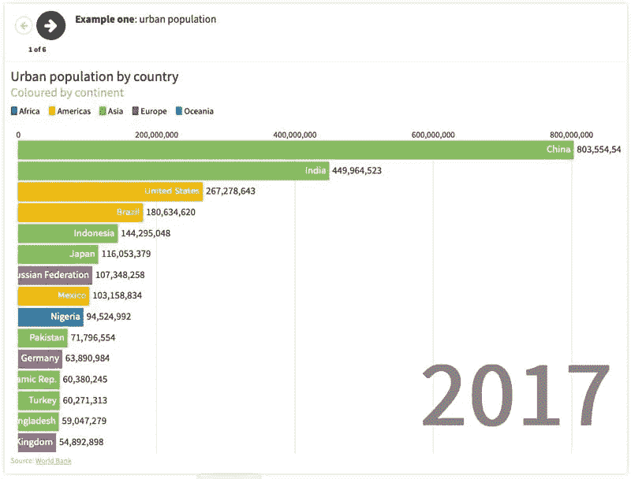

# 关于动画条形图你需要知道的一切

> 原文：<https://towardsdatascience.com/https-towardsdatascience-com-everything-you-need-to-know-about-animated-bar-charts-be033f398619?source=collection_archive---------6----------------------->

## 用 R 语言生成动画条形图的分步指南


一个动画条形图基本上是一个迷人的动画趋势图，棒线根据等级上升到顶端。制作一个动画条形图通常涉及 3 个变量，其中之一通常是时间变量。剩下的两个变量是

1.  代表国家名称、公司名称等类别的变量
2.  代表每个类别的相应值的变量。

下面是一些动画条形图的例子*(图片来自谷歌，给所有者的信用):*



# 你希望在这篇文章中找到什么？

在这篇文章中，我将提出两个要点:

1.  为什么动画条形图如此受欢迎和重要？(简短地)
2.  如何在 R 中创建动画条形图？(本文主要关注点)

*   如何将 excel 文件导入 R
*   使用“ggplot2”包可视化静态图
*   用“gganimate”包创建动画

当然，你可以在网上找到很多关于如何创建动画条形图的不同来源。有各种各样的工具可以用来创建这样一个柱状图，比如 Tableau、Power BI、Visme、fluore 等等。然而，更多的时候，这些工具并不是免费的。因此，我想介绍如何在 R 中做到这一点，这是一个免费的统计软件，每个人都可以使用。

在 R 中创建一个动画柱状图并不是什么新鲜事。你肯定可以在网上找到很多关于如何在 r 中做到这一点的资源。然而， ***就像我的许多其他文章一样，我想给你们一个简单而详细的分步指南(带有一些解释和数据在每个步骤中的样子的截图，这样每个人都可以很容易地跟随，即使没有实际下载数据并亲自尝试)*** 。

如果这听起来像是你喜欢的，那我们就开始吧！！

# 为什么动画条形图如此受欢迎？

我们都喜欢用数据讲故事。然而，制作一个既能讲述一个故事又能在视觉上吸引大量观众的图表并不总是容易的。既然我们想提供大量的信息，但同时又不想用一个图表/图轰炸观众太多的信息，那么为什么不创建一个动画可视化，将所有的图结合在一起呢？

动画条形图帮助我们可视化趋势随时间的变化，这种类型的图表非常受欢迎，尤其是在社交媒体上，因为它们在简洁易懂的图表中提供了整体数据故事/见解。

# 如何在 R 中创建动画条形图？

## 下载数据并导入到 R

在这篇文章中，我将查看 2002 年至 2018 年在澳大利亚大学注册的国际学生的国籍，并查看这些年来，排名前 10 位的国籍是什么。数据集在[这里](https://internationaleducation.gov.au/research/DataVisualisations/Pages/Student-number.aspx)可用。点击“获取数据”,然后就完成了。


原始数据集如下所示:


“月”列包含两个类别:8 月和 12 月。由于 8 月摄入的数据仅在 2019 年可用，我决定使用 12 月摄入的数据，因为数据在 2002 年至 2018 年的 12 月可用。因此更容易创建动画条形图。注意，最后我们只需要 3 列，即**年份、国籍**和**学生**。这足以产生一个动画条形图。最终数据集将如下所示:


使用 **Filter** 函数，然后删除不相关的行和列，清理原始数据集以获得如上的最终数据集的过程简单明了。我不会详细讲述如何去做，因为这不是本文的重点。如果你有任何困难，请在评论区告诉我。你也可以先把原始数据导入 R，然后用‘tidy verse’包清理数据。但是，既然我们大多数人都是在 Excel 中打开下载的文件，为什么不干脆一直清理那里的数据呢:)？

现在，让我们假设我们已经获得了只有 3 列的最终数据集。我会把它命名为“Dec Intake.xlsx”。

**现在让我们将这些数据导入到 R** ，**中，只需使用 read_excel()函数**

```
library(readxl) # remember to install before loading this package dec_intake = read_excel('Dec Intake.xlsx')
View(dec_intake)
```


由于我们希望以这样的方式创建一个条形图，即每年只显示前 10 个国籍，我们需要用“tidyverse”包整理上面的数据集。

```
library(tidyverse)dec_intake_formatted = dec_intake %>% 
  group_by(Year)%>%      
  mutate(rank = rank(-Students),
         Value_rel = Students/Students[rank==1],
         Value_lbl = paste0(" ",Students)) %>%
  group_by(Nationality) %>%
  filter(rank <= 10)View(dec_intake_formatted)
```


让我解释一下代码:

*   **group_by(Year)** :首先，我按照年份对数据进行分组
*   **mutate()** :创建新列
*   **rank = rank(-Students)** :创建“rank”列，对该年的学生人数进行排名。“学生”旁边的“-”号表示最大的人数将排在 1 号，第二大的人数排在 2 号，依此类推。
*   **Value_rel = Students/Students[rank = = 1]**:创建“Value _ rel”列，其中国籍等级编号 1 的值为 1.0，以下国家的值小于 1.0
*   **Value_lbl = paste0("，Students)** :创建“Value_lbl”列，用于标记每个等级中的学生人数。该列在后面很有用，因为它将在动画条形图中为我们提供标签。
*   **filter()** :每年只选择前 10 个国家

我们现在有一个干净的数据集准备绘图。让我们进入下一步。

## 在绘图中创建动画

```
library(ggplot2)   # to create static plot
library(gganimate)  # to add animation to static plot 
```

让我们创建一个名为' **anim** '的新变量。以下是本部分的完整代码:

```
anim = ggplot(dec_intake_formatted, aes(rank, group = Nationality))+
  **geom_tile**(aes(y = Students/2,
                height = Students,
                width = 0.9), alpha = 0.8, color = NA) +
  **geom_text**(aes(y = 0, label = paste(Nationality, " ")), vjust = 0.2, hjust = 1, size = 7) + #determine size of the Nationlity label
  **geom_text**(aes(y=Students,label = Value_lbl, hjust=0),size = 8 ) +  #determine size of the value label
  **coord_flip**(clip = "off", expand = TRUE) +
  **scale_x_reverse**() +
  **theme_minimal**() +
  **theme**(axis.line=element_blank(),
        axis.text.x=element_blank(),
        axis.text.y=element_blank(),
        axis.ticks=element_blank(),
        axis.title.x=element_blank(),
        axis.title.y=element_blank(),
        legend.position="none",
        panel.background=element_blank(),
        panel.border=element_blank(),
        panel.grid.major=element_blank(),
        panel.grid.minor=element_blank(),
        panel.grid.major.x = element_line( size=.1, color="grey" ),
        panel.grid.minor.x = element_line( size=.1, color="grey" ),
        plot.title=element_text(size=25, hjust=0.5, face="bold",     colour="red", vjust=-1),
        plot.subtitle=element_text(size=18, hjust=0.5, face="italic", color="red"),
        plot.caption =element_text(size=12, hjust=0.5, face="italic", color="red"),
        plot.background=element_blank(),
        plot.margin = margin(1,4, 1, 8, "cm")) +
  **transition_states**(Year, transition_length = 4, state_length = 1) +
  **ease_aes**('sine-in-out') +
  **labs**(title = 'Number of International Students Enrolled in Australia per Year by Nationality: {closest_state}',  
       caption  = "Data Source: [https://internationaleducation.gov.au/Pages/default.aspx](https://internationaleducation.gov.au/Pages/default.aspx)")
```

不要被上面的代码吓到！如果您熟悉 ggplot2 中的语法，它们实际上非常简单。如果你是新来的，也没关系，因为这篇文章是给初学者的。我现在将解释上面的每一行代码。

```
anim = ggplot(dec_intake_formatted, aes(rank, group = Nationality))+
  **geom_tile**(aes(y = Students/2,
                height = Students,
                width = 0.9), alpha = 0.8, color = NA)
```

这里要创建柱状图，可以使用 geom_bar()。不过这里我要介绍一下 geom_tile()，就是在地块中创建瓦片。这在我们处理 3 个变量，即国家、学生和时间时特别有用。对于 geom_bar()，如果我们使用两个变量，通常会更有用。[这里的](https://rstudio.com/wp-content/uploads/2015/03/ggplot2-cheatsheet.pdf)是我觉得非常有用的帮助表。更多信息也可以参考一下。

```
aes(y = Students/2, ...)
```

现在，为什么是“学生/2”而不仅仅是“学生”，或者“学生/3”等等？让我们来测试一下:

```
anim = ggplot(dec_intake_formatted, aes(rank, group = Nationality))+
  **geom_tile**(aes(**y = Students**,
                height = Students,
                width = 0.9), alpha = 0.8, color = NA)anim = ggplot(dec_intake_formatted, aes(rank, group = Nationality))+
  **geom_tile**(aes(**y = Students/2**,
                height = Students,
                width = 0.9), alpha = 0.8, color = NA)anim = ggplot(dec_intake_formatted, aes(rank, group = Nationality))+
  **geom_tile**(aes(**y = Students/3**,
                height = Students,
                width = 0.9), alpha = 0.8, color = NA)anim = ggplot(dec_intake_formatted, aes(rank, group = Nationality))+
  **geom_tile**(aes(**y = Students/4**,
                height = Students,
                width = 0.9), alpha = 0.8, color = NA)
```


至此，你大概知道我为什么选择 Students/2 作为论点了。代码的下一部分将是:

```
**geom_text**(aes(y = 0, label = paste(Nationality, " ")), vjust = 0.2, hjust = 1, size = 7) #determine size of the Nationlity label
  + **geom_text**(aes(y=Students,label = Value_lbl, hjust=0),size = 8 ) #determine size of the value label
```

这两行代码允许我们确定标签的大小，即国籍名称和学生人数。

```
**coord_flip**(clip = "off", expand = TRUE) +
  **scale_x_reverse**() +
  **theme_minimal**()
```

*   **坐标翻转()**:翻转坐标以便更好的可视化
*   **scale_x_reverse()** :让排名靠前的国家名称出现在顶部，并随着我们沿轴向下移动而减少。
*   这是一种定制我们剧情主题的方式。根据您的风格，您也可以使用各种其他主题。我选择了 theme_minimal()，因为我希望一切都简单。

```
**theme**(axis.line=element_blank(),
        axis.text.x=element_blank(),
        axis.text.y=element_blank(),
        axis.ticks=element_blank(),
        axis.title.x=element_blank(),
        axis.title.y=element_blank(),
        legend.position="none",
        panel.background=element_blank(),
        panel.border=element_blank(),
        panel.grid.major=element_blank(),
        panel.grid.minor=element_blank(),
        panel.grid.major.x = element_line( size=.1, color="grey" ),
        panel.grid.minor.x = element_line( size=.1, color="grey" ),
        plot.title=element_text(size=25, hjust=0.5, face="bold", colour="red", vjust=-1),
        plot.subtitle=element_text(size=18, hjust=0.5, face="italic", color="red"),
        plot.caption =element_text(size=12, hjust=0.5, face="italic", color="red"),
        plot.background=element_blank(),
        plot.margin = margin(1,4, 1, 8, "cm"))
```

[这里](https://ggplot2.tidyverse.org/reference/theme.html)是 ggplot2 包中主题的完整列表。来源解释了我在上面的块中使用的每一个元素。所以这真的取决于你希望你的动画条形图看起来像什么。对我来说，同样，我希望我的情节看起来简单，所以你可以看到我把大部分参数作为 **element_blank()。**这样你就可以随心所欲地定制自己的主题。

但是我想请你注意这一部分:

```
plot.margin = margin(1, 4, 1, 8, "cm")
```

> **第一个**和**第三个**数字表示**顶部**和**底部**边缘。
> 
> **第二**和**第四**数字表示**右**和**左**余量。

没有固定的边距。一切都取决于你情节的尺度。换句话说，这是一个反复试验的过程。例如，如果国家的名称很长，您可能希望增加一点边距，以便它能适合框架。经过几次试验后，获得了上述裕度组合(1，4，1，8)。

酷！现在我们有了静态图。让我们创建过渡来制作动画图表。

```
anim <- ggplot(dec_intake_formatted, aes(rank, group = Nationality)) + geom_tile(aes(y = Students/2,
                height = Students,
                width = 0.9), alpha = 0.8, color = NA) +
  geom_text(aes(y = 0, label = paste(Nationality, " ")), vjust = 0.2, hjust = 1, size = 7) + #determine size of the Nationlity label
  geom_text(aes(y=Students,label = Value_lbl, hjust=0),size = 8 ) +  #determine size of the value label
  coord_flip(clip = "off", expand = TRUE) +
  scale_x_reverse() +
  theme_minimal() +
  theme(axis.line=element_blank(),
        axis.text.x=element_blank(),
        axis.text.y=element_blank(),
        axis.ticks=element_blank(),
        axis.title.x=element_blank(),
        axis.title.y=element_blank(),
        legend.position="none",
        panel.background=element_blank(),
        panel.border=element_blank(),
        panel.grid.major=element_blank(),
        panel.grid.minor=element_blank(),
        panel.grid.major.x = element_line( size=.1, color="grey" ),
        panel.grid.minor.x = element_line( size=.1, color="grey" ),
        plot.title=element_text(size=25, hjust=0.5, face="bold", colour="red", vjust=-1),
        plot.subtitle=element_text(size=18, hjust=0.5, face="italic", color="red"),
        plot.caption =element_text(size=12, hjust=0.5, face="italic", color="red"),
        plot.background=element_blank(),
        plot.margin = margin(1,4, 1, 8, "cm")) +
  **transition_states**(Year, **transition_length** = 4, **state_length** = 1) +
  **ease_aes**('sine-in-out') +
  **labs**(title = 'Number of International Students Enrolled in Australia per Year by Nationality: {closest_state}',  
       caption  = "Data Source: [https://internationaleducation.gov.au/Pages/default.aspx](https://internationaleducation.gov.au/Pages/default.aspx)")
```

*   **过渡 _ 长度**:动画长度
*   **state_length** :状态停顿的相对长度
*   **ease_aes()** :表示在动画中应该如何缓和不同的美感
*   labs() :这是你添加标题、说明、副标题的地方。

也可以使用:**enter _ fade()**+**exit _ fade()**使过渡更加平滑。有关参数的更多信息，您可以参考“gganimate”包指南 [**此处**](https://cran.r-project.org/web/packages/gganimate/gganimate.pdf) 。然而，在我看来，您不需要使用软件包中介绍的所有参数。就像我在这里介绍的一些论点就足够了。

## 创建 gif

使用 **animate()** 函数，

```
library(gifski)
library(png)animate(anim, nframes = 350,fps = 25,  width = 1200, height = 1000, 
        renderer = gifski_renderer("gganim.gif"))
```

*   **nframes** 是帧数。数字越大，过渡越好。这和画漫画差不多。想象一下，如果你画了许多捕捉角色单个动作的页面，然后翻阅所有页面，动作会显得非常流畅。同样的概念也适用于此。但是，帧数越多，处理时间就越长。r 将花费更多的时间和消耗更多的能量。
*   **fps** 是每秒花费在每一帧上的时间(默认为 10)
*   **宽度、高度**:动画的尺寸，以像素为单位
*   **Renderer:** 设置将每一帧合成一个动画的函数(默认为 gifski_renderer())

完整的论据列表，你也可以在这里 参考指南 [**。**](https://cran.r-project.org/web/packages/gganimate/gganimate.pdf)

## 将所有东西放在一起，这就是最终的输出


就是这样！希望你们喜欢这篇文章，并从中有所收获。下次当你们在网上或任何地方遇到动画趋势柱状图时，我希望你们都能有信心用像 r 这样简单免费的工具生成这样的图表。

如果你有任何问题，请在下面的评论区写下来。让我知道你们用什么样的数据集来做这种图表。谢谢你的阅读。祝您愉快，编程愉快！！！

> 如果您有兴趣了解更多关于 R 的信息，请查看我在 R 、[随机森林](/implement-random-forest-in-r-b00b69eb8501)和[预测](/implementing-prophet-time-series-forecasting-model-f16d2a191acc)中关于[探索性数据分析的其他文章！](/exploratory-data-analysis-in-r-for-beginners-fe031add7072)