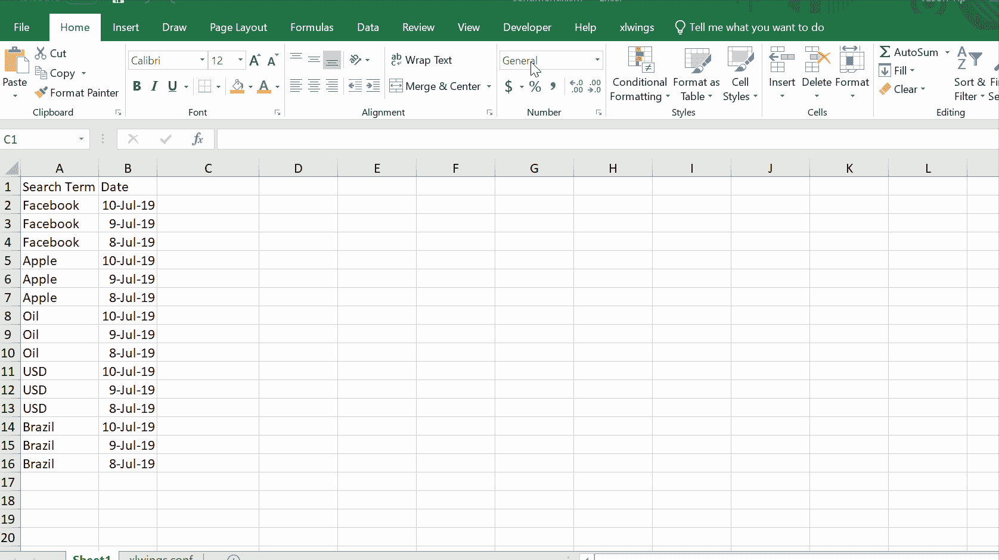
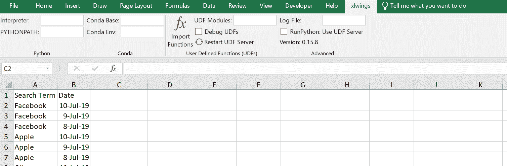

# 在 Excel 中生成新闻情感评分

> 原文：<https://towardsdatascience.com/https-towardsdatascience-com-generate-news-sentiment-scores-in-excel-1edddfc25163?source=collection_archive---------15----------------------->

## 具有单一功能

Null result for days which have no news articles on The Business Times

**刮掉的新闻文章**

Search result for USD on the 8th July, Sentiment Score: -0.1409

我收到了我的一个读者的请求，他在[的算法交易中使用了对新闻文章](/https-towardsdatascience-com-algorithmic-trading-using-sentiment-analysis-on-news-articles-83db77966704)的情绪分析，来创建一个通用工具，让你可以从网上搜集的新闻文章([《商业时报》](https://www.businesstimes.com.sg/))中获得情绪分数。我以前在 algo 交易中用它作为衡量标准，但我认为它对投资组合管理或金融风险方面的人也非常有用。

# 想法

这个想法是为了让非技术用户更容易在 Excel 上根据他们在不同的日子里感兴趣的各种术语得到简单的一对一的分数。我可以想象这将被用于投资组合的重新平衡，甚至作为媒体监控的自动化形式。我在之前的[帖子](/https-towardsdatascience-com-algorithmic-trading-using-sentiment-analysis-on-news-articles-83db77966704)中描述了网络抓取和情感评分。

# 设置的 9 个简单步骤

***仅限 Windows ***

## 1。 [LinkedIn 消息](https://www.linkedin.com/in/jasonyip184/)我用你的电子邮件获取了项目文件夹

## 2。打开项目文件夹中的 perspective . py

Replace the highlighted path with your own aka C:/Users/bob/Desktop/sentiment/stock_lexicon.pickle

## 3.下载并安装 Anaconda (Python)

[https://www.anaconda.com/distribution/#download-section](https://www.anaconda.com/distribution/#download-section)

## 4。打开命令提示符，创建 conda 环境

conda create -n py36 python=3.6 && activate py36

## 5。进入情感项目目录并安装包

假设文件夹在您的桌面上

cd desktop/sentiment && pip install -r requirements.txt

## 6。在 Excel 中显示开发者标签

File > Options > Customize Ribbon

## 7。启用设置

File > Options > Trust Center > Trust Center Settings > Macro Settings > Trust access to the VBA project object model

## 8。打开 perspective . xlsm 并启用 xlwings

## 9。将 xlwings 指向您的 conda 环境并导入 python 函数

指定 Anaconda3 的安装路径

Conda Base: C:\Users\bob\Anaconda3

# 和..我们完了！

欢迎分享任何意见或想法！