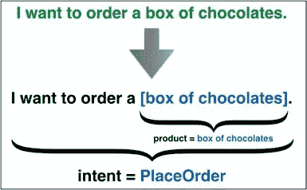
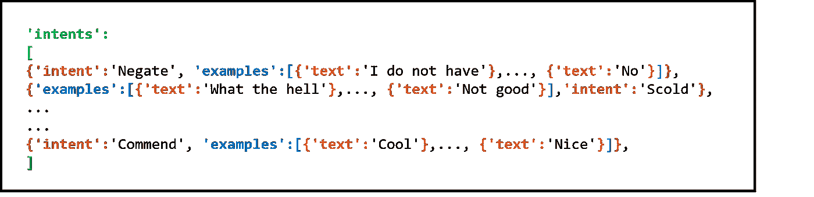
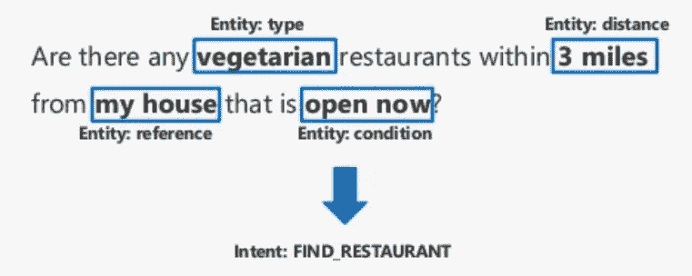
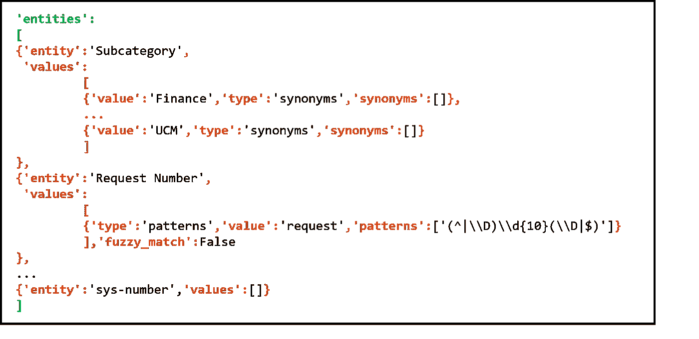

# 如何分析训练一个聊天机器人的质量？

> 原文：<https://towardsdatascience.com/https-towardsdatascience-com-how-to-analyze-the-quality-of-training-a-chatbot-bf73d5f5b4b7?source=collection_archive---------27----------------------->

## 评估聊天机器人训练的一些重要指标。

目前，聊天机器人已经出现。我们可以说，大多数有网站的公司都有一些机器人，甚至在不知道的情况下(因为有特别训练有素和实施的机器人)，大多数人已经与一个机器人互动过。

伴随着机器人，出现了无限的概念，例如:实体、意图、对话节点、工作空间、技能等等。还需要评估机器人提供的培训和服务表现。亲爱的读者，我们已经进入了…超级数据科学家。

举一个很肤浅的一笔，下面对齐一下:

*   **AI 模型:**由一组意图和实体组成。
*   **人工智能提供商**:它是一个工具，使用人工智能模型对机器人用户发送的新消息进行分类(该引擎的例子是 Watson)。

如果“人工智能模型”是好的，“人工智能提供者”将在用户与聊天机器人的对话中按预期执行。同样，这就像评估老师教给学生的内容(人工智能模型)，从而确保如果内容是正确的，学生(机器人)能够在日常生活中应用这些知识。
IBM 推荐的注意点之一是，在训练中不存在重复表达，无论是与意图相关还是与实体相关。在这篇文章中，我展示了如何评估这些重复的存在与否。

所以来吧，让我们开始吧…

**1-意向**

意图意味着用户期望机器人支持什么。

Example of intent used in bot training.

*   **结构:**

在机器人工作区有几个对象，其中之一是“意图”。**里面的‘意图’:[]**都是在 bot 训练中使用的意图。

每个意向都有 **{ '意向'**和**'实例' }** 对象。在 **'intent'** 对象中是意图的名称，在 **'examples': []** 中是该意图的所有表达式示例，这些示例在' examples '对象中报告:[ **{'text': ''}** ，…， **{'text': ''}** ]。

不应该重复的是 **{'text': ''}** 中的表达式。

Structure of intents in the workspace — Watson Assistant.

**分析:**

为了检查机器人是否被训练了重复的例子，我在 jupyter 笔记本上创建了一个脚本，可以在我的 github 上找到

*   导入所需的库，并使用沃森助手中的凭据创建对象；
*   用 bot 训练中使用的工作空间创建“original_workspace”对象；
*   对进行**循环，遍历每个意图的例子，寻找重复；**

**2 个实体**

实体意味着信息的补充，即用户希望执行的动作的参数。

Example of entities used in bot training.

*   **结构:**

在 bot 工作区中有几个对象，其中之一是“实体”。在**‘实体’:[]**对象内部是所有用于训练机器人的实体。

每个实体都有 **{ '实体'**和**'值' }** 。在对象**‘entity’**中是实体的名称，在**‘values’:[]**对象中是该实体的值和同义词。

值在' values': [{'value': ''}]内报告，同义词在' values': [{'synonyms': ['']}]内报告。

Structure of entities in the workspace — Watson Assistant.

**分析:**

继续我在 github 上提供的脚本。对于实体，建议实体名称、值和同义词之间不要有重复的表达式。

*   为创建一个**循环，通过寻找重复项来遍历实体名称、值和同义词:**

感谢阅读。

# 给我看看代码！

要使用我在 github 中分享的代码，您必须安装 python 和 jupyter notebook，或者使用 IBM 创建的允许您在云端执行分析的平台。为此，只需实例化您的[数据科学体验](https://console.bluemix.net/catalog/services/data-science-experience)版本。

步骤:

1.  接近 DSX 号。
2.  创建新项目。
3.  在“资产”选项卡上，单击“创建笔记本”。
4.  在 [github 中访问我的代码。](https://github.com/danicunhase/Intents-and-Entities.git)复制粘贴。
5.  在笔记本中，根据您要分析的助手更改凭据。

搞定了。