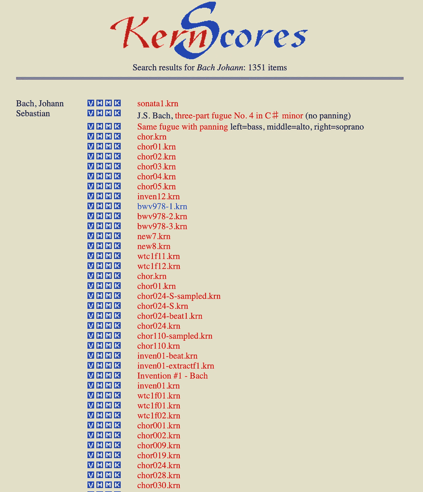

# 如何闪电般下载文件

> 原文：<https://towardsdatascience.com/https-towardsdatascience-com-how-to-download-files-in-a-lightning-speed-a8e8dcc694f7?source=collection_archive---------11----------------------->

## 以及不同解析工具之间的详细比较


> 你可以有没有信息的数据，但你不能有没有数据的信息。— [丹尼尔·凯斯·莫兰](http://en.wikipedia.org/wiki/Daniel_Keys_Moran)

随着分析技能在最近几天受到高度重视，如何获得高质量的数据也很重要。如果没有更多或高质量的数据，伟大的分析总是无法进行。

有一天，

我的一个朋友问我。

“伟鸿，在点击下载音乐文件的链接之前，你知道媒体文件是否会立即下载吗？

如果链接指向另一个网站，并显示错误信息，该怎么办？我不想下载邮件，我只需要媒体文件。"

我说，“这是个好问题。让我想清楚，然后尽快回复你。”

过了一会儿，我说:“给你！”


```
def is_downloadable(url):
    """
    Does the url contain a downloadable resource
    """
    h = requests.head(url, allow_redirects=True)
    header = h.headers
    content_type = header.get('content-type')
    if 'text' in content_type.lower():
        return False
    if 'html' in content_type.lower():
        return False
    return True
```

上述函数将用于检查 URL 是否包含可下载的源，其逻辑如下所示:

1.  不是直接下载 URL 的内容并检查源的类型，而是检查 URL 的请求头。
2.  检查标题的内容类型，如果它既不是文本也不是 Html，这意味着 URL 带有可以下载的源。

接下来，我在考虑加速代码。除了使用 BeautifulSoup 来解析 Html，有没有其他替代方法可以得到同样的结果，但比 BeautifulSoup 更快？

答案是肯定的，下面我将向你展示如何使用其他更快的 Html 解析器。在此之前，让我们比较一下从 Html 中提取数据的各种比较著名的工具。

1.  美丽的声音
2.  Lxml
3.  html 解析器
4.  Selectolax



这是我们将要抓取的[网站](http://kern.humdrum.org/search?s=t&keyword=Bach%20Johann&fbclid=IwAR39fsc8gUWjN6eYAUkewldNkeV499lX0Ew6VP8Nrrd_T1T7plaIIIb5nFQ)，我们将点击 **M** 来下载巴赫约翰的音乐。

## 美丽的声音

```
from bs4 import BeautifulSoup
import wget
soup = BeautifulSoup(r.text, 'lxml')css_path = 'tr > td:nth-child(2) > a:nth-child(3)'for node_link in soup.select(css_path):
   url = node_link['href']
   if is_downloadable(url):
        wget.download(url, 
                     './data/' +\
                     url.split('&file=')[-1].split('&format')[0] +\
                     '.mid')
```

上面的代码片段是使用 BeautifulSoup 作为我们工具的代码。

如 BeautifulSoup 文档中所述，

> 漂亮的汤永远不会像它上面的解析器一样快。

因为它是建立在 LXML 之上的，所以我们将把它用作我们的解析器。如您所知，我们使用 CSS 来定位数据。

## LXML

```
import lxml.html
import wgetdom = lxml.html.fromstring(r.text)
css_path = 'tr > td:nth-child(2) > a:nth-child(3)'for node_link in dom.cssselect(css_path):
    url = node_link.get('href') # OR node_link.attrib['href'] # check whether the url is downloadable
    if is_downloadable(url):
        wget.download(url, 
                     './data/' +\
                     url.split('&file=')[-1].split('&format')[0] +\
                     '.mid')
```

上面的代码说明了如何使用 LXML 解析器访问 HTML。正如您所观察到的，语法看起来非常类似于 BeautifulSoup。此外，Lxml 不仅支持 CSS，还支持 Xpath，因此如果您更熟悉使用 Xpath，那么 LXML 将是您更好的选择，而不是 BeautifulSoup。

## html 解析器

```
from html.parser import HTMLParser
import wgetclass MyHTMLParser(HTMLParser):
    links = []
    def handle_starttag(self, tag, attrs):
        if tag != 'a':
            returnfor attr in attrs:
            if 'href' in attr[0]:
                if attr[1].endswith('format=midi'):
                    self.links.append(attr[1])
                    breakparser = MyHTMLParser()
parser.feed(r.text)for url in parser.links:
   if is_downloadable(url):
       wget.download(url, 
                     './data/' +\
                     url.split('&file=')[-1].split('&format')[0] +\
                     '.mid')
```

Python 框架内置了一个 [HTML 解析器](https://docs.python.org/3.7/library/html.parser.html?highlight=htmlparser)，上面的代码用它来提取 URL。这有点复杂，因为我们需要创建自己的 HTMLParser 类来覆盖原始类中的`handle_starttag`方法。对我来说，我很少使用 HTMLParser，因为其他可用的工具更容易实现。

## Selectolax

```
from selectolax.parser import HTMLParser
import wgetfor node_link in dom.css(selector):
   url = node_link.attributes['href'] if is_downloadable(url):
       wget.download(url, 
                     './data/' +\
                     url.split('&file=')[-1].split('&format')[0] +\
                     '.mid')
```

我开始知道 Selectolax 包是当有人回复我的 Reddit 评论，告诉我试试这个包。(感谢这位 Reddit 的朋友！🤗)基本上，它是一个适度的引擎的 Cython 包装器。经过尝试，解析 HTML 页面的速度有所提高，但幅度不大。同样的建议，如果你更熟悉 XPATH，就用 LXML 代替。


## 性能概述

作为实验，我使用不同的工具总共下载了 **1349 个** MID 文件。运行 **20** 次后，平均每个工具所用的时间，结果如下:

```
+---------------+--------------------+
| Package       | Average Time taken |
+---------------+--------------------+
| BeautifulSoup | 1300.94s           |
| LXML          | 1258.89s           |
| Selectolax    | 1241.85s           |
| HTMLParser    | 1265.95s           |
+---------------+--------------------+
```

Selectolax 是最快的，但差别并不明显。

总之，如果你真的需要提高你的铲运机或爬虫的速度，那么也许选择 Selectolax 更好。如果您更熟悉 Xpath，请使用 LXML。此外，也许你正在处理一个设计糟糕的网站(就 Html 文档结构而言)，最好选择 BeautifulSoup。最后但同样重要的是，如果您想挑战自己，那么就使用 HTMLParser 吧😎😎😎。

到目前为止，我希望您对用于解析 Html 页面的每个 Python 包有了更好的理解。

## 参考

1.  [https://stack overflow . com/questions/4967103/beautiful soup-and-lxml-html-what-to-preferred](https://stackoverflow.com/questions/4967103/beautifulsoup-and-lxml-html-what-to-prefer)
2.  [https://www . mschweighauser . com/fast-URL-parsing-with-python/](https://www.mschweighauser.com/fast-url-parsing-with-python/)
3.  [https://www . code mentor . io/aviar Yan/downloading-files-from-URLs-in-python-77 q3b S10 un](https://www.codementor.io/aviaryan/downloading-files-from-urls-in-python-77q3bs0un)
4.  [https://stack overflow . com/questions/71151/html-parser-in-python](https://stackoverflow.com/questions/71151/html-parser-in-python)
5.  [https://stack overflow . com/questions/6126789/selecting-attribute-values-from-lxml](https://stackoverflow.com/questions/6126789/selecting-attribute-values-from-lxml)

# 关于作者

[Low 魏宏](https://www.linkedin.com/in/lowweihong/?source=post_page---------------------------)是 Shopee 的数据科学家。他的经验更多地涉及抓取网站，创建数据管道，以及实施机器学习模型来解决业务问题。

他提供爬行服务，能够为你提供你所需要的准确和干净的数据。你可以访问 [**这个网站**](https://www.thedataknight.com/) 查看他的作品集，也可以联系他获取**抓取服务**。

你可以在 [LinkedIn](https://www.linkedin.com/in/lowweihong/?source=post_page---------------------------) 和 [Medium](https://medium.com/@lowweihong?source=post_page---------------------------) 上和他联系。

[](https://medium.com/@lowweihong?source=post_page-----3efb6878f8db----------------------) [## 低微红—中等

### 在媒体上阅读低纬鸿的作品。数据科学家|网络搜集服务:http://datainfinite.mystrikingly.com/…

medium.com](https://medium.com/@lowweihong?source=post_page-----3efb6878f8db----------------------)