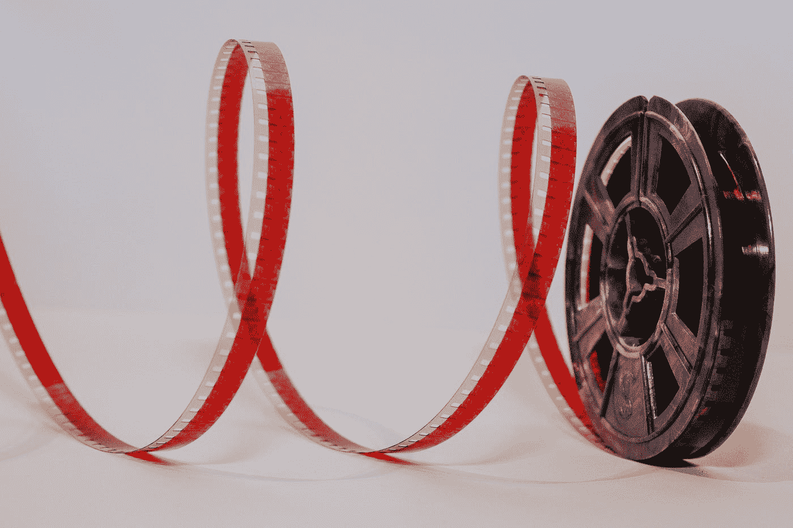
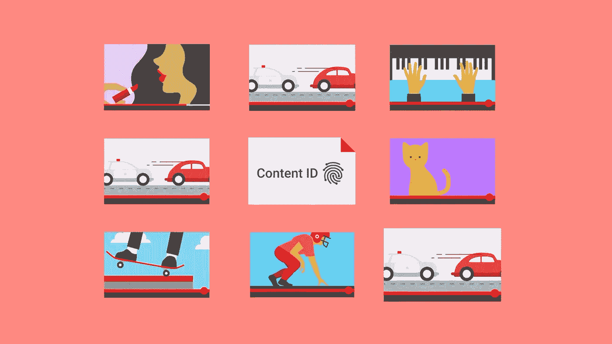
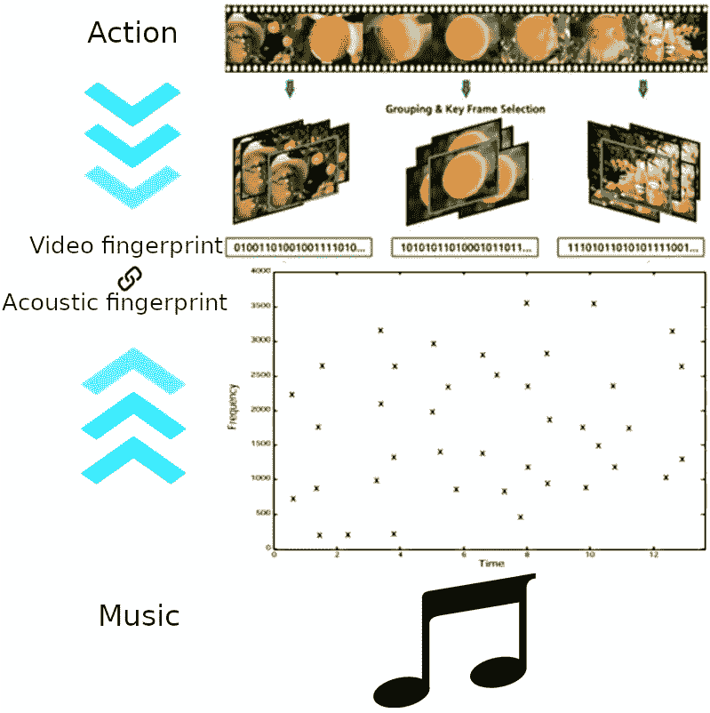
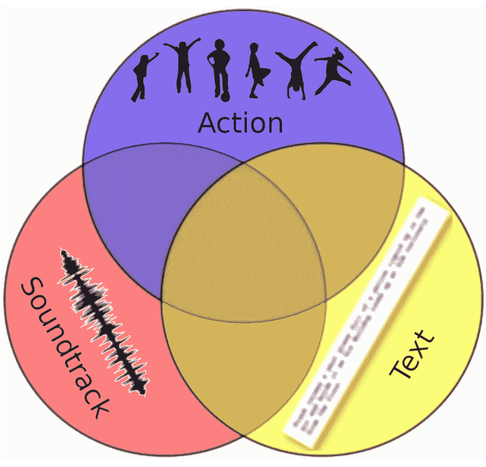

# 如何使用深度学习为您的视频找到合适的音乐

> 原文：<https://towardsdatascience.com/https-towardsdatascience-com-how-to-find-the-right-music-for-your-video-using-deep-learning-58541eb8bc3b?source=collection_archive---------12----------------------->

假设您有一个自定义视频，并且想要其中某些场景的配乐。这种方法描述了如何通过数字指纹技术将动作、文本和音乐链接在一起。

Photo by [Denise Jans](https://unsplash.com/@dmjdenise?utm_source=medium&utm_medium=referral) on [Unsplash](https://unsplash.com?utm_source=medium&utm_medium=referral)

在这篇文章中，我将介绍一种可能的方法，可以给你一个关于如何选择视频背景音乐的答案。无论你做什么:你的 Youtube 频道的博客或电影比赛的业余电影，或者你经营一个专业的制作工作室，或者你是一个游戏开发者，你需要为你的游戏找到一个配乐——无论如何，好的音乐都会增加你的视频的价值。

这种方法描述了如何使用机器学习为视频挑选音乐。这个概念可以使用[深度学习](https://medium.freecodecamp.org/want-to-know-how-deep-learning-works-heres-a-quick-guide-for-everyone-1aedeca88076)作为更广泛的机器学习方法家族的一部分来实现。

在看了 Instagram 视频和[商品评论](https://greenice.net/build-review-website/)后，我萌生了自动为视频挑选音乐的想法。我开始研究并试图理解这是否是一种先验的可能性。最后，我发现我的想法有权利被转化为一种方法，甚至转化为一种产品。然而，这将是一个资源密集型的机器学习系统开发。

# 你需要的音乐

当我们为一个视频选择音乐时，我们会遇到许多挑战，有些挑战来自一系列演绎和归纳的思维方式。

首先我们从一个场景描述开始。让我们把这种思维方式命名为‘向前’，在这里，我们观看视频，然后对我们所看到的进行分析和分类，并试图理解和描述我们产生的情绪。

之后要逆向思考。利用我们对情感的分析和描述的结果，我们需要在我们的脑海中找到一段适合所讨论场景的音乐。

所以，音乐和动作有一个共同点，那就是可以用语言来表达，但如果你没有这方面的经验，这就不那么容易了。描述一首音乐的一种方式是遵循[的建议](https://www.quora.com/How-do-you-describe-music-1)，将音乐作为一种艺术形式来分析。这将非常复杂，结果可能会变得非常主观。

然而，如果我们打算使用人工智能来挑选音乐，我们将需要找到另一个共同的数字分母。应该是来自原始媒体的少量[相关特征，它们可以像数据库的关键字段一样相互链接。该方法基于数字视频和声学指纹之间的时间一致性的概念。](http://disp.ee.ntu.edu.tw/~pujols/Introduction%20to%20Video%20Fingerprinting.pdf)

# 动作识别

第一步，我们将解决[动作识别](http://blog.qure.ai/notes/deep-learning-for-videos-action-recognition-review)的任务。今天，机器学习系统能够使用[视频指纹](https://en.wikipedia.org/wiki/Digital_video_fingerprinting)来检测和识别视频中的活动。你甚至可以在微软的计算机视觉服务上测试它。

这个领域也在 Kaggle 上流行起来。去年，谷歌开始了第一阶段的[竞赛](https://www.kaggle.com/c/youtube8m)来开发分类算法，该算法使用来自 Youtube 的新的和改进的 YT-8M V2 数据集准确地分配视频级别标签。

动作识别的目的是从电影帧中识别出[场景](https://en.wikipedia.org/wiki/Scene_(filmmaking))。作为这一阶段的结果，我们将有一个数字视频指纹和一个行动的文本描述。

# 最佳音乐

第二步是定义什么音乐最适合视频场景。幸运的是，在很多情况下，我们知道什么音乐应该适合一个动态图片所代表的故事。我们的生活经验帮助我们。电影充满了动作和声音的结合。从童年起，我们就知道什么声音符合追逐，或者恐惧、爱、快乐等情绪。

*电影摄影*，由于其受欢迎程度，为选择合适的轨道设定了质量标准。所以，我们可以用电影原声作为视频的例子。

在这种情况下， [Movieclips](http://www.movieclips.com/) 可以提供帮助，因为它是 YouTube 上最大的电影网络。每个剪辑包含一个简短的电影场景和一段简短的文字。

然而，配乐并没有覆盖电影或场景的整个持续时间。音乐出现在作者决定强调观众注意力的地方。因此，下一个任务是从其他声音或其缺失中选择音乐。类似于 [YouTube](https://support.google.com/youtube/answer/2797370) 、[内容 ID](https://www.adweek.com/digital/youtube-make-money-off-your-videos/) 或 [Shazam](https://www.shazam.com/) 的系统可以通过[声音指纹](https://en.wikipedia.org/wiki/Acoustic_fingerprint)的技术来实现。

Image source: [https://support.google.com/youtube/answer/2797370](https://support.google.com/youtube/answer/2797370)

[从音频中生成签名对于通过声音进行搜索至关重要。](http://coding-geek.com/how-shazam-works/)一种常见的技术是创建一个称为*频谱图*的时频图。任何一段音频都可以翻译成声谱图。随着时间的推移，每段音频被分割成一些片段。在某些情况下，相邻的时间段共享一个公共的时间边界，而在其他情况下，相邻的时间段可能会重叠。结果是一个图表，它描绘了音频的三维:频率对振幅(强度)对时间。

# 概念

正如我之前提到的，这个概念很简单。它表示视频的一个*动作*和一首*歌曲*之间的相互联系，作为数字视频指纹和声音指纹之间的时间一致性。

*Image by author*

旨在解决分类任务的监督深度学习算法可以分为两个阶段:

1.  训练-分析标记的电影数据库(检测动作和声音)并利用标记的动作和相应的配乐建立指纹数据库。

2.工作-从音乐数据库中选择曲目名称。

**警告:当我们使用计算机视觉** [**神经网络**](https://en.wikipedia.org/wiki/Artificial_neural_network) **时，我们应该考虑到** [**概率**](https://en.wikipedia.org/wiki/Probability) **这些术语。对于一个新的独特的视频，我们将使用** [**的不确定性**](https://en.wikipedia.org/wiki/Uncertainty) **来获利。**

# 两种选择

未来系统的输入数据有两种可能的选择:视频及其文本描述。声音、视频和文本在媒体文件或流式视频中是相互联系的。

*Image by author*

1.录像

机器学习系统将识别视频上的一个动作，创建一个[视频指纹](http://www.tele-tag.com/technology/)，在电影数据库中搜索相似的指纹，根据符合程度对结果进行排名，将结果与电影配乐相关联，并返回带有链接的**配乐列表**，例如，谷歌音乐或苹果 iTunes。

2.文本

通过视频的文字描述来搜索音轨，或者搜索你想要的音轨的关键部分，会让这个概念变得有点困难。该算法必须添加搜索动作-描述对应关系的过程。

# 副作用

在研究这个主题时，我公开了另一个有用的选项，该选项基于来自新视频和系统学习的视频之间的指纹差异的不确定性。

[深度学习分类模型往往给出归一化的得分向量](https://arxiv.org/pdf/1703.04977.pdf)，不一定能捕捉到模型的不确定性。它可以通过贝叶斯深度学习方法来捕获，贝叶斯深度学习方法为理解深度学习模型的不确定性提供了一个实用的框架。

这种不确定性可以被用作潜在修改**的度量，以使用[生成对抗网络](/understanding-generative-adversarial-networks-gans-cd6e4651a29)来生成新的音频指纹**。另一种选择是快速傅立叶逆变换(FFT)的实现，其可以生成**新的唯一音轨(音乐片段)**。来自 FFT 的自然损失可以通过来自先前生成的**音轨列表**的最佳匹配音乐的最近比特来补偿。

# 结论

所描述的概念示出了如何使用机器学习系统为视频选择音乐。它可以轻松找到视频项目或流媒体所需的最佳歌曲曲目。它还可以为最佳选择提供曲目的变体。

这一概念显示了其成为强大服务的重要功能的潜力，如 Youtube、谷歌照片、微软 Azure、 [Adobe Premiere Pro](https://www.adobe.com/products/premiere.html) 、 [Corel VideoStudio](https://www.videostudiopro.com) 和 [Pinnacle Studio](https://www.pinnaclesys.com/) 。然而，我认为基于概念的独立产品开发是低效的。

动作和文本可以用作音乐生成的输入数据。它可能没有人类的作品漂亮，但很可能是独一无二的，可以激发作者的创造力。

被揭示的副作用可能是人类创造力的一个伟大领域。它可以创造出了解一个活动或一个故事听起来如何的可能性。