# 使卷积网络再次保持平移不变

> 原文：<https://towardsdatascience.com/https-towardsdatascience-com-making-convolutional-networks-shift-invariant-again-f16acca06df2?source=collection_archive---------16----------------------->

## 现代卷积网络有什么问题，如何修复？如果你使用 CNN，你可能想读这个。

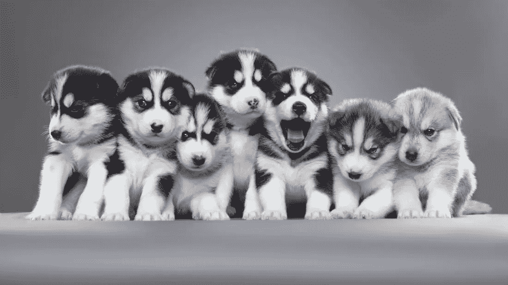

[istock.com/sarhange1](http://istock.com/sarhange1)

2019 年 4 月，一篇新的计算机视觉论文出现，标题为[“让卷积网络再次保持平移不变”](https://arxiv.org/abs/1904.11486)。为什么现代卷积网络不再是平移不变的，这意味着什么，我们如何使它们再次平移不变？

# 现代卷积网络怎么了？

大多数现代的卷积网络对于小的移位或转换来说是不健壮的。例如，网络输出可能会根据输入位置发生剧烈变化。

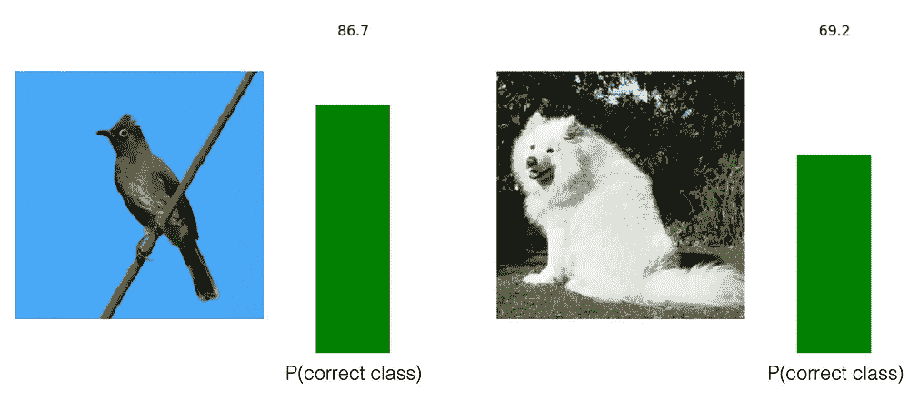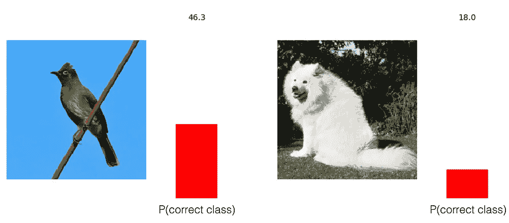

[The two sets of images look identical to us, but not to the convolutional network!](https://icml.cc/media/Slides/icml/2019/seasideball(12-14-00)-12-15-05-4561-making_convolut.pdf)

尽管卷积是平移不变的，并且汇集建立了平移不变性，但是跨越的**忽略了奈奎斯特采样定理和混叠，这**破坏了平移不变性**。在最大汇集和跨步回旋期间可以看到跨步。**

> 采样定理:如果对波形的采样速度是其最高频率分量的两倍，则可以对带限连续时间信号进行采样，并从其样本中完美地重建信号。

在信号处理中，**模糊**在二次采样之前用作抗混叠手段。在深度学习中，这种方法最终被 **max-pooling** 所取代，当时后者从经验上证明了更好的性能。

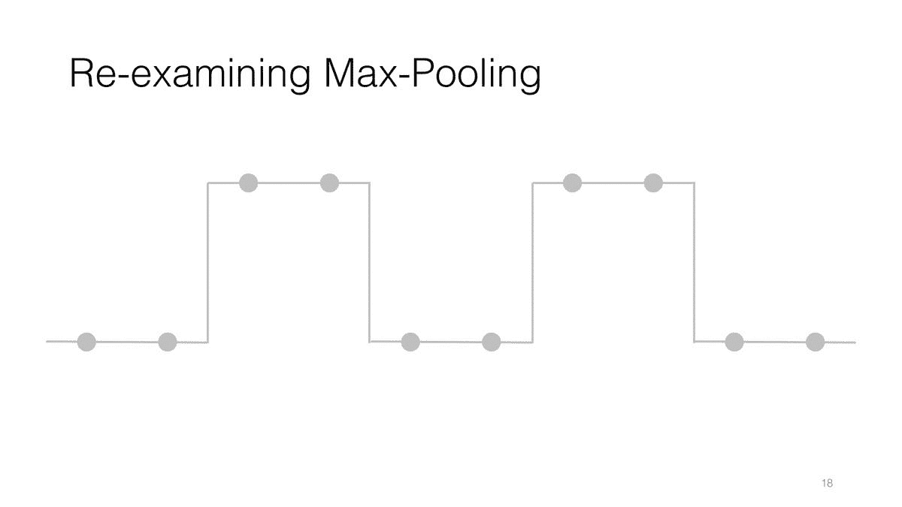

Max-Pooling operation on the same signal with two different shifts. The outputs are different, Max-Pooling breaks shift-equivariance

现有的工作提出了各种方法来增加下采样的抗混叠能力，例如通过密集地提取特征，通过在最大和平均池之间软选通，或者利用卷积核网络。然而，这些方法要么计算量大，没有充分利用平均池的抗锯齿能力，要么精确度较低。此外，大多数现有工作将最大池和平均池视为两个独立的、不兼容的下采样策略。

# 怎样才能给强大的网络加上抗锯齿？

本文试图调和经典反走样和最大池。首先，请注意，最大池操作相当于以**密集**的方式获取最大值，并从该中间特征图中进行**子采样**。第一个操作，密评，其实根本不别名；问题在于二次采样操作。因此，我们可以在二次采样之前添加一个模糊滤波器来减少混叠。模糊和子采样一起被评估为**模糊池**。

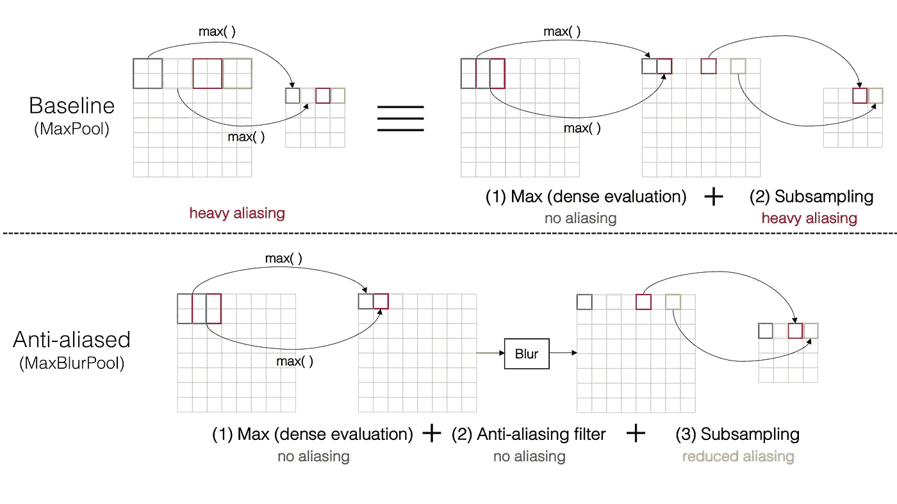

抗混叠可以类似地应用于其他卷积网络。对于步进卷积，我们可以在卷积和激活后简单地添加一个模糊池层。平均池相当于使用箱式滤镜的模糊缩减像素采样，因此用使用更强滤镜的模糊池替换它可以提供更好的等偏移方差。BlurPool 使用以下模糊滤镜进行测试:矩形-2 [1，1]，三角形-3 [1，2，1]和二项式-5 [1，4，6，4，1]。

# 我们如何评价抗锯齿？

在不同的计算机视觉架构上，对新的子采样策略进行了图像分类和生成测试。为了评估抗混叠性能，提出了三种移位不变性/等方差度量:

首先，将卷积网络视为特征提取器，其中每一层都是一个特征图。然后，一个度量是**内部特征距离**，它是特征映射的移位输出和具有移位输入的特征映射的输出之间的余弦距离。

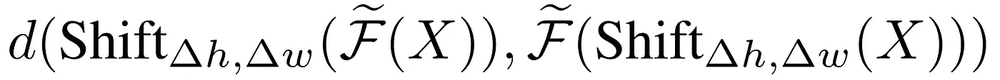

Internal feature distance for a feature map F tilda

接下来，我们可以通过检查模型多长时间预测来自同一图像的两个不同偏移的相同类别来评估**分类一致性**。

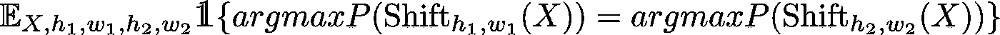

Classification consistency for prediction on different shifts

对于图像生成，我们可以通过测试输入图像的偏移是否会生成原始图像输出的偏移版本来评估**生成稳定性**。

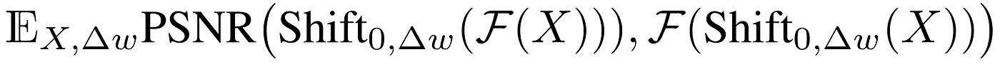

Peak signal-to-noise ratio between generated images with shifted and non-shifted input

# 结果

通过针对各种水平和垂直偏移计算 VGG 网络各层的内部特征距离，我们观察到抗锯齿网络保持了**更好的偏移-等方差**，并且最终输出更加偏移-可变。与基线网络不同，在缩减采样图层中，与理想的等偏移方差没有太大的偏差。

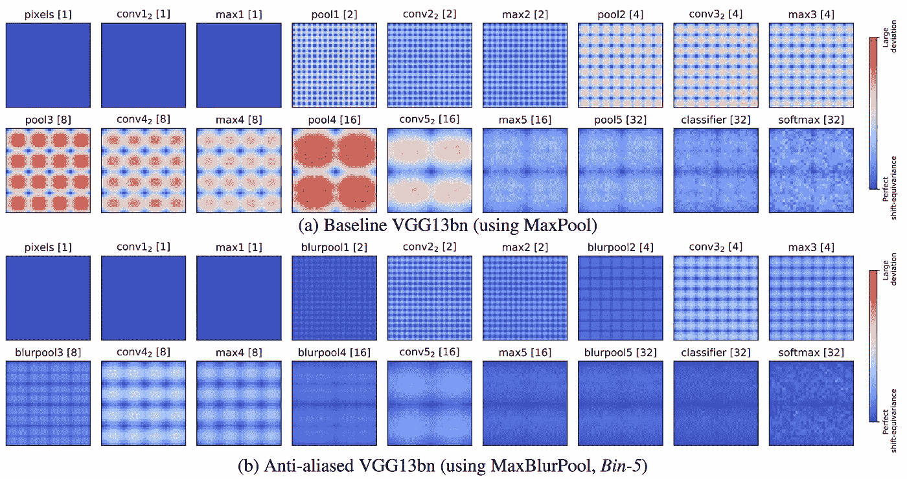

Each pixel in the heatmap corresponds to a shift (∆h, ∆w) where its color indicates feature distance. Big distance or large deviation is red, zero distance or perfect shift-equivariance is blue.

对于图像分类，添加低通滤波器可通过 ResNet50 增加**分类一致性**，其中强滤波器可进一步提高稳定性。此外，**绝对分类**精度也随着这些滤波器的增加而提高，而无需增加可学习的参数。事实上，低通滤波可以作为有效的正则化。

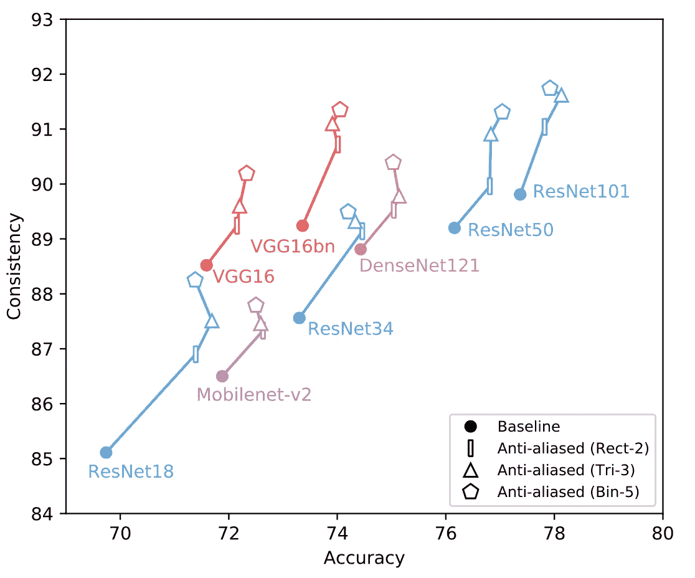

ImageNet classification consistency vs. accuracy

对于图像生成，低通滤波器被添加到 U-Net 架构的步长卷积层。输入有偏移和无偏移时生成的图像之间的 PSNR 也会增加，这意味着输出更加相似。

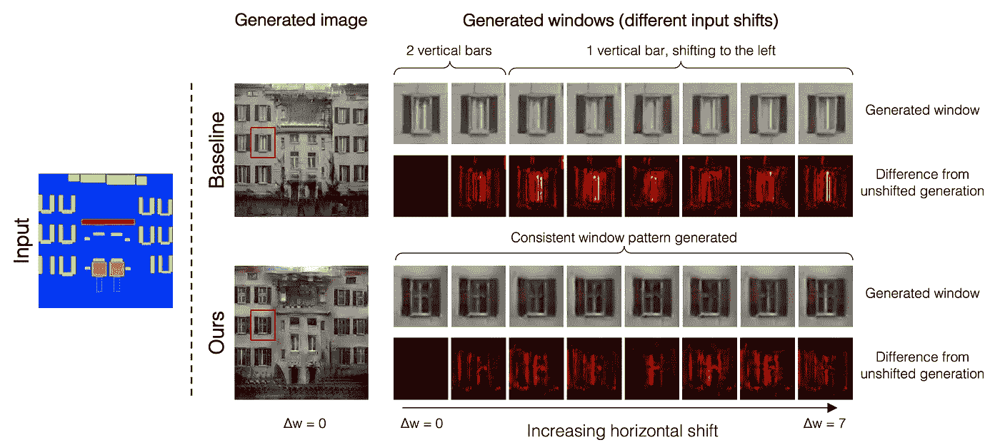

Selected example to demonstrate generation stability. Without anti-aliasing (top), shifting produces different looking windows. With anti-aliasing (bottom), the same window pattern is generated regardless of shifts.

此外，这种抗锯齿方法还提高了对噪声等其他扰动的稳定性。它还降低了对受损图像进行分类的平均错误率。因此，抗锯齿有助于为各种架构和任务获得更健壮和更通用的网络。

# 讨论

我自己尝试了这个模型，对一个预先训练好的反锯齿 Resnet18 模型进行了微调，用于灰度图像的[图像分类，训练数据不到 4 000 个。最初，这项任务是具有挑战性的，因为该模型倾向于过度拟合稀缺的训练数据。反走样确实帮助模型**一般化**，测试精度从 0.95865 提高到 0.97115。](/latest-winning-techniques-for-kaggle-image-classification-with-limited-data-5259e7736327)

本文提出的方法值得注意，因为它在不增加任何可学习参数的情况下提高了性能。拥有移位不变卷积网络意味着我们不再需要移位数据增强。两者都有助于缩短计算时间，并在计算机视觉任务中更好地概括。

最初的问题在于图像在视觉上可能看起来相似，但实际上它们之间有很大的距离。移位图像正是这种现象的一个常见例子。让我们提醒自己，好的卷积网络应该迎合人类的视觉。对我们来说看起来一样的图像对机器来说也应该如此。因此，平移不变网络更好地模拟人类感知，因为由网络提取的特征具有更好的平移等方差，并且平移后的图像更经常被认为是相同的。

经典的信号处理实践模糊抗混叠，但它已经在现代卷积网络中消失，目的是优化性能。本文的结果表明，在当前的卷积网络中添加抗锯齿功能可以同时提高平移方差和任务性能，现在也许是时候恢复模糊滤波器，让卷积网络再次保持平移不变了！