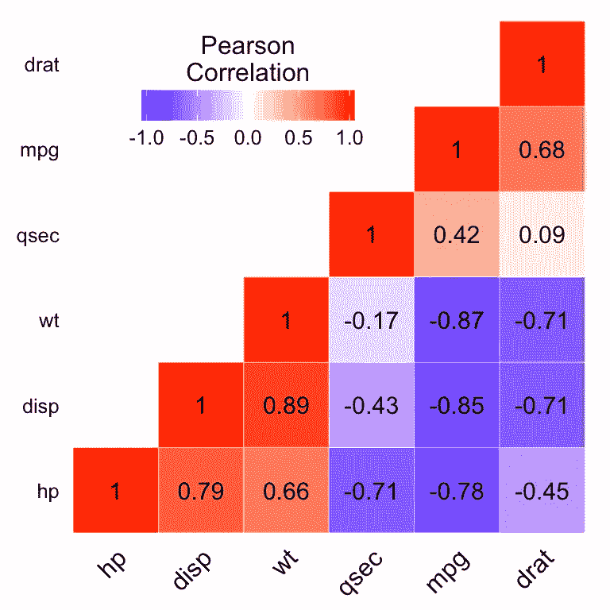

# 多重共线性-它是如何产生问题的？

> 原文：<https://towardsdatascience.com/https-towardsdatascience-com-multicollinearity-how-does-it-create-a-problem-72956a49058?source=collection_archive---------11----------------------->

## 深入了解多重共线性如何影响模型的性能


Photo by [Luke Chesser](https://unsplash.com/@lukechesser?utm_source=unsplash&utm_medium=referral&utm_content=creditCopyText) on [Unsplash](https://unsplash.com/search/photos/stats?utm_source=unsplash&utm_medium=referral&utm_content=creditCopyText)

在回归分析过程中，我们在实际执行回归之前检查许多东西。我们检查独立值是否相关，我们检查我们选择的特征是否重要，以及是否有任何缺失值，如果是，那么如何处理它们。

首先，让我们了解什么是因变量和自变量—

1.  因变量，回归过程中必须预测的值。也称为目标值。
2.  自变量，我们用来预测目标值或因变量的值。也被称为预测器。

如果我们有这样一个等式

```
y = w*x
```

这里，y 是因变量，w 是自变量。

我们稍后会看到它是如何被检测到的，但首先，让我们看看如果变量是相关的，会有什么问题。

## 从概念上理解—

想象你去观看一个摇滚乐队的音乐会。有两名歌手，一名鼓手，一名键盘手和两名吉他手。你很容易区分歌手的声音，因为一个是男性，另一个是女性，但你似乎很难分辨谁弹得更好。

两个吉他手都以相同的音调、音高和速度演奏。如果你能去掉其中一个，那就不成问题了，因为两者几乎一样。

去掉一个吉他手的好处是降低成本，减少团队成员。在机器学习中，训练的特征越少，模型就越简单。

这里两个吉他手共线。如果一个人弹吉他很慢，那么另一个吉他手也会弹得很慢。如果一个人弹得快，那么另一个人也弹得快。

如果两个变量共线，这意味着如果一个变量增加，那么另一个也增加，反之亦然。

## 数学上的理解—

让我们考虑这个等式

考虑 A 和 B 是高度相关的。

```
y = w1*A + w2*B
```

系数 w1 是在保持 B 不变的情况下，A 每增加一个单位 y 的增加量。但是实际上这是不可能的，因为 A 和 B 是相关的，如果 A 增加一个单位，那么 B 也增加一个单位。因此，我们不能检查 A 或 b 的个人贡献。解决方案是删除他们中的任何一个。

## 检查多重共线性—

通常有两种方法来检查多重共线性

1.  相关矩阵
2.  差异通货膨胀系数(VIF)

**相关矩阵—****相关矩阵**是显示变量间**相关**系数的表格。

我们不打算讨论相关矩阵是如何计算的。

create_correlation_matrix



[source](https://www.google.co.in/url?sa=i&source=images&cd=&cad=rja&uact=8&ved=2ahUKEwi2rcf-jfTjAhXFbCsKHSTSCHYQjB16BAgBEAM&url=http%3A%2F%2Fwww.sthda.com%2Fenglish%2Fwiki%2Fggplot2-quick-correlation-matrix-heatmap-r-software-and-data-visualization&psig=AOvVaw2dwHr4ilqUXUzygcdOfSJz&ust=1565382389179020)

> 我认为高于 0.75 的值是高度相关的。

**方差膨胀因子—** 方差膨胀因子(VIF)是多项模型中的方差与单项模型中的方差之比。它量化了普通最小二乘回归分析中多重共线性的严重程度。VIF 值可以解释为

1.  1(非共线)
2.  1–5(中等共线)
3.  > 5(高度共线)

移除 VIF 值大于 5 的值。

VIF Python

## 结论—

多重共线性会显著降低模型的性能，而我们可能不知道这一点。这是特征选择过程中非常重要的一步。移除多重共线性还可以减少要素，这最终会降低模型的复杂性，并且存储这些要素的开销也会减少。

确保在执行任何回归分析之前运行多重共线性测试。