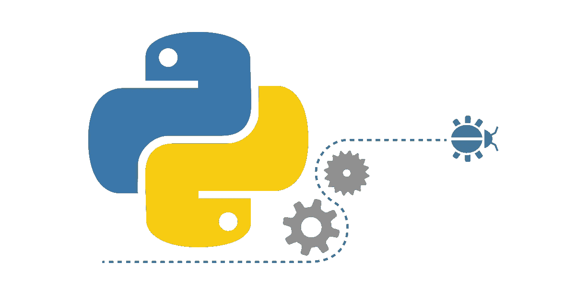

# Python 基础:可变对象与不可变对象

> 原文：<https://towardsdatascience.com/https-towardsdatascience-com-python-basics-mutable-vs-immutable-objects-829a0cb1530a?source=collection_archive---------2----------------------->



Source: [https://www.quora.com/Can-you-suggest-some-good-books-websites-for-learning-Python-for-a-layman](https://www.quora.com/Can-you-suggest-some-good-books-websites-for-learning-Python-for-a-layman)

读完这篇博客后，你会知道:

*   什么是对象的**身份**、**类型**和**值**
*   什么是**可变**和**不可变** **对象**

# 简介(对象、值和类型)

Python 代码中的所有数据都由对象或对象之间的关系来表示。每个对象都有标识、类型和值。

## 身份

> 一个对象的*标识* **一旦被创建**就不会改变**；你可能认为它是内存中**对象的地址**。`[**is**](https://docs.python.org/3/reference/expressions.html#is)` **运算符**比较两个对象的身份；`[**id()**](https://docs.python.org/3/library/functions.html#id)` **函数**返回一个表示其身份的整数。**

## 类型

一个对象的类型定义了**可能的值** **和操作**(例如“它有长度吗？”)该类型支持。`[**type()**](https://docs.python.org/3/library/functions.html#type)` **函数**返回对象的类型。像身份一样，对象类型**是不可改变的**。

## 价值

> 某些对象的*值*可以改变。值可以变化的对象**被称为**可变*；一旦被创建，其值不可改变的对象**称为*。****

****对象的可变性是由其类型决定的。****

******重要提示** 有些对象包含对其他对象的引用，这些对象被称为**容器**。容器的一些例子有**元组**、**列表**和**字典**。如果可变对象被改变，包含对可变对象 **的**引用的不可变容器**的**值可以被改变**。然而，容器仍然被认为是不可变的，因为当我们谈论容器**的**可变性时，只有被包含对象的**身份**是隐含的。******

****在下一节中，我们将看到更多的信息和详细的例子来理解可变和不可变对象之间的区别。****

# ****Python 中的可变和不可变数据类型****

*   ****Python 中的一些**可变**数据类型有**列表、字典、集合**和**用户自定义类**。****
*   ****另一方面，一些**不可变的**数据类型是 **int、float、decimal、bool、string、tuple 和 range** 。****

****是时候举些例子了。先来比较一下**元组** ( **不可变**)和**列表** ( **可变**)的数据类型。我们可以像这样用**方括号** `**[]**`定义一个列表:`numbers = [1, 2, 3]`。定义一个 tuple，我们只需要把括号替换成**圆括号** `**()**` 就像这样:`numbers = (1, 2, 3)`。从这两种数据类型中，我们可以通过索引访问元素，并且可以对它们进行迭代。主要区别在于元组一旦定义就不能更改。****

## ****索引列表和元组****

****输出:****

```
****1
10****
```

## ****改变值:列表与元组****

****输出:****

```
****[100, 2, 3]**--------------------------------------------------------------------**
**TypeError**                         Traceback (most recent call last)
**<ipython-input-2-286c46a29f5d>** in <module>**()**
      3 list_values**[0]** **=** **100**
      4 print**(**list_values**)**
**----> 5** set_values**[0]** **=** **100**

**TypeError**: 'tuple' object does not support item assignment****
```

****我们可以看到，当我们试图改变元组时，我们得到了一个错误，但我们没有这个问题的列表。****

## ****元组与列表扩展****

****现在，我们可以尝试使用`+=`操作符来扩展我们的列表和元组。这将对两种数据类型都起作用。让我们看看会发生什么。****

****输出:****

```
****2450343168136
2450343205552

2450343168136
2450341742248****
```

****我们可以看到，列表标识没有改变，而元组标识改变了。这意味着**扩展了我们的列表**，但是**创建了**一个完全**的新元组**。列表比元组更节省内存。****

## ****其他不可变数据类型示例****

****我们已经看到其他一些不可变的数据类型是整数和字符串。一旦它们被初始化，**它们的值就不能被改变**。****

****输出:****

```
****1657696608
1657696640****
```

****输出:****

```
****2450343168944
2450343426208****
```

****我们看到，对于数字和文本变量，它们的**标识都发生了变化**。这意味着**新变量**在两种情况下都被创建。****

## ****通过引用复制可变对象****

****让我们看看，如果我们为一个可变数据类型给同一个对象的两个名字**会发生什么。******

****输出:****

```
****2450343166664
2450343166664
True
[4, 5, 6, 7]
[4, 5, 6, 7]****
```

****我们可以看到变量名具有相同的标识，这意味着它们引用了计算机内存中相同的对象。提醒:`[**is**](https://docs.python.org/3/reference/expressions.html#is)` **运算符**比较两个对象的身份。****

****所以，当我们改变第二个变量的值时，第一个变量的值也会改变。这只发生在可变对象上。你可以在我之前的博客文章中看到如何避免这种情况。****

## ****复制不可变对象****

****让我们尝试用一个不可变的对象做一个类似的例子。我们可以尝试复制两个字符串，并更改其中任何一个字符串的值。****

****输出:****

```
****3063511450488
3063511450488
True

3063551623648
3063511450488
False

Python is awesome
Python****
```

****每次当我们试图用**更新一个不可变对象**的值时，一个新的**对象就会被创建**。当我们更新第一个字符串时，第二个字符串的值不会改变。****

## ****==运算符****

****有时候我们不是要比较两个对象的同一性，而是要比较这些对象的价值。我们可以使用`==`操作符来做到这一点。****

****输出:****

```
****True
False****
```

****我们可以清楚地看到这两个对象具有相同的值，但是它们的身份不同。****

## ****不可变对象改变它的值****

****正如我们之前所说的，如果可变对象被改变，包含对可变对象的引用的**不可变容器**的值可以被改变。让我们来看一个例子。****

****输出:****

```
****<class 'tuple'>
(129392130, ['Programming', 'Machine Learning', 'Statistics'])
(129392130, ['Programming', 'Machine Learning', 'Maths'])****
```

****我们已经改变了`skills`变量的值。另一个变量`person`包含对`skills`变量的引用，这也是它的值被更新的原因。****

******提醒**
对象仍然被认为是不可变的，因为当我们谈论容器的**可变性时，只有被包含对象的**标识**是隐含的。******

****然而，如果你的不可变对象只包含不可变对象，我们不能改变它们的值。让我们看一个例子。****

****输出:****

```
****1657696608
1657696032
(42, 24, ('Python', 'pandas', 'scikit-learn'))
1657696864
1657696064
(42, 24, ('Python', 'pandas', 'scikit-learn'))****
```

****请记住，当您试图更新一个不可变对象的值时，会创建一个新的对象。****

# ****摘要****

*   ****Python 代码中所有的**数据**都是用对象或对象之间的**关系**来表示的**。******
*   ****每个对象都有一个**标识**，一个**类型**，以及一个**值**。****
*   ****对象的标识**一旦被创建就不会改变** **。**你可以认为它是**对象在内存**中的地址。****
*   ****一个对象的类型定义了**可能的值** **和操作**。****
*   ****值可以改变的对象**称为**可变的 ***。*** 对象**一旦被创建，其值就不可改变**的对象称为*。*****
*   *****当我们谈论容器的**可变性时，只有被包含对象的**身份**是隐含的。*******

# *****资源*****

*   *****[https://www . python forthe lab . com/blog/mutable-and-immutable-objects/](https://www.pythonforthelab.com/blog/mutable-and-immutable-objects/)*****
*   *****[https://standupdev.com/wiki/doku.php?id = python _ tuples _ are _ immutable _ but _ may _ change](https://standupdev.com/wiki/doku.php?id=python_tuples_are_immutable_but_may_change)*****
*   *****[https://www . geeks forgeeks . org/mutable-vs-immutable-objects-in-python/](https://www.geeksforgeeks.org/mutable-vs-immutable-objects-in-python/)*****
*   *****[https://docs.python.org/3/reference/datamodel.html](https://docs.python.org/3/reference/datamodel.html)*****
*   *****[https://docs.python.org/3/library/functions.html#id](https://docs.python.org/3/library/functions.html#id)*****

# *****我的其他博客文章*****

*****你也可以看看我以前的博文。*****

*   *****[Jupyter 笔记本快捷键](https://medium.com/@ventsislav94/jypyter-notebook-shortcuts-bf0101a98330)*****
*   *****[数据科学的 Python 基础知识](/python-basics-for-data-science-6a6c987f2755)*****
*   *****[Python 基础:迭代、可迭代、迭代器和循环](/python-basics-iteration-and-looping-6ca63b30835c)*****
*   *****[Python 基础:列表理解](/python-basics-list-comprehensions-631278f22c40)*****
*   *****[Python 数据科学:Matplotlib 数据可视化简介](/data-science-with-python-intro-to-data-visualization-and-matplotlib-5f799b7c6d82)*****
*   *****[使用 Python 的数据科学:使用 pandas 加载、子集化和过滤数据简介](/data-science-with-python-intro-to-loading-and-subsetting-data-with-pandas-9f26895ddd7f)*****
*   *****[文本自然语言处理导论](http://Introduction to Natural Language Processing for Text)*****

# *****时事通讯*****

*****如果你想在我发表新的博客文章时得到通知，你可以订阅[我的简讯](https://buttondown.email/Ventsislav)。*****

# *****商务化人际关系网*****

*****这是我在 LinkedIn 上的简介，如果你想和我联系的话。我将很高兴与你联系在一起。*****

# *****最后的话*****

*****谢谢你的阅读。我希望你喜欢这篇文章。如果你喜欢，请按住拍手键，分享给你的朋友。我很高兴听到你的反馈。如果你有什么问题，尽管问。😉*****