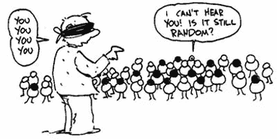
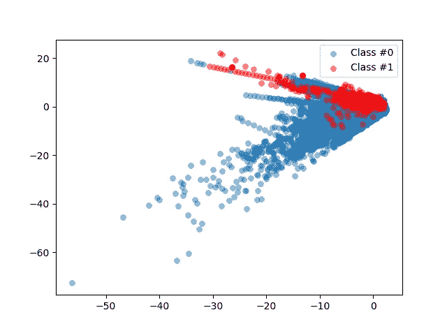
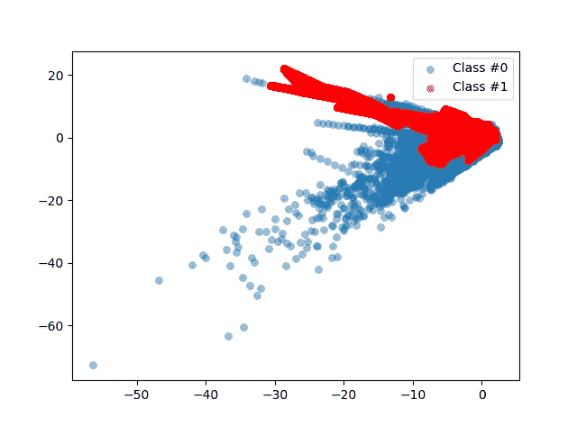

# 不平衡数据集的重采样方法-欺诈交易

> 原文：<https://towardsdatascience.com/https-towardsdatascience-com-resampling-methods-for-unbalanced-datasets-5b565d0a247d?source=collection_archive---------14----------------------->

假设你的任务是开发一个简单的机器学习算法，无论是有监督的(有明确的目标变量)还是无监督的(没有预定义的结果变量)。但是看你的数据，好像是一个阶级统治了另一个阶级。在这种情况下，您的模型将很难从您的数据中学习来预测未来的类。



Data Sampling [Source](https://ssix-project.eu/data-sampling/)

仍然不确定这里的问题是什么？让我们看一个恰当的例子。

**可视化不平衡数据集**

让我们看看不平衡数据在实践中是什么样子的。出于本文的目的，以及即将发布的一系列专注于检测欺诈者的文章，我从 Kaggle 挑选了[信用卡欺诈数据集](https://www.kaggle.com/mlg-ulb/creditcardfraud)。
该数据集是大约 28.5k 信用卡交易的集合，其中维度是从 V1 到 V28 的一组理论特征，不包括交易金额，以及后者是否是欺诈交易，以分类变量的形式表示(当没有欺诈时，Class == 0，否则，Class == 1)。

```
#Import libraries & Read Data
import pandas as pd
import numpy as np
import matplotlib.pyplot as pltdf = pd.read_csv("creditcard.csv")
```

现在让我们来数一数欺诈案件相对于非欺诈案件出现的次数。

```
occ = df['Class'].value_counts()
print(occ)Output:
#0    284315
#1       492 
```

因此，在总共 284807 笔信用卡交易中，我们总共发现了 492 起欺诈案件。

```
print(occ / df.shape[0])
```

这只占所有病例的 0.17%。对于训练我们的模型来说，这可以说是相当微不足道的欺诈性数据，这就是我们所说的*类不平衡问题。*

在我们做出任何更改之前，让我们先直观地看一下。

首先，让我们定义一个函数来创建数据和标签的散点图。

```
def plot_data(X, y):
 plt.scatter(X[y == 0, 0], X[y == 0, 1], label="Class #0", alpha=0.5, linewidth=0.15)
 plt.scatter(X[y == 1, 0], X[y == 1, 1], label="Class #1", alpha=0.5, linewidth=0.15, c='r')
 plt.legend()
 return plt.show()
```

我们希望在我们的图表上尽可能避免噪音和维度。因此，我们将创建一个将所有特性放在一起的*向量 X* ，以及一个包含目标变量(类变量)的*向量 y* 。
我们将为此定义一个附加函数。

```
def prep_data(df):
        X = df.iloc[:, 1:29].values
        X = np.array(X).astype(np.float)
        y = df.iloc[:, 30].values
        y=np.array(y).astype(np.float)
        return X,y
```

我们现在定义变量 X 和 y:

```
X, y = prep_data(df)
```

准备好了吗？我们走吧:

```
plot_data(X, y)
```



Visualization of Class Imbalance

您可以很容易地看到，红色的欺诈案例明显多于蓝色的非欺诈案例。在这种情况下，机器学习算法解释的主要是非欺诈事件。当成功训练我们的模型时，这将被证明是具有挑战性的，因为当数据集保持原样时，它很可能会产生假阴性。

那么我们能做些什么呢？这就是重采样派上用场的地方，作为一种提高欺诈与非欺诈比率的方法。

**什么是重采样&什么时候用？** 重采样是从原始数据集中抽取重复样本的过程。重采样方法背后的直觉是，它为我们的数据类创建“相似”案例，以便呈现代表我们希望调查的人群的数据，并因此向算法提供足够的数据以输出*更准确的结果(当数据不够时)。*

**有哪些类型的重采样方法？**

*   欠采样多数类
*   对少数民族阶层进行过度采样
*   合成少数过采样技术(SMOTE)

显然有更多的重采样方法(例如，自举、交叉验证等。)但在本文中，我们将重点定义以上三种。

**欠采样多数类**(在这种情况下，非欺诈情况)从数据集中随机抽取主要类，以匹配非主要类的数量。一般来说，这通常是最不可取的方法，因为它会导致我们丢弃一些有价值的数据，但是当您有一个大型数据集时，欠采样*在计算上可能会更好(除非您同时煮咖啡)。*

**过采样少数类**则相反。与前面的方法不同，我们随机抽取非支配类，并创建“假”副本来匹配支配类中的案例数量。在这种情况下，我们实际上是在创建数据的副本，并在此基础上训练我们的模型。当我们的非支配类没有分散在数据集中时，这可能不是一个理想的方法。复制只会有效地再造相似的实例，而没有“合成的”种类。

这就引出了第三个也是最后一个方法！

**合成少数过采样技术(SMOTE)** 是另一种类型的少数过采样技术，只是这种技术考虑了非支配类的现有情况的特征，并以“最近邻居”的方式创建合成副本*(无法控制自己来自东南亚的说法:相同，但不同！).*

> 对于这三种方法，一个经验法则是只对你的训练数据进行重采样！

**重采样不平衡类—击杀方式** *(看我在那里做了什么？永远不要错过任何插上一句双关语的机会)*

```
!pip install imblearn
from imblearn.over_sampling import SMOTEmethod = SMOTE(kind='regular')
```

让我们将该方法应用于我们的特性&目标变量。

```
X_resampled, y_resampled = method.fit_sample(X, y)
```

现在让我们来看看我们新的平衡数据集:

```
plot_data(X_resampled, y_resampled)
```

瞧啊！



Balanced Dataset — using SMOTE Technique

**结论**

正如你所看到的，我们的非主导类(红色的欺诈案例)在数据上更加明显。如果我们运行一个快速的数字检查，我们会看到 *y* 和*y _ 重采样*的计数现在是相似的。
SMOTE 已经在 imblearn 软件包中预定义的特征空间中有效地合成了新的欺诈案例(对于更倾向于数学的人来说，对 K-最近邻和欧几里德空间的理解在这一点上可能会派上用场)。

不过，尽管如此，还是要记住一些限制，因为最近的邻居可能并不总是欺诈案例。将 SMOTE 方法与其他一些基于规则的系统结合起来以获得更高的准确性将是一个明智的决定，但这取决于手头的任务和数据。

**玩得开心！** 现在，可以说你已经准备好继续使用你的预测模型了(别忘了只在训练集上应用 SMOTE)！

*这是我关于检测信用卡欺诈的系列文章中的第一篇(因此选择了这里的数据集)。如果您有兴趣了解更多信息并尝试一下，请订阅我的频道，不要犹豫，请在下面留下您的反馈:)谢谢！*