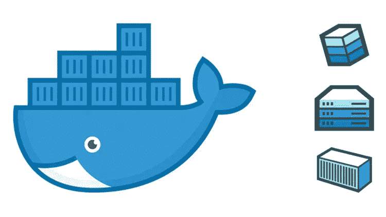

# 数据结构、容器、Kubernetes、知识图表等等…

> 原文：<https://towardsdatascience.com/https-towardsdatascience-com-the-data-fabric-containers-kubernetes-309674527d16?source=collection_archive---------13----------------------->

## 在这里看完所有的部分:[第一部分](/the-data-fabric-for-machine-learning-part-1-2c558b7035d7)、[第一部分 1b](/the-data-fabric-for-machine-learning-part-1-b-deep-learning-on-graphs-309316774fe7) 、[第二部分](/the-data-fabric-for-machine-learning-part-2-building-a-knowledge-graph-2fdd1370bb0a)。

## 在上一篇文章中，我们讨论了知识图的构建模块，现在我们将更进一步，学习构建知识图所需的基本概念、技术和语言。


Image by [Héizel Vázquez](https://heizelvazquez.tumblr.com/)

# 目录

*   [简介](https://medium.com/p/309674527d16#398d)
*   [目标](https://medium.com/p/309674527d16#a3ba)
*   [集装箱和码头简介](https://medium.com/p/309674527d16#ac16)
*   [什么是容器？](https://medium.com/p/309674527d16#1f3e)
*   [我们为什么需要容器？](https://medium.com/p/309674527d16#a615)
*   [码头工人](https://medium.com/p/309674527d16#7eac)
*   [Kubernetes](https://medium.com/p/309674527d16#665c)
*   [在 Docker 和 Kubernetes 部署 AnzoGraph](https://medium.com/p/309674527d16#872a)
*   [Anzo 和 AnzoGraph 的基础知识](https://medium.com/p/309674527d16#37af)
*   [SPARQL 基础知识](https://medium.com/p/309674527d16#cfda)
*   [齐柏林飞艇在安兹图](https://medium.com/p/309674527d16#f627)
*   [结论](https://medium.com/p/309674527d16#ab2e)
*   [资源](https://medium.com/p/309674527d16#cee5)

# 介绍


[https://towardsdatascience.com/the-data-fabric-for-machine-learning-part-1-2c558b7035d7](/the-data-fabric-for-machine-learning-part-1-2c558b7035d7)

在本系列的上一篇文章中，我谈到了知识图的概念及其与数据结构的关系:

> 数据结构中的**结构**是从知识图构建的，为了创建知识图，你需要语义和本体来找到一种链接数据的有用方法，这种方法可以唯一地识别和连接具有常见业务术语的数据。

我还谈到了**三元组** : **主体、客体和谓词**(或*实体-属性-值*)以及资源描述框架(RDF)的概念。现在，在所有这些和讨论之后，我们应该准备好创建我们的数据结构了，对吗？没有。

在本文中，我将详细介绍我们需要理解的最后几个部分，以便为我们的公司实际构建知识图和部署数据结构。我将使用由 [Cambridge Semantics](https://www.cambridgesemantics.com/) 开发的独立 AnzoGraph 数据库，并将它与 Docker 和 Kubernetes 一起部署。

可以想象，我们必须了解更多关于容器、docker、kubernetes 等的知识。，但是还有别的。我们需要有一种与数据对话的方式，通常我们用 SQL，但是当你有图形数据时，最好的语言之一叫做 SPARQL，所以我们也将学习它。

本文是一篇教程，提供了关于如何在 Kubernetes 上部署 AnzoGraph 的理论信息，基于剑桥语义的教程:

 [## 用 Docker 设置沙盒

### 编辑描述

docs.cambridgesemantics.com](https://docs.cambridgesemantics.com/anzograph/userdoc/sandbox-docker.htm) 

## 教程的免责声明:我将测试 MacOS 中的所有东西，但是你可以在上面的链接中找到更多关于其他平台的信息。


# 目标

在文章的最后，你将能够理解容器、Kubernetes 的基础知识，如何在它们之上构建平台，以及我们将使用的图形数据库语言 SPARQL，所有这些都与独立的 AnzoGraph 图形数据库相关。


# 集装箱和码头简介


[https://www.tintri.com/blog/2017/03/tintri-supports-containers-advanced-storage-features](https://www.tintri.com/blog/2017/03/tintri-supports-containers-advanced-storage-features)

T 这不会是容器的完整概述，只是足够的信息让你知道我们为什么需要它们。请查看下面的参考资料。

## 什么是容器？


在 docker 的网页上，有一个关于什么是容器的很好的例子:

> 软件的标准化单位

容器的正式定义是:

> 容器是一个标准的软件单元，它将代码及其所有依赖项打包，以便应用程序能够快速可靠地从一个计算环境运行到另一个计算环境。

简而言之，容器是一个隔离的环境，您可以在其中设置执行任务所需的依赖关系。它们类似于虚拟机，但功能不同，因为容器虚拟化的是操作系统而不是硬件。

我们可以想象这样一个容器:


[https://www.docker.com/resources/what-container](https://www.docker.com/resources/what-container)

每个容器都有自己独立的用户空间，允许多个容器在一台主机上运行。

## 为什么我们需要容器？


[https://xkcd.com/1629/](https://xkcd.com/1629/)

容器让我们的生活变得更容易。有了它们，我们可以测试编程环境、软件和工具，而不会损害我们的主操作系统，而且它们在我们产品的分销部分也有惊人的应用。

像[本·韦伯](https://medium.com/u/a80e1f69e782?source=post_page-----309674527d16--------------------------------)、[威尔·科尔森](https://medium.com/u/e2f299e30cb9?source=post_page-----309674527d16--------------------------------)、[马克·纳格尔伯格](https://medium.com/u/23dd4da5adca?source=post_page-----309674527d16--------------------------------)和[萨钦·阿贝瓦达纳](https://medium.com/u/4d883eeaf62d?source=post_page-----309674527d16--------------------------------)这样的伟人在数据科学领域写了关于容器需求的精彩文章，你可以在下面的参考资料中找到它们。

最大的使用案例是:

*   再现性
*   改善协作
*   节省开发运维时间和数据运维时间
*   更容易分配

当然还有更多，但在数据空间中，这些是最重要的。我们将使用容器创建一个完整的隔离系统来运行 AnzoGraph 数据库，并将其部署在那里。

## 码头工人



Docker 是创建容器的最佳工具。Docker 是一个基于 Linux 容器的开源项目。

Docker 容器映像是一个轻量级的、独立的、可执行的软件包，包括运行应用程序所需的一切:代码、运行时、系统工具、系统库和设置。

Docker 图像更像是蓝图。图像是不可变的主模板，用于抽取完全相同的容器。

这是使用 docker 的基本工作流程:


[https://towardsdatascience.com/digging-into-data-science-tools-docker-bbb9f3579c87](/digging-into-data-science-tools-docker-bbb9f3579c87)

我们将使用 docker 和 kubernetes(见下文)来部署我们的 AnzoGraph 实例，所以我们需要做的第一件事是安装 docker。在此之前，您需要知道使用 docker 运行 AnzoGraph 有一些要求:

*   **Docker 版本**:需要 Docker 社区版 18 版或更高版本。
*   **操作系统** : MacOS、Linux、Windows 10 专业版或企业版。Docker 使用虚拟机管理程序，主机服务器必须支持虚拟化。由于较旧的 Windows 版本和 Windows 10 家庭版不支持 Hyper-V，Windows 上的 Docker 需要 Windows 10 Professional 或 Enterprise。另外，在 Windows 上使用 Docker CE 时，配置 Docker 使用 Linux 容器。不支持使用 Microsoft [Windows 容器](https://docs.microsoft.com/en-us/virtualization/windowscontainers/about/)，因为它为 Windows 容器服务实例提供 Windows API 支持。
*   **可用内存**:最低 12gb；推荐:32 GB。AnzoGraph 需要足够的 RAM 来存储数据、中间查询结果和运行服务器进程。Cambridge Semantics 建议您分配 3 到 4 倍于计划数据大小的 RAM。
*   **可用磁盘空间** : AnzoGraph 内部需要 10 GB。加载文件转移、持久化或备份所需的额外磁盘空间量取决于要加载的数据的大小。对于持久性，Cambridge Semantics 建议您在服务器上拥有两倍于 RAM 的可用磁盘空间。
*   **CPU 计数**:最小值:2；推荐 4+。

让我们从安装 docker 开始。对于 Mac，请点击此处:

 [## Mac Docker 桌面- Docker Hub

### 在 Mac 上开始使用 Docker 的最快和最简单的方法

hub.docker.com](https://hub.docker.com/editions/community/docker-ce-desktop-mac) 

点击获取 Docker:


并按照 Docker 文档中的说明安装和运行 Docker。

AnzoGraph 映像需要至少 10 GB 的可用磁盘空间和 7 GiB 的可用 RAM 来启动数据库。

要调整设置，右击 Docker 图标并选择**设置**。点击**磁盘**查看可用的磁盘镜像大小。例如:


根据需要调整磁盘大小，然后点击**应用**保存更改。点击**高级**查看 CPU 和内存设置。例如:


根据需要调整数值，然后点击**应用并重启**以应用更改并重启 Docker。

**注意:为了记录，我使用了 80GB 的磁盘和 16GB 的内存。**


# 库伯内特斯


[https://svitla.com/blog/kubernetes-vs-docker](https://svitla.com/blog/kubernetes-vs-docker)

首先。Kubernetes 怎么发音？根据这个 [GitHub 线程](https://github.com/kubernetes/kubernetes/issues/44308)的正确说法是:

> koo-ber-nay-TACE

这是我说的:

它的意思是“航海大师”。很酷的名字，不是吗？

所以，如果这是水手，船在哪里？还有，是什么船？

根据官方文档， [Kubernetes (K8s)](https://kubernetes.io/docs/concepts/overview/what-is-kubernetes/) 是一个用于自动化部署、扩展和管理容器化应用程序的开源系统。所以“船”就是我们的容器，以及里面的应用程序。Kubernetes 是所有关于抽象的复杂性。

欲了解更多信息，请点击此处:

[](https://kubernetes.io/docs/tutorials/kubernetes-basics/) [## 了解 Kubernetes 基础知识

### Kubernetes 基础本教程提供了一个 Kubernetes 集群编排系统基础的演练…

kubernetes.io](https://kubernetes.io/docs/tutorials/kubernetes-basics/) 

和下面的参考资料部分。


# 在 Docker 和 Kubernetes 中部署 AnzoGraph


H 在这里，我们将专注于运动学，因为这是我们如何使用 Kubernetes 和 Docker 与 AnzoGraph。Kitematic 是一个简单的应用程序，用于管理 Mac、Linux 和 Windows 上的 Docker 容器。

所以，我们要做的第一件事就是通过点击苹果菜单中的 Docker 图标并选择 **Kitematic** 来启动 Docker Kitematic。


这将引导您下载软件:


然后，当所有的东西都安装好后，只需打开 Kinematic 并在搜索字段中键入 **anzograph** 并找到 anzograph 库:


然后点击 **Create** 启动 AnzoGraph 部署，您将看到:


等待几秒钟，当您看到消息`Press [CTRL+C] to stop`时，按 CTRL+C 关闭引导日志。AnzoGraph 现在在您的 Docker 实例中运行。

现在您可以点击 web 预览来查看 AnzoGraph 在哪里运行:


在我的例子中，它运行在[http://localhost:32871/](http://localhost:32871/)上，但是它可以为你改变。

在登录界面上，输入用户名 **admin** 和密码 **Passw0rd1** ，然后点击**登录**。

你被录取了！！！你应该会看到这个:


因此，查询部分看起来像 SQL，但不是。什么是 AnzoGraph？？我希望你记得。如果没有，我给你出个主意。


# Anzo 和 AnzoGraph 的基础知识


[https://towardsdatascience.com/deep-learning-for-the-masses-and-the-semantic-layer-f1db5e3ab94b](/deep-learning-for-the-masses-and-the-semantic-layer-f1db5e3ab94b)

你可以用 Anzo 建立一个叫做“企业知识图”的东西。

AnzoGraph 是一个独立的本地大规模并行处理(MPP)图形 OLAP 数据库，旨在提供大数据规模的快速高级分析，AnzoGraph 的一个版本与 Anzo 集成。

随着机器学习和人工智能的发展，图 OLAP 数据库变得非常重要，因为许多机器学习算法本身就是图算法，在图 OLAP 数据库上运行比在 RDBMS 上运行更有效。

图中的节点和边灵活地捕捉了每个数据源的高分辨率孪生数据—结构化的或非结构化的。该图表可以帮助用户快速、交互式地回答任何问题，允许用户与数据进行对话以揭示见解。

所有这些的目标是构建一个数据结构:

> *数据结构是支持公司所有数据的平台。它是如何被管理、描述、组合和普遍访问的。该平台由企业知识图构成，以创建统一的数据环境。*

如果你想了解更多，请查看我在该系列上的文章:

[](/ontology-and-data-science-45e916288cc5) [## 本体论和数据科学

### 对现有数据的研究如何帮助我们成为更好的数据科学家。

towardsdatascience.com](/ontology-and-data-science-45e916288cc5) [](/graph-databases-whats-the-big-deal-ec310b1bc0ed) [## 图形数据库。有什么大不了的？

### 继续对语义和数据科学的分析，是时候讨论图形数据库以及它们必须…

towardsdatascience.com](/graph-databases-whats-the-big-deal-ec310b1bc0ed) [](/deep-learning-for-the-masses-and-the-semantic-layer-f1db5e3ab94b) [## 面向大众的深度学习(…和语义层)

### 深度学习现在无处不在，在你的手表里，在你的电视里，在你的电话里，在某种程度上，在你的平台上…

towardsdatascience.com](/deep-learning-for-the-masses-and-the-semantic-layer-f1db5e3ab94b) 

# SPARQL 基础知识


PARQL 发音为“sparkle ”,是资源描述框架(RDF)的查询语言。如果您想了解更多关于 RDF 的信息，请查看:

[](/the-data-fabric-for-machine-learning-part-2-building-a-knowledge-graph-2fdd1370bb0a) [## 机器学习的数据结构。第 2 部分:构建知识图。

### 在能够开发数据结构之前，我们需要构建一个知识图。在这篇文章中，我将建立一个基础…

towardsdatascience.com](/the-data-fabric-for-machine-learning-part-2-building-a-knowledge-graph-2fdd1370bb0a) 

但基本上，RDF 是一种定向的、带标签的图形数据格式，用于表示 Web 中的信息。RDF 通常用于表示个人信息、社交网络、关于数字制品的元数据等，并提供一种集成不同信息源的方法。

我们将在这里理解 SPARQL 的基础知识，目标是至少理解这个查询:

```
SELECT ?g (COUNT(*) as ?count)
WHERE {
 graph ?g{
  ?s ?p ?o
 }
}
GROUP BY ?g
ORDER BY DESC(?count)
```

如果您想了解关于 SPARQL 的更多信息，请查看官方文档:

 [## RDF 的 SPARQL 查询语言

### RDF 是一种定向的、带标签的图形数据格式，用于表示 Web 中的信息。本规范定义了…

www.w3.org](https://www.w3.org/TR/rdf-sparql-query/) 

让我们从一些样本数据开始运行一些查询。在查询控制台上，用以下语句替换默认查询:

```
LOAD WITH 'global' <s3://csi-sdl-data-tickit/tickit.ttl.gz> INTO GRAPH <tickit>
```

该语句从 **csi-sdl-data-tickit** S3 桶上的**tickit.ttl.gz**目录中加载样本 Tickit 数据。顺便说一下，Tickit 数据集捕获了虚构的 Tickit 网站的销售活动，人们在该网站上买卖体育赛事、演出和音乐会的门票。

数据包括人员、地点、类别、日期、事件、列表和销售信息。通过识别一段时间内的门票移动、卖家的成功率、最畅销的活动和场地以及一年中最赚钱的时间，分析师可以使用这些数据来确定提供什么激励措施、如何吸引新人以及如何推动广告和促销。

下图显示了 tickit 图的模型或本体。圆圈代表数据的主题或类别，矩形代表属性:


[https://docs.cambridgesemantics.com/anzograph/userdoc/tickit.htm](https://docs.cambridgesemantics.com/anzograph/userdoc/tickit.htm)

然后单击 Run，过一会儿您应该会看到消息“更新成功”


为了检查一切是否正确，运行以下查询:

```
SELECT (count(*) as ?number_of_triples)
FROM <tickit>
WHERE { ?s ?p ?o }
```

统计 Tickit 数据集中三元组的数量。您应该得到:


SPARQL 惯例:

*   **大写**:虽然 SPARQL 不区分大小写，但是为了可读性，本节中的 SPARQL 关键字都是大写的。
*   ***斜体*** :斜体术语是您在查询中替换的占位符值。
*   **[ ]** :表示可选条款。
*   **|** :表示或。指示您可以使用一个或多个指定的选项。
*   **^** :表示异或(XOR)。表示您只能选择一个指定的选项。

学习数据库语言的基本部分是选择和检索一些数据。对于类似 SQL 的 SPARQL，提供了一个用于选择或查找数据的选择查询表单。

以下简单的 SELECT 语句查询样本 Tickit 数据集，以返回 event100 的所有谓词和对象:

```
SELECT ?predicate ?object
FROM <tickit>
WHERE {
  <event100> ?predicate ?object
}
ORDER BY ?predicate
```

您应该看到:


你可能在想什么是*？谓词*和*？object* 部分是，因为其他的东西，FROM，WHERE 和 ORDER BY，似乎和 SQL 中的一样。

[在过去的一篇文章](/the-data-fabric-for-machine-learning-part-2-building-a-knowledge-graph-2fdd1370bb0a)中，我用一个例子解释过:


To have a triple we need a subject and object, and a predicate linking the two.

谓语和宾语的概念来源于*三元组*的概念。所以你可以看到我们有了**主语** < Geoffrey Hinton >与**宾语** <研究者>由**谓语** <构成>。这对我们人类来说可能听起来很容易，但需要一个非常全面的框架来用机器做到这一点。

你会在其他地方发现这些概念是实体-属性-值。

仅此而已，它们只是我们在构成知识图的图形数据库中的普通名称和概念。

再来做一个例子。我们将在 Tickit 数据集中列出每个不同的事件名称:

```
SELECT DISTINCT ?name
FROM <tickit>
WHERE {
  ?event <eventname> ?name.
}
```

您应该得到:


SPARQL 的另一个重要部分是构造的概念。

我们使用构造查询表单从现有数据创建新数据。构造查询采用每个解决方案，并用它替换图或三元模板中的变量。

以下示例查询指定了一个三元组模板，该模板为样本 Tickit 数据集中的 person 三元组构造了一个新的年龄谓词和大约年龄值:

```
PREFIX xsd: <http://www.w3.org/2001/XMLSchema#>
CONSTRUCT { ?person <age> ?age . }
WHERE { GRAPH <tickit> {
  { SELECT ?person ((YEAR(?date))-(YEAR(xsd:dateTime(?birthdate))) AS ?age)
    WHERE {
      ?person <birthday> ?birthdate .
      BIND(xsd:dateTime(NOW()) AS ?date)
      }
    }
  }
}
ORDER BY ?person
LIMIT 50
```

您应该得到:


这里，PREFIX 子句声明了您希望在查询中引用的 URIs 的任何缩写。BIND 将表达式的结果赋给一个新变量。WHERE 子句中的图形部分仅用于匹配<tickit>。其他的我觉得和 SQL 很像，可以理解。</tickit>

我们可以用子句 ask 向我们的图提问。我们使用 ASK 查询表单来确定特定的三元组模式是否存在于指定的数据集中。ASK 返回 true 或 false，这取决于解决方案或匹配是否存在。

例如:

```
ASK FROM <tickit> { ?s <eventname> "Wicked" . }
```

对于这一个，你将得到*真*:)

我们将使用的最后一个子句是 DESCRIBE。我们使用 DESCRIBE 查询表单返回与指定资源相关联的所有三元组，而不仅仅是绑定到您指定的任何变量的三元组。

例如，以下简单的 DESCRIBE 示例查询样本 Tickit 数据集，以描述与 person2 相关联的所有资源:

```
DESCRIBE <person2>
FROM <tickit>
```

您将获得:

```
s             | p                                               | o
--------------+-------------------------------------------------+------------------
person6048    | friend                                          | person2
person9251    | friend                                          | person2
listing30988  | sellerid                                        | person2
sales28393    | sellerid                                        | person2
sales28394    | sellerid                                        | person2
person2       | lastname                                        | Humphrey
person2       | like                                            | musicals
person2       | birthday                                        | 1995-01-03
person2       | http://www.w3.org/1999/02/22-rdf-syntax-ns#type | person
person2       | card                                            | 9955429152637722
person2       | city                                            | Murfreesboro
person2       | friend                                          | person48892
person2       | friend                                          | person15323
...
99 rows
```

关于 SPARQL 还有很多要学习的，另一个很好的信息来源是剑桥语义本身的 SPARQL 参考:

 [## SPARQL 参考

### AnzoGraph 实现了 W3C SPARQL 1.1 查询语言中描述的标准 SPARQL 形式和函数…

docs.cambridgesemantics.com](https://docs.cambridgesemantics.com/anzograph/userdoc/sparql-ref.htm) 

# 齐柏林飞艇


[Pinterest](https://www.pinterest.com/pin/533887730809896653/)

我们要讨论的最后一部分是如何使用 Zeppelin 并将其与独立的图形分析数据库 AnzoGraph 连接。Zeppelin 是一款基于网络的笔记本电脑，类似于 Jupyter，我们将使用它的部署来拥有一个集成的 SPARQL 解释器，使我们能够使用 gRPC 协议与 AnzoGraph 建立一个安全的、经过身份验证的连接。

第一步是访问 docker CLI 并选择一个文件夹来存储 Zeppelin。我是这样做的:

1.  打开 Kinematic 并点击 Docker CLI


2.选择一个文件夹，然后运行:

```
[ -d $PWD/logs ] ||  mkdir -p  $PWD/logs
[ -d $PWD/notebook ] || mkdir -p  $PWD/notebook
```

最后，运行以下命令，在端口 8080 上下载并运行 Zeppelin 映像:

```
docker run -p 8080:8080 --name=zeppelin -v $PWD/logs:/logs -v $PWD/notebook:/notebook \
  -e ZEPPELIN_NOTEBOOK_DIR='/notebook' \
  -e ZEPPELIN_LOG_DIR='/logs' \
  -e ZEPPELIN_WEBSOCKET_MAX_TEXT_MESSAGE_SIZE=10240000 \
  -d  cambridgesemantics/contrib-zeppelin:latest \
  /zeppelin/bin/zeppelin.sh
```

部署完成后，在浏览器中转至以下 URL 打开 Zeppelin:

```
[http://localhost:8080/#/](http://localhost:8080/#/) # this may be different
```

此刻您应该会看到这个屏幕:


要连接 AnzoGraph，点击**匿名**下拉列表，选择**翻译:**


现在输入“sparql”并找到 SPARQL 解释器:


点击**编辑**按钮，修改解释器，输入您的 AnzoGraph 部署细节，并与数据库建立安全连接:

*   **anzo . graph . host**:AnzoGraph 主机的 IP 地址。
*   **anzo . graph . password**:anzo . graph . user 字段中用户的密码。
*   **anzo.graph.port** :用于 AnzoGraph 的 gRPC 端口。默认值为 **5700** 。不要更改该值。
*   **anzo.graph.trust.all** :指示 Zeppelin 信任 AnzoGraph SSL 证书。接受默认值**真**。
*   **anzo.graph.user** :登录 AnzoGraph 的用户名。

添加完连接详情后，点击屏幕底部的**保存**。Zeppelin 会显示一个对话框，询问您是否要使用新设置重新启动解释器。点击**确定**配置连接。

当解释器重新启动完成时，单击屏幕顶部的 Zeppelin 徽标返回到欢迎屏幕。

现在使用平台[下载 AnzoGraph 教程 Zeppelin 笔记本](https://docs.cambridgesemantics.com/anzograph/userdoc/AnzoGraph-Tutorial-Note.zip)，并在电脑上解压下载的笔记本 ZIP 文件。ZIP 文件包含 AnzoGraph-Tutorial-notebook . JSON。

在 Zeppelin 欢迎界面上，点击**导入注意:**


在导入界面，点击**选择 JSON 文件**，然后选择要导入的 AnzoGraph-Tutorial-notebook . JSON 文件。现在，要在文件中运行查询，请单击该段落的 run 按钮。看一下我们讨论 SPARQL 的上一节，以理解这些查询:)

你应该会看到这个:


# 结论

这只是我们创建数据结构过程的开始。到目前为止，我们已经建立了理论框架，现在是在本地推出 AnzoGraph 的第一个实际步骤。

我们学习了容器、Docker、Kubernetes、SPARQL、RDF 和 Zeppelin，以及如何查询图形数据。如果你已经知道 SQL，这种改变并不疯狂，但是你需要了解一门新的语言。

在未来，我们将把我们的“公共数据集”转换成图表，然后开始构建我们的知识图表和数据结构，在其上运行查询，最后通过机器学习来预测未来。

感谢您的阅读，如果您想了解更多信息，请关注我这里，以及 LinkedIn 和 Twitter:

[](https://www.linkedin.com/in/faviovazquez/) [## 法维奥·瓦兹奎-科学与数据公司创始人/首席数据科学家| LinkedIn

### 加入 LinkedIn ‼️‼️重要提示:由于 LinkedIn 技术限制，我现在只能接受连接请求…

www.linkedin.com](https://www.linkedin.com/in/faviovazquez/) [](https://twitter.com/faviovaz) [## 法维奥·巴斯克斯(@法维奥·巴斯克斯)|推特

### Favio Vázquez 的最新推文(@FavioVaz)。数据科学家。物理学家和计算工程师。我有一个…

twitter.com](https://twitter.com/faviovaz) 

# 资源

[](https://medium.com/free-code-camp/a-beginner-friendly-introduction-to-containers-vms-and-docker-79a9e3e119b) [## 对初学者友好的容器、虚拟机和 Docker 介绍

### 如果你是一个程序员或技术人员，你可能至少听说过 Docker:一个打包、运输…

medium.com](https://medium.com/free-code-camp/a-beginner-friendly-introduction-to-containers-vms-and-docker-79a9e3e119b) [](/data-science-for-startups-containers-d1d785bfe5b) [## 创业公司的数据科学:容器

### 为机器学习构建可重复的设置

towardsdatascience.com](/data-science-for-startups-containers-d1d785bfe5b) [](/docker-without-the-hassle-b98447caedd8) [## 没有麻烦的码头工人

### 使用 repo2docker 自动构建 docker 容器

towardsdatascience.com](/docker-without-the-hassle-b98447caedd8) [](/digging-into-data-science-tools-docker-bbb9f3579c87) [## 挖掘数据科学工具:Docker

### Docker 是一个创建和管理“容器”的工具，它就像一个小虚拟机，你可以在其中运行你的…

towardsdatascience.com](/digging-into-data-science-tools-docker-bbb9f3579c87) [](/docker-for-data-science-4901f35d7cf9) [## 数据科学码头工人

### Docker 是一个为软件工程师简化安装过程的工具。来自统计背景的我…

towardsdatascience.com](/docker-for-data-science-4901f35d7cf9) [](/key-kubernetes-concepts-62939f4bc08e) [## Kubernetes 的关键概念

### 云计算、容器化和容器编排是 DevOps 中最重要的趋势。无论你是…

towardsdatascience.com](/key-kubernetes-concepts-62939f4bc08e)  [## RDF 的 SPARQL 查询语言

### RDF 是一种定向的、带标签的图形数据格式，用于表示 Web 中的信息。本规范定义了…

www.w3.org](https://www.w3.org/TR/rdf-sparql-query/)  [## AnzoGraph 部署和用户指南

### 欢迎使用 AnzoGraph 部署和用户指南！本指南包括 AnzoGraph 部署说明、指南和…

docs.cambridgesemantics.com](https://docs.cambridgesemantics.com/anzograph/userdoc/home.htm)