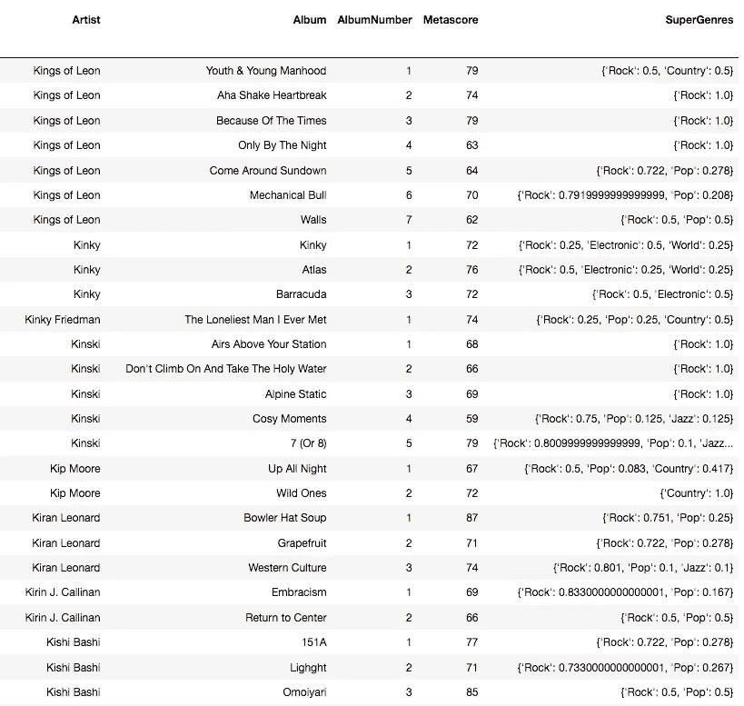
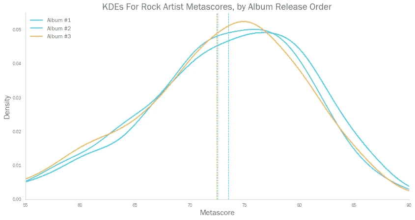
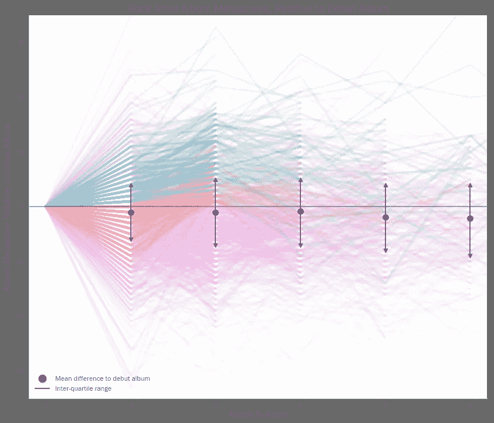
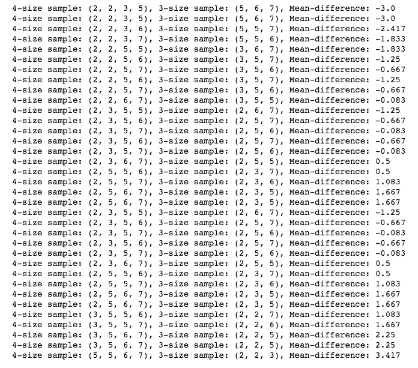
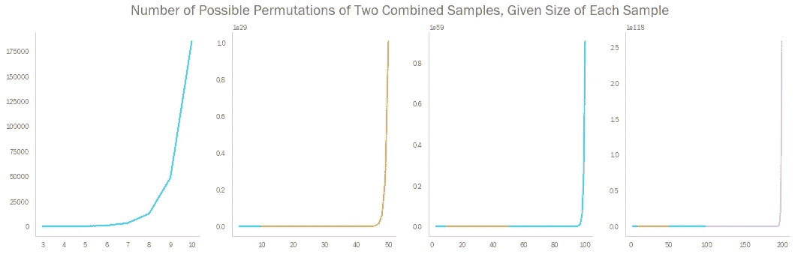
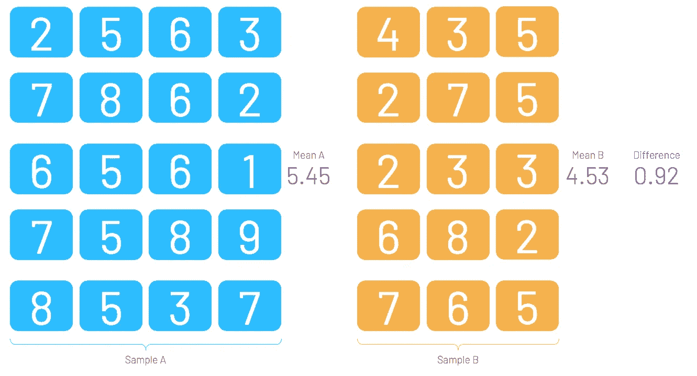
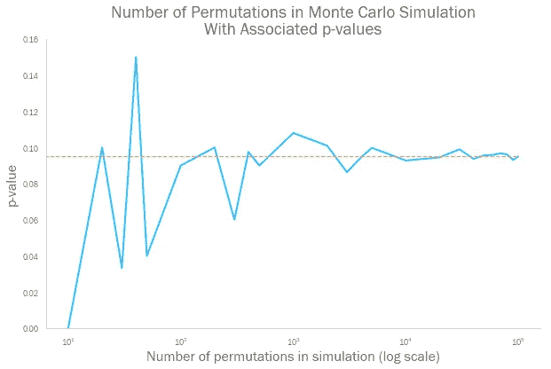
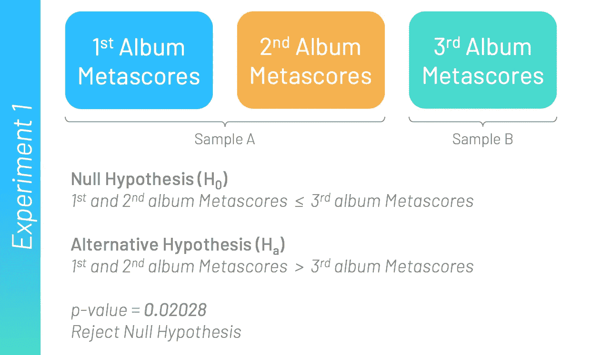
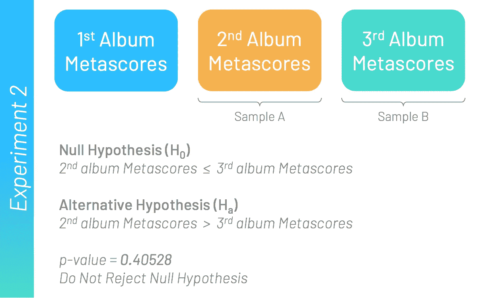
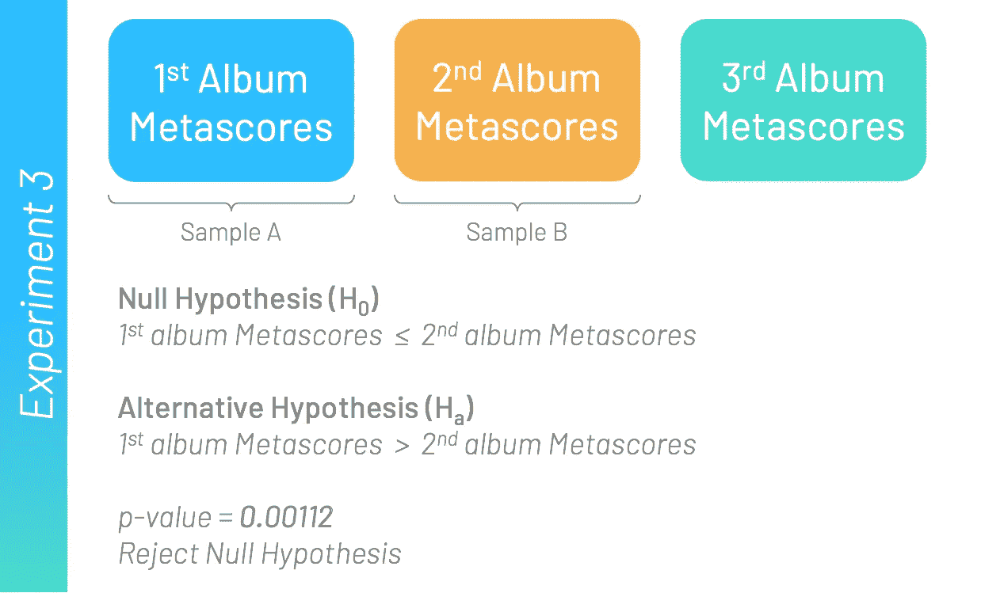

# 蒙特卡洛模拟能驱散‘困难的第三张专辑’吗？

> 原文：<https://towardsdatascience.com/https-towardsdatascience-com-the-difficult-third-album-655d7a710412?source=collection_archive---------31----------------------->

## [数字音乐](https://towardsdatascience.com/tagged/music-by-numbers)

## 使用 Python 进行排列测试和蒙特卡罗模拟的介绍


The Killers, sensibly sticking to their first two albums at Glastonbury 2019 (Photo: NME)

《困难的第三张专辑》在音乐界就像民间传说一样好。

一个乐队的首张专辑实际上从一开始就一直在建设中。对一些乐队来说，这可能代表了多年的歌曲创作和提炼。这听起来很新鲜，而且没有期望的重量。

一个乐队的第二张专辑(所谓的第二张专辑)是带着第一张专辑的成功所带来的能量和信心制作的。即使一个乐队的声音从他们的首次亮相到现在没有太大的变化，人们也不太可能在一次发行后就厌倦它，如果它一开始就很好的话。

因此，如果乐队能够淘汰体面的首次亮相和大二学生，是什么让第三张专辑如此艰难？首先，第三张专辑可能会在第一张的四到五年后推出——流行的音乐趋势将会改变。乐队通常需要超越他们可能已经形成的舒适区，这可以发现那些不太符合标准的歌曲作者。

此外，一个厌倦了几年巡回演出的乐队可能缺乏空间来写一张唱片的高质量材料，长时间的巡回演出会让一个乐队彻底厌倦彼此。长期滥用药物在摇滚乐中仍然很常见，而且并不像甲壳虫乐队让你相信的那样有助于创作好音乐。

# 艰难的第三篇博文

理论站得住脚，但是‘困难的第三张专辑’是在数据中诞生的吗？为了找到答案，我们将使用我们在本系列的[前几篇文章](/the-devils-music-622d29028c0b)中看到的数据集，它由从 Metacritic 收集的数据组成。

[](/the-devils-music-622d29028c0b) [## 魔鬼的音乐

### Pitchfork 真的是互联网最苛刻的乐评人吗？

towardsdatascience.com](/the-devils-music-622d29028c0b) 

我们将为每张专辑考虑的重要数据点是它的“ [Metascore](https://www.metacritic.com/about-metascores) ”。这是一张专辑不同评论家评论的加权平均值。

虽然用于创建 Metascore 的确切方法并不公开，但 Metacritic 建议“根据[出版物的]质量和整体地位”给予额外的权重。然后将这些分数标准化(类似于大学里的“曲线评分”),以防止分数聚集在一起。无论如何，Metascore 是衡量任何一张专辑“真实”质量的最佳标准。

# 乍一看

我们从“专辑”数据帧开始，它包含每个发行版本的信息，如艺术家、专辑的 Metascore 和专辑的流派。数据集中有 17，727 个相册。



An extract of the Albums dataframe. Note — the ‘SuperGenres’ column is a high level view of the genres given on the album’s Metacritic page. For example, terms like ‘Indie’ or ‘Metal’ would be given as ‘Rock’ here. Note, an album can be assigned to more than one genre — the dictionaries in the ‘SuperGenres’ column describe the different weightings of each genre for that album.

出于这种分析的目的，我们关注那些只制作了至少部分“摇滚”专辑的艺术家，因为“困难的第三张专辑”通常与这种类型有关。我们也将只考虑发行了至少三张专辑的艺术家。这将范围缩小到 1324 位艺术家的 5791 张专辑。

我们可以通过几种方式来看待这些数据。首先，让我们简单地把不同专辑的 Metascores，根据专辑是一个乐队的首张专辑、第二张专辑还是第三张专辑来分组。

通过绘制这三组专辑的均值和[核密度估计值](https://en.wikipedia.org/wiki/Kernel_density_estimation) (KDEs ),我们看到元得分的分布非常相似。首张专辑的平均元得分较高，第二张专辑的元得分略高于第三张专辑。



Vertical dashed lines represent means for each group of albums

我们可以查看数据的另一种方式是考虑一个乐队从一张专辑到下一张专辑的相对 Metascore 差异。我们可以绘制出乐队专辑相对于他们首次亮相的得分，从而显示他们的得分如何随着时间的推移而发展。



Green lines represent artists that improved from albums 1 to 2, and then again from 2 to 3\. Amber lines represent artists whose third albums were better than their debuts, but whose second albums were worse.

同样，我们看到专辑三的平均 Metascore(相对于首张专辑)下降了。这就支持了‘困难的第三张专辑’的存在。然而，每张专辑的差异是显著的，就平均得分“轨迹”而言，没有明确的模式。许多乐队完全避免了“困难的第三张专辑”综合症(上图中用绿色和琥珀色突出显示的那些)。

因此，我们有一些证据表明，“第三张专辑”获得的元批评分数比首次亮相或大二学生低。但我们显然在数据中有很多噪音，并且均值之间的差异远非令人信服。光凭肉眼观察数据不足以得出结论——我们需要更加严谨的统计数据。

# 蒙特卡罗模拟——简介

蒙特卡洛模拟是一种非参数统计测试，它可以告诉我们两个样本是否来自同一人群(在给定的确定性范围内——通常为 95%)。换句话说，它们可以告诉我们两个样本的平均值之间的差异是否具有统计学意义。

从这个意义上说，它们具有与 T 检验相似的功能。然而，蒙特卡罗模拟的优点是，我们可以忽略一些假设，这些假设必须满足 T 检验才是可靠的(例如，正态分布样本)。在我看来，蒙特卡洛模拟也更直观。


A photo of Monte Carlo to keep you going through the statsy bit that’s coming up…

让我们考虑一个非常基本的例子。

假设我们有两个样本，大小分别为 4 和 3。


我们可以看到样本 A 的均值比样本 B 的均值大 1.67。因此，我们可能会得出这样的结论:样本 A 来自不同的总体，而样本 B 的均值更大。

但是，为了便于论证，我们假设 A 和 B 是从同一个人群中抽取的(把这个当作零假设)。现在，如果我们观察相同的 7 个数据点，但排列不同(仍然抽取大小为 4 和 3 的样本),我们观察到大于 1.67 的平均差异的可能性有多大？

如果我们发现绘制这些大小的样本通常会产生大于 1.67 的平均差异，那么这种差异显然不是非常特殊的——我们可以得出结论，两个原始样本没有显著差异。

反过来，如果我们大多看到均值差异小于 1.67，那么我们可以得出相反的结论。这样的平均差异是不可能的，因此两个原始样本是明显不同的。

因此，我们研究了从现有的 7 个数据点中抽取大小为 4 和 3 的样本的所有不同方法。



There are 35 possible permutations, as given by the N choose K formula

我们看到有 3/35 的实例(或 8.5%)的平均差异大于 1.67。这个百分比可以像标准 T 检验中的 p 值一样使用。

换句话说，如果我们想以 95%的把握说人口 A 的平均值大于人口 B 的平均值(即，我们想使用 0.05 的α值)，那么我们需要这个值小于 5%。

既然 8.5% > 5%，就不能拒绝两个样本来自同一总体的零假设。样本 A 与样本 B 在统计上没有差异，尽管具有较大的平均值。

上面有 7 个数据点的例子可以很好地解释排列测试的理论。然而，如果我们想在现实世界中部署同样的逻辑，就有一个障碍。

当我们增加样本量时，两个组合样本的可能排列数*爆炸*。例如，如果我们有两个大小为 140 的样本，那么这 280 个数据点的可能排列比已知宇宙中的原子还要多。



Just having two samples, each of size 10, results in nearly 200,000 possible permutations

鉴于我们对“困难的第三张专辑”的分析中有几张*千张*专辑，不可能查看每种可能排列的均值差异——地球上没有足够强大的计算机。

这就是蒙特卡罗模拟方法所处理的问题。蒙特卡洛模拟不是计算出所有可能的排列(可能有几十亿几十亿)，而是从可能的排列中随机抽取样本，然后计算它们的平均差。

让我们用尺寸为 20 和 15 的较大样本创建一个新示例。



假设我们将上面的两个样本结合起来，取一系列 20 和 15 大小的样本(每次取它们平均值的差)。有 3，247，943，160 种可能的方法来做到这一点，但是我们不需要查看每一种方法。记住——蒙特卡罗方法只会从这些排列中抽取一个样本。

我们需要回答的下一个问题是——在我们对自己的答案有信心之前，我们需要进行多少次排列？



正如我们所看到的，一旦我们的模拟观察到超过 10，000 个排列，低于 0.92 的平均差异份额(原始样本对的平均差异)开始稳定。当我们进行蒙特卡洛模拟来观察 100，000 种排列时，我们可以非常确定我们的 p 值将足够接近真实值。

在这种情况下，p 值稳定在 0.095 左右。同样，这大于我们的标准α值 0.05，因此我们不能拒绝零假设——样本 A 和样本 B 没有显著差异，尽管它们的均值不同。

# 用蒙特卡洛模拟法分析“困难的第三张专辑”

让我们将这一理论应用于相册数据集。首先，让我们引入一些必需的库。Pandas 将允许我们与相册数据框架进行交互，Numpy 将允许我们快速进行基本的操作和算术——当你运行成千上万的模拟时这很有用！

```
**import** pandas **as** pd
**import** numpy **as** np
```

我们现在需要编写几个额外的函数。首先，我们需要一个可以从一个 Numpy 数组中减去另一个数组的函数。换句话说，如果我们有两个数组:

1.  [2, 3, 5, 7, 7, 7, 8]
2.  [3, 7, 7]

然后我们需要一些返回[2，5，7，8]的函数

我们在蒙特卡洛模拟的部分需要这一点，其中，已经从组合样本中抽取了数据点的初始随机选择，我们需要未被选择的其他数据点的列表。我在谷歌上搜索了一个内置的 Numpy 函数来做这件事，但是没有用。如果它确实存在，那么请随时给我发消息

第二个函数是运行蒙特卡罗模拟本身的函数。我们内置了几个额外的参数，包括它应该运行的默认模拟次数，以及我们测试样本 A 的平均值是大于还是小于样本 b 的平均值。

让我们使用上面的函数来运行一些假设检验。

首先，让我们比较一下第三张专辑和第一、第二张专辑的原始 Metascores。记住——在这些测试中，我们只使用摇滚歌手，只考虑发行了三张或更多专辑的歌手。



p-value derived from 50,000 Monte Carlo simulations

所以看起来第三张专辑的 metascore 明显低于初次登场和大二学生的 metascore 总和。

然而，这有可能是由首张专辑中相对较高的分数驱动的吗？让我们只比较第三张专辑和第二张专辑——我们知道第三张专辑的平均 Metascore 比第二张专辑稍低，但是差距似乎很小。



p-value derived from 50,000 Monte Carlo simulations

事实上，假设检验表明差距并不显著——超过 40%的相同数据的随机排列产生了更大的平均差异。我们未能证明第三张专辑通常比第二张专辑差。

从出道到出第二张专辑的差距呢？这里的平均差异看起来更大，但它有统计学意义吗？



p-value derived from 50,000 Monte Carlo simulations

这里我们可以看到我们的 p 值确实非常小——不到 0 . 1%的随机排列比真实的排列有更大的平均差异。我们可以断然拒绝零假设，似乎在出道专辑和大二之间存在统计上的显著差异。

因此，第三张专辑远不是“困难”的一张，似乎乐队在制作第二张专辑时面临着更大的挑战。

> *这是我的“* [*【数字音乐】*](https://towardsdatascience.com/tagged/music-by-numbers) *”专栏的最新博客，用数据讲述现代音乐产业的故事。我很乐意听到对上述分析的任何评论，或者对数据集本身的任何想法。欢迎在下方随意留言，或者通过*[*LinkedIn*](https://www.linkedin.com/in/callum-ballard/)*联系我。*