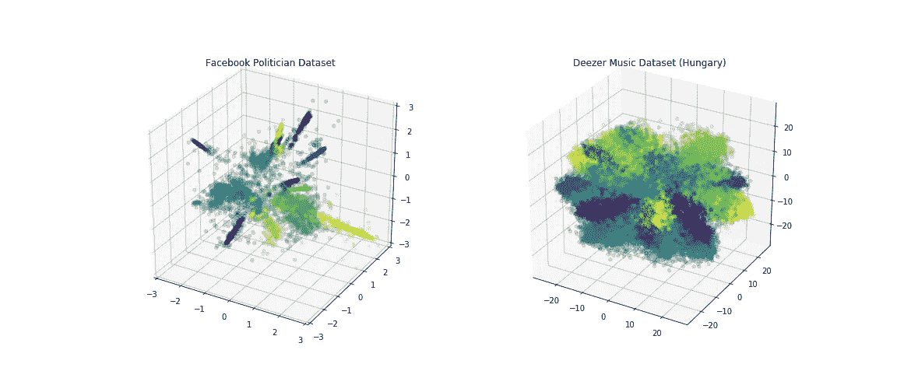
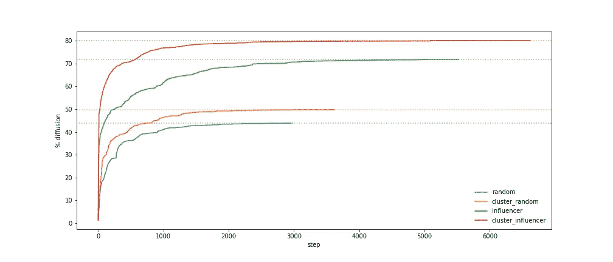
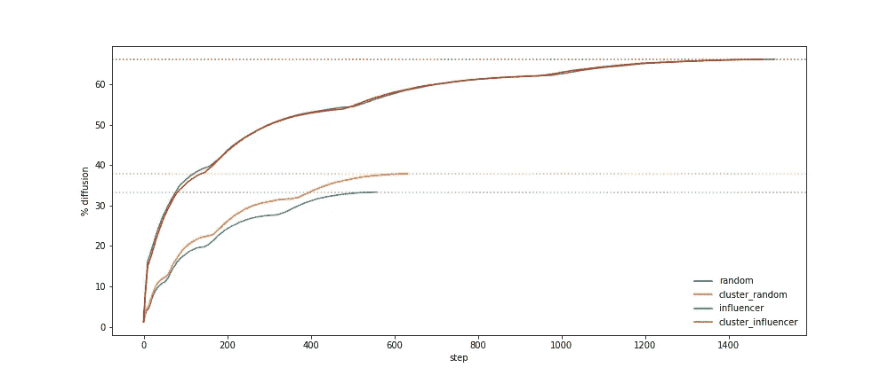
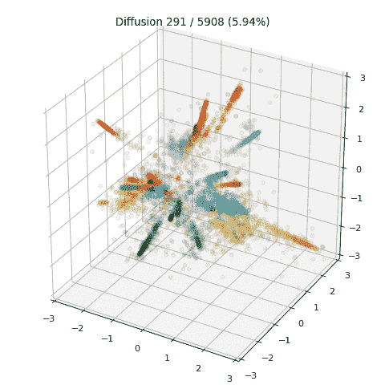
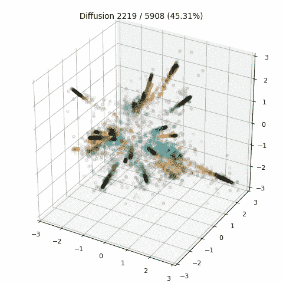
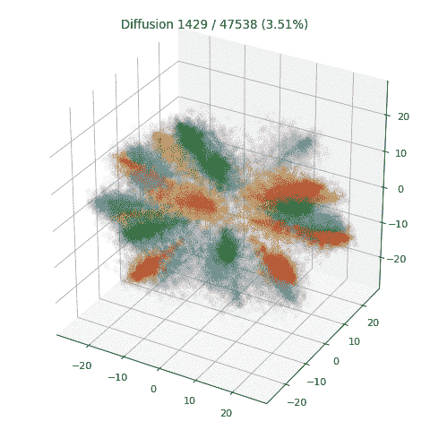
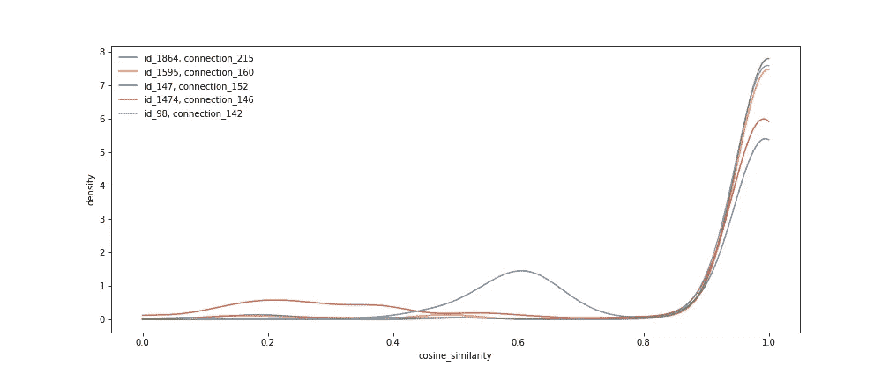
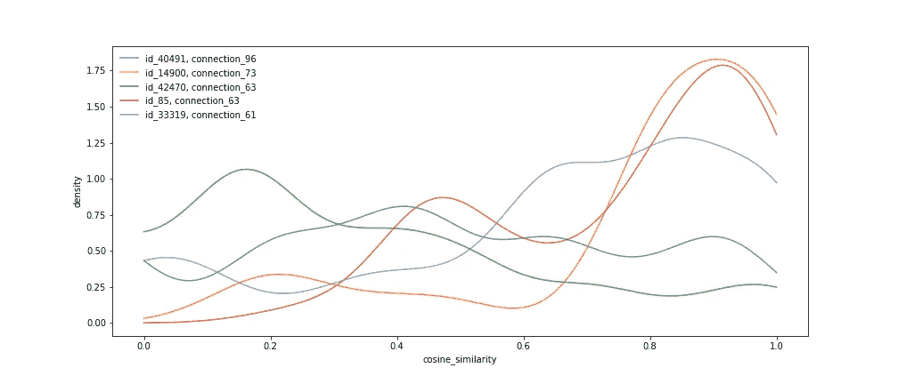

# 传播病毒:图嵌入的一个应用

> 原文：<https://towardsdatascience.com/https-towardsdatascience-com-the-elements-of-viral-growth-7f364aec64eb?source=collection_archive---------36----------------------->

## 模拟不同的播种技术以最大化网络中的信息扩散


## 影响者被高估了吗？

这是足够直观的，你需要有影响力的人来传播你的产品或服务的意识。然而，在我的一个研究生班里，我遇到了一个观念，即影响者可能被高估了。基本思想是影响者倾向于集中在大型子网络中。如果你依靠他们来推广你的产品，你可能会错过许多较小的卫星网络。这是一个警钟，许多我们认为理所当然的直觉可能无法纠正，如果仓促实施，从长远来看可能会付出高昂的代价。

周末，我决定在不同的数据集上测试几种播种策略。事实证明，影响者是否被高估没有简单的答案。增长动力在很大程度上取决于图簇的结构、节点嵌入以及影响者如何与其他人联系。



两个数据集——脸书政客和 Deezer 音乐流媒体——特别能说明问题。在运行 GEMSEC 图形嵌入算法之后，如上所示，通过前 3 个主成分来可视化这两个数据集。您能猜出以下哪种播种技术对每个数据集最有效吗？

1.  简单的随机播种:这是一种天真的播种方式，但是它有它的支持者。主要优点是简单、便宜、公平。
2.  根据集群大小分层抽样的随机播种:依靠分层抽样，我们可以确保不会错过播种小集群。
3.  影响者播种:只需选择拥有最多联系的影响者。
4.  基于集群的影响者播种:类似于选项 2，但是我们在每个集群中挑选顶级影响者。


*本帖将集中于高层讨论，将实现细节留到最后。*

## 数据集

真实世界的社交网络数据集被用来训练 GEMSEC 模型。这些数据集可以在[仓库](https://github.com/benedekrozemberczki/GEMSEC#datasets)中找到。在这里，我主要关注两个数据集:

1.  脸书政客页面网络:这些图形代表了经过验证的脸书页面之间的相互相似的网络。
2.  Deezer 用户-用户友谊网络:音乐流媒体网站 Deezer 的友谊网络(这里我们只关注匈牙利)。

## 图形嵌入

数据集中唯一可用的信息是节点之间的边。我们知道谁和谁有联系，但是我们不知道他们为什么有联系，或者他们有多相似。如果我们要对信息传播建模，我们需要某种相似性度量来估计一个人将信息传播给另一个人的可能性。在音乐服务中，相似性可以是音乐品味。在社交网络中，相似性可以代表亲密度(共享的对话、照片等)。)

为了绕过这一限制，我训练 GEMSEC 图嵌入模型直接学习节点嵌入，同时对它们进行聚类(因此得名 **G** 图 **EM** 与 **SE** lf **C** 聚类)。让我放弃数学上的细节，这些细节在最初的[论文](https://arxiv.org/abs/1802.03997)中有。重要的一点是*我们现在有了图结构和节点嵌入。*

## 模拟

扩散过程被模拟成随机行走。感染的概率与两个节点之间的余弦相似性相关。我做了一个简化的假设，即具有负余弦相似性的节点不会相互感染。

开始时，只有种子节点被感染。种子节点被放置在队列中。每当一个节点出队时，它都试图感染它的所有邻居。新感染的节点(包括旧节点本身)以广度优先搜索的方式被附加到队列中。

## 观察

结果总结在下面的两个图中。

*   在脸书政客数据集上，基于聚类的影响者播种优于直接影响者播种，但在 Deezer 音乐数据集上，它们显示出很小的差异。
*   基于聚类的随机播种在两个数据集上都优于简单的随机播种。这是意料之中的，因为我们本质上是按照集群大小进行分层抽样。



Diffusion curve, Facebook politician dataset



Diffusion curve, Deezer music dataset (Hungary)

是什么导致了影响者播种的差异？主要原因是影响者在所有集群中的影响力并不相同。如果我们只选择顶级影响者，20 个集群中只有 12 个具有合格的影响者。通过分层抽样，我们迫使影响力较小的群体被播种。



First 400 steps animation: random 1% seeding (left); cluster-based top 1% influencer seeding (right)



First 200 steps animation: random 1% seeding (left); cluster-based top 1% influencer seeding (right)

第二个原因归因于图形结构。政客数据集具有非常两极分化、明显不同且分离良好的聚类。Deezer 音乐流数据集更加模糊。这是可以理解的，人们可以享受不同的音乐流派，但政治家们坚持特定的(往往是相反的)政治立场。最高影响者的邻居节点的密度图清楚地展示了两极分化的模式:政治家的朋友都是相似的；音乐爱好者跨越群体建立友谊。



Kernel density estimation, top influencer’s cosine similarity with connected nodes (Facebook politician)



Kernel density estimation, top influencer’s cosine similarity with connected nodes (Deezer music)

## **总结**

图形是最难处理也是最有利可图的问题之一。这篇博客的目的不是提出任何普遍真理，而是阐明一些观点，从这些观点你可以检查你自己的图形数据集。一些值得您注意的细节是:

1.  当图表的知识容易获得，或者容易通过机器学习导出时，与随机播种相比，影响者播种是更优选的。
2.  相似性度量应该是感染概率的良好代理。c 罗拥有 1.61 亿 Instagram 粉丝，但这并不意味着他可以影响所有人(其中大部分人与他截然不同)。
3.  集群是否定义良好？个别节点是否高度极化？如果是这样，那么特定集群中的影响者可能非常有影响力。
4.  在所有集群或细分市场中，影响力是否相等？如果不是，你可能需要分层抽样来捕捉小卫星网络。
5.  不要依赖直觉，进行模拟，尽可能多地整合当前可用的信息。虽然模拟经常被证明是非常不准确的，但它有助于提出有价值的问题。

## 实验细节

首先，将 GEMSEC [存储库](https://github.com/benedekrozemberczki/GEMSEC#datasets)克隆到您的工作站。数据库中也提供了数据集。

其次，用所需的包创建环境。你可以简单地运行我的 [gemsec_env.yml](https://github.com/shawlu95/Data-Science-Toolbox/blob/master/case_study/gemsec/gemsec_env.yml) 文件。

```
conda env create -f gemsec_env.yml
```

要复制我的结果，运行[实验. sh](https://github.com/shawlu95/Data-Science-Toolbox/blob/master/case_study/gemsec/experiment.sh) 文件中的命令。

建议您使用多核 CPU 虚拟机。该算法支持多线程。

图、汇总统计和动画代码可在[这里](https://github.com/shawlu95/Data-Science-Toolbox/tree/master/case_study/gemsec)获得。

## 延伸阅读

下面的博客涵盖了与 AB 测试相关的主题，以及对本文中提到的关键概念的更深入的回顾。

*   可视化贝塔分布和贝叶斯更新[ [链接](/visualizing-beta-distribution-7391c18031f1)
*   理解置信区间[ [链接](/understanding-confidence-interval-d7b5aa68e3b)
*   A/B 测试的威力[ [环节](/the-power-of-a-b-testing-3387c04a14e3)
*   超越 A/B 测试:多臂强盗实验[ [链接](/beyond-a-b-testing-multi-armed-bandit-experiments-1493f709f804)
*   你知道可信区间[ [链接](/do-you-know-credible-interval-e5b833adf399#bce7)吗

## 来源

[【1】](https://arxiv.org/abs/1802.03997)b . Rozemberczki，R. Davies，R. Sarkar 和 C. Sutton。GEMSEC:带自聚类的图嵌入。2018.