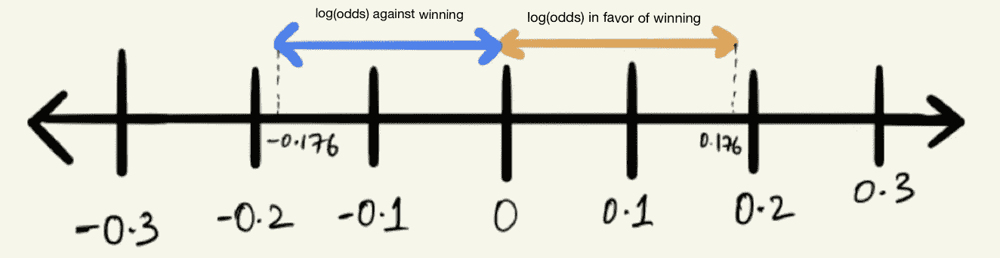

# 对数概率是什么，为什么

> 原文：<https://towardsdatascience.com/https-towardsdatascience-com-what-and-why-of-log-odds-64ba988bf704?source=collection_archive---------2----------------------->

数据科学的三个主要类别是*统计学、机器学习和软件工程*。要成为一名优秀的数据科学家，你需要将这三者结合起来。在这篇帖子里，我要说的是一个***Log Odds——****一个来自统计范畴*的箭头。当我第一次开始从事数据科学工作时，我对对数概率非常困惑。我会问一些问题，比如什么是对数概率，我们为什么需要它们，等等。

当试图理解任何概念时，我喜欢使用*Divide and Understand strateg*y，即把它分成更小的部分，分别理解它们的含义，然后结合这些知识，从整体上把握概念。所以在这里，让我们首先了解什么是*赔率*，然后努力理解*对数赔率*。

Figure-0: Divide and Understand Log Odds (image by Author)

出于解释的目的，让我们考虑一个场景，我和一个人工智能(AI)系统下了 10 盘棋，其中 4 次我都赢了(如果我在现实中真的能做到这一点，我会对我的象棋技巧印象深刻)。

# 赔率和概率

按照我们的设想，我有 4 次能够击败系统，所以我赢得游戏的几率是 4 比 6，即在总共 10 场游戏中，我赢了 4 场，输了 6 场。

Figure-1: Odds of winning are 4 to 6 (image by Author)

这也可以写成一个分数

Figure-2: Odds as a fraction (image by Author)

> 赔率不应与概率混淆

***赔率*** 是某件事情发生与某件事情没有发生的*比率*。在我们上面的场景中，赔率是 4 比 6。然而， ***概率*** 是某件事情发生与所有可能发生的事情的*比率。因此，在我们的象棋例子中，概率是 4 比 10(因为总共进行了 10 场游戏)。*

Figure-3: Odds v/s Probability (image by Author)

根据我们的例子，

> 赢的几率:4/6 = 0.6666
> 赢的概率:4/10 = 0.40
> 输的概率:6/10 = 0.60
> 也等于 1 -赢的概率:1 - 0.40 = 0.60

给定概率，我们也可以计算如下赔率

Figure-4: Calculating Odds, given Probability (image by Author)

> ***更新(2020 年 2 月 10 日):增加了更多的上下文并更新了图 5 和图 6，以更好地表示数字线上的赔率。感谢读者***[***Buhringj***](https://medium.com/u/319c6babee0?source=post_page-----64ba988bf704--------------------------------)***对他们的查询。***

现在，假设我们将游戏总数从 10 场增加到 100 场，而我仍然只能在这 100 场游戏中赢 4 场，那么

> 获胜几率:4/96 = 0.0417

如果我们进一步将游戏次数增加到 500 次，而我仍然玩得很糟糕，并且我的获胜次数保持不变，那么赔率现在变成了

> 获胜几率:4/496 = 0.0081

我打得越差，我的胜算就越接近于零。由于在这种情况下我输了，这些赔率也可以被认为是**“赢的赔率”**。*赢的几率保持在 0 和 1* 的范围内。

另一方面，如果我开始在更多的游戏中击败人工智能，那么我获胜的几率就会增加。假设我们玩 100 局游戏，人工智能输了 6 局，而我赢了剩下的，那么

> 获胜几率:94/6 = 15.6667

同样的，在 500 场比赛中，假设 AI 仍然输了 6 场

> 获胜几率:494/6 = 82.3333

在这种情况下，我赢了，这些赔率也可以被认为是**“赢的赔率”**，随着我在这场比赛中击败 AI 的表现越来越好，这些赔率会快速增加。如果我永远保持这样的进步，很快人工智能的损失与我的胜利相比将变得几乎可以忽略不计，我获胜的几率将接近无穷大。*赢的几率范围在 1 到无穷大之间*。

Figure-5: Odds on a Number Line (image by Author)

# 对数赔率

既然我们已经了解了赔率和概率，那么让我们试着了解对数赔率，以及为什么我们真的需要它们。Log Odds 无非是 ***log of odds，即 log(odds)。*** 在我们上面的场景中，对我不利的胜算范围在 0 到 1 之间，而对我有利的胜算范围在 1 到无穷大之间，这是一个非常巨大的范围。这使得*对*的赔率在*那些赞成*的人看来要小得多。

那么我们能做些什么来让它变得公平呢？你猜对了，**取日志。取概率的对数使它看起来对称。**

> 胜算= 4/6 = 0.6666
> log(胜算)= log(0.6666) = -0.176
> 胜算= 6/4 = 1.5
> log(胜算)= log(1.5) = 0.176

Figure-6: log(odds) on a Number Line (image by Author)

看，它现在看起来很对称，是一个公平的比较尺度。所以基本上使用对数函数帮助我们在两种情况下，即赢(有利)和输(不利)时，使离原点(0)的距离相同。你现在可以看到这有多重要。但是等等…

你还知道吗，了解这一切也有助于我们了解一个非常重要的函数的基础知识，**Logit 函数，**它是最常用的机器学习算法之一的基础，**逻辑回归。让它深入人心吧！！**

Figure-7: Logit Function (image by Author)

# 结论

所以希望这篇文章能帮助你更好地理解赔率、概率、对数赔率(与 log(Odds)相同)和 Logit 函数。在结束之前，我想在这里指出的一点是 log(odds)的用处。

Figure-8: log(odds) helps getting a Normal distribution (image by Author)

你可以从右边的图中看到 log(odds)如何帮助我们在左边的图中得到一个很好的正态分布。这使得 log(odds)对于解决某些问题非常有用，基本上是那些与发现赢/输、真/假、假/非假类型场景中的概率相关的问题。

# 参考

*   [StatQuest: Odds and Log(赔率)，解释清楚！！！](https://www.youtube.com/watch?v=ARfXDSkQf1Y)