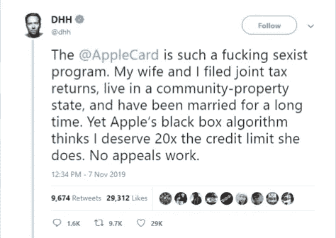
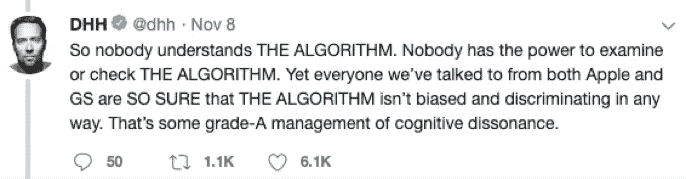

# 当算法失控时

> 原文：<https://towardsdatascience.com/https-towardsdatascience-com-when-algorithms-go-rogue-51d60bd71c6f?source=collection_archive---------39----------------------->

## 人工智能“黑匣子”如何让我们看不到流氓算法，以及我们能做些什么。

*Photo by* [*Noah Silliman*](https://unsplash.com/@noahsilliman?utm_source=unsplash&utm_medium=referral&utm_content=creditCopyText) *on* [*Unsplash*](https://unsplash.com/s/photos/dark?utm_source=unsplash&utm_medium=referral&utm_content=creditCopyText)

在 11 月的第一周，苹果和高盛受到了不必要的关注，因为 Ruby on Rails 的著名创造者 [@DHH](https://twitter.com/dhh) (阿乐 24 小时耐力赛冠军车手)指控他们性别歧视。

例证:他和妻子一起申请了苹果信用卡，并获得了相当于妻子 20 倍的信用额度。这一点，当他们共同报税，她有一个更好的信用评分。

这条推文在网上疯传，但当苹果的另一位“史蒂夫” [@stevewoz](https://twitter.com/stevewoz/status/1193422616016519168) 支持这一说法时，事情变得更加激烈。

但我们不是在讨论苹果和高盛在此事件后的麻烦，以及随后下令进行的法律调查。在整个推特风暴中还有一个相关的问题。

这值得思考，不是吗？毕竟，我们谈论的是世界上最大的公司之一，他们不能解释他们自己的算法？据我所知，他们不得不通过将她提升到 VIP 级别来解决这个问题。

# **当算法失控时**

我们知道，大多数人工智能决策几乎都是一个“黑箱”。这是由于基于树或基于神经网络的模型分数不容易被翻译来为人类提供直观的理解。由此导致的问题在金融服务等受监管行业变得尤为严重。如果一家电子商务公司的推荐算法出了问题，最糟糕的情况可能是收入受到影响。对于一家金融服务公司来说，情况并非如此。

> 如果我们甚至不知道一个决定是如何做出的，你怎么能在一个决定中发现偏见(种族、性别、年龄甚至文化)？

苹果的故事并不是唯一的例子。过去有太多的例子表明，无意中的偏见已经潜入了系统。

以下是算法失控的一些原因:

## 解决问题:

如果计算客户信用度的人工智能系统只是为了优化利润，它可能很快就会陷入掠夺性行为——例如寻找信用评分低的人来出售次级贷款。这听起来是不是很牵强？正在进行的针对联合健康集团和 Optum 的法律调查如何？在 Optum 中，非裔美国人更倾向于去看医生，只是因为算法被优化以降低医疗成本(而不是选择一个需要更多医疗关注的人)？

## 缺乏社会意识:

输入系统的数据包含了体现社会系统的偏见和成见。机器既不理解这些偏差，也不能考虑消除它们，它只是试图针对系统中的偏差优化模型。

作为一个例子，考虑下面的[关于谷歌 BERT 的研究](https://arxiv.org/pdf/1906.07337.pdf)或者这个关于 Word2Vec pairing 的研究[男人对于电脑程序员就像女人对于家庭主妇一样？](https://papers.nips.cc/paper/6228-man-is-to-computer-programmer-as-woman-is-to-homemaker-debiasing-word-embeddings.pdf)”。在这两种情况下，模型本身不会导致偏差，但基础数据会。

## 不良数据的代理:

虽然不使用明显令人反感的数据是显而易见的，但是高度相关的数据通常可以充当代理。以 NYPD 开发的犯罪模式识别系统**为例。他们小心翼翼地从数据中删除了特定的位置，因为这些位置被认为与[种族](https://www.wsj.com/articles/nypd-built-bias-safeguards-into-pattern-spotting-ai-system-11572514202?mod=djemAIPro)高度相关，因此是其代表。**

# **可解释的人工智能**

我们谈论算法问责制的事实——以及以这个名字命名的[法案](https://www.wyden.senate.gov/news/press-releases/wyden-booker-clarke-introduce-bill-requiring-companies-to-target-bias-in-corporate-algorithms-)，现在可能会得到推动——足以证明人们对人工智能在自动化决策中的使用非常关注。

这种算法责任的关键要求之一是人类能够理解人工智能决策过程。从 2017 年开始，在可解释的人工智能方面投入了大量的努力来解决这个问题。DARPA 是努力创造能让人工智能决策被人类理解的系统的先驱。它已经获得了广泛的工业和学术兴趣。一些负责可解释人工智能的开源框架，如 [LIME](https://github.com/marcotcr/lime) 和 [SHAP](https://github.com/slundberg/shap) 正受到良好的关注。

> 它需要的是采纳和监管支持。