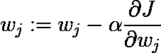

# 为什么随机梯度下降有效？

> 原文：<https://towardsdatascience.com/https-towardsdatascience-com-why-stochastic-gradient-descent-works-9af5b9de09b8?source=collection_archive---------6----------------------->

Crazy paths often lead to the right destination!

优化代价函数是机器学习中最重要的概念之一。梯度下降是最常见的优化算法，也是我们如何训练 ML 模型的基础。但对于大型数据集来说，这可能会非常慢。这就是为什么我们使用这种算法的一种变体，称为随机梯度下降，以使我们的模型学习得更快。但是是什么让它更快呢？这是有代价的吗？

***嗯……在深入 SGD 之前，这里有一个香草渐变下降的快速提醒……***

我们首先随机初始化模型的权重。使用这些权重，我们计算训练集中所有数据点的成本**。然后计算代价相对于权重的梯度，最后更新权重。这个过程一直持续到我们达到最小值。**

更新步骤是这样的…

J is the cost over all the training data points

现在，如果我们的训练集中的数据点数量变大，会发生什么？说***m = 1000 万。*** 在这种情况下，我们必须将所有 ***m*** 示例的成本相加，以执行一个更新步骤！

***新币来救我们了……***

> 我们不是计算所有数据点的成本，而是计算单个数据点和相应梯度的成本。然后我们更新权重。

更新步骤如下…

J_i is the cost of ith training example

我们可以很容易地看到，在这种情况下，更新步骤执行得非常快，这就是为什么我们可以在很短的时间内达到最小值。

## 但是 SGD 为什么会起作用？

关键的概念是，我们不需要检查所有的训练示例来了解斜率下降的方向。通过一次只分析一个例子并跟随它的斜率，我们可以到达一个非常接近实际最小值的点。这里有一个直觉…

> 假设你做了一个 app，想通过 100 个客户的反馈来改进它。你可以用两种方法来做这件事。在第一种方式中，你可以将应用程序交给第一个客户，然后将他的反馈交给第二个客户，然后是第三个，以此类推。从他们那里收集反馈后，你可以改进你的应用程序。但是第二种方式，你可以在得到第一个客户的反馈后，马上对 app 进行改进。然后你把它给第二个，在给第三个之前你又提高了一次。请注意，通过这种方式，您可以以更快的速度改进您的应用程序，并且可以更早地达到最佳状态。

希望你能分辨出第一个过程是普通梯度下降，第二个是 SGD。

## 但是 SGD 也有一些缺点…

SGD 比原始梯度下降法快得多，但是 SGD 的收敛路径比原始梯度下降法更嘈杂。这是因为在每一步中，它不是计算实际的梯度，而是一个近似值。所以我们看到成本有很大的波动。但是，这仍然是一个更好的选择。

Convergence paths are shown on a contour plot

我们可以在上面的等高线图中看到 SGD 的噪声。需要注意的是，vanilla GD 更新次数较少，但是每次更新实际上都是在一个完整的时期之后进行的。SGD 需要很多更新步骤，但它将需要较少的历元数，也就是说，在这种情况下，我们迭代所有示例的次数将较少，因此这是一个更快的过程。

从图中可以看出，梯度下降还有第三种变化，称为小批量梯度下降。这是一个利用 SGD 的灵活性和 GD 的准确性的过程。在这种情况下，我们一次获取固定数量(称为**批量**)的训练样本，并计算成本和相应的梯度。然后，我们更新重量，并为下一批继续相同的过程。如果**批量= 1** ，那么它变成 SGD，如果**批量= m** ，那么它变成正常 GD。

J_b is the cost of bth batch

## 从头开始实施

这里有一个 python 实现的小批量渐变下降。您可以轻松地使 batch_size = 1 来实现 SGD。在这段代码中，我使用 SGD 优化了一个简单的二元分类问题的逻辑回归的成本函数。

在这里找到完整的代码。

## 还好奇？看一个我最近做的视频…

我希望你喜欢阅读。下次见…学习愉快！