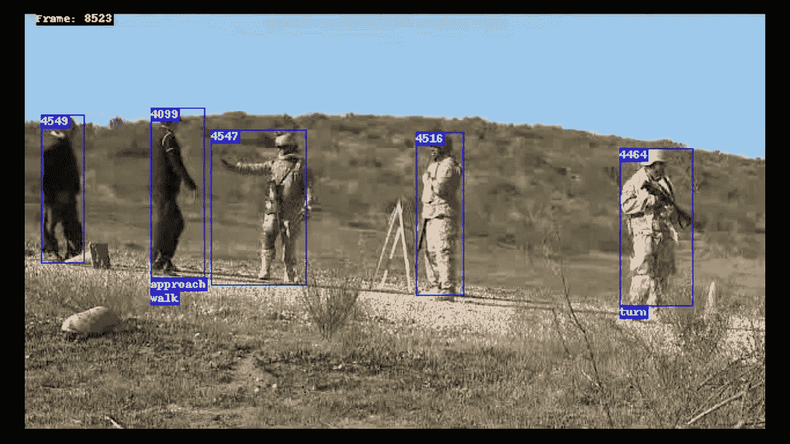
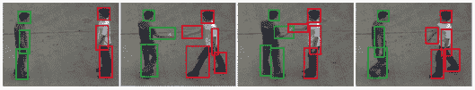
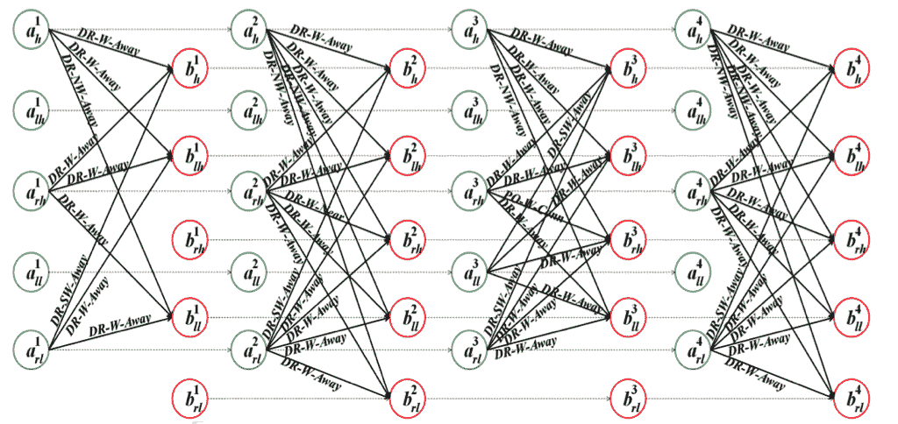
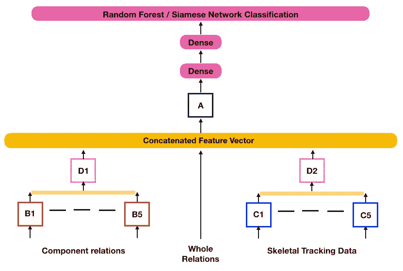
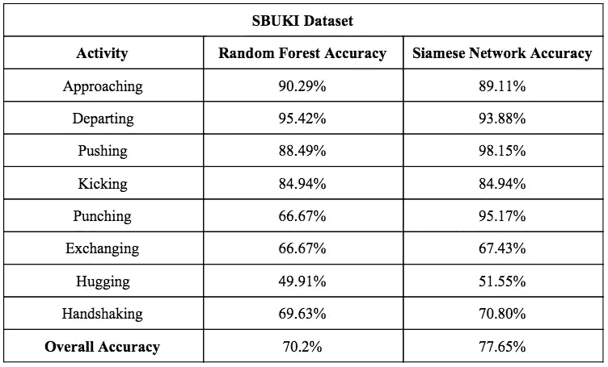
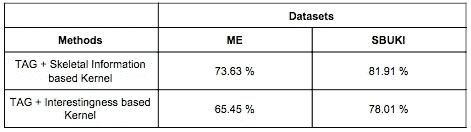

# 人类活动识别:小数据学习的有效实现

> 原文：<https://towardsdatascience.com/human-activity-recognition-an-efficient-implementation-of-small-data-learning-f4c282d92fa?source=collection_archive---------14----------------------->

[1]This image was procured from the [Mind’s Eye Project](http://www.cs.colostate.edu/~draper/MindsEye.php). It depicts Human Activity Recognition in real time.

> 深度学习应用中的大数据集魔咒能否被打破？有必要收集数百万个样本来训练一个特定任务的神经网络吗？我们卷起袖子，开始寻找这个古老问题的答案。我们创建了一个定制的深度学习管道，用于克服自主系统中**人类活动识别**的挑战。在项目接近尾声时，我们能够产生足够的结果，支持我们的架构有效地从**极小的数据集**中学习。我们使用不到 **260** **个例子**来训练我们的模型！

**在这篇博客中，我将避免细枝末节，也就是说，我将专注于我们所做的有效的事情，而不是提及我们所有失败的尝试。我也不会讨论引文中已经存在的不必要的细节。如果您想了解更多，或者对我们方法的实施有任何疑问，请随时通过*sudarshan.kamath97@gmail.com 与我联系。***

传统上，从视频中提取特征一直具有挑战性，因为视频数据包含许多语义时空关系，这些关系难以被丰富地编码以馈入 LSTM 模块。原始视频帧数据只有在我们拥有大量数据集时才有效。

我们想建议一个替代方案，以*时间活动图(标签)*的形式。*标签*向 LSTM 呈现了一系列丰富编码的时空关系。为了帮助你理解*标签*是如何形成的，我将用下面的例子进一步说明:

[2]Hand-shake activity from the UT-Interaction Dataset

包围盒形成在延伸的物体上，即上述视频帧中的*左臂、右臂、左腿、右腿*和*头部*。这些边界框之间的交互由*标签*编码，如下所示:

[3]TAG depicting Handshake Activity from the UT-Interaction dataset

*标签*中的节点对应于描述扩展对象的边界框，同一帧中两个节点之间的空间关系使用空间边来描述，空间边的标签使用*扩展核心 9* 集成表示来计算。它们描述了两个相互作用的边界框之间的*拓扑、方向*和*距离*关系。如果一帧中的节点出现在两个视频帧中，则该节点通过时间边连接到另一帧中的节点。

在从原始视频数据中创建了一个*标签*之后，我们接着将它输入到我们定制的 ***结构化递归神经网络*** 架构中。下图解释了 *sRNN* 的各个部分:

[4]Custom sRNN architecture for taking in a TAG as input

上述体系结构基于分解由单个神经网络承担的任务的复杂性的直观想法。LSTMs *B1* ，…， *B5* 从对应于人物 1 的节点，即 *B1* 获取输入，例如，对人物 1 头部的所有关系进行编码。整个关系再次由*扩展核心 9* 架构提供。骨骼追踪数据可通过 [*SBUKI*](https://www3.cs.stonybrook.edu/~kyun/research/kinect_interaction/index.html) 数据集获得，或者可以使用开源库 [*Openpose*](https://github.com/CMU-Perceptual-Computing-Lab/openpose) 有效提取。编码后，单个 LSTMs *Bis* 和 *Cis* 分别将数据反馈给 LSTMs *D1* 和 *D2* 。因此，各个 rnn 只学习由它们各自的节点编码的信息，而不是学习编码在视频帧中的所有信息。这有助于分解手头任务的复杂性。此外，我们有一个特征丰富的向量，该向量将被馈送到 LSTM *A、*中，该向量以整体方式包含所有时空信息，可以被馈送到其他深度学习管道。

在通过 2 个密集层传递特征向量之后，我们使用两种分类方法来标记我们的数据。一个是*随机森林分类器*，另一个是*连体网络*。

以前，当我们使用传统的 *softmax* 分类器时，我们面临过拟合的问题。98 %的训练准确率之后是低至 50 %的测试准确率。*随机森林*已经被方便地用于克服机器学习流水线中的过拟合问题，因此我们在我们的 *sRNN* 架构的最后一层的输出上训练了一个*随机森林*分类器。

暹罗网络也在我们的建筑上展现了它的魅力。我们都知道人脸识别软件面临着一次性学习的挑战，这个问题和我们正在做的事情很相似，我们需要从非常少量的数据中学习。

以下是我们的最终精度:

[5]Activity-wise as well as overall accuracies for the *SBUKI* dataset using Random Forest and Siamese Network Classifiers

活动方面的准确性不是架构效率的准确度量，因为我们必须确保训练集包含适当数量的用于所考虑的特定活动的示例。然而，看看总体精度，然后将它们与下面给出的最先进的方法进行比较:

[6]State-of-the-art accuracies for SBUKI and ME dataset

我们的精度几乎相当于最先进的水平。需要记住的是，上述精度使用的是机器学习管道，这要求我们明确提供学习方法工作的特征向量。我们的方法使用深度学习管道(*)来学习特征。我们的方法是高度可扩展的，并且可以扩展到需要使用小数据快速学习的较大系统。*

***我们相信未来在于更快、更有效的学习方法，而不是更大的数据集，因此这是迈向未来的又一步。***

*我们的大部分训练是使用 80-20 的训练-测试分割完成的，训练进行了 100 个时期。我们管道的代码可以在 [***这个库***](https://github.com/sudz123/HAR.ai) *中找到。**

*这个项目是我*和我* ( [Sudarshan Kamath](https://www.linkedin.com/in/sudarshankamath/) )以及我的项目伙伴[*Diptanshu Agarwal*](https://www.linkedin.com/in/diptanshu-agarwal/)在[*Shyamanta Hazarika*](http://www.iitg.ac.in/s.m.hazarika/)*教授的指导下完成的。所有的引用、深入的解释以及项目细节都可以在我们的学士论文中找到，这些论文可以在我们的 Github 资源库中找到。**

*干杯！*