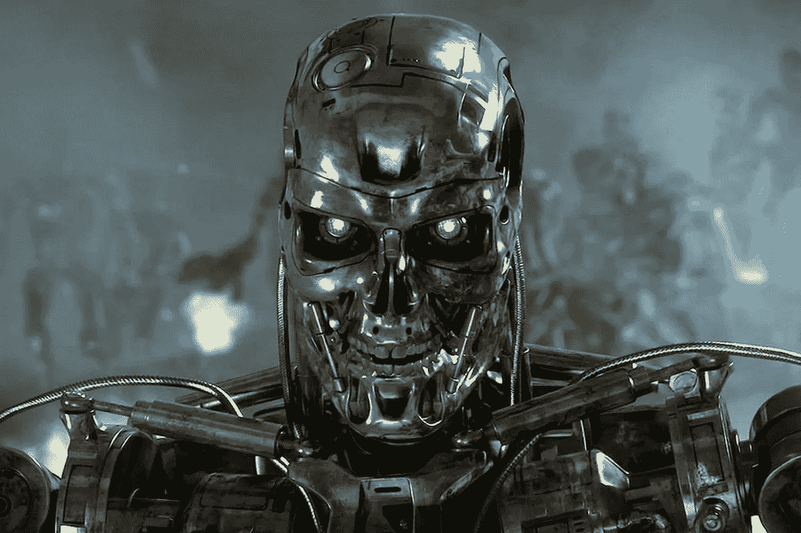
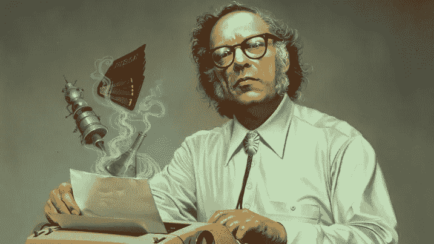
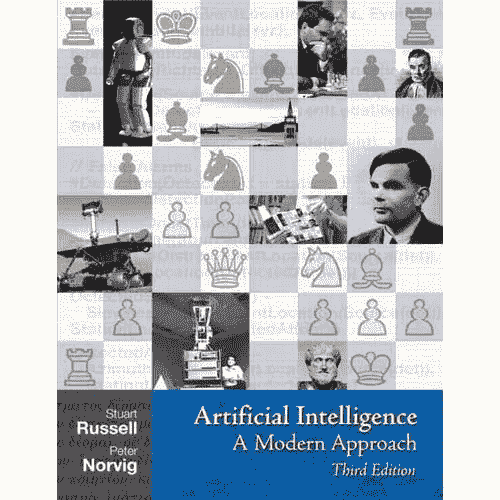
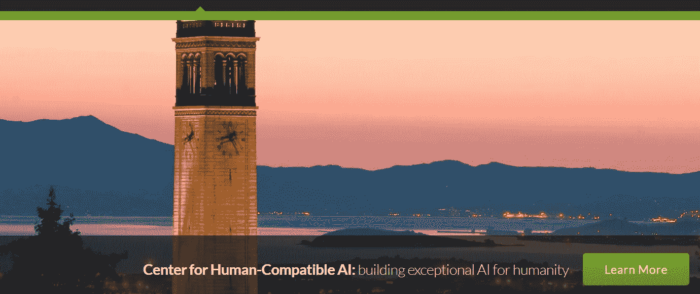
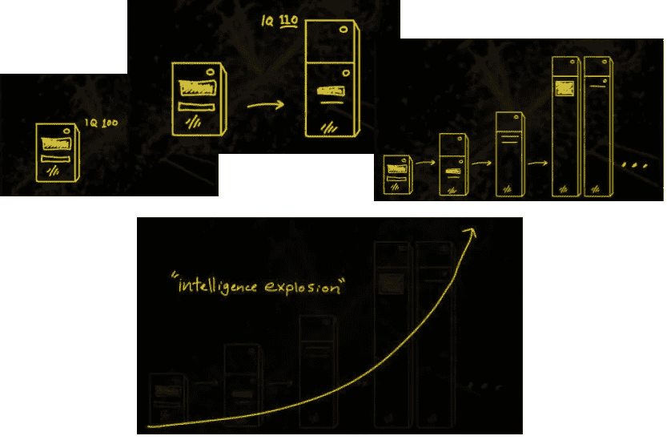
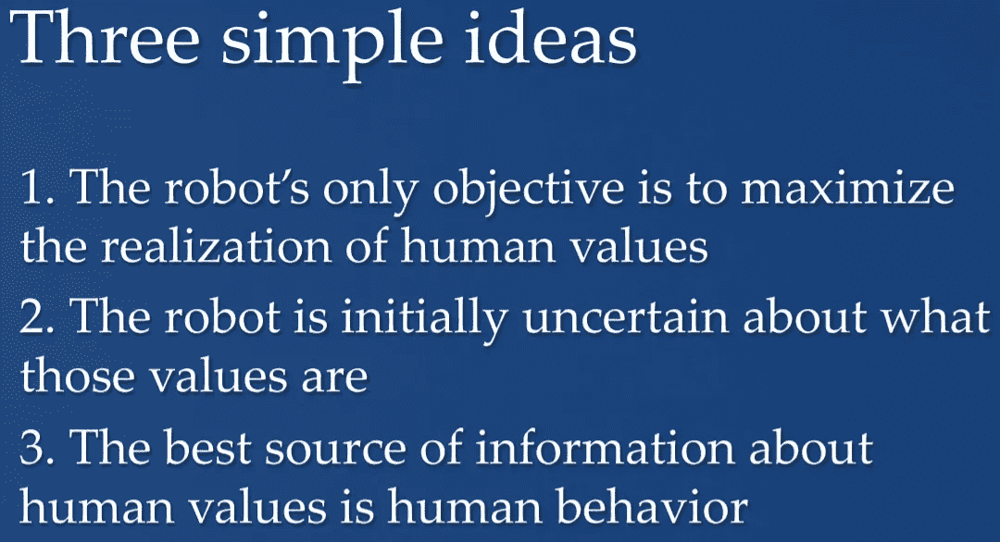

# 人类兼容人工智能

> 原文：<https://towardsdatascience.com/human-compatible-ai-c02c141c5756?source=collection_archive---------18----------------------->

## 为什么阿西莫夫定律不充分？我们能否制造出不是面向目标，而是可证明有益的人工智能系统？

Photo by [rawpixel.com](https://www.pexels.com/@rawpixel?utm_content=attributionCopyText&utm_medium=referral&utm_source=pexels) from [Pexels](https://www.pexels.com/photo/person-holding-black-pen-1020325/?utm_content=attributionCopyText&utm_medium=referral&utm_source=pexels)

# 阿西莫夫定律:深奥却无力

对于科幻迷来说(还有其他一些人)，艾萨克·阿西莫夫不需要介绍。

A collage of covers by Michael Whelan from the *Foundation* series.Image: Bantam Books ([Digital Trends](https://www.digitaltrends.com/movies/isaac-asimov-foundation-apple/))

他的[机器人三定律](https://en.wikipedia.org/wiki/Three_Laws_of_Robotics)(1942 年 3 月首次出现在短篇小说[around](https://en.wikipedia.org/wiki/Runaround_(story))中)是任何关于机器人、人类人工智能和文明未来的知识话语中最常被引用的格言。

因为，我们都在网上的某个地方见过这张图片，对吗？

我们希望这些机器，站在我们这边，作为我们的朋友、哲学家和向导，而不是站在另一边的敌人

这是三大定律，只是为了重述一下，

*   **第一定律**——*机器人不得伤害人类，也不得坐视人类受到伤害。*
*   第二定律——“机器人必须服从人类给它的命令，除非这些命令与第一定律相冲突。”
*   第三定律:机器人必须保护自己的存在，只要这种保护不与第一或第二定律相冲突。”

## 一套(主要)情节生成设备(英语)

阿西莫夫既不是机器人专家，也不是计算机科学家/人工智能研究者。他的职业是生物化学家，在他的一生中，他对写作的重视远远高于常规的大学研究和教学。文学界当然因为他的这一选择而更加丰富。

他编织的惊人故事的情节对他来说极其重要。他还使用了新颖的情节生成装置，前面提到的机器人*法则*就是其中主要的。它们并不意味着被编码到某种机器人设备中，或者甚至是模拟人工智能代理的计算机程序中。

**Source**: [Why Asimov’s Three Laws Of Robotics Can’t Protect Us](https://io9.gizmodo.com/why-asimovs-three-laws-of-robotics-cant-protect-us-1553665410)

正如机器人专家兼作家[丹尼尔·克拉尔](https://en.wikipedia.org/wiki/Daniel_H._Wilson)言简意赅地指出的那样——“*阿西莫夫的规则很整洁，但也很扯淡。例如，它们是英文的。你到底是怎么给那个*编程的？”

> 阿西莫夫定律并没有被设计成编码到人工智能程序或超级智能机器人的处理器中。

你可以争辩说,*自然哲学*(早期称之为物理科学)的许多定律是用通俗易懂的语言表述的，后来用数学术语编纂成了法典。

如果你确信同样的事情也可以发生在这些法律上，试着给出关键短语的精确定义(和数学界限)，比如*不作为、伤害、服从、冲突、保护、存在*。

努力？正如我提到的，它们在英语中是*。*

## *阿西莫夫的故事证明它们不起作用*

*阿西莫夫的大部分故事都围绕着一个主题——机器人可能会遵循这些表面上符合逻辑、伦理上合理的代码，但仍然会误入歧途，给人类和社会带来意想不到的灾难性后果。*

*《创世纪》中关于规避的故事本身就表明了前两条定律是多么容易发生冲突，而第三条定律需要被发明出来才能有一个圆满的结局。*

**

*Source: [http://raydillon.blogspot.com/2012/09/my-art-from-ridley-scotts-prophets-of.html](http://raydillon.blogspot.com/2012/09/my-art-from-ridley-scotts-prophets-of.html)*

***真正符合逻辑的科学法则不应该这么容易就发生冲突**。它们是按顺序建立的，通常会产生一个清晰、明确、可行的解决方案。还记得牛顿定律吗？或者，麦克斯韦方程组？*

*网上有大量文章讨论这些法律对于构建任何功能性超级智能代理(以硬件或软件为中心)的可悲不足。检查[这里](https://theconversation.com/after-75-years-isaac-asimovs-three-laws-of-robotics-need-updating-74501)，或者[这里](https://www.technologyreview.com/s/527336/do-we-need-asimovs-laws/)，或者[这个](https://www.brookings.edu/opinions/isaac-asimovs-laws-of-robotics-are-wrong/)。*

> *那么，有什么措施来解决这个问题吗？*

# *人类兼容人工智能*

*你对人工智能感兴趣吗？我认为答案是肯定的，因为你选择了打开这个故事来阅读。*

*你见过这本教科书吗？*

**

*你很有可能知道(即使你没有勇气翻阅这本近千页的纲要——我自己也只有 30%左右)，因为这是全球数百所大学人工智能课程的标准文本。*

*这本书有两位作者。*

*Peter Norvig 是学生和学习者社区中更熟悉的名字，他在一个[伟大的在线课程](https://www.udacity.com/course/intro-to-artificial-intelligence--cs271)中教授我们人工智能的基础知识，或者出版那些[关于编程、统计和机器学习的惊人的 Jupyter 笔记本](https://github.com/norvig/pytudes#pytudes-index-of-jupyter-ipython-notebooks)。*

*然而，在本文中，我们将关注本书的第一作者 Stuart Russell 博士，教授，世界知名的加州大学伯克利分校人工智能研究员。*

*他正在通过他的 [***人类兼容人工智能***](https://humancompatible.ai/) 中心，研究一种名为[可证明有益的人工智能](https://people.eecs.berkeley.edu/~russell/papers/russell-bbvabook17-pbai.pdf)的东西。*

**

## *要问的重要问题*

*主流人工智能研究人员并不经常问这些问题，但他们正在慢慢地但肯定地获得社区中许多人的关注。*

> *我们应该担心超级智能人工智能给人类带来的长期风险吗？如果是这样，我们能做些什么呢？*

*你可能会问“ ***什么长期风险*** ”。*

*你可能会说，如果聪明、理性、道德和伦理的人类——科学家、工程师、社会活动家、政治家——一起仔细定义智能系统的“目标”,那么它就不会走错路。*

> *因为**目标函数**很重要，对吧？*

**

*如果你已经阅读并理解了现代机器学习算法的核心原理，这个世界似乎就是在这些原理上运行的，你知道几乎所有的这些算法(无论如何是最有用的)都是通过最大化一个目标函数来工作的。*

* [## 下面是什么？机器学习的核心是优化

### 我们展示了最流行的机器学习/统计建模技术背后的核心优化框架。

towardsdatascience.com](/a-quick-overview-of-optimization-models-for-machine-learning-and-statistics-38e3a7d13138) 

因此，如果你认为为了开发一个超智能但有道德和伦理的 AI 系统，**我们所需要的只是一个好的目标函数**，那你就错不了。

> 几乎所有现代、强大的人工智能系统和算法的核心都是目标函数。

当然，如果目标函数或目标是无害的，一个强大的人工智能不会对人类造成伤害。

> 还有什么比设定一个目标**最大化回形针产量**更无害(也更令人沮丧的平凡)的呢？

## 超级智能回形针最大化器

牛津大学哲学家[尼克·博斯特罗姆](https://nickbostrom.com/)在[2003 年的一篇论文](https://www.nickbostrom.com/ethics/ai.html)中首次描述了曲别针最大化器，它是一个被赋予了[**人工 **G** 通用 **I** 智能**](https://wiki.lesswrong.com/wiki/Artificial_general_intelligence) **( **AGI** )的系统/代理，其目标是最大化其收集的曲别针数量。**

**听起来无害吗？让我们再深入一点。**

**如果它被构造成具有大致人类水平的一般智能，该系统可能会从地球上所有可能的来源收集回形针，赚钱购买回形针，甚至开始制造回形针。**

**这才是更有趣的地方。它从哪里获得制造回形针的原材料？它当然可以买到它们。当正常的供应链耗尽时会发生什么？它可以尝试非常规的供应链，从其他来源购买相同的原材料(如铝)，通常用于其他行业，如飞机或汽车行业。**

**要做到这一点，它必须采用巧妙的方法来赚钱。而且它越聪明，就越有可能完成那些**子目标**。**

**因此，**主目标会产生子目标**，这些子目标没有被明确地编程，并且是人类设计者没有计划到的。**

**因此，它也将经历一个“**智能爆炸**”，将努力提高自己的智能，以满足子目标，这反过来又有助于满足最大限度地提高回形针产量的宏伟目标。**

**增加了它的智力后，它会制造出更多的回形针，并利用它增强的能力来进一步自我提高。**

> **一个纯粹以目标为导向的 AGI，即使给了一个非常安全和简单的目标，也极有可能产生子目标，这些子目标是不可预见的，因此也是无法计划的。**

****

****Source**: [http://www.danieldewey.net/tedxvienna.html](http://www.danieldewey.net/tedxvienna.html)**

**它停在哪里？**

**根据博斯特罗姆的说法，在某个时候，它可能会“首先将整个地球，然后将越来越多的空间变成纸夹制造设施”。**

****

## **可证明有益的人工智能**

**因此，设计一个纯粹面向目标的人工智能系统，终究不是一个好主意。意想不到的事情可能会突然出现。**

**因为，当我们教一台机器思考并不断改进自己时，我们不能指望它会在何时以何种方式超越我们。**

**这就是所谓的“[**AGI**](https://alfredruth.com/en/ai-and-the-control-problem/)的控制问题”。目前对它的定义和理解都很模糊。这比你想象的要难。非常非常难。**

**因为这类似于一群大猩猩试图思考如何控制人类的情况。**

**在超级聪明的 AGI 面前，我们很可能会像那些大猩猩一样。**

****

****Source**: [https://www.gorilladoctors.org/](https://www.gorilladoctors.org/)**

> **“如果机器会思考，它可能会比我们思考得更聪明，那么我们应该在哪里？艾伦·图灵，1951 年。**

**在他非常令人愉快的 TED 演讲中，拉塞尔教授给出了几个目标导向型机器人的例子(包括一个智能助理，其目标是让你的配偶一直开心)，并解释了这种系统的潜在危险和局限性。**

**然后，他谈到了可以解决这个问题的一种方法— [***可证明是有益的 AI***](https://futureoflife.org/wp-content/uploads/2017/01/Stuart-Russell-conference.pdf?x90991) ***。*****

**这种设计方法的目标是通过**将人工智能的注意力从实现任意目标的能力转移到实现可证明有益行为的能力和动机，来确保不会出现像回形针最大化器那样的可能性。****

> **而*有益*是什么意思？**

**当然，这取决于人类和整个社会集体行为的性质和特征。因此，这项任务必然要利用比人工智能研究人员、机器学习工程师和计算机科学家的核心群体更大的思想家群体的专业知识和经验——社会科学家、政治家、经济学家、心理学家。**

> **这是设计安全有益的人工智能的新思路，它被命名为与人类兼容的人工智能。**

## **新的三部法律**

**除了形式概念，Russell 还引入了三个简单的想法作为新设计方法的核心。如果你愿意，你可以称之为机器人新定律 T21，**

****

****Source**: [https://futureoflife.org/wp-content/uploads/2017/01/Stuart-Russell-conference.pdf?x90991](https://futureoflife.org/wp-content/uploads/2017/01/Stuart-Russell-conference.pdf?x90991)**

**从本质上来说，**智能代理在开始的时候**并不是很聪明或者不确定它的目标。**它开始时有很多不确定性，就像一个人类婴儿**，然后，慢慢地，它找到了一个稳固的立足点，不仅执行[随机搜索](/getting-started-with-randomized-optimization-in-python-f7df46babff0)并盲目遵循 [Q-learning](https://en.wikipedia.org/wiki/Q-learning) 策略(所有强化学习课程都会教你)，而且**还信任它的父母——我们人类——并观察他们**。**

****

**Image by [Mabel Amber](https://pixabay.com/users/MabelAmber-1377835/?utm_source=link-attribution&utm_medium=referral&utm_campaign=image&utm_content=3602245) (Pixabay)**

**还记得“[摇篮里的猫](https://en.wikipedia.org/wiki/Cat%27s_in_the_Cradle)”吗？**

> **我的孩子前几天刚出生
> 他像往常一样来到这个世界
> 但是我要赶飞机，要付账单
> 我不在的时候他学会了走路
> 他会说话【在我知道之前】随着他的成长
> **他会说“爸爸，我会像你一样”
> “你知道我会像你一样”****

# **总结和相关想法**

**这篇文章可能已经超出了它的有用性，但是不提及一些相关的想法是不公平的。如果你对这个领域感兴趣的话，我们鼓励你去谷歌一下，了解更多。**

*   ***逆向强化学习*(在合作博弈中)**
*   ***关闭开关问题*(用于机器人)**
*   ***AI 安全*举措(参考 [Max Tegmark 的书 Life 3.0](https://space.mit.edu/home/tegmark/) )**

**认真思考 AGI 及其潜在影响不应仅限于学术研究界。每个人都可以参与进来，提出他们的想法和对这样一个未来系统应该学会吸收的价值系统的投入。**

**当 AGI 到来时，我们可能仍然会变成那些大猩猩(与 AGI 相比)，但仍然有一个健康的关系。**

****

**Image by [Stefan Keller](https://pixabay.com/users/KELLEPICS-4893063/?utm_source=link-attribution&utm_medium=referral&utm_campaign=image&utm_content=2925179) from [Pixabay](https://pixabay.com/?utm_source=link-attribution&utm_medium=referral&utm_campaign=image&utm_content=2925179)**

# **一些进一步的阅读**

1.  **[https://www . technology review . com/s/527336/do-we-need-asimovs-laws/](https://www.technologyreview.com/s/527336/do-we-need-asimovs-laws/)**
2.  **[https://www.cs.huji.ac.il/~feit/papers/Asimov06.pdf](https://www.cs.huji.ac.il/~feit/papers/Asimov06.pdf)**
3.  **[https://wiki.lesswrong.com/wiki/Paperclip_maximizer](https://wiki.lesswrong.com/wiki/Paperclip_maximizer)**
4.  **[http://www.danieldewey.net/tedxvienna.html](http://www.danieldewey.net/tedxvienna.html)**
5.  **[https://alfredruth.com/en/ai-and-the-control-problem/](https://alfredruth.com/en/ai-and-the-control-problem/)**
6.  **[https://futureo flife . org/WP-content/uploads/2017/01/Stuart-Russell-conference . pdf？x90991](https://futureoflife.org/wp-content/uploads/2017/01/Stuart-Russell-conference.pdf?x90991)**
7.  **[https://people . eecs . Berkeley . edu/~ Russell/papers/Russell-BBVA book 17-pbai . pdf](https://people.eecs.berkeley.edu/~russell/papers/russell-bbvabook17-pbai.pdf)*** 

***如果你有任何问题或想法要分享，请联系作者[**tirthajyoti【AT】Gmail . com**](mailto:tirthajyoti@gmail.com)。另外，你可以查看作者的 [**GitHub**](https://github.com/tirthajyoti?tab=repositories) **资源库**中其他有趣的 Python、R 和机器学习资源中的代码片段。如果你像我一样对机器学习/数据科学充满热情，请随时[在 LinkedIn 上添加我](https://www.linkedin.com/in/tirthajyoti-sarkar-2127aa7/)或[在 Twitter 上关注我。](https://twitter.com/tirthajyotiS)***

*** [## Tirthajyoti Sarkar - Sr .首席工程师-半导体、人工智能、机器学习- ON…

### 通过写作使数据科学/ML 概念易于理解:https://medium.com/@tirthajyoti 开源和有趣…

www.linkedin.com](https://www.linkedin.com/in/tirthajyoti-sarkar-2127aa7/)***